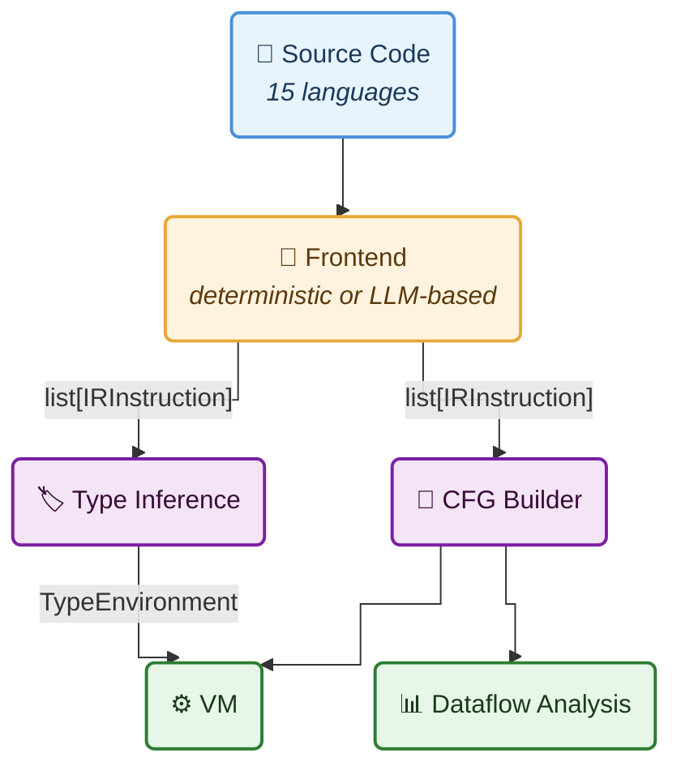
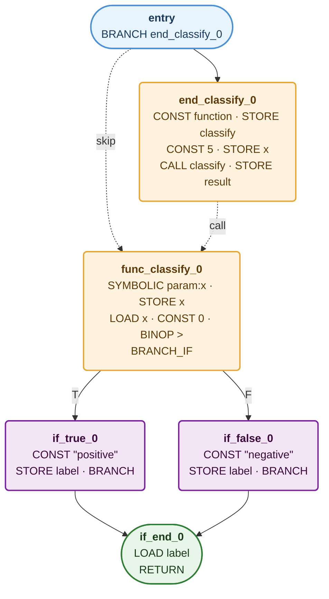
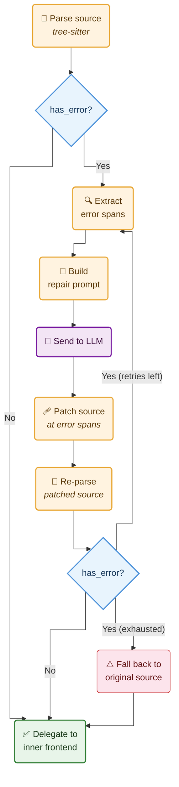
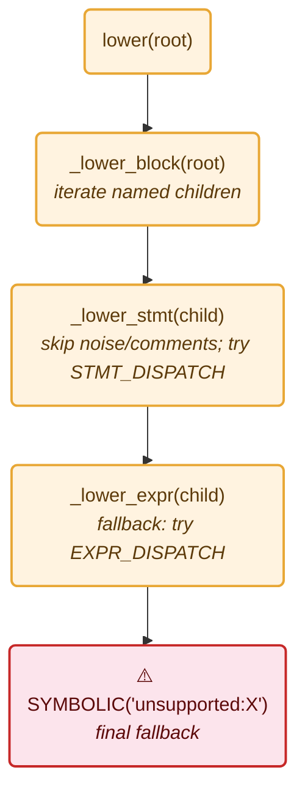
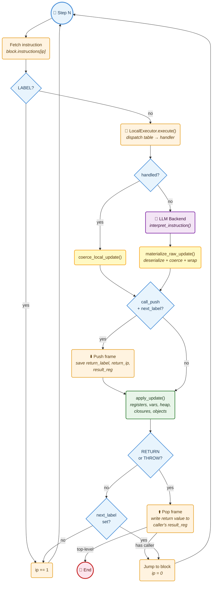
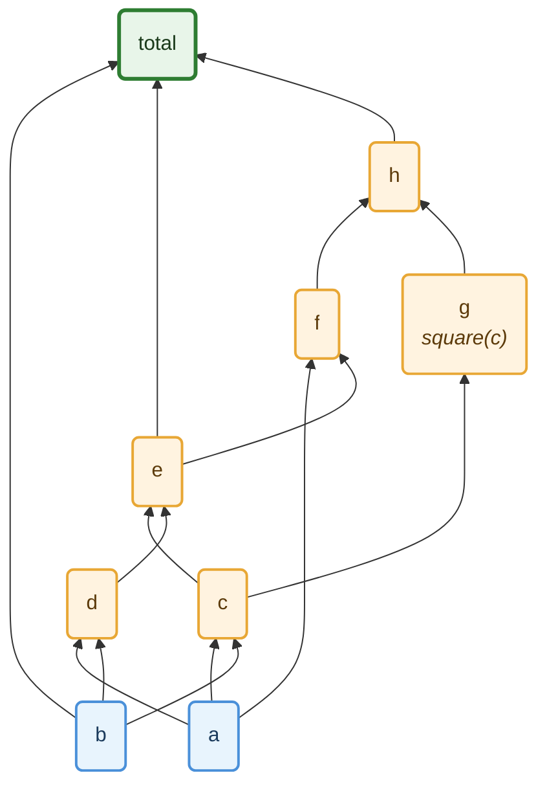
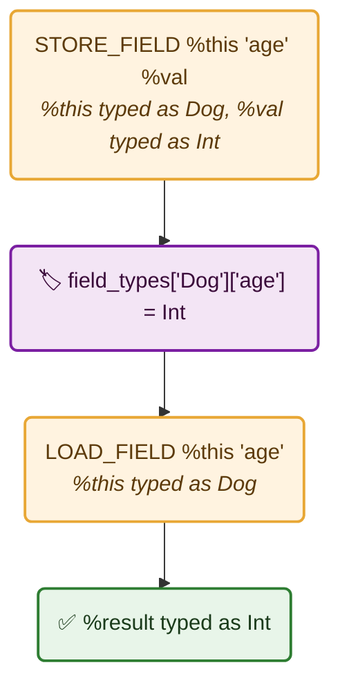
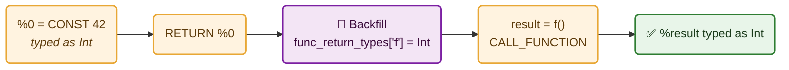

*A universal IR, 15 deterministic frontends, LLM-assisted repair/lowering/execution, a deterministic VM with class hierarchy support and cross-language slicing, a structured type system with generics/unions/variance/traits and interface-aware inference, and iterative dataflow analysis.*

**GitHub**: [avishek-sen-gupta/red-dragon](https://github.com/avishek-sen-gupta/red-dragon)


---

## The Problem

I wanted to analyse source code across many languages (trace data flow, build control flow graphs, understand how variables depend on each other) without writing a separate analyser for each language. The conventional approach is to build language-specific tooling (Roslyn for C#, javac's AST for Java, etc.), but that means duplicating every downstream analysis pass for every language. I wanted **one representation, one analyser, many languages**.

Established IRs exist for this kind of work. LLVM IR covers C, C++, Rust, Swift, and others. WebAssembly targets a growing set of languages. GraalVM's Truffle framework provides a polyglot execution layer. I considered all of these and chose to build my own for three reasons:

- No single existing IR covered the full set of languages I wanted to analyse (Python, Ruby, JavaScript, TypeScript, PHP, Lua, Scala, Kotlin, Go, Java, C#, C, C++, Rust, Pascal, and COBOL).
- Existing IRs assume programs are complete and all dependencies are resolved. They are not designed for incomplete code with missing imports, unresolved externals, or partial extracts.
- I wanted to integrate LLM-based lowering and LLM-assisted execution as first-class features of the pipeline, and grafting that onto an existing IR's toolchain would have taken more time than building a purpose-built one.

The twist: I wanted to handle *incomplete* programs gracefully. Real-world code depends on imports, frameworks, and external systems that aren't available during static analysis. Most tools crash or give up when they hit an unresolved reference. I wanted mine to keep going, creating **symbolic placeholders** for unknowns and tracing data flow through them.

[RedDragon](https://github.com/avishek-sen-gupta/red-dragon) is the result. It parses source in 15 languages, lowers it to a universal intermediate representation, builds control flow graphs, performs iterative dataflow analysis, and executes programs via a deterministic virtual machine. All with **zero LLM calls** for programs with concrete inputs. RedDragon is a work in progress.

This post covers how the system is designed: the IR, the frontends, the VM, type inference, and the dataflow analysis.

### Motivation

RedDragon is the natural extension of my earlier work on [Cobol-REKT](https://github.com/avishek-sen-gupta/cobol-rekt), a COBOL reverse engineering toolkit. That project taught me the value of building analysis tools for legacy code, and left me wanting to generalise the approach across languages. I'd also built a small VM in Prolog previously, and wanted to attempt a more complete one — with a proper type system, dataflow analysis, and multi-language support.

Beyond the technical goals, this project was also a deliberate exercise in AI-assisted software development. I wanted to actively practise and improve my skills in directing an AI to build non-trivial systems — understanding where it works well, where it doesn't, and how to structure the collaboration. The [companion post](/2026/03/12/experiences-building-with-coding-assistant) covers that side of the experience.

RedDragon is a work in progress, and this post is a snapshot of where it stands today. My understanding of compiler design, type systems, and program analysis continues to evolve alongside the project.

### Core Theses

RedDragon explores three ideas about analysing frequently-incomplete code, the kind found in legacy migrations, decompiled binaries, partial extracts, and codebases with missing dependencies:

1. **Deterministic language frontends with LLM-assisted repair.** Tree-sitter frontends (15 languages) and a ProLeap bridge (COBOL) handle well-formed source deterministically. When tree-sitter hits malformed syntax, an optional LLM repair loop fixes only the broken fragments and re-parses, maximising deterministic coverage for real-world incomplete code. All paths produce the same universal IR.

2. **Full LLM frontends for unsupported languages.** For languages without a tree-sitter frontend, an LLM lowers source to IR entirely, supporting any language without new parser code. A chunked variant splits large files into per-function chunks via tree-sitter, lowering each independently. The LLM acts as a *compiler frontend*, constrained by a formal IR schema with concrete patterns. It's translating syntax, not reasoning about semantics.

3. **A VM that integrates LLMs only at the boundaries where information is genuinely missing.** When execution hits missing dependencies, unresolved imports, or unknown externals, a configurable resolver can invoke an LLM to produce plausible state changes, keeping execution moving through incomplete programs instead of halting at the first unknown. When source is complete and all dependencies are present, the entire pipeline (parse → lower → execute) is deterministic with zero LLM calls.

---

## Table of Contents

1. [Architecture Overview](#architecture-overview)
2. [A Worked Example: Source to Execution](#a-worked-example-source-to-execution)
3. [The IR: 28 Opcodes to Rule Them All](#the-ir-28-opcodes-to-rule-them-all)
4. [Frontends: Four Strategies, One Output](#frontends-four-strategies-one-output)
5. [LLM-Assisted AST Repair](#llm-assisted-ast-repair)
6. [LLM Frontend: Lowering Unknown Languages](#llm-frontend-lowering-unknown-languages)
7. [The Dispatch Table Engine](#the-dispatch-table-engine)
8. [Lowering Equivalence](#lowering-equivalence)
9. [The Deterministic VM](#the-deterministic-vm)
10. [LLM-Assisted VM Execution](#llm-assisted-vm-execution)
11. [Dataflow Analysis](#dataflow-analysis)
12. [Type Inference](#type-inference)
13. [Cross-Language Type Inference in Practice](#cross-language-type-inference-in-practice)
14. [Cross-Language Verification via Exercism](#cross-language-verification-via-exercism)
15. [References](#references)

---

## Architecture Overview

RedDragon follows a classic compiler pipeline:



Every stage operates on the same flat IR. The type inference pass, VM, and dataflow analysis are all language-agnostic. They don't know whether the instructions came from Python, Rust, or COBOL.

---

## A Worked Example: Source to Execution

To make the pipeline concrete, here's a complete trace of a simple program through every stage. This is the same pipeline that runs for all 15 languages.

### Source (Python)

```python
def classify(x):
    if x > 0:
        label = "positive"
    else:
        label = "negative"
    return label

result = classify(5)
```

### Stage 1: Lowering to IR

The Python tree-sitter frontend parses this and emits flat three-address code. The function body is wrapped in a skip-over pattern (a `BRANCH` jumps past it so it's not executed at definition time):

```
branch end_classify_0                    # skip over body
func_classify_0:                         # entry point
  %0 = symbolic param:x                  # parameter binding
  store_var x %0
  %1 = load_var x                        # if x > 0
  %2 = const 0
  %3 = binop > %1 %2
  branch_if %3 if_true_0,if_false_0
if_true_0:
  %4 = const "positive"
  store_var label %4
  branch if_end_0
if_false_0:
  %5 = const "negative"
  store_var label %5
  branch if_end_0
if_end_0:
  %6 = load_var label
  return %6
end_classify_0:
  %7 = const <function:classify@func_classify_0>
  store_var classify %7
  %8 = const 5
  store_var x %8
  %9 = call_function classify %8         # classify(5)
  store_var result %9
```

Every instruction is a flat dataclass with an opcode, operands, a destination register, and a source location tracing it back to the original line and column. No nested expressions. `x > 0` decomposes into `LOAD_VAR`, `CONST`, `BINOP`.

### Stage 2: CFG Construction

The CFG builder splits the IR at every `LABEL` and after every `BRANCH`/`BRANCH_IF`/`RETURN`/`THROW`, then wires edges based on branch targets:



### Stage 3: VM Execution (0 LLM calls)

The deterministic VM executes step by step. When it hits `CALL_FUNCTION classify`, it pushes a new stack frame, binds the parameter `x = 5`, and jumps to `func_classify_0`:

```
step  1: branch end_classify_0          → skip to end_classify_0
step  2: const <function:classify>       → %7 = <function:classify@func_classify_0>
step  3: store_var classify %7           → classify = <function>
step  4: const 5                         → %8 = 5
step  5: store_var x %8                  → x = 5
step  6: call_function classify %8       → push frame, jump to func_classify_0
step  7: symbolic param:x               → %0 = 5 (bound from caller)
step  8: store_var x %0                  → x = 5
step  9: load_var x                      → %1 = 5
step 10: const 0                         → %2 = 0
step 11: binop > %1 %2                   → %3 = True (5 > 0)
step 12: branch_if %3 if_true,if_false   → True, jump to if_true_0
step 13: const "positive"                → %4 = "positive"
step 14: store_var label %4              → label = "positive"
step 15: branch if_end_0                 → jump to if_end_0
step 16: load_var label                  → %6 = "positive"
step 17: return %6                       → pop frame, return "positive"
step 18: store_var result %9             → result = "positive"

Final state: result = "positive"  (18 steps, 0 LLM calls)
```

### Stage 4: Dataflow Analysis

The reaching definitions analysis traces through the register chain. The raw def-use chain says "`result` depends on `%9`". But tracing through: `%9` comes from `CALL_FUNCTION` on `classify` with argument `%8`; inside the call, `label` is set to `"positive"` (the branch taken); `label` is loaded into `%6` and returned. The dependency graph says: `result` depends on `classify` and `x`.

The [LLM-Assisted VM Execution](#llm-assisted-vm-execution) section shows what happens when the source has missing dependencies: the VM creates symbolic placeholders that propagate deterministically, preserving dataflow tracing even without concrete values.

---

## The IR: 28 Opcodes to Rule Them All

*See also: [IR Reference](https://github.com/avishek-sen-gupta/red-dragon/blob/main/docs/ir-reference.md)*

The intermediate representation is a **flattened three-address code** with 28 opcodes, grouped by role:

```
Value producers:   CONST, LOAD_VAR, LOAD_FIELD, LOAD_INDEX,
                   NEW_OBJECT, NEW_ARRAY, BINOP, UNOP,
                   CALL_FUNCTION, CALL_METHOD, CALL_UNKNOWN

Value consumers:   STORE_VAR, STORE_FIELD, STORE_INDEX

Control flow:      BRANCH, BRANCH_IF, LABEL, RETURN, THROW,
                   TRY_PUSH, TRY_POP

Pointers:          ADDRESS_OF

Regions:           ALLOC_REGION, WRITE_REGION, LOAD_REGION

Continuations:     SET_CONTINUATION, RESUME_CONTINUATION

Escape hatch:      SYMBOLIC
```

The first 19 opcodes handle all general-purpose lowering across 15 languages. `TRY_PUSH` and `TRY_POP` model structured exception handling (pushing/popping handler labels onto the VM's exception stack). `ADDRESS_OF` supports pointer aliasing: `&x` on a primitive promotes the variable to a heap object and returns a typed `Pointer(base, offset)`, enabling `*ptr = 99` to update the original variable through the alias (see [Pointer Aliasing](#pointer-aliasing)). The three region opcodes (`ALLOC_REGION`, `WRITE_REGION`, `LOAD_REGION`) provide byte-addressed memory for COBOL-style overlays, REDEFINES, and packed data layouts. The two continuation opcodes (`SET_CONTINUATION`, `RESUME_CONTINUATION`) model COBOL's PERFORM return semantics, where control transfers to a named paragraph and returns to the caller on completion. The extended opcodes are language-agnostic in the IR and VM; they happen to be emitted by specific frontends but could serve broader use cases.

Every instruction is a flat dataclass: an opcode, a list of operands, a destination register, and a source location tracing it back to the original code. No nested expressions. `a + b * c` decomposes into:

```
%0 = const b
%1 = const c
%2 = binop * %0 %1
%3 = const a
%4 = binop + %3 %2
```

This verbosity is the **trade-off for universality**. CFG construction, dataflow analysis, and VM execution all operate on the same flat list. Adding a new language means emitting these opcodes; everything downstream works automatically.

### Source Location Traceability

Every instruction carries a `SourceLocation` with start/end line and column, captured from the tree-sitter AST node that generated it. The IR's string representation appends this:

```
%0 = const 10  # 1:4-1:6
```

This means any IR instruction, any VM execution step, any dataflow dependency can be traced back to the exact span of source code that produced it. When a symbolic value appears in the output, its provenance chain leads back to specific source lines.

### Control Flow and Functions

All control flow is explicit: labels, conditional branches, and unconditional jumps. There are no structured `if`/`while`/`for` constructs. `BRANCH_IF` encodes both targets in its label field (comma-separated). The CFG builder splits the IR into basic blocks at every `LABEL` and after every `BRANCH`/`BRANCH_IF`/`RETURN`/`THROW`, then wires edges based on the branch targets. Loops become back-edges: a `while` loop's `BRANCH` at the end of the body points back to the condition's label. Function definitions use the **skip-over pattern** shown in the [worked example](#a-worked-example-source-to-execution): a `BRANCH` jumps past the body at definition time, and a `FunctionRegistry` scans the IR for `SYMBOLIC "param:"` markers to extract parameter names, map class names to method labels, and build linearized parent chains for class inheritance (see [Class Hierarchy and Inherited Method Dispatch](#class-hierarchy-and-inherited-method-dispatch)).

### Three Call Variants

The IR distinguishes three kinds of calls by their operand layout:

- **`CALL_FUNCTION`**: static calls where the target is a known name. Operands: `[func_name, arg0, arg1, ...]`
- **`CALL_METHOD`**: method calls on objects. Operands: `[obj_reg, method_name, arg0, arg1, ...]`
- **`CALL_UNKNOWN`**: dynamic calls where the target is a computed expression (a variable holding a function reference, or a closure). Operands: `[target_reg, arg0, arg1, ...]`

The frontend decides which to emit based on the AST: `foo(x)` emits `CALL_FUNCTION`, `obj.foo(x)` emits `CALL_METHOD`, and `some_var(x)` where `some_var` isn't a known function emits `CALL_UNKNOWN`.

### Object and Array Construction

Objects and arrays are created via `NEW_OBJECT`/`NEW_ARRAY` followed by `STORE_FIELD`/`STORE_INDEX` for each member. An array literal `[1, 2, 3]` lowers to:

```
%0 = const 3
%1 = new_array list %0
%2 = const 0
%3 = const 1
store_index %1 %2 %3         # array[0] = 1
%4 = const 1
%5 = const 2
store_index %1 %4 %5         # array[1] = 2
%6 = const 2
%7 = const 3
store_index %1 %6 %7         # array[2] = 3
```

This verbose expansion means the VM and dataflow analysis see every individual element assignment, which matters for tracking which values flow into which positions.

### The SYMBOLIC Escape Hatch

`SYMBOLIC` is the escape hatch. When a frontend encounters a construct it doesn't handle, it emits `SYMBOLIC "unsupported:list_comprehension"` instead of crashing. The VM treats it as a symbolic value that propagates through execution. Parameters use it too (`SYMBOLIC "param:x"`), as do caught exceptions (`SYMBOLIC "caught_exception:ValueError"`).

Over time, `unsupported:` emissions get replaced with real IR as frontends gain coverage. The project's history is essentially the story of systematically eliminating every last `SYMBOLIC`.

---

## Frontends: Four Strategies, One Output

*See also: [Frontend Design](https://github.com/avishek-sen-gupta/red-dragon/blob/main/docs/notes-on-frontend-design.md) · [Per-Language Frontend Docs](https://github.com/avishek-sen-gupta/red-dragon/tree/main/docs/frontend-design)*

All four frontend strategies produce the same `list[IRInstruction]`. They differ in speed, coverage, and determinism:

**1. Deterministic frontends (15 languages):** Python, JavaScript, TypeScript, Java, Ruby, Go, PHP, C#, C, C++, Rust, Kotlin, Scala, Lua, Pascal. These use tree-sitter for parsing and a dispatch-table-based recursive descent for lowering. **Sub-millisecond. Zero LLM calls. Fully testable.** Each frontend is modularised into separate files for expressions, control flow, and declarations, inheriting from a shared `BaseFrontend`. An optional **AST repair decorator** can wrap any deterministic frontend to handle malformed source (see the next section).

**2. COBOL frontend (ProLeap bridge):** COBOL source is parsed by the ProLeap COBOL parser (a Java-based parser producing an Abstract Syntax Graph), bridged to Python via a shaded JAR that emits JSON ASGs. The frontend includes a complete type system: PIC clause parsing (zoned decimal, COMP/COMP-1/COMP-2, packed decimal, alphanumeric, EBCDIC), REDEFINES overlays with byte-addressed memory regions, OCCURS arrays with subscript resolution, level-88 condition names with value ranges, and paragraph-based control flow via named continuations. COBOL-specific IR is emitted using the region and continuation opcodes.

**3. LLM frontend:** For languages without a deterministic frontend. The source is sent to an LLM constrained by a formal schema: all 27 opcode specs, concrete patterns, and worked examples. The LLM acts as a mechanical compiler frontend, not a reasoning engine. This distinction matters: the prompt doesn't ask *"what does this code do?"* It asks *"translate this into these specific opcodes."*

**4. Chunked LLM frontend:** For large files that overflow context windows. Tree-sitter decomposes the file into per-function chunks, each is LLM-lowered independently, registers and labels are renumbered to avoid collisions, and the chunks are reassembled into a single IR.

---

## LLM-Assisted AST Repair

Real-world source code is often malformed: missing semicolons, unclosed brackets, incomplete extracts pasted from documentation, partial files from legacy migrations. Tree-sitter is tolerant of errors (it produces ERROR and MISSING nodes in the AST rather than refusing to parse), but those error nodes reach the dispatch chain and produce `SYMBOLIC "unsupported:ERROR"` emissions. The deterministic frontend keeps going, but the analysis loses information at every error node.

The AST repair facility recovers that information. It's implemented as a decorator (`RepairingFrontendDecorator`) that wraps any deterministic frontend. When the source is clean, the decorator adds **zero overhead**: it checks `tree.root_node.has_error`, finds no errors, and delegates directly to the inner frontend. When errors exist, it runs a repair loop:



The loop has four stages, each implemented as a pure function:

### 1. Error Span Extraction

The extractor walks the tree-sitter AST recursively, collecting every ERROR and MISSING node. Each node's byte offsets are expanded to cover full source lines (so the LLM sees complete lines, not mid-line fragments). Overlapping or adjacent spans are merged to avoid sending redundant context. Each merged span gets N lines of surrounding context (configurable, default 3) attached as `context_before` and `context_after`.

### 2. Prompt Construction

The prompter builds a structured repair prompt from the error spans. The system prompt constrains the LLM to fix *only* syntax errors and return *only* the repaired code, with no markdown wrapping and no explanations. Each error span becomes a delimited section in the user prompt showing the broken code with its surrounding context:

```
# Context before:
def process(data):
    result = []

# Broken code:
    for item in data
        result.append(item.value

# Context after:
    return result
```

Multiple error spans are separated by a `===FRAGMENT===` delimiter. The LLM returns repaired fragments separated by the same delimiter.

### 3. Source Patching

The patcher applies repaired fragments back to the original source bytes. It processes spans from end-of-file backward so that earlier byte offsets remain valid as later spans are replaced. This is the same technique compilers use for applying source-level fixups.

### 4. Re-parse and Retry

The patched source is re-parsed with tree-sitter. If the parse is now clean (`has_error` is false), the repaired source is passed to the inner deterministic frontend for lowering. If errors remain and retry budget allows (default: 3 attempts), the loop repeats from step 1 with the partially-repaired source. If all retries are exhausted, the decorator falls back to the original source, accepting `SYMBOLIC` emissions for the error nodes rather than crashing.

### Design Properties

**The LLM fixes syntax, not semantics.** The prompt constrains the LLM to syntactic repair: fix the missing semicolon, close the bracket, complete the partial statement. This keeps the repair narrowly scoped and verifiable (the repaired source either parses cleanly or it doesn't).

**Graceful degradation.** If the LLM returns garbage, the retry budget is eventually exhausted and the decorator falls back to the original source. The worst case is identical to not having repair at all.

---

## LLM Frontend: Lowering Unknown Languages

The 15 deterministic frontends cover a fixed set of languages. For everything else (Haskell, Elixir, Perl, R, Fortran, or any language with parseable source), the LLM frontend lowers source directly to IR. No tree-sitter grammar needed, no dispatch table, no language-specific code. The LLM acts as the entire compiler frontend.

### The Prompt as a Formal Schema

The LLM frontend works by constraining the LLM to a **mechanical translation task**. The system prompt is a specification containing:

1. **The instruction format**: every IR instruction is a JSON object with `opcode`, `result_reg`, `operands`, `label`, and `source_location` fields.
2. **All 27 opcode definitions**: grouped into value producers (`CONST`, `LOAD_VAR`, `BINOP`, `CALL_FUNCTION`, ...), consumers/control flow (`STORE_VAR`, `BRANCH_IF`, `RETURN`, ...), and special instructions (`SYMBOLIC`, `LABEL`).
3. **Critical patterns**: exact lowering templates for function definitions (the skip-over pattern with `BRANCH`/`LABEL`/`SYMBOLIC param:`/implicit `RETURN None`), class definitions, constructor calls, method calls, and if/elif/else chains.
4. **A complete worked example**: a `fib(n)` function lowered to 30 IR instructions, showing every convention in context.
5. **Rules**: the first instruction is always `LABEL "entry"`, every expression is flattened into registers, string literals include quotes in the operand, booleans are `"True"`/`"False"`, return only the JSON array with no markdown fences.

The user prompt is simply: *"Lower the following {language} source code into IR instructions:"* followed by the raw source. The opcode definitions and patterns are the specification; the LLM is the translator.

### Parsing and Validation

The LLM's response (a JSON array of instruction objects) goes through three stages:

1. **Fence stripping**: markdown code fences are removed if present (LLMs add them reflexively despite being told not to).
2. **JSON parsing**: each object is mapped to an `IRInstruction`, validating that every opcode string matches the `Opcode` enum. Unknown opcodes raise `IRParsingError`.
3. **Entry label validation**: if the first instruction isn't `LABEL "entry"`, one is auto-prepended with a warning. This ensures the CFG builder always finds a valid entry point.

If JSON parsing fails, the frontend retries up to 3 times (configurable). Each retry makes a fresh LLM call. If all retries are exhausted, the parsing error propagates.

### Chunked LLM Frontend: Scaling to Large Files

A single LLM call can't handle a 2,000-line file: the source plus the system prompt plus the response would overflow the context window. The chunked frontend solves this by decomposing the file before calling the LLM.

The decomposition uses tree-sitter for structural splitting (even though the language may not have a deterministic *lowering* frontend, tree-sitter grammars exist for most languages). The `ChunkExtractor` walks the top-level children of the parse tree and classifies each as a function, class, or top-level statement. Contiguous top-level statements are grouped into a single chunk. Functions and classes are emitted first, then top-level groups, preserving the definition-before-use ordering that the skip-over pattern requires.

Each chunk is lowered independently through the standard `LLMFrontend`. The `IRRenumberer` then fixes up the results:

- **Register renumbering**: each chunk's registers start at `%0`, so the renumberer offsets them (`%0` in chunk 2 becomes `%47` if chunk 1 used registers up to `%46`).
- **Label renumbering**: each chunk's labels get a `_chunkN` suffix to avoid collisions (`if_true_2` in chunk 1 vs. `if_true_2_chunk1`).
- **Function reference fixup**: the `<function:foo@func_foo_0>` convention embeds the label in a string literal. The renumberer patches these to match the suffixed labels.

The entry label is stripped from each chunk's output and a single `LABEL "entry"` is prepended to the combined result. If a chunk fails (the LLM returns unparseable JSON), a `SYMBOLIC "chunk_error:chunk_name"` placeholder is inserted and lowering continues with the next chunk.

### End-to-End Example: Haskell

Haskell has no deterministic frontend in RedDragon. Here is the full pipeline for a Haskell program with pattern-matched recursion, imports, and external function calls:

```haskell
import Data.Char (toUpper, ord)

factorial :: Int -> Int
factorial 0 = 1
factorial n = n * factorial (n - 1)

x = factorial 5
ch = toUpper 'a'
code = ord ch
total = x + code
```

The LLM frontend receives this source along with the 180-line system prompt and produces IR following the same conventions as the deterministic frontends. The `factorial` function is lowered using the skip-over pattern:

```
entry:
  branch end_factorial_1          # skip over function body

func_factorial_0:
  %0 = symbolic "param:n"
  store_var n %0
  %1 = load_var n
  %2 = const 0
  %3 = binop == %1 %2
  branch_if %3 if_true_2,if_false_3

if_true_2:
  %4 = const 1
  return %4

if_false_3:
  %5 = load_var n
  %6 = const 1
  %7 = binop - %5 %6
  %8 = call_function factorial %7
  %9 = load_var n
  %10 = binop * %9 %8
  return %10
  %11 = const "None"
  return %11

end_factorial_1:
  %12 = const "<function:factorial@func_factorial_0>"
  store_var factorial %12
```

The top-level bindings follow the same pattern: `CONST` + `CALL_FUNCTION` + `STORE_VAR` for each assignment. At execution time, `factorial(5)` resolves to 120 deterministically (concrete recursive call). `toUpper('a')` and `ord(ch)` are unresolved `Data.Char` functions, handled by the `UnresolvedCallResolver`: the default `SymbolicResolver` traces dependencies through symbolic placeholders; the opt-in `LLMPlausibleResolver` produces concrete values (`'A'`, `65`, `total = 185`). From Haskell source to executed VM state, with **zero language-specific code**.

---

## The Dispatch Table Engine

*See also: [Base Frontend Design](https://github.com/avishek-sen-gupta/red-dragon/blob/main/docs/frontend-design/base-frontend.md)*

The heart of the deterministic frontends is a `BaseFrontend` class that all 15 languages inherit from. It uses two dispatch tables (one for statements, one for expressions) mapping tree-sitter AST node types to handler methods.

The lowering dispatch chain:



Common constructs (`if/else`, `while`, `for`, `for-each` with destructuring, `return`, `function_definition`, `class_definition`, `try/catch`) are handled in the base class. For-loop destructuring (`for (const [k, v] of arr)` in JS/TS, `for ((k, v) in map)` in Kotlin, structured bindings in C++) decomposes binding patterns into individual `LOAD_INDEX`/`LOAD_FIELD` + `STORE_VAR` instructions per iteration. Language-specific constructs override or extend. Overridable constants handle the small but persistent differences across grammars:

```python
# Python says "True", Go says "true", Lua says "true"
TRUE_LITERAL: str = "True"    # default
FALSE_LITERAL: str = "False"
NONE_LITERAL: str = "None"

# Python puts the body in "body", Go puts it in "block"
FUNC_BODY_FIELD: str = "body"
IF_CONSEQUENCE_FIELD: str = "consequence"
```

All 15 languages **canonicalise their native null/boolean forms** to Python-form at lowering time. `nil`, `null`, `undefined`, `NULL` all become `"None"`. `true`, `True`, `TRUE` all become `"True"`. This means the VM only handles one set of literals, regardless of source language.

Adding support for a new AST node type is mechanical: write a handler method, register it in the dispatch table. This is what made the systematic coverage push possible. When the audit flagged 34 missing node types across 15 languages, implementing them was straightforward because each one followed the same pattern.

---

## Lowering Equivalence

If 15 frontends lower the same algorithm from 15 different languages, does the resulting IR look the same? It should. The whole point of a universal IR is that downstream analysis (VM execution, dataflow, CFG) doesn't depend on the source language. If two frontends produce structurally different IR for the same logic, it means one of them has a bug or an unnecessary inefficiency.

The lowering equivalence tests verify this directly. For each algorithm, the test lowers the source through all 15 deterministic frontends, extracts the function body from the IR (scanning for the `LABEL func_<name>_N` ... `LABEL end_<name>_N` markers), strips `LABEL` instructions (which vary in naming across languages), and compares the resulting opcode sequences.

### Iterative Factorial: Full Equivalence

The iterative factorial is implemented in all 15 languages using the same structure: initialise `result = 1` and `i = 2`, loop while `i <= n`, multiply `result *= i`, increment `i`, return `result`. Despite the syntactic differences (Python's `while`, Go's `for`, Rust's `loop` with `break`, Pascal's `while...do`), all 15 frontends produce the identical opcode sequence:

```
SYMBOLIC, STORE_VAR, CONST, STORE_VAR, CONST, STORE_VAR,
LOAD_VAR, LOAD_VAR, BINOP, BRANCH_IF, LOAD_VAR, LOAD_VAR,
BINOP, STORE_VAR, LOAD_VAR, CONST, BINOP, STORE_VAR, BRANCH,
LOAD_VAR, RETURN, CONST, RETURN
```

This is a 23-opcode sequence: parameter binding, three initialisations, the loop condition (`LOAD_VAR i`, `LOAD_VAR n`, `BINOP <=`, `BRANCH_IF`), the loop body (`BINOP *`, `STORE_VAR result`, `BINOP +`, `STORE_VAR i`, `BRANCH` back), and the return path. Every frontend, from C to Lua to Scala, produces exactly this sequence.

### Recursive Factorial: Partial Equivalence

The recursive variant (`if n <= 1: return 1; return n * factorial(n - 1)`) achieves equivalence across 11 of 15 frontends. Four languages (Kotlin, Pascal, Rust, Scala) emit minor redundant instructions: an extra `STORE_VAR`/`LOAD_VAR` pair or an unreachable `BRANCH`. These are semantically correct (the VM produces the right answer) but structurally non-identical. The test is marked `xfail` with `strict=True`, so it will fail loudly when the frontends are fixed, signalling that the xfail should be removed.

The structural differences are instructive:

- **Kotlin** emits an extra `LOAD_VAR` before the return, because Kotlin's tree-sitter grammar wraps the return value in a `parenthesized_expression` that the frontend lowers as a separate load.
- **Rust** emits an extra `BRANCH` after the implicit return, because Rust's expression-position blocks produce a trailing unconditional jump to the function end label.
- **Pascal** and **Scala** have similar minor redundancies from language-specific AST structures.

These are all candidates for frontend-level peephole optimisations: removing dead stores, eliminating redundant loads, pruning unreachable branches. The equivalence test makes the gap visible and quantifiable.

### What Equivalence Tests Catch

The equivalence tests complement the Exercism execution tests. Exercism verifies that all 15 frontends produce the *correct answer*. Equivalence tests verify that they produce the *same IR structure*. A frontend could produce the correct answer through a longer, less efficient IR path (extra stores, redundant loads, unnecessary branches). The execution test would pass; the equivalence test would fail.

This distinction matters for analysis quality. Redundant instructions can introduce spurious dependencies in the dataflow graph, create unnecessary basic blocks in the CFG, or slow down the VM. **Structural equivalence is a stronger property than semantic correctness.**

---

## The Deterministic VM

*See also: [VM Design](https://github.com/avishek-sen-gupta/red-dragon/blob/main/docs/notes-on-vm-design.md)*

The VM is **fully deterministic**. Unknown values are *created* as symbolic placeholders that propagate through computation, rather than being resolved via LLM calls. The entire execution engine is reproducible across runs.

### VM State: Frames, Heap, and Closures

The VM's state is held in a single `VMState` dataclass:

```python
@dataclass
class VMState:
    heap: dict[str, HeapObject]          # flat object store
    call_stack: list[StackFrame]         # LIFO execution frames
    path_conditions: list[str]           # branch assumptions
    symbolic_counter: int = 0            # fresh-name generator
    closures: dict[str, ClosureEnvironment]  # shared mutable cells
```

Each `StackFrame` has a **two-level namespace**: `registers` for IR temporaries (`%0`, `%1`, ...) and `local_vars` for source-level named variables. This separation keeps the three-address code machinery invisible to the analysis layer, which only cares about named variables.

The heap is a flat dictionary mapping addresses (`"obj_0"`, `"arr_1"`) to `HeapObject` instances. Each `HeapObject` stores a `type_hint` and a `fields` dictionary. Arrays use stringified indices as field keys. This uniform representation means the VM doesn't distinguish between object field access and array indexing at the storage level.

### The Execution Loop

The VM executes one instruction per step in a bounded loop. Each step fetches, dispatches, coerces, applies, and resolves control flow:



The critical design point: **every path converges on `apply_update()`**. Whether the instruction was executed locally or by the LLM backend, the state change flows through the same single mutator. The LLM path adds a materialization step (deserialize JSON, coerce types, wrap in `TypedValue`), but the state application is identical.

The call dispatch path saves the return address (`return_label`, `return_ip`) and result register on the new frame *before* `apply_update` runs, so parameter bindings land in the callee's frame automatically. On return, the saved metadata tells the loop where to resume in the caller.

### Opcode Dispatch

The `LocalExecutor` maps each of the 28 `Opcode` enum values to a handler function via a static dispatch table:

```python
DISPATCH: dict[Opcode, Any] = {
    Opcode.CONST: _handle_const,
    Opcode.BINOP: _handle_binop,
    Opcode.CALL_FUNCTION: _handle_call_function,
    Opcode.LOAD_FIELD: _handle_load_field,
    # ... all 28 opcodes
}
```

Every handler receives the instruction, the VM state, the CFG, and a function registry, and returns an `ExecutionResult`. **No handler mutates the VM directly.** Instead, each constructs a `StateUpdate` describing the desired mutations.

### StateUpdate: The Communication Contract

`StateUpdate` is the universal contract between handlers and the state engine. It's a pure data object listing all effects:

```python
class StateUpdate:
    register_writes: dict[str, TypedValue]  # %0 = TypedValue(42, Int)
    var_writes: dict[str, TypedValue]       # x = TypedValue("hello", String)
    heap_writes: list[HeapWrite]            # obj.field = TypedValue(...)
    new_objects: list[NewObject]            # allocate on heap
    call_push: StackFramePush | None        # push new frame
    call_pop: bool                          # pop frame on return
    path_condition: str | None              # branch assumption
    next_label: str | None                  # jump target
```

All values flowing through `StateUpdate` are `TypedValue` objects — frozen dataclasses pairing a raw Python value with its `TypeExpr` type. This means type information is carried alongside every value throughout the execution pipeline, from handler output through state mutation to subsequent reads.

This separation of *computation* (handlers) from *mutation* (`apply_update`) is a deliberate **functional core / imperative shell** split. The handlers are pure functions that return data. The mutation is centralised in one place.

### TypedValue: Runtime Type Propagation

Every runtime value in the VM is a `TypedValue` — a frozen dataclass pairing a raw value with its inferred type:

```python
@dataclass(frozen=True)
class TypedValue:
    value: Any       # int, str, SymbolicValue, Pointer, ...
    type: TypeExpr   # ScalarType("Int"), ParameterizedType("Array", ...), ...
```

Registers, local variables, heap fields, and closure bindings all store `TypedValue`. This bridges the static type inference pass (which runs before execution) with runtime coercion: when a `BINOP` operates on two `TypedValue` operands, it can inspect their types to apply language-specific coercion rules (e.g., Java's `String + int` auto-stringification) without consulting the `TypeEnvironment` at every step.

Three helpers simplify construction: `typed(value, type_expr)` for explicit typing, `typed_from_runtime(value)` for inferring type from a Python value, and `VOID_RETURN` (a canonical `TypedValue(None, Void)`) for procedures that return nothing.

### Two-Layer Type Coercion

Type coercion operates at two points:

**Layer 1 (Pre-operation):** Pluggable `BinopCoercionStrategy` and `UnopCoercionStrategy` coerce operands *before* evaluation. The default strategies are no-ops, but language-specific strategies override them — `JavaBinopCoercion` auto-stringifies when one operand of `+` is a `String`. Each strategy also infers the result type.

**Layer 2 (Write-time):** `TypeConversionRules` coerce values when storing into typed registers (Int → Float widening, Float → Int narrowing, Bool → Int promotion). This layer operates inside `apply_update()`.

### BuiltinResult

Built-in functions return a `BuiltinResult` — a uniform type distinguishing pure builtins from those with side effects:

```python
@dataclass
class BuiltinResult:
    value: Any
    new_objects: list[NewObject] = field(default_factory=list)
    heap_writes: list[HeapWrite] = field(default_factory=list)
```

Pure builtins (`len`, `abs`, `max`) return `BuiltinResult(value=result)` with empty side-effect lists. Heap-mutating builtins (`list.append`, `array_of`) express mutations as structured `new_objects` and `heap_writes` that the executor applies through the same `apply_update()` path. This eliminated the previous inconsistency where some builtins returned bare values and others returned tuples with side effects.

### `apply_update()`: The Single Mutator

All state changes flow through `apply_update()`, which applies a `StateUpdate` in strict order: new objects, register writes, heap writes, path conditions, call push, variable writes, call pop. The ordering matters: call push (step 5) happens *before* variable writes (step 6), so parameter bindings automatically land in the new frame without special-casing. Variable writes also handle closure synchronisation: if a variable is in the frame's `captured_var_names`, the write is mirrored to the shared `ClosureEnvironment`.

### Symbolic Value Propagation

When execution hits an unresolved import or function, the VM creates a `SymbolicValue` with a descriptive hint:

```
sym_0 (hint: "math.sqrt(16)")
```

This symbolic value propagates through computation deterministically. Each handler checks whether its operands are symbolic. If either operand of a `BINOP` is symbolic, the result is a fresh symbolic with a constraint recording the expression:

```
sym_0 + 1  →  sym_1 (constraint: "sym_0 + 1")
```

Field access on a symbolic object creates a symbolic field with **lazy heap materialisation**: the first access to `sym_0.x` allocates a synthetic heap entry and caches a symbolic value for `x`, so subsequent accesses to the same field return the same symbolic. This deduplication is important for dataflow analysis, where repeated reads of the same field should trace back to the same definition.

Concrete operations that fail (division by zero, unsupported operator) produce an `UNCOMPUTABLE` sentinel, which triggers symbolic fallback rather than crashing.

The trade-off is that symbolic branches always take the true path (a simplification), and symbolic values can't be resolved to concrete results without help.

### The UnresolvedCallResolver

For the latter trade-off, a configurable `UnresolvedCallResolver` uses the Strategy pattern. Two strategies ship with RedDragon: a default symbolic resolver (zero LLM calls, fully deterministic) and an opt-in LLM-based resolver that produces plausible concrete values. The next section covers this mechanism in detail.

### Closures

One subtle design iteration worth mentioning: closure capture semantics. The initial implementation captured variables by snapshot (copy at definition time). This broke counter factories:

```python
def make_counter():
    count = 0
    def inc():
        count += 1
        return count
    return inc
```

With snapshot capture, `inc()` always reads `count = 0`. The fix was shared `ClosureEnvironment` cells: all closures from the same scope share a mutable environment, matching Python/JavaScript semantics. When a nested function is created, the enclosing frame's variables are copied into a `ClosureEnvironment`. On each call, captured variables are injected into the new frame, and `apply_update()` mirrors writes back to the shared environment. This is the kind of deep correctness issue that only surfaces through specific test cases. It's documented as ADR-019 in the project's [architectural decision records](https://github.com/avishek-sen-gupta/red-dragon/blob/main/docs/architectural-design-decisions.md).

### Class Hierarchy and Inherited Method Dispatch

OOP languages encode class hierarchies differently: Java uses `extends`, Python lists bases in the class signature, Ruby uses `<`, C++ has access-specified base lists, and so on. RedDragon handles all of these through a single mechanism in the `FunctionRegistry`, without adding any new IR opcodes.

Each frontend extracts parent class names from its language-specific tree-sitter nodes and encodes them in the class reference string: `<class:Dog@class_Dog_0:Animal>` records that `Dog` extends `Animal`. The registry's `_scan_classes` method collects these direct parents, and `_expand_parent_chains` transitively expands them into a linearized list. For a chain `C extends B extends A`, `class_parents["C"]` becomes `["B", "A"]`.

At execution time, when `CALL_METHOD` resolves a method on an object, the executor first looks in the child class's method table. On a miss, it walks `class_parents` until it finds a matching method:

```python
# Walk parent chain for inherited methods
for parent in registry.class_parents.get(type_hint, []):
    parent_methods = registry.class_methods.get(parent, {})
    candidate = parent_methods.get(method_name, "")
    if candidate and candidate in cfg.blocks:
        func_label = candidate
        break
```

Method override works naturally: the child's method table is checked first, so a redefined method in the child shadows the parent's version. Multi-level inheritance (C → B → A) resolves at any depth.

Ten OOP frontends extract parent classes: Java, Python, C#, Kotlin, Ruby, JavaScript, TypeScript, Scala, PHP, and C++. Each uses a shared `make_class_ref` helper to encode parents into the class reference string, keeping the language-specific code minimal. The five non-OOP frontends (C, Go, Rust, Lua, Pascal) are unaffected.

### Pointer Aliasing

C and Rust programs use `&x` to take the address of a variable. In most analysis tools, this creates an aliasing relationship that's tracked through a separate alias analysis pass. RedDragon handles it directly in the VM through a KLEE-inspired **promote-on-address-of** model.

When the VM encounters `ADDRESS_OF`, it promotes the target variable from a primitive to a `HeapObject` and returns a typed `Pointer(base, offset)` value. Subsequent writes through the pointer (`*ptr = 99`) go through the heap and update the original variable's storage. This means aliasing is exact: `*ptr` and `x` always see the same value, with no approximation.

```
%0 = const 42
store_var x %0
%1 = address_of x               # promote x to heap, return Pointer
store_var ptr %1
%2 = const 99
store_field ptr "value" %2       # *ptr = 99; x is now 99
%3 = load_var x                  # %3 = 99 (reads through heap)
```

The model supports nested pointers (`int **pp`), pointer arithmetic (`ptr + 1` offsets into arrays), pointer subtraction (returns the offset difference between same-base pointers), pointer relational comparisons (`<`, `>`, `==` on offsets within the same base), struct pointers (arrow operator via `LOAD_FIELD`), and array pointer decay. The C and Rust frontends emit `ADDRESS_OF` for `&identifier` expressions.

### Slicing

All 15 languages support array and string slicing in execution. Each language's slice syntax is lowered to the same `SLICE` IR operation, and the VM handles the semantics uniformly:

- **Python:** `a[1:3]`, `a[::2]`, `a[-2:]`
- **Ruby:** `arr[1..3]` (inclusive range), `arr[1...3]` (exclusive), `arr[start, length]` (positional)
- **Rust:** `arr[1..3]` (exclusive), `arr[1..=3]` (inclusive)
- **Go:** `a[1:3]`, `a[2:]`, string slicing
- **Kotlin:** `subList()` and `substring()` via `METHOD_TABLE` dispatch

### Rest Patterns and Variadic Parameters

JavaScript and TypeScript support rest patterns in destructuring and function parameters:

**Array destructuring:** `const [a, ...rest] = arr` — the frontend emits a `SLICE` operation to extract remaining elements into the rest variable.

**Object destructuring:** `const {a, ...rest} = obj` — remaining properties are spread into a new object on the heap.

**Function rest parameters:** `function f(a, ...args)` — the frontend injects an `arguments` array into the function's local scope and emits a `SLICE` to extract the variadic portion into the rest parameter.

### Anonymous Class Resolution

TypeScript and JavaScript allow assigning anonymous classes to variables: `const MyClass = class { ... }`. When `new MyClass()` is encountered, the VM resolves it by checking the variable store if the name isn't in the class registry:

```python
if class_name not in self.class_registry:
    resolved = self.current_frame.lookup(class_name)
    if isinstance(resolved, str):
        class_name = resolved
```

This reuses the existing variable store as the lookup table — no new data structures needed.

### Built-in Functions

The VM includes a small table of built-in functions (`len`, `range`, `print`, `int`, `float`, `str`, `bool`, `abs`, `max`, `min`, plus array constructors) that are resolved before falling through to the `UnresolvedCallResolver`. Each built-in handles symbolic arguments gracefully: `len` of a symbolic list returns a symbolic, `range` with symbolic bounds returns `UNCOMPUTABLE`, and so on. This keeps common operations concrete without requiring language-specific runtime support.

---

## LLM-Assisted VM Execution

The deterministic VM handles known functions, built-ins, class constructors, and concrete operations without external help. But real-world code calls libraries, frameworks, and system functions that don't exist in the IR. When the VM exhausts all internal resolution paths (built-in table, function registry, class constructors, string/list indexing conversion), it delegates to an `UnresolvedCallResolver`. For a program with 50 function calls where 45 are to local functions and built-ins, only 5 hit the resolver.

This is the third and final point where an LLM can enter the pipeline. The first is at the frontend (lowering source to IR). The second is AST repair (fixing malformed syntax). This third point is at runtime: resolving calls to functions whose implementations are unavailable.

### The Strategy Pattern

The resolver is a pluggable strategy, selected at pipeline configuration time:

```python
class UnresolvedCallResolver(ABC):
    @abstractmethod
    def resolve_call(self, func_name, args, inst, vm) -> ExecutionResult: ...

    @abstractmethod
    def resolve_method(self, obj_desc, method_name, args, inst, vm) -> ExecutionResult: ...
```

Both `resolve_call` (for `CALL_FUNCTION` and `CALL_UNKNOWN`) and `resolve_method` (for `CALL_METHOD`) return an `ExecutionResult` containing a `StateUpdate`, the same data object that every opcode handler returns. This means the resolver's output flows through the same `apply_update()` path as everything else. No special cases.

### SymbolicResolver (Default)

The default resolver creates a fresh `SymbolicValue` for any unknown call (e.g., `sym_0 (hint: "math.sqrt(16)")`). The symbolic propagation described in the [VM section](#symbolic-value-propagation) takes over from there: dependent operations produce constrained symbolics, and the dataflow analysis traces dependencies through them. This is the right default for most analysis tasks, where knowing that a dependency exists matters more than knowing its concrete value.

### LLMPlausibleResolver (Opt-In)

When concrete results matter (e.g., verifying that a computed value matches an expected output), the `LLMPlausibleResolver` asks an LLM to produce a plausible return value.

The resolver sends a structured JSON prompt containing:

```json
{
  "call": "math.sqrt(16)",
  "args": [16],
  "result_reg": "%5",
  "state": {
    "local_vars": {"x": 16, "y": "sym_0"},
    "heap": {}
  },
  "language": "python"
}
```

The system prompt constrains the LLM to return a JSON object with:
- `value`: the concrete return value (or null if unknowable)
- `heap_writes`: any side effects as `[{"obj_addr": "...", "field": "...", "value": ...}]`
- `var_writes`: any variable mutations as `{"name": value}`
- `reasoning`: a short explanation

For standard library functions (`math.sqrt`, `string.upper`, `list.append`), the prompt instructs the LLM to compute the exact result. For unknown functions, it asks for a best estimate based on the name and arguments.

The response is parsed into a `StateUpdate` and applied through the same `apply_update()` path. If the LLM returns invalid JSON or the call fails for any reason, the resolver falls back to `SymbolicResolver` automatically. The worst case is identical to not using LLM resolution at all.

### Worked Example: Analysing Code with Missing Dependencies

Consider a Python program that uses `requests` (not available in the IR) and a local function:

```python
import requests

def extract_name(data):
    return data["user"]["name"]

response = requests.get("https://api.example.com/users/1")
body = response.json()
name = extract_name(body)
greeting = "Hello, " + name
```

The deterministic frontend lowers this to IR. `extract_name` gets a full function definition (skip-over pattern, parameter binding, `LOAD_FIELD` chain). `requests.get` and `response.json()` are calls to unresolved externals.

**With SymbolicResolver:**

```
response  = sym_0 (hint: "requests.get('https://api.example.com/users/1')")
body      = sym_1 (hint: "sym_0.json()")
```

The VM enters `extract_name` with `data = sym_1`. The `LOAD_FIELD` for `data["user"]` triggers lazy heap materialisation: a synthetic heap entry is created for `sym_1`, and a symbolic field `user` is cached. Then `LOAD_FIELD` for `["name"]` creates another symbolic. The result:

```
name      = sym_3 (hint: "sym_2.name")  where sym_2 = sym_1["user"]
greeting  = sym_4 (constraint: "'Hello, ' + sym_3")
```

The dataflow analysis traces `greeting` back through `name`, `body`, and `response` to the `requests.get` call. The **dependency chain is fully preserved** even though no concrete HTTP call was made.

**With LLMPlausibleResolver:**

```
response  = <plausible Response object>
body      = {"user": {"name": "Alice", "email": "alice@example.com"}}
name      = "Alice"
greeting  = "Hello, Alice"
```

The LLM produces a plausible JSON response for the API call. `response.json()` returns a plausible dict. `extract_name` runs concretely on the plausible data. The final values are concrete and inspectable, at the cost of one LLM call per unresolved external.

---

## Dataflow Analysis

*See also: [Dataflow Design](https://github.com/avishek-sen-gupta/red-dragon/blob/main/docs/notes-on-dataflow-design.md)*

The dataflow module (`interpreter/dataflow.py`) performs **iterative intraprocedural analysis** over the CFG in five stages:

1. **Collect definitions**: identify every point where a variable or register is assigned
2. **Reaching definitions**: GEN/KILL worklist fixpoint iteration over the CFG
3. **Def-use chains**: link each use to the definition(s) that reach it
4. **Raw dependency graph**: trace through register chains to discover direct named-variable-to-named-variable dependencies
5. **Transitive closure**: propagate indirect dependencies to produce the full dependency graph

The analysis is forward, may-approximate (over-approximate), and intraprocedural (single function/module scope). It covers all value-producing opcodes including the byte-addressed memory region operations (`ALLOC_REGION`, `LOAD_REGION`, `WRITE_REGION`), so COBOL programs get full dataflow tracking.

### Reaching Definitions

Standard GEN/KILL worklist iteration over the dataflow equations:

```
reach_in(B)  = ∪ { reach_out(P) | P ∈ predecessors(B) }
reach_out(B) = GEN(B) ∪ (reach_in(B) − KILL(B))
```

The lattice is the power set of all definitions (finite), so convergence is guaranteed. A safety cap of 1,000 iterations prevents runaway on pathological CFGs.

### The Register Chain Problem

The interesting part is translating from register-level def-use chains to human-readable variable dependencies. The IR uses temporary registers (`%0`, `%1`, ...) for all intermediate values. A statement like `y = x + 1` becomes:

```
%0 = LOAD_VAR x
%1 = CONST 1
%2 = BINOP +, %0, %1
     STORE_VAR y, %2
```

The raw def-use chain says "`y` depends on `%2`". But a human wants to know "`y` depends on `x`". The dependency graph builder traces through the register chain: `%2` comes from `BINOP` on `%0` and `%1`; `%0` comes from `LOAD_VAR x`; `%1` is a constant. Therefore `y` depends on `x`. Transitive closure extends this across multi-step computations.

### Worked Example: Diamond Dependencies

Consider this program with diamond dependencies, function calls, and multi-operand expressions:

```python
a = 1
b = 2
c = a + b
d = a * b
e = c + d
f = e - a

def square(x):
    return x * x

g = square(c)
h = g + f
total = h + e + b
```

`c` and `d` both depend on `a` and `b` (the diamond). `g` depends on `c` through the function call. `total` depends on three variables directly. The IR for just the main body (omitting the function) looks like:

```
%0  = const 1           → a = 1
%1  = const 2           → b = 2
%2  = load_var a
%3  = load_var b
%4  = binop + %2 %3     → c = a + b
%5  = load_var a
%6  = load_var b
%7  = binop * %5 %6     → d = a * b
%8  = load_var c
%9  = load_var d
%10 = binop + %8 %9     → e = c + d
%11 = load_var e
%12 = load_var a
%13 = binop - %11 %12   → f = e - a
%14 = load_var c
%15 = call_function square %14  → g = square(c)
%16 = load_var g
%17 = load_var f
%18 = binop + %16 %17   → h = g + f
%19 = load_var h
%20 = load_var e
%21 = load_var b
%22 = binop + %19 %20   → (partial)
%23 = binop + %22 %21   → total = h + e + b
```

The dependency graph builder traces through the register chains. For example, `c` depends on `%4` (a `BINOP`), which reads `%2` (from `LOAD_VAR a`) and `%3` (from `LOAD_VAR b`), so `c → {a, b}`. Applying this recursively across all variables:

`c → {a, b}`, `d → {a, b}`, `e → {c, d}`, `f → {e, a}`, `g → {c}` (through the function call), `h → {g, f}`, `total → {h, e, b}`.

The direct dependency graph:



`total` directly depends on `h`, `e`, and `b`. The transitive closure adds `a`, `c`, `d`, `f`, and `g`, giving `total → {a, b, c, d, e, f, g, h}`. This means a change to any of these variables could affect `total`.

### Branching and Multiple Reaching Definitions

On a diamond CFG (if/else), reaching definitions produce multiple reaching defs for the same variable at the merge point:

```
entry:    x = 10        → reach_out = {x@entry}
if_true:  x = 20        → reach_out = {x@if_true}
if_false: y = 30        → reach_out = {x@entry, y@if_false}
merge:    use(x)        → reach_in = {x@entry, x@if_true, y@if_false}
```

At the merge block, `x` has *two* reaching definitions (from `entry` and `if_true`). This correctly models the fact that the value of `x` at the merge point depends on which branch was taken. The def-use chain links the use of `x` in `merge` to both definitions.

### Decoupling

The dataflow module has **no dependencies on the VM, frontends, or backends**. It's a pure analysis pass over the CFG, decoupled from the imperative shell (parsing, I/O, LLM calls). Its input is a `CFG` object; its output is a `DataflowResult` containing definitions, block facts, def-use chains, and both raw and transitive dependency graphs.

---

## Type Inference

*See also: [Type System Design](https://github.com/avishek-sen-gupta/red-dragon/blob/main/docs/type-system.md)*

The type inference module (`interpreter/type_inference.py`) is a **static analysis pass** that runs after lowering but before VM execution. It walks the IR instructions in a fixpoint loop — repeating until no new types are discovered — and produces an immutable `TypeEnvironment` mapping registers and variables to canonical types. The VM then uses this environment for type-aware coercion at write time.

### Type Representation: The TypeExpr ADT

Types are represented as an algebraic data type (`TypeExpr`) with six variants:

```
ScalarType(name)                          # Int, String, Bool, MyClass
ParameterizedType(constructor, arguments) # Array[Int], Map[String, Int], Pointer[Pointer[Float]]
FunctionType(params, return_type)         # Fn(Int, String) -> Bool
UnionType(members)                        # Union[Int, String], Optional = Union[T, Null]
TypeVar(name, bound)                      # T, T: Number (bounded type variable)
UnknownType                               # sentinel for unresolved types
```

All TypeExpr values produce canonical string representations and — critically for the migration from the original string-based system — compare equal to those strings (`ScalarType("Int") == "Int"`). This made it possible to migrate the inference engine, type resolver, and coercion rules to structured types incrementally without breaking existing tests.

### The Type Ontology

The base type hierarchy is a DAG (`TypeGraph`) with subtype queries and least-upper-bound (LUB) computation:

```
Any
├── Number
│   ├── Int
│   └── Float
├── String
├── Bool
├── Object
└── Array
```

The graph is pluggable: `TypeGraph` is constructed from a tuple of `TypeNode` values and can be extended without mutating the original. Subtype checks (`is_subtype`) and common-supertype queries (`common_supertype`) traverse the DAG via BFS. At runtime the graph is extended with user-defined class types, interface/trait nodes, and parameterized type rules.

**Parameterized types.** `ParameterizedType` values carry subtype checking through their arguments. `Array[Int]` is a subtype of `Array[Number]` because `Int` is a subtype of `Number` (covariant by default). A raw constructor (`Array`) is a supertype of any parameterised variant (`Array[Int]`).

**Union types.** `UnionType` members are flattened (nested unions merge), deduplicated, and singleton-eliminated (`Union[Int]` simplifies to `Int`). `Optional` is sugar for `Union[T, Null]`. A union is a subtype of a parent if all members are subtypes; a child is a subtype of a union parent if it is a subtype of at least one member.

**Function types.** `FunctionType` follows standard variance: parameters are **contravariant** (a function accepting `Number` is a subtype of one requiring `Int`), return types are **covariant** (returning `Int` is a subtype of returning `Number`).

**Type aliases.** A `type_aliases` registry maps alias names to `TypeExpr` targets. Resolution is transitive with cycle protection: `IntPtr → Pointer[Int]`, `NestedPtr → Pointer[IntPtr] → Pointer[Pointer[Int]]`.

**Interface and trait typing.** `TypeNode` values carry a `kind` field (`"class"` or `"interface"`). `TypeGraph.extend_with_interfaces()` adds interface nodes and wires implementing classes to them, so `is_subtype(MyClass, Serializable)` works when `MyClass` implements `Serializable`.

**Variance annotations.** A per-constructor variance registry maps constructors to per-argument variance (`COVARIANT`, `CONTRAVARIANT`, or `INVARIANT`). For example, `MutableList` can be marked invariant so that `MutableList[Int]` is *not* a subtype of `MutableList[Number]`. Unregistered constructors default to covariant.

**Bounded type variables.** `TypeVar("T", bound=ScalarType("Number"))` represents a generic parameter constrained to `Number` subtypes. `Array[Int]` is a subtype of `Array[T: Number]` because `Int` satisfies the bound.

### Two Sources of Type Information

Type information enters the system through two paths:

**1. Frontend type extraction (12 statically-typed languages).** During lowering, each frontend extracts type annotations from the tree-sitter AST and normalises them to canonical types via a per-language type map. Simple types are straightforward: Java's `int` → `Int`, Rust's `f64` → `Float`, Go's `string` → `String`. Generic types are extracted structurally: a shared `extract_normalized_type()` function walks tree-sitter's `generic_type` / `generic_name` / `user_type` nodes recursively, decomposes each component through the language's type map, and emits bracket notation (`List[Int]`, `Map[String, Array[Float]]`). C pointer types use a depth-counting approach: `int **p` becomes `Pointer[Pointer[Int]]`. All extracted types are parsed into `TypeExpr` objects and seeded into a `TypeEnvironmentBuilder` that the inference pass merges before its walk. Dynamically-typed languages (JavaScript, Ruby, Lua) skip this step — they have no annotations to extract.

**2. Inference from IR structure.** The inference pass itself infers types from the IR opcodes, covering both dynamically-typed languages (where all types come from inference) and filling gaps in statically-typed code (e.g., inferring the type of an expression result).

### The Inference Algorithm

The inference walk runs to fixpoint over the flat IR. A dispatch table maps 19 of the 28 opcodes to handler functions (the remaining 9 are control flow and pointer instructions with no typeable results). Each handler is a pure function that reads from and writes to an `_InferenceContext` — a mutable bundle of maps storing `TypeExpr` values:

- `register_types`: `%0` → `ScalarType("Int")`, `%3` → `ScalarType("Bool")`, ...
- `var_types`: `x` → `ScalarType("Int")`, `items` → `ParameterizedType("Array", [ScalarType("String")])`, ...
- `func_return_types`: `factorial` → `ScalarType("Int")`, ...
- `func_param_types`: `factorial` → `[("n", ScalarType("Int"))]`, ...
- `tuple_element_types`: `%5` → `{0: ScalarType("Int"), 1: ScalarType("String")}`, ...

The key inference rules:

| Opcode | Rule |
|--------|------|
| `CONST` | Literal analysis: `42` → Int, `3.14` → Float, `"hello"` → String, `True`/`False` → Bool |
| `LOAD_VAR` | Copy type from `var_types` |
| `STORE_VAR` | Inherit type from source register |
| `BINOP` | Delegate to `TypeResolver` — comparison ops → Bool, arithmetic follows promotion rules (Int + Float → Float) |
| `UNOP` | Fixed types for `not`/`!` → Bool, `#`/`~` → Int; otherwise inherit operand type |
| `CALL_FUNCTION` | Look up `func_return_types`, then `_BUILTIN_RETURN_TYPES` (`len` → Int, `str` → String, `range` → Array) |
| `CALL_METHOD` | Class-scoped dispatch → `func_return_types` fallback → builtin method table (60+ methods: `.upper()` → String, `.split()` → Array, `.find()` → Int, `.startswith()` → Bool, etc.) |
| `RETURN` | Backfill `func_return_types` from the return expression's type |
| `NEW_OBJECT` | Use the class name as the type |
| `STORE_FIELD` / `LOAD_FIELD` | Track and retrieve per-class field types |
| `STORE_INDEX` / `LOAD_INDEX` | Track and retrieve array/tuple element types (tuples track per-index: `Tuple[Int, String]`) |

The `RETURN` backfill deserves mention: when the pass encounters a `RETURN` instruction inside a function, it records the return expression's type in `func_return_types`. This means callers later in the IR can resolve the function's return type even without an explicit annotation. The fixpoint loop extends this to **forward references**: when function A calls function B defined later in the IR, the first pass learns B's return type from its `RETURN`, and the second pass propagates it to A's call site. Chains of arbitrary depth (A → B → C) resolve correctly.

### Type-Aware Coercion in the VM

The inference pass produces a frozen `TypeEnvironment` (backed by `MappingProxyType` for immutability). Since all VM values are `TypedValue` objects carrying their type alongside their value, coercion operates at two layers (described in more detail in the [Two-Layer Type Coercion](#two-layer-type-coercion) section above):

**Layer 1 (Pre-operation):** Pluggable `BinopCoercionStrategy` and `UnopCoercionStrategy` coerce operands before evaluation. Language-specific strategies (e.g., `JavaBinopCoercion` for `String + int` auto-stringification) override the defaults.

**Layer 2 (Write-time):** The `TypeConversionRules` interface coerces values when storing into typed registers. The default rules (`DefaultTypeConversionRules`) handle:

- **Widening**: Int → Float (lossless promotion)
- **Narrowing**: Float → Int (truncate toward zero, matching C/Java/COBOL semantics)
- **Bool promotion**: Bool → Int
- **Arithmetic result types**: Int ÷ Int → Int (floor division), Int + Float → Float
- **Comparison results**: any comparison → Bool

This two-layer coercion means the VM produces correct typed results for cross-language programs. A Go program that declares `var x int = 7 / 2` gets `3` (integer division), not `3.5`. A COBOL program with PIC 9(4) fields truncates float assignments. The type system makes this automatic rather than requiring per-language special cases in the VM.

### Self/This Typing

Inside class definitions, the inference pass recognises `self`, `this`, and `$this` parameter names and assigns them the enclosing class type. This enables method return type resolution: when `self.method()` is called, the pass knows the receiver's class and can look up the method's return type in the class-scoped method type map.

### Interface-Aware Inference

When a variable is typed as an interface (`Animal animal = ...`) and a method is called on it (`animal.speak()`), the inference pass needs to resolve the return type without knowing the concrete class. The solution is a chain walk: when class method lookup fails, the pass walks the `interface_implementations` map to find the interface that the variable's type implements, then looks up the method's return type from the interface's method definitions.

Five frontends (Java, C#, TypeScript, Kotlin, Go) seed `interface_implementations` during lowering. Interfaces are lowered as `CLASS` blocks with method definitions, so their return types are available in the function registry.

### Method Signatures

Class methods are stored in a `method_signatures` dictionary keyed by `ScalarType`, with a `FunctionKind` enum (`UNBOUND`, `INSTANCE`, `STATIC`) distinguishing method types. This class-scoped storage eliminates method name collisions — the same method name in different classes no longer overwrites a single flat entry — and supports method overload accumulation.

### Design Properties

**Pure function.** `infer_types()` takes a list of IR instructions and a `TypeResolver`, returns a `TypeEnvironment`. No mutation of the input instructions. No side effects.

**Fixpoint convergence.** The pass repeats until no new types are discovered, resolving forward references across function boundaries. Convergence is measured by the combined size of `register_types` and `func_return_types`. Programs without forward references converge in one pass (no performance penalty). Each handler's "skip if already known" guards prevent clobbering types from earlier passes while allowing unfilled gaps to be resolved on subsequent passes.

**Pluggable ontology.** The `TypeGraph`, `TypeConversionRules`, and `TypeResolver` are all injected. A different language family (e.g., one with unsigned integers or decimal types) can supply its own rules without changing the inference engine.

**Structured types end-to-end.** The entire type pipeline — from frontend extraction through inference, coercion, and environment output — operates on `TypeExpr` objects exclusively. The `str | TypeExpr` union that existed during the migration has been fully removed: all seed sites, all 15 frontends, and all downstream consumers (inference context, type resolver, conversion rules) work with the structured representation directly. There are no string serialization boundaries.

---

## Cross-Language Type Inference in Practice

*See also: [IR Lowering Gaps](https://github.com/avishek-sen-gupta/red-dragon/blob/main/docs/ir-lowering-gaps.md)*

The type inference engine described above is language-agnostic: it operates on IR instructions without knowing which frontend produced them. But making it work *correctly* across 15 languages required solving language-specific lowering gaps — places where idiomatic code in one language produced IR that the inference pass couldn't reason about.

### The End-to-End Flow

The full pipeline from source to typed environment looks like this:

```mermaid
%%{ init: { "flowchart": { "curve": "stepBefore" } } }%%
flowchart LR
    subgraph Frontend ["Frontend (per-language)"]
        SRC("📄 Source Code"):::input --> PARSE("🌳 tree-sitter Parse"):::step
        PARSE --> LOWER("⬇️ Lower to IR"):::step
        LOWER --> SEED("🌱 Seed Type<br/>Environment Builder"):::step
    end
    subgraph Inference ["Type Inference (language-agnostic)"]
        SEED --> MERGE("🔗 Merge Seeds"):::infer
        MERGE --> WALK("🔄 Fixpoint Loop<br/><i>over IR</i>"):::infer
        WALK --> ENV("❄️ Frozen<br/>TypeEnvironment"):::output
    end
    ENV --> VM("⚙️ VM<br/><i>type-aware coercion</i>"):::engine

    classDef input fill:#e8f4fd,stroke:#4a90d9,stroke-width:2px,color:#1a3a5c
    classDef step fill:#fff3e0,stroke:#e8a735,stroke-width:2px,color:#5c3a0a
    classDef infer fill:#f3e5f5,stroke:#7b1fa2,stroke-width:2px,color:#3a0a3a
    classDef output fill:#e8f5e9,stroke:#2e7d32,stroke-width:2px,color:#1a3a1a
    classDef engine fill:#e8f5e9,stroke:#2e7d32,stroke-width:2px,color:#1a3a1a
```



The critical contract: **frontends must produce IR that the inference pass can consume**. If a frontend drops a return value, the inference pass has nothing to propagate. If a field access is lowered as a variable load instead of a field load, field tracking breaks.

### Field Type Tracking Across OOP Languages

Eight OOP languages (Python, Java, C#, C++, JavaScript, TypeScript, PHP, Scala) support field type tracking through `this`/`self`. The mechanism:



This only works if:
1. The `self`/`this` parameter register is typed as the enclosing class (handled by each frontend's `_emit_this_param` / `_emit_self_param`)
2. `this.field` access is lowered as `LOAD_FIELD`, not `LOAD_VAR`

### Return Backfill and Expression-Bodied Functions

Return backfill infers a function's return type from its `RETURN` instructions:



This works for explicit `return` statements. But three languages have idioms where the return value is implicit:

- **Scala** expression-bodied functions: `def f() = 42` (the body *is* the return value)
- **Kotlin** expression-bodied functions: `fun f() = 42`
- **Ruby** implicit return: the last expression in a method is the return value

In all three cases, the original frontend lowering discarded the expression value and unconditionally emitted a default nil return. The inference pass saw `RETURN nil` and could not backfill the actual type.

### The Fix Pattern

The fix for all three languages followed the same principle: **detect when a function body is a bare expression rather than a block of statements, and wire the expression's register to the RETURN instruction**.

For Scala, `lower_function_def` checks if `body_node` is a block type or a bare expression. If bare, it calls `lower_expr` and emits `RETURN` with the result:

```
# Before: def getAge(): Int = this.age
func_getAge:
  %0 = load_var this    # ← wrong: should be load_field
  %1 = load_var age     # ← body iterated as children
  %2 = const ()
  return %2             # ← default nil return

# After:
func_getAge:
  %0 = load_var this
  %1 = load_field %0 age   # ← field_expression lowered correctly
  return %1                 # ← expression value returned
```

For Ruby, a `_lower_body_with_implicit_return` helper identifies the last named child of the method body. If it's an expression (not a statement like `if`, `while`, or `return`), it lowers it via `lower_expr` and returns its register:

```
# Before: def get_age; @age; end
func_get_age:
  %0 = load_var self
  %1 = load_field %0 age    # value loaded...
  %2 = const None
  return %2                  # ...but discarded

# After:
func_get_age:
  %0 = load_var self
  %1 = load_field %0 age
  return %1                  # implicit return wired
```

### Cross-Language Type Inference Test Matrix

With all three gaps fixed, the integration test suite verifies type inference scenarios across all applicable languages:

| Scenario | Languages Tested |
|----------|-----------------|
| BINOP (Int + Int → Int) | Java, Go, C, C++, C#, Rust, Python, JavaScript, TypeScript, Kotlin, Scala, PHP, Lua, Ruby, Pascal |
| BINOP (Int + Float → Float) | Java, Go, C, C++, C#, Rust, Python, JavaScript, TypeScript, Kotlin, Scala, PHP, Lua, Ruby |
| Comparison → Bool | Java, Go, C, C++, C#, Rust, Python, JavaScript, TypeScript, Kotlin, Scala, PHP, Lua, Ruby |
| UNOP (not/!) → Bool | Java, C, C++, C#, Python, JavaScript, TypeScript, Kotlin, Scala, PHP, Lua, Ruby |
| Return backfill | Lua, PHP, TypeScript, Kotlin, Scala |
| Typed param seeding | Java, Go, C, C++, C#, Rust, TypeScript, Kotlin, Scala |
| Field type tracking (OOP) | Python, Java, C#, C++, JavaScript, TypeScript, PHP, Scala |
| CALL_METHOD return types | Python, Java, C#, C++, JavaScript, TypeScript, Kotlin, Scala, PHP, Ruby |
| NEW_OBJECT typing | JavaScript, TypeScript, PHP, Ruby, Scala |
| Builtin method return types | Python, JavaScript, Java, Ruby, Kotlin |
| Forward reference resolution | Python, JavaScript, Ruby |
| Interface method return types | Java, C#, TypeScript, Kotlin, Go |

Each cell is a parametrized pytest fixture — a failure in one language doesn't mask failures in others.

---

## Cross-Language Verification via Exercism

The broadest verification effort was the Exercism integration test suite. The idea: take Exercism's canonical test cases (which define expected inputs and outputs for programming exercises), write equivalent solutions in all 15 languages, and verify that RedDragon's pipeline produces the correct answer for every case in every language.

The 18 exercises span a range of constructs: modulo and boolean logic (leap), while loops (collatz-conjecture), accumulators (difference-of-squares), string operations (two-fer, hamming, reverse-string, rna-transcription), nested loops (isogram, pangram), multi-branch classification (bob), float arithmetic (space-age), and multi-pass validation (luhn). For each exercise, every canonical test case generates tests across three dimensions:

1. **Lowering quality**: does the IR contain any `unsupported:` SYMBOLIC? (15 tests per exercise)
2. **Cross-language consistency**: do all 15 languages produce structurally equivalent IR? (2 tests per exercise)
3. **VM execution correctness**: does the VM produce the expected output? (cases x languages tests)

The argument substitution mechanism deserves a mention: a `build_program()` helper finds the `answer = f(default_arg)` line in each solution and substitutes new arguments for each canonical test case. This works across languages with different assignment syntaxes (`=`, `:=`, `: type =`) via regex.

The Exercism suite surfaced more bugs than any other test approach. Each exercise exposed new gaps: Ruby's `parenthesized_statements` vs Python's `parenthesized_expression`, Rust's expression-position loops, Pascal's single-quote string escaping, PHP's `.` concatenation operator. Every gap found was a bug fixed.

---

## The Numbers

| Metric | Value |
|--------|-------|
| Supported languages | 15 (deterministic) + COBOL (ProLeap) + any (LLM) |
| IR opcodes | 28 |
| Tests (all passing) | 11,575 |
| LLM calls at test time | 0 |
| Exercism exercises | 18 (across 15 languages) |
| Rosetta algorithms | 15 (across 15 languages) |
| Type inference scenarios | 12 (verified across up to 15 languages each) |

---

## Conclusion

RedDragon started as a question: *"Can I build a single system that analyses code in any language?"* It evolved into a compiler pipeline with 15 deterministic frontends, a COBOL frontend via ProLeap, LLM-assisted AST repair, a structured type system (an algebraic TypeExpr ADT with generics, unions, function types, tuples, type aliases, interface/trait typing, variance annotations, and bounded type variables), static type inference with fixpoint convergence, interface-aware chain walk, and structural generic extraction across 12 statically-typed languages, a deterministic VM with class hierarchy support (inherited method dispatch via linearized parent chains across 10 OOP languages), `TypedValue`-based runtime type propagation with two-layer coercion, cross-language slicing, rest pattern destructuring, byte-addressed memory regions and named continuations, and cross-language verification.

**None of the individual components are novel.** TAC IR, dispatch tables, worklist dataflow, and forward type inference are all textbook techniques. The value, if any, is in applying them together to a practical multi-language analysis tool.

All three projects are open source: [RedDragon](https://github.com/avishek-sen-gupta/red-dragon), [Codescry](https://github.com/avishek-sen-gupta/codescry), and [RedDragon-Codescry TUI](https://github.com/avishek-sen-gupta/reddragon-codescry-tui).

---

## References

Design documents and detailed specs from the RedDragon repository:

- [IR Reference](https://github.com/avishek-sen-gupta/red-dragon/blob/main/docs/ir-reference.md) — Full specification of all 28 opcodes, instruction format, and lowering conventions
- [Frontend Design](https://github.com/avishek-sen-gupta/red-dragon/blob/main/docs/notes-on-frontend-design.md) — Architecture of the frontend subsystem: dispatch tables, AST repair, LLM frontends
- [Per-Language Frontend Docs](https://github.com/avishek-sen-gupta/red-dragon/tree/main/docs/frontend-design) — Exhaustive per-file documentation for all 15 language frontends and the base frontend
- [VM Design](https://github.com/avishek-sen-gupta/red-dragon/blob/main/docs/notes-on-vm-design.md) — VM internals: state model, opcode dispatch, symbolic propagation, closures, class hierarchy
- [Dataflow Design](https://github.com/avishek-sen-gupta/red-dragon/blob/main/docs/notes-on-dataflow-design.md) — Reaching definitions, def-use chains, and dependency graph construction
- [Type System Design](https://github.com/avishek-sen-gupta/red-dragon/blob/main/docs/type-system.md) — Type ontology, inference algorithm, coercion rules, and cross-language type extraction
- [Architectural Decision Records](https://github.com/avishek-sen-gupta/red-dragon/blob/main/docs/architectural-design-decisions.md) — Chronological log of key design decisions (ADR-001 through ADR-102)
- [IR Lowering Gaps](https://github.com/avishek-sen-gupta/red-dragon/blob/main/docs/ir-lowering-gaps.md) — Tracking document for cross-language type inference lowering gaps
- [Project Philosophy](https://github.com/avishek-sen-gupta/red-dragon/blob/main/PHILOSOPHY.md) — Design principles and engineering values
- [Contributing Guide](https://github.com/avishek-sen-gupta/red-dragon/blob/main/CONTRIBUTING.md) — How to contribute to the project

_This post has not been written or edited by AI._
