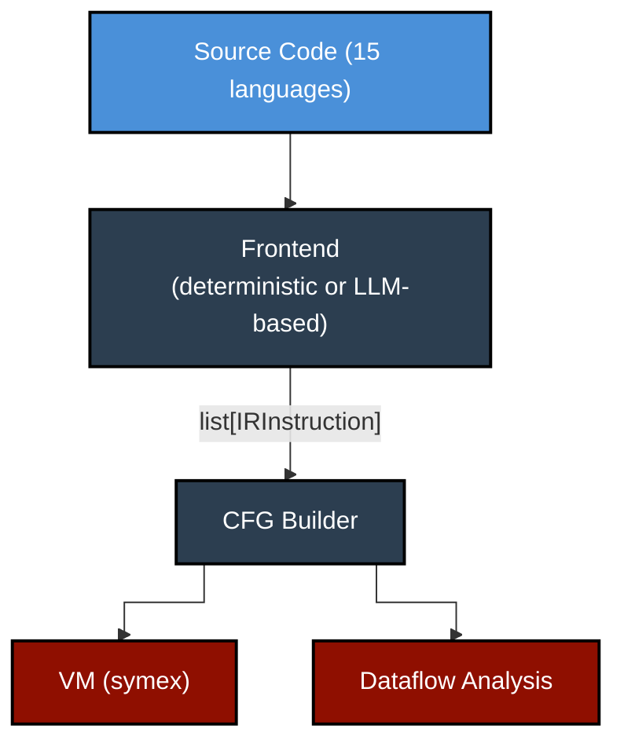
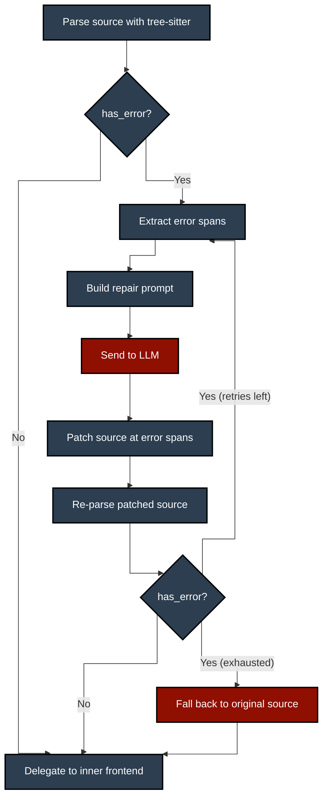
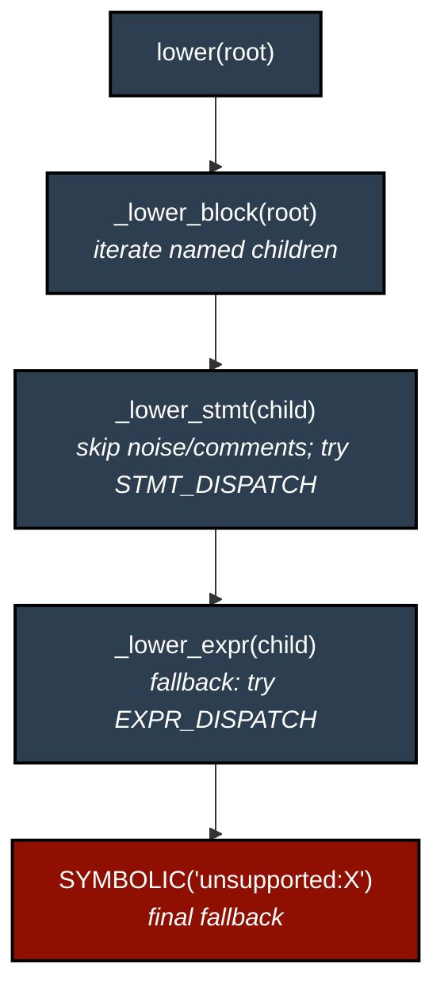
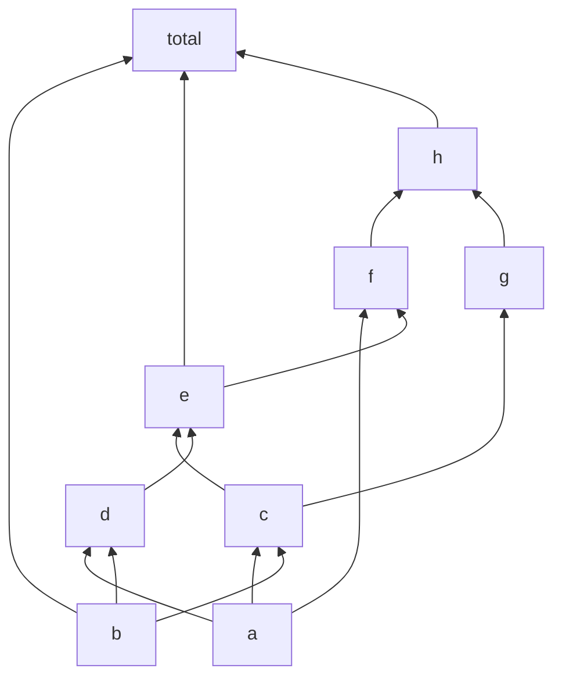

*A universal IR, 15 deterministic frontends, a symbolic VM, and iterative dataflow analysis. This post is a work in progress.*


---

## The Problem

I wanted to analyse source code across many languages (trace data flow, build control flow graphs, understand how variables depend on each other) without writing a separate analyser for each language. The conventional approach is to build language-specific tooling (Roslyn for C#, javac's AST for Java, etc.), but that means duplicating every downstream analysis pass for every language. I wanted one representation, one analyser, many languages.

Established IRs exist for this kind of work. LLVM IR covers C, C++, Rust, Swift, and others. WebAssembly targets a growing set of languages. GraalVM's Truffle framework provides a polyglot execution layer. I considered all of these and chose to build my own for three reasons:

- No single existing IR covered the full set of languages I wanted to analyse (Python, Ruby, JavaScript, TypeScript, PHP, Lua, Scala, Kotlin, Go, Java, C#, C, C++, Rust, Pascal, and COBOL).
- Existing IRs assume programs are complete and all dependencies are resolved. They are not designed for incomplete code with missing imports, unresolved externals, or partial extracts.
- I wanted to integrate LLM-based lowering and LLM-assisted execution as first-class features of the pipeline, and grafting that onto an existing IR's toolchain would have taken more time than building a purpose-built one.

The twist: I wanted to handle *incomplete* programs gracefully. Real-world code depends on imports, frameworks, and external systems that aren't available during static analysis. Most tools crash or give up when they hit an unresolved reference. I wanted mine to keep going, creating symbolic placeholders for unknowns and tracing data flow through them.

[RedDragon](https://github.com/avishek-sen-gupta/red-dragon) is the result. It parses source in 15 languages, lowers it to a universal intermediate representation, builds control flow graphs, performs iterative dataflow analysis, and executes programs symbolically via a deterministic virtual machine. All with zero LLM calls for programs with concrete inputs.

RedDragon is part of a family of three tools: [Codescry](https://github.com/avishek-sen-gupta/codescry) (a repo surveying toolkit that detects integration points using regex, ML classifiers, code embeddings, and LLM classification) and [RedDragon-Codescry TUI](https://github.com/avishek-sen-gupta/reddragon-codescry-tui) (a terminal UI integrating the two). The TUI demo is shown above.

This post covers how the system is designed: the IR, the frontends, the VM, and the dataflow analysis.

### Core Theses

RedDragon explores three ideas about analysing frequently-incomplete code, the kind found in legacy migrations, decompiled binaries, partial extracts, and codebases with missing dependencies:

1. **Deterministic language frontends with LLM-assisted repair.** Tree-sitter frontends (15 languages) and a ProLeap bridge (COBOL) handle well-formed source deterministically. When tree-sitter hits malformed syntax, an optional LLM repair loop fixes only the broken fragments and re-parses, maximising deterministic coverage for real-world incomplete code. All paths produce the same universal IR.

2. **Full LLM frontends for unsupported languages.** For languages without a tree-sitter frontend, an LLM lowers source to IR entirely, supporting any language without new parser code. A chunked variant splits large files into per-function chunks via tree-sitter, lowering each independently. The LLM acts as a *compiler frontend*, constrained by a formal IR schema with concrete patterns. It's translating syntax, not reasoning about semantics.

3. **A VM that integrates LLMs only at the boundaries where information is genuinely missing.** When execution hits missing dependencies, unresolved imports, or unknown externals, a configurable resolver can invoke an LLM to produce plausible state changes, keeping execution moving through incomplete programs instead of halting at the first unknown. When source is complete and all dependencies are present, the entire pipeline (parse → lower → execute) is deterministic with zero LLM calls.

---

## Table of Contents

1. [Architecture Overview](#architecture-overview)
2. [A Worked Example: Source to Execution](#a-worked-example-source-to-execution)
3. [The IR: 27 Opcodes to Rule Them All](#the-ir-27-opcodes-to-rule-them-all)
4. [Frontends: Four Strategies, One Output](#frontends-four-strategies-one-output)
5. [LLM-Assisted AST Repair](#llm-assisted-ast-repair)
6. [The Dispatch Table Engine](#the-dispatch-table-engine)
7. [The Deterministic VM](#the-deterministic-vm)
8. [Dataflow Analysis](#dataflow-analysis)
9. [Cross-Language Verification via Exercism](#cross-language-verification-via-exercism)

---

## Architecture Overview

RedDragon follows a classic compiler pipeline, extended with symbolic execution:



Every stage operates on the same flat IR. The VM and dataflow analysis are language-agnostic. They don't know whether the instructions came from Python, Rust, or COBOL.

---

## A Worked Example: Source to Execution

To make the pipeline concrete, here's a complete trace of a simple program through every stage. This is the same pipeline that runs for all 15 languages.

### Source (Python)

```python
def classify(x):
    if x > 0:
        label = "positive"
    else:
        label = "negative"
    return label

result = classify(5)
```

### Stage 1: Lowering to IR

The Python tree-sitter frontend parses this and emits flat three-address code. The function body is wrapped in a skip-over pattern (a `BRANCH` jumps past it so it's not executed at definition time):

```
branch end_classify_0                    # skip over body
func_classify_0:                         # entry point
  %0 = symbolic param:x                  # parameter binding
  store_var x %0
  %1 = load_var x                        # if x > 0
  %2 = const 0
  %3 = binop > %1 %2
  branch_if %3 if_true_0,if_false_0
if_true_0:
  %4 = const "positive"
  store_var label %4
  branch if_end_0
if_false_0:
  %5 = const "negative"
  store_var label %5
  branch if_end_0
if_end_0:
  %6 = load_var label
  return %6
end_classify_0:
  %7 = const <function:classify@func_classify_0>
  store_var classify %7
  %8 = const 5
  store_var x %8
  %9 = call_function classify %8         # classify(5)
  store_var result %9
```

Every instruction is a flat dataclass with an opcode, operands, a destination register, and a source location tracing it back to the original line and column. No nested expressions. `x > 0` decomposes into `LOAD_VAR`, `CONST`, `BINOP`.

### Stage 2: CFG Construction

The CFG builder splits the IR at every `LABEL` and after every `BRANCH`/`BRANCH_IF`/`RETURN`/`THROW`, then wires edges based on branch targets:


### Stage 3: VM Execution (0 LLM calls)

The deterministic VM executes step by step. When it hits `CALL_FUNCTION classify`, it pushes a new stack frame, binds the parameter `x = 5`, and jumps to `func_classify_0`:

```
step  1: branch end_classify_0          → skip to end_classify_0
step  2: const <function:classify>       → %7 = <function:classify@func_classify_0>
step  3: store_var classify %7           → classify = <function>
step  4: const 5                         → %8 = 5
step  5: store_var x %8                  → x = 5
step  6: call_function classify %8       → push frame, jump to func_classify_0
step  7: symbolic param:x               → %0 = 5 (bound from caller)
step  8: store_var x %0                  → x = 5
step  9: load_var x                      → %1 = 5
step 10: const 0                         → %2 = 0
step 11: binop > %1 %2                   → %3 = True (5 > 0)
step 12: branch_if %3 if_true,if_false   → True, jump to if_true_0
step 13: const "positive"                → %4 = "positive"
step 14: store_var label %4              → label = "positive"
step 15: branch if_end_0                 → jump to if_end_0
step 16: load_var label                  → %6 = "positive"
step 17: return %6                       → pop frame, return "positive"
step 18: store_var result %9             → result = "positive"

Final state: result = "positive"  (18 steps, 0 LLM calls)
```

### Stage 4: Dataflow Analysis

The reaching definitions analysis traces through the register chain. The raw def-use chain says "`result` depends on `%9`". But tracing through: `%9` comes from `CALL_FUNCTION` on `classify` with argument `%8`; inside the call, `label` is set to `"positive"` (the branch taken); `label` is loaded into `%6` and returned. The dependency graph says: `result` depends on `classify` and `x`.

### What Changes With Incomplete Code

Now consider what happens when the source has a missing dependency:

```python
import math
result = math.sqrt(16) + 1
```

The frontend doesn't know what `math.sqrt` returns. Instead of crashing, the VM creates a symbolic value:

```
step 1: call_function math.sqrt 16    → sym_0 (hint: "math.sqrt(16)")
step 2: const 1                       → %1 = 1
step 3: binop + sym_0 %1              → sym_1 (constraint: "sym_0 + 1")
step 4: store_var result sym_1        → result = sym_1

Final state: result = sym_1 [sym_0 + 1, where sym_0 = math.sqrt(16)]
```

The dataflow analysis still works: `result` depends on `math.sqrt` and the constant `1`. The symbolic value propagates deterministically. If you opt into the LLM resolver (`UnresolvedCallStrategy.LLM`), the VM would instead resolve `math.sqrt(16)` to `4.0`, and the final result would be `5.0`.

This is the core idea: deterministic by default, LLM-assisted only at the boundaries where information is genuinely missing.

---

## The IR: 27 Opcodes to Rule Them All

The intermediate representation is a flattened three-address code with 27 opcodes, grouped by role:

```
Value producers:   CONST, LOAD_VAR, LOAD_FIELD, LOAD_INDEX,
                   NEW_OBJECT, NEW_ARRAY, BINOP, UNOP,
                   CALL_FUNCTION, CALL_METHOD, CALL_UNKNOWN

Value consumers:   STORE_VAR, STORE_FIELD, STORE_INDEX

Control flow:      BRANCH, BRANCH_IF, LABEL, RETURN, THROW,
                   TRY_PUSH, TRY_POP

Regions:           ALLOC_REGION, WRITE_REGION, LOAD_REGION

Continuations:     SET_CONTINUATION, RESUME_CONTINUATION

Escape hatch:      SYMBOLIC
```

The first 19 opcodes handle all general-purpose lowering across 15 languages. `TRY_PUSH` and `TRY_POP` model structured exception handling (pushing/popping handler labels onto the VM's exception stack). The three region opcodes (`ALLOC_REGION`, `WRITE_REGION`, `LOAD_REGION`) provide byte-addressed memory for COBOL-style overlays, REDEFINES, and packed data layouts. The two continuation opcodes (`SET_CONTINUATION`, `RESUME_CONTINUATION`) model COBOL's PERFORM return semantics, where control transfers to a named paragraph and returns to the caller on completion. All eight extended opcodes are language-agnostic in the IR and VM; they happen to be emitted by the COBOL frontend but could serve C struct layouts or binary protocol parsing.

Every instruction is a flat dataclass: an opcode, a list of operands, a destination register, and a source location tracing it back to the original code. No nested expressions. `a + b * c` decomposes into:

```
%0 = const b
%1 = const c
%2 = binop * %0 %1
%3 = const a
%4 = binop + %3 %2
```

This verbosity is the trade-off for universality. CFG construction, dataflow analysis, and VM execution all operate on the same flat list. Adding a new language means emitting these opcodes; everything downstream works automatically.

### Source Location Traceability

Every instruction carries a `SourceLocation` with start/end line and column, captured from the tree-sitter AST node that generated it. The IR's string representation appends this:

```
%0 = const 10  # 1:4-1:6
```

This means any IR instruction, any VM execution step, any dataflow dependency can be traced back to the exact span of source code that produced it. When a symbolic value appears in the output, its provenance chain leads back to specific source lines.

### Control Flow in the IR

All control flow is explicit. There are no structured `if`/`while`/`for` constructs in the IR. A simple `if/else` lowers to labels, conditional branches, and unconditional jumps:

```
%0 = binop > x 5
branch_if %0 if_true_0,if_false_0
if_true_0:
  %1 = const 1
  store_var y %1
  branch if_end_0
if_false_0:
  %2 = const 0
  store_var y %2
  branch if_end_0
if_end_0:
  ...
```

`BRANCH_IF` encodes both targets in its label field (comma-separated). The CFG builder splits the IR into basic blocks at every `LABEL` and after every `BRANCH`/`BRANCH_IF`/`RETURN`/`THROW`, then wires edges based on the branch targets. Loops become back-edges: a `while` loop's `BRANCH` at the end of the body points back to the condition's label.

### Functions as IR Patterns

Function definitions are lowered as *skip-over* patterns. The body is emitted inline in the IR, bracketed by a `BRANCH` that jumps past it (so the body isn't executed at definition time) and a `LABEL` marking the entry point:

```
branch end_add_0              # skip over body
func_add_0:                   # entry point
  %0 = symbolic param:a       # parameter binding
  store_var a %0
  %1 = symbolic param:b
  store_var b %1
  %2 = load_var a
  %3 = load_var b
  %4 = binop + %2 %3
  return %4
end_add_0:
  %5 = const <function:add@func_add_0>
  store_var add %5
```

Parameters are emitted as `SYMBOLIC` instructions with a `param:` prefix. A `FunctionRegistry` scans the IR to extract parameter names from these markers and maps class names to method labels. This metadata drives call resolution at execution time.

### Three Call Variants

The IR distinguishes three kinds of calls by their operand layout:

- **`CALL_FUNCTION`**: static calls where the target is a known name. Operands: `[func_name, arg0, arg1, ...]`
- **`CALL_METHOD`**: method calls on objects. Operands: `[obj_reg, method_name, arg0, arg1, ...]`
- **`CALL_UNKNOWN`**: dynamic calls where the target is a computed expression (a variable holding a function reference, or a closure). Operands: `[target_reg, arg0, arg1, ...]`

The frontend decides which to emit based on the AST: `foo(x)` emits `CALL_FUNCTION`, `obj.foo(x)` emits `CALL_METHOD`, and `some_var(x)` where `some_var` isn't a known function emits `CALL_UNKNOWN`.

### Object and Array Construction

Objects and arrays are created via `NEW_OBJECT`/`NEW_ARRAY` followed by `STORE_FIELD`/`STORE_INDEX` for each member. An array literal `[1, 2, 3]` lowers to:

```
%0 = const 3
%1 = new_array list %0
%2 = const 0
%3 = const 1
store_index %1 %2 %3         # array[0] = 1
%4 = const 1
%5 = const 2
store_index %1 %4 %5         # array[1] = 2
%6 = const 2
%7 = const 3
store_index %1 %6 %7         # array[2] = 3
```

This verbose expansion means the VM and dataflow analysis see every individual element assignment, which matters for tracking which values flow into which positions.

### The SYMBOLIC Escape Hatch

`SYMBOLIC` is the escape hatch. When a frontend encounters a construct it doesn't handle, it emits `SYMBOLIC "unsupported:list_comprehension"` instead of crashing. The VM treats it as a symbolic value that propagates through execution. Parameters use it too (`SYMBOLIC "param:x"`), as do caught exceptions (`SYMBOLIC "caught_exception:ValueError"`).

Over time, `unsupported:` emissions get replaced with real IR as frontends gain coverage. The project's history is essentially the story of systematically eliminating every last `SYMBOLIC`.

---

## Frontends: Four Strategies, One Output

All four frontend strategies produce the same `list[IRInstruction]`. They differ in speed, coverage, and determinism:

**1. Deterministic frontends (15 languages):** Python, JavaScript, TypeScript, Java, Ruby, Go, PHP, C#, C, C++, Rust, Kotlin, Scala, Lua, Pascal. These use tree-sitter for parsing and a dispatch-table-based recursive descent for lowering. Sub-millisecond. Zero LLM calls. Fully testable. Each frontend is modularised into separate files for expressions, control flow, and declarations, inheriting from a shared `BaseFrontend`. An optional **AST repair decorator** can wrap any deterministic frontend to handle malformed source (see the next section).

**2. COBOL frontend (ProLeap bridge):** COBOL source is parsed by the ProLeap COBOL parser (a Java-based parser producing an Abstract Syntax Graph), bridged to Python via a shaded JAR that emits JSON ASGs. The frontend includes a complete type system: PIC clause parsing (zoned decimal, COMP/COMP-1/COMP-2, packed decimal, alphanumeric, EBCDIC), REDEFINES overlays with byte-addressed memory regions, OCCURS arrays with subscript resolution, level-88 condition names with value ranges, and paragraph-based control flow via named continuations. COBOL-specific IR is emitted using the region and continuation opcodes.

**3. LLM frontend:** For languages without a deterministic frontend. The source is sent to an LLM constrained by a formal schema: all 27 opcode specs, concrete patterns, and worked examples. The LLM acts as a mechanical compiler frontend, not a reasoning engine. This distinction matters: the prompt doesn't ask *"what does this code do?"* It asks *"translate this into these specific opcodes."*

**4. Chunked LLM frontend:** For large files that overflow context windows. Tree-sitter decomposes the file into per-function chunks, each is LLM-lowered independently, registers and labels are renumbered to avoid collisions, and the chunks are reassembled into a single IR.

The key architectural decision was making the LLM path a *compiler frontend*, not a *reasoning engine*. When you constrain the LLM to pattern-matching against a formal schema, output quality improves. It's translating syntax, not reasoning about semantics.

---

## LLM-Assisted AST Repair

Real-world source code is often malformed: missing semicolons, unclosed brackets, incomplete extracts pasted from documentation, partial files from legacy migrations. Tree-sitter is tolerant of errors (it produces ERROR and MISSING nodes in the AST rather than refusing to parse), but those error nodes reach the dispatch chain and produce `SYMBOLIC "unsupported:ERROR"` emissions. The deterministic frontend keeps going, but the analysis loses information at every error node.

The AST repair facility recovers that information. It's implemented as a decorator (`RepairingFrontendDecorator`) that wraps any deterministic frontend. When the source is clean, the decorator adds zero overhead: it checks `tree.root_node.has_error`, finds no errors, and delegates directly to the inner frontend. When errors exist, it runs a repair loop:



The loop has four stages, each implemented as a pure function:

### 1. Error Span Extraction

The extractor walks the tree-sitter AST recursively, collecting every ERROR and MISSING node. Each node's byte offsets are expanded to cover full source lines (so the LLM sees complete lines, not mid-line fragments). Overlapping or adjacent spans are merged to avoid sending redundant context. Each merged span gets N lines of surrounding context (configurable, default 3) attached as `context_before` and `context_after`.

### 2. Prompt Construction

The prompter builds a structured repair prompt from the error spans. The system prompt constrains the LLM to fix *only* syntax errors and return *only* the repaired code, with no markdown wrapping and no explanations. Each error span becomes a delimited section in the user prompt showing the broken code with its surrounding context:

```
# Context before:
def process(data):
    result = []

# Broken code:
    for item in data
        result.append(item.value

# Context after:
    return result
```

Multiple error spans are separated by a `===FRAGMENT===` delimiter. The LLM returns repaired fragments separated by the same delimiter.

### 3. Source Patching

The patcher applies repaired fragments back to the original source bytes. It processes spans from end-of-file backward so that earlier byte offsets remain valid as later spans are replaced. This is the same technique compilers use for applying source-level fixups.

### 4. Re-parse and Retry

The patched source is re-parsed with tree-sitter. If the parse is now clean (`has_error` is false), the repaired source is passed to the inner deterministic frontend for lowering. If errors remain and retry budget allows (default: 3 attempts), the loop repeats from step 1 with the partially-repaired source. If all retries are exhausted, the decorator falls back to the original source, accepting `SYMBOLIC` emissions for the error nodes rather than crashing.

### Design Properties

**Zero overhead on clean source.** The fast path is a single `has_error` check on the root node.

**Decorator pattern.** The repair facility wraps any `Frontend` implementation. It's not baked into the frontends themselves. This means the same `PythonFrontend` works with or without repair, and the repair logic is tested independently.

**The LLM fixes syntax, not semantics.** The prompt explicitly constrains the LLM to syntactic repair: fix the missing semicolon, close the bracket, complete the partial statement. It doesn't ask the LLM to reason about what the code does. This keeps the repair narrowly scoped and verifiable (the repaired source either parses cleanly or it doesn't).

**Graceful degradation.** If the LLM returns garbage, the source patcher applies it, tree-sitter re-parses, finds errors again, and eventually the retry budget is exhausted. The fallback is always the original source through the deterministic frontend, which handles ERROR nodes via `SYMBOLIC`. The worst case is identical to not having repair at all.

---

## The Dispatch Table Engine

The heart of the deterministic frontends is a `BaseFrontend` class (~950 lines) that all 15 languages inherit from. It uses two dispatch tables (one for statements, one for expressions) mapping tree-sitter AST node types to handler methods.

The lowering dispatch chain:



Common constructs (`if/else`, `while`, `for`, `return`, `function_definition`, `class_definition`, `try/catch`) are handled in the base class. Language-specific constructs override or extend. Overridable constants handle the small but persistent differences across grammars:

```python
# Python says "True", Go says "true", Lua says "true"
TRUE_LITERAL: str = "True"    # default
FALSE_LITERAL: str = "False"
NONE_LITERAL: str = "None"

# Python puts the body in "body", Go puts it in "block"
FUNC_BODY_FIELD: str = "body"
IF_CONSEQUENCE_FIELD: str = "consequence"
```

All 15 languages canonicalise their native null/boolean forms to Python-form at lowering time. `nil`, `null`, `undefined`, `NULL` all become `"None"`. `true`, `True`, `TRUE` all become `"True"`. This means the VM only handles one set of literals, regardless of source language.

Adding support for a new AST node type is mechanical: write a handler method, register it in the dispatch table. This is what made the systematic coverage push possible. When the audit flagged 34 missing node types across 15 languages, implementing them was straightforward because each one followed the same pattern.

---

## The Deterministic VM

One decision shaped the rest of the project more than any other: making the VM fully deterministic.

The original design had the LLM deciding state changes at each execution step. When the VM encountered an unknown value, it asked the LLM what to do. This was slow, non-deterministic, untestable, and fragile.

The key insight came from a simple question: *"Given that the IR is always bounded, shouldn't execution be deterministic?"* Yes. If the IR has no unbounded loops (or loops are bounded by concrete values), execution is a mechanical process. Unknown values don't need to be *resolved*. They can be *created* as symbolic placeholders that propagate through computation.

So we ripped out all LLM calls from the VM. The entire execution engine became reproducible across runs.

### VM State: Frames, Heap, and Closures

The VM's state is held in a single `VMState` dataclass:

```python
@dataclass
class VMState:
    heap: dict[str, HeapObject]          # flat object store
    call_stack: list[StackFrame]         # LIFO execution frames
    path_conditions: list[str]           # branch assumptions
    symbolic_counter: int = 0            # fresh-name generator
    closures: dict[str, ClosureEnvironment]  # shared mutable cells
```

Each `StackFrame` has a **two-level namespace**: `registers` for IR temporaries (`%0`, `%1`, ...) and `local_vars` for source-level named variables. This separation keeps the three-address code machinery invisible to the analysis layer, which only cares about named variables.

The heap is a flat dictionary mapping addresses (`"obj_0"`, `"arr_1"`) to `HeapObject` instances. Each `HeapObject` stores a `type_hint` and a `fields` dictionary. Arrays use stringified indices as field keys. This uniform representation means the VM doesn't distinguish between object field access and array indexing at the storage level.

### Opcode Dispatch

The `LocalExecutor` maps each of the 27 `Opcode` enum values to a handler function via a static dispatch table:

```python
DISPATCH: dict[Opcode, Any] = {
    Opcode.CONST: _handle_const,
    Opcode.BINOP: _handle_binop,
    Opcode.CALL_FUNCTION: _handle_call_function,
    Opcode.LOAD_FIELD: _handle_load_field,
    # ... all 27 opcodes
}
```

Every handler receives the instruction, the VM state, the CFG, and a function registry, and returns an `ExecutionResult`. No handler mutates the VM directly. Instead, each constructs a `StateUpdate` describing the desired mutations.

### StateUpdate: The Communication Contract

`StateUpdate` is the universal contract between handlers and the state engine. It's a pure data object listing all effects:

```python
class StateUpdate:
    register_writes: dict[str, Any]      # %0 = value
    var_writes: dict[str, Any]           # x = value
    heap_writes: list[HeapWrite]         # obj.field = value
    new_objects: list[NewObject]         # allocate on heap
    call_push: StackFramePush | None     # push new frame
    call_pop: bool                       # pop frame on return
    path_condition: str | None           # branch assumption
    next_label: str | None               # jump target
```

This separation of *computation* (handlers) from *mutation* (`apply_update`) is a deliberate functional core / imperative shell split. The handlers are pure functions that return data. The mutation is centralised in one place.

### `apply_update()`: The Single Mutator

All state changes flow through a single function, `apply_update()`, which applies a `StateUpdate` to the VM in a strict order:

1. **New objects**: allocate heap entries
2. **Register writes**: write to the current frame's registers
3. **Heap writes**: update object fields (materialising synthetic entries if needed)
4. **Path condition**: record branch assumptions
5. **Call push**: push a new `StackFrame` onto the call stack
6. **Variable writes**: write to the *current* frame's `local_vars` (which is the new frame if step 5 fired)
7. **Call pop**: pop the call stack on return

The ordering of steps 5 and 6 is the subtle part. When calling a function, parameters need to land in the *new* frame, not the caller's. By pushing the frame first (step 5) and writing variables second (step 6), parameter bindings automatically go to the right place without any special-casing.

Step 6 also handles closure synchronisation: if a written variable is in the frame's `captured_var_names`, the write is mirrored to the shared `ClosureEnvironment`, ensuring that mutations inside closures are visible to other closures sharing the same environment.

### Symbolic Value Propagation

When execution hits an unresolved import or function, the VM creates a `SymbolicValue` with a descriptive hint:

```
sym_0 (hint: "math.sqrt(16)")
```

This symbolic value propagates through computation deterministically. Each handler checks whether its operands are symbolic. If either operand of a `BINOP` is symbolic, the result is a fresh symbolic with a constraint recording the expression:

```
sym_0 + 1  →  sym_1 (constraint: "sym_0 + 1")
```

Field access on a symbolic object creates a symbolic field with lazy heap materialisation: the first access to `sym_0.x` allocates a synthetic heap entry and caches a symbolic value for `x`, so subsequent accesses to the same field return the same symbolic. This deduplication is important for dataflow analysis, where repeated reads of the same field should trace back to the same definition.

Concrete operations that fail (division by zero, unsupported operator) produce an `UNCOMPUTABLE` sentinel, which triggers symbolic fallback rather than crashing.

The trade-off is that symbolic branches always take the true path (a simplification), and symbolic values can't be resolved to concrete results without help.

### The UnresolvedCallResolver

For the latter trade-off, a configurable `UnresolvedCallResolver` uses the Strategy pattern:

**SymbolicResolver** (default): creates a fresh symbolic for any unknown call. Zero LLM calls, fully deterministic.

**LLMPlausibleResolver** (opt-in): sends a structured prompt to an LLM with the function name, arguments, and current VM state, then parses the response into a `StateUpdate`. Falls back to `SymbolicResolver` on failure.

This separation keeps the default execution path fast and reproducible while allowing users to opt into richer (but slower, non-deterministic) analysis when needed.

### Closures

One subtle design iteration worth mentioning: closure capture semantics. The initial implementation captured variables by snapshot (copy at definition time). This broke counter factories:

```python
def make_counter():
    count = 0
    def inc():
        count += 1
        return count
    return inc
```

With snapshot capture, `inc()` always reads `count = 0`. The fix was shared `ClosureEnvironment` cells: all closures from the same scope share a mutable environment, matching Python/JavaScript semantics. When a nested function is created, the enclosing frame's variables are copied into a `ClosureEnvironment`. On each call, captured variables are injected into the new frame, and `apply_update()` mirrors writes back to the shared environment. This is the kind of deep correctness issue that only surfaces through specific test cases. It's documented as ADR-019 in the project's decision records.

### Built-in Functions

The VM includes a small table of built-in functions (`len`, `range`, `print`, `int`, `float`, `str`, `bool`, `abs`, `max`, `min`, plus array constructors) that are resolved before falling through to the `UnresolvedCallResolver`. Each built-in handles symbolic arguments gracefully: `len` of a symbolic list returns a symbolic, `range` with symbolic bounds returns `UNCOMPUTABLE`, and so on. This keeps common operations concrete without requiring language-specific runtime support.

---

## Dataflow Analysis

The dataflow module (`interpreter/dataflow.py`, ~430 lines) performs iterative intraprocedural analysis over the CFG in five stages:

1. **Collect definitions**: identify every point where a variable or register is assigned
2. **Reaching definitions**: GEN/KILL worklist fixpoint iteration over the CFG
3. **Def-use chains**: link each use to the definition(s) that reach it
4. **Raw dependency graph**: trace through register chains to discover direct named-variable-to-named-variable dependencies
5. **Transitive closure**: propagate indirect dependencies to produce the full dependency graph

The analysis is forward, may-approximate (over-approximate), and intraprocedural (single function/module scope). It covers all value-producing opcodes including the byte-addressed memory region operations (`ALLOC_REGION`, `LOAD_REGION`, `WRITE_REGION`), so COBOL programs get full dataflow tracking.

### Reaching Definitions

For each basic block, the algorithm computes two local sets. **GEN** is the last definition of each variable within the block (if a block defines `x` twice, only the second is in GEN). **KILL** is all definitions of variables that this block redefines, from other blocks. The worklist then iterates the standard dataflow equations until convergence:

```
reach_in(B)  = ∪ { reach_out(P) | P ∈ predecessors(B) }
reach_out(B) = GEN(B) ∪ (reach_in(B) − KILL(B))
```

The lattice is the power set of all definitions (finite), and the transfer function is monotone, so convergence is guaranteed. A safety cap of 1,000 iterations prevents runaway on pathological CFGs.

### The Register Chain Problem

The interesting part is translating from register-level def-use chains to human-readable variable dependencies. The IR uses temporary registers (`%0`, `%1`, ...) for all intermediate values. A statement like `y = x + 1` becomes:

```
%0 = LOAD_VAR x
%1 = CONST 1
%2 = BINOP +, %0, %1
     STORE_VAR y, %2
```

The raw def-use chain says "`y` depends on `%2`". But a human wants to know "`y` depends on `x`". The dependency graph builder traces through the register chain: `%2` comes from `BINOP` on `%0` and `%1`; `%0` comes from `LOAD_VAR x`; `%1` is a constant. Therefore `y` depends on `x`. Transitive closure extends this across multi-step computations.

### Worked Example: Diamond Dependencies

Consider this program with diamond dependencies, function calls, and multi-operand expressions:

```python
a = 1
b = 2
c = a + b
d = a * b
e = c + d
f = e - a

def square(x):
    return x * x

g = square(c)
h = g + f
total = h + e + b
```

`c` and `d` both depend on `a` and `b` (the diamond). `g` depends on `c` through the function call. `total` depends on three variables directly. The IR for just the main body (omitting the function) looks like:

```
%0  = const 1           → a = 1
%1  = const 2           → b = 2
%2  = load_var a
%3  = load_var b
%4  = binop + %2 %3     → c = a + b
%5  = load_var a
%6  = load_var b
%7  = binop * %5 %6     → d = a * b
%8  = load_var c
%9  = load_var d
%10 = binop + %8 %9     → e = c + d
%11 = load_var e
%12 = load_var a
%13 = binop - %11 %12   → f = e - a
%14 = load_var c
%15 = call_function square %14  → g = square(c)
%16 = load_var g
%17 = load_var f
%18 = binop + %16 %17   → h = g + f
%19 = load_var h
%20 = load_var e
%21 = load_var b
%22 = binop + %19 %20   → (partial)
%23 = binop + %22 %21   → total = h + e + b
```

The reaching definitions analysis runs over the CFG (which for this straight-line program is a single block). Every `STORE_VAR` generates a definition, and every `LOAD_VAR` creates a use. The def-use chain extraction links each use to its reaching definition.

The raw dependency graph builder then traces through the register chains:

- `c` depends on `%4`, which reads `%2` (from `LOAD_VAR a`) and `%3` (from `LOAD_VAR b`). So `c → {a, b}`.
- `d` depends on `%7`, which reads `%5` (from `LOAD_VAR a`) and `%6` (from `LOAD_VAR b`). So `d → {a, b}`.
- `e` depends on `%10`, which reads `%8` (from `LOAD_VAR c`) and `%9` (from `LOAD_VAR d`). So `e → {c, d}`.
- `f` depends on `%13`, which reads `%11` (from `LOAD_VAR e`) and `%12` (from `LOAD_VAR a`). So `f → {e, a}`.
- `g` depends on `%15` (from `CALL_FUNCTION square %14`), and `%14` comes from `LOAD_VAR c`. So `g → {c}`.
- `h` depends on `%18`, which reads `%16` (from `LOAD_VAR g`) and `%17` (from `LOAD_VAR f`). So `h → {g, f}`.
- `total` traces through the chained binops to `%19` (`LOAD_VAR h`), `%20` (`LOAD_VAR e`), `%21` (`LOAD_VAR b`). So `total → {h, e, b}`.

The direct dependency graph:



`total` directly depends on `h`, `e`, and `b`. The transitive closure adds `a`, `c`, `d`, `f`, and `g`, giving `total → {a, b, c, d, e, f, g, h}`. This means a change to any of these variables could affect `total`.

### Branching and Multiple Reaching Definitions

On a diamond CFG (if/else), reaching definitions produce multiple reaching defs for the same variable at the merge point:

```
entry:    x = 10        → reach_out = {x@entry}
if_true:  x = 20        → reach_out = {x@if_true}
if_false: y = 30        → reach_out = {x@entry, y@if_false}
merge:    use(x)        → reach_in = {x@entry, x@if_true, y@if_false}
```

At the merge block, `x` has *two* reaching definitions (from `entry` and `if_true`). This correctly models the fact that the value of `x` at the merge point depends on which branch was taken. The def-use chain links the use of `x` in `merge` to both definitions.

### Decoupling

The dataflow module has no dependencies on the VM, frontends, or backends. It's a pure analysis pass over the CFG, decoupled from the imperative shell (parsing, I/O, LLM calls). Its input is a `CFG` object; its output is a `DataflowResult` containing definitions, block facts, def-use chains, and both raw and transitive dependency graphs.

---

## Cross-Language Verification via Exercism

The broadest verification effort was the Exercism integration test suite. The idea: take Exercism's canonical test cases (which define expected inputs and outputs for programming exercises), write equivalent solutions in all 15 languages, and verify that RedDragon's pipeline produces the correct answer for every case in every language.

Each exercise tests a specific set of language constructs:

| Exercise | Key Constructs | Cases | Total Tests |
|----------|----------------|-------|-------------|
| leap | modulo, boolean logic, short-circuit eval | 9 | 287 |
| collatz-conjecture | while loop, conditional, integer division | 4 | 137 |
| difference-of-squares | accumulator, function composition | 9 | 287 |
| two-fer | string concatenation, string literals | 3 | 107 |
| hamming | string indexing, character comparison | 5 | 167 |
| reverse-string | backward iteration, char-by-char building | 5 | 167 |
| rna-transcription | multi-branch if, character mapping | 6 | 197 |
| perfect-numbers | divisor loop, three-way string return | 9 | 287 |
| triangle | nested ifs, validity guards, 3-arg functions | 21 | 647 |
| space-age | float division, float constants | 8 | 257 |
| grains | exponentiation, large integers | 8 | 257 |
| isogram | nested loops, continue, helper functions | 14 | 437 |
| nth-prime | trial division, primality testing | 3 | 107 |
| resistor-color | string-to-int mapping | 3 | 107 |
| pangram | string variable indexing, nested loops | 11 | 347 |
| bob | multi-branch string classification | 22 | 633 |
| luhn | two-pass validation, right-to-left traversal | 22 | 677 |
| acronym | word boundary detection, toUpperChar | 9 | 269 |

For each exercise, every canonical test case generates tests across three dimensions:

1. **Lowering quality**: does the IR contain any `unsupported:` SYMBOLIC? (15 tests per exercise)
2. **Cross-language consistency**: do all 15 languages produce structurally equivalent IR? (2 tests per exercise)
3. **VM execution correctness**: does the VM produce the expected output? (cases x languages tests)

The argument substitution mechanism deserves a mention: a `build_program()` helper finds the `answer = f(default_arg)` line in each solution and substitutes new arguments for each canonical test case. This works across languages with different assignment syntaxes (`=`, `:=`, `: type =`) via regex.

The Exercism suite surfaced more bugs than any other test approach. Each exercise exposed new gaps: Ruby's `parenthesized_statements` vs Python's `parenthesized_expression`, Rust's expression-position loops, Pascal's single-quote string escaping, PHP's `.` concatenation operator. Every gap found was a bug fixed.

---

## The Numbers

| Metric | Value |
|--------|-------|
| Supported languages | 15 (deterministic) + COBOL (ProLeap) + any (LLM) |
| IR opcodes | 27 |
| Tests (all passing) | 8,569 |
| LLM calls at test time | 0 |
| Exercism exercises | 18 (across 15 languages) |
| Rosetta algorithms | 14 (across 15 languages) |

---

## Conclusion

RedDragon started as a question: *"Can I build a single system that analyses code in any language?"* It evolved into a compiler pipeline with 15 deterministic frontends, a COBOL frontend via ProLeap, LLM-assisted AST repair, a symbolic VM with byte-addressed memory regions and named continuations, and cross-language verification.

None of the individual components are novel. TAC IR, dispatch tables, worklist dataflow, symbolic execution are all textbook techniques. The value, if any, is in applying them together to a practical multi-language analysis tool.

All three projects are open source: [RedDragon](https://github.com/avishek-sen-gupta/red-dragon), [Codescry](https://github.com/avishek-sen-gupta/codescry), and [RedDragon-Codescry TUI](https://github.com/avishek-sen-gupta/reddragon-codescry-tui).

_This post has not been written or edited by AI._
