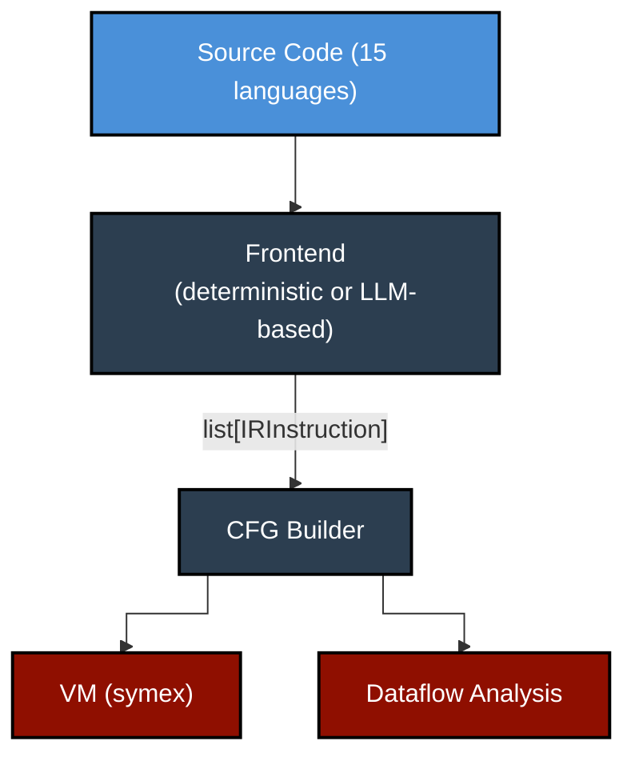
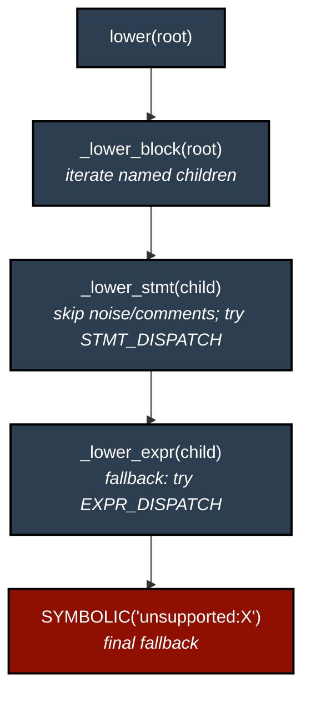

*A universal IR, 15 deterministic frontends, a symbolic VM, and an iterative audit loop.*


---

## The Problem

I wanted to analyse source code across many languages (trace data flow, build control flow graphs, understand how variables depend on each other) without writing a separate analyser for each language. The conventional approach is to build language-specific tooling (Roslyn for C#, javac's AST for Java, etc.), but that means duplicating every downstream analysis pass for every language. I wanted one representation, one analyser, many languages.

The twist: I also wanted to handle *incomplete* programs gracefully. Real-world code depends on imports, frameworks, and external systems that aren't available during static analysis. Most tools crash or give up when they hit an unresolved reference. I wanted mine to keep going, creating symbolic placeholders for unknowns and tracing data flow through them.

[RedDragon](https://github.com/avishek-sen-gupta/red-dragon) is the result. It parses source in 15 languages, lowers it to a universal intermediate representation, builds control flow graphs, performs iterative dataflow analysis, and executes programs symbolically via a deterministic virtual machine. All with zero LLM calls for programs with concrete inputs.

RedDragon is part of a family of three tools: [Codescry](https://github.com/avishek-sen-gupta/codescry) (a repo surveying toolkit that detects integration points using regex, ML classifiers, code embeddings, and LLM classification) and [RedDragon-Codescry TUI](https://github.com/avishek-sen-gupta/reddragon-codescry-tui) (a terminal UI integrating the two). The TUI demo is shown above.

This post covers how the system was designed, how it evolved, and the engineering discipline that kept it coherent across 28 architectural decisions and 400+ conversation sessions with Claude Code.

---

## Table of Contents

1. [Architecture Overview](#architecture-overview)
2. [The IR: 19 Opcodes to Rule Them All](#the-ir-19-opcodes-to-rule-them-all)
3. [Frontends: Three Strategies, One Output](#frontends-three-strategies-one-output)
4. [The Dispatch Table Engine](#the-dispatch-table-engine)
5. [The Deterministic VM](#the-deterministic-vm)
6. [Dataflow Analysis](#dataflow-analysis)
7. [The Evolution: From Monolith to 7,268 Tests](#the-evolution-from-monolith-to-7268-tests)
8. [The Audit Loop: Systematic Completeness](#the-audit-loop-systematic-completeness)
9. [Cross-Language Verification via Exercism](#cross-language-verification-via-exercism)
10. [Guardrails: The CLAUDE.md as Architecture](#guardrails-the-claudemd-as-architecture)
11. [What I'd Do Differently](#what-id-do-differently)

---

## Architecture Overview

RedDragon follows a classic compiler pipeline, extended with symbolic execution:



Every stage operates on the same flat IR. The VM and dataflow analysis are language-agnostic. They don't know whether the instructions came from Python, Rust, or COBOL.

---

## The IR: 19 Opcodes to Rule Them All

The intermediate representation is a flattened three-address code with 19 opcodes, grouped by role:

```
Value producers:   CONST, LOAD_VAR, LOAD_FIELD, LOAD_INDEX,
                   NEW_OBJECT, NEW_ARRAY, BINOP, UNOP,
                   CALL_FUNCTION, CALL_METHOD, CALL_UNKNOWN

Value consumers:   STORE_VAR, STORE_FIELD, STORE_INDEX

Control flow:      BRANCH, BRANCH_IF, LABEL, RETURN, THROW

Escape hatch:      SYMBOLIC
```

Every instruction is a flat dataclass: an opcode, a list of operands, a destination register, and a source location tracing it back to the original code. No nested expressions. `a + b * c` decomposes into:

```
%0 = const b
%1 = const c
%2 = binop * %0 %1
%3 = const a
%4 = binop + %3 %2
```

This verbosity is the trade-off for universality. CFG construction, dataflow analysis, and VM execution all operate on the same flat list. Adding a new language means emitting these 19 opcodes; everything downstream works automatically.

### Source Location Traceability

Every instruction carries a `SourceLocation` with start/end line and column, captured from the tree-sitter AST node that generated it. The IR's string representation appends this:

```
%0 = const 10  # 1:4-1:6
```

This means any IR instruction, any VM execution step, any dataflow dependency can be traced back to the exact span of source code that produced it. When a symbolic value appears in the output, its provenance chain leads back to specific source lines.

### Control Flow in the IR

All control flow is explicit. There are no structured `if`/`while`/`for` constructs in the IR. A simple `if/else` lowers to labels, conditional branches, and unconditional jumps:

```
%0 = binop > x 5
branch_if %0 if_true_0,if_false_0
if_true_0:
  %1 = const 1
  store_var y %1
  branch if_end_0
if_false_0:
  %2 = const 0
  store_var y %2
  branch if_end_0
if_end_0:
  ...
```

`BRANCH_IF` encodes both targets in its label field (comma-separated). The CFG builder splits the IR into basic blocks at every `LABEL` and after every `BRANCH`/`BRANCH_IF`/`RETURN`/`THROW`, then wires edges based on the branch targets. Loops become back-edges: a `while` loop's `BRANCH` at the end of the body points back to the condition's label.

### Functions as IR Patterns

Function definitions are lowered as *skip-over* patterns. The body is emitted inline in the IR, bracketed by a `BRANCH` that jumps past it (so the body isn't executed at definition time) and a `LABEL` marking the entry point:

```
branch end_add_0              # skip over body
func_add_0:                   # entry point
  %0 = symbolic param:a       # parameter binding
  store_var a %0
  %1 = symbolic param:b
  store_var b %1
  %2 = load_var a
  %3 = load_var b
  %4 = binop + %2 %3
  return %4
end_add_0:
  %5 = const <function:add@func_add_0>
  store_var add %5
```

Parameters are emitted as `SYMBOLIC` instructions with a `param:` prefix. A `FunctionRegistry` scans the IR to extract parameter names from these markers and maps class names to method labels. This metadata drives call resolution at execution time.

### Three Call Variants

The IR distinguishes three kinds of calls by their operand layout:

- **`CALL_FUNCTION`**: static calls where the target is a known name. Operands: `[func_name, arg0, arg1, ...]`
- **`CALL_METHOD`**: method calls on objects. Operands: `[obj_reg, method_name, arg0, arg1, ...]`
- **`CALL_UNKNOWN`**: dynamic calls where the target is a computed expression (a variable holding a function reference, or a closure). Operands: `[target_reg, arg0, arg1, ...]`

The frontend decides which to emit based on the AST: `foo(x)` emits `CALL_FUNCTION`, `obj.foo(x)` emits `CALL_METHOD`, and `some_var(x)` where `some_var` isn't a known function emits `CALL_UNKNOWN`.

### Object and Array Construction

Objects and arrays are created via `NEW_OBJECT`/`NEW_ARRAY` followed by `STORE_FIELD`/`STORE_INDEX` for each member. An array literal `[1, 2, 3]` lowers to:

```
%0 = const 3
%1 = new_array list %0
%2 = const 0
%3 = const 1
store_index %1 %2 %3         # array[0] = 1
%4 = const 1
%5 = const 2
store_index %1 %4 %5         # array[1] = 2
%6 = const 2
%7 = const 3
store_index %1 %6 %7         # array[2] = 3
```

This verbose expansion means the VM and dataflow analysis see every individual element assignment, which matters for tracking which values flow into which positions.

### The SYMBOLIC Escape Hatch

`SYMBOLIC` is the escape hatch. When a frontend encounters a construct it doesn't handle, it emits `SYMBOLIC "unsupported:list_comprehension"` instead of crashing. The VM treats it as a symbolic value that propagates through execution. Parameters use it too (`SYMBOLIC "param:x"`), as do caught exceptions (`SYMBOLIC "caught_exception:ValueError"`).

Over time, `unsupported:` emissions get replaced with real IR as frontends gain coverage. The project's history is essentially the story of systematically eliminating every last `SYMBOLIC`.

---

## Frontends: Three Strategies, One Output

All three frontend strategies produce the same `list[IRInstruction]`. They differ in speed, coverage, and determinism:

**1. Deterministic frontends (15 languages):** Python, JavaScript, TypeScript, Java, Ruby, Go, PHP, C#, C, C++, Rust, Kotlin, Scala, Lua, Pascal. These use tree-sitter for parsing and a dispatch-table-based recursive descent for lowering. Sub-millisecond. Zero LLM calls. Fully testable.

**2. LLM frontend:** For languages without a deterministic frontend. The source is sent to an LLM constrained by a formal schema: all 19 opcode specs, concrete patterns, and worked examples. The LLM acts as a mechanical compiler frontend, not a reasoning engine. This distinction matters: the prompt doesn't ask *"what does this code do?"* It asks *"translate this into these specific opcodes."*

**3. Chunked LLM frontend:** For large files that overflow context windows. Tree-sitter decomposes the file into per-function chunks, each is LLM-lowered independently, registers and labels are renumbered to avoid collisions, and the chunks are reassembled into a single IR.

The key architectural decision was making the LLM path a *compiler frontend*, not a *reasoning engine*. When you constrain the LLM to pattern-matching against a formal schema, output quality improves. It's translating syntax, not reasoning about semantics.

---

## The Dispatch Table Engine

The heart of the deterministic frontends is a `BaseFrontend` class (~950 lines) that all 15 languages inherit from. It uses two dispatch tables (one for statements, one for expressions) mapping tree-sitter AST node types to handler methods.

The lowering dispatch chain:



Common constructs (`if/else`, `while`, `for`, `return`, `function_definition`, `class_definition`, `try/catch`) are handled in the base class. Language-specific constructs override or extend. Overridable constants handle the small but persistent differences across grammars:

```python
# Python says "True", Go says "true", Lua says "true"
TRUE_LITERAL: str = "True"    # default
FALSE_LITERAL: str = "False"
NONE_LITERAL: str = "None"

# Python puts the body in "body", Go puts it in "block"
FUNC_BODY_FIELD: str = "body"
IF_CONSEQUENCE_FIELD: str = "consequence"
```

All 15 languages canonicalise their native null/boolean forms to Python-form at lowering time. `nil`, `null`, `undefined`, `NULL` all become `"None"`. `true`, `True`, `TRUE` all become `"True"`. This means the VM only handles one set of literals, regardless of source language.

Adding support for a new AST node type is mechanical: write a handler method, register it in the dispatch table. This is what made the systematic coverage push possible. When the audit flagged 34 missing node types across 15 languages, implementing them was straightforward because each one followed the same pattern.

---

## The Deterministic VM

One decision shaped the rest of the project more than any other: making the VM fully deterministic.

The original design had the LLM deciding state changes at each execution step. When the VM encountered an unknown value, it asked the LLM what to do. This was slow, non-deterministic, untestable, and fragile.

The key insight came from a simple question: *"Given that the IR is always bounded, shouldn't execution be deterministic?"* Yes. If the IR has no unbounded loops (or loops are bounded by concrete values), execution is a mechanical process. Unknown values don't need to be *resolved*. They can be *created* as symbolic placeholders that propagate through computation.

So we ripped out all LLM calls from the VM. The entire execution engine became reproducible across runs.

### VM State: Frames, Heap, and Closures

The VM's state is held in a single `VMState` dataclass:

```python
@dataclass
class VMState:
    heap: dict[str, HeapObject]          # flat object store
    call_stack: list[StackFrame]         # LIFO execution frames
    path_conditions: list[str]           # branch assumptions
    symbolic_counter: int = 0            # fresh-name generator
    closures: dict[str, ClosureEnvironment]  # shared mutable cells
```

Each `StackFrame` has a **two-level namespace**: `registers` for IR temporaries (`%0`, `%1`, ...) and `local_vars` for source-level named variables. This separation keeps the three-address code machinery invisible to the analysis layer, which only cares about named variables.

The heap is a flat dictionary mapping addresses (`"obj_0"`, `"arr_1"`) to `HeapObject` instances. Each `HeapObject` stores a `type_hint` and a `fields` dictionary. Arrays use stringified indices as field keys. This uniform representation means the VM doesn't distinguish between object field access and array indexing at the storage level.

### Opcode Dispatch

The `LocalExecutor` maps each of the 19 `Opcode` enum values to a handler function via a static dispatch table:

```python
DISPATCH: dict[Opcode, Any] = {
    Opcode.CONST: _handle_const,
    Opcode.BINOP: _handle_binop,
    Opcode.CALL_FUNCTION: _handle_call_function,
    Opcode.LOAD_FIELD: _handle_load_field,
    # ... all 19 opcodes
}
```

Every handler receives the instruction, the VM state, the CFG, and a function registry, and returns an `ExecutionResult`. No handler mutates the VM directly. Instead, each constructs a `StateUpdate` describing the desired mutations.

### StateUpdate: The Communication Contract

`StateUpdate` is the universal contract between handlers and the state engine. It's a pure data object listing all effects:

```python
class StateUpdate:
    register_writes: dict[str, Any]      # %0 = value
    var_writes: dict[str, Any]           # x = value
    heap_writes: list[HeapWrite]         # obj.field = value
    new_objects: list[NewObject]         # allocate on heap
    call_push: StackFramePush | None     # push new frame
    call_pop: bool                       # pop frame on return
    path_condition: str | None           # branch assumption
    next_label: str | None               # jump target
```

This separation of *computation* (handlers) from *mutation* (`apply_update`) is a deliberate functional core / imperative shell split. The handlers are pure functions that return data. The mutation is centralised in one place.

### `apply_update()`: The Single Mutator

All state changes flow through a single function, `apply_update()`, which applies a `StateUpdate` to the VM in a strict order:

1. **New objects**: allocate heap entries
2. **Register writes**: write to the current frame's registers
3. **Heap writes**: update object fields (materialising synthetic entries if needed)
4. **Path condition**: record branch assumptions
5. **Call push**: push a new `StackFrame` onto the call stack
6. **Variable writes**: write to the *current* frame's `local_vars` (which is the new frame if step 5 fired)
7. **Call pop**: pop the call stack on return

The ordering of steps 5 and 6 is the subtle part. When calling a function, parameters need to land in the *new* frame, not the caller's. By pushing the frame first (step 5) and writing variables second (step 6), parameter bindings automatically go to the right place without any special-casing.

Step 6 also handles closure synchronisation: if a written variable is in the frame's `captured_var_names`, the write is mirrored to the shared `ClosureEnvironment`, ensuring that mutations inside closures are visible to other closures sharing the same environment.

### Symbolic Value Propagation

When execution hits an unresolved import or function, the VM creates a `SymbolicValue` with a descriptive hint:

```
sym_0 (hint: "math.sqrt(16)")
```

This symbolic value propagates through computation deterministically. Each handler checks whether its operands are symbolic. If either operand of a `BINOP` is symbolic, the result is a fresh symbolic with a constraint recording the expression:

```
sym_0 + 1  →  sym_1 (constraint: "sym_0 + 1")
```

Field access on a symbolic object creates a symbolic field with lazy heap materialisation: the first access to `sym_0.x` allocates a synthetic heap entry and caches a symbolic value for `x`, so subsequent accesses to the same field return the same symbolic. This deduplication is important for dataflow analysis, where repeated reads of the same field should trace back to the same definition.

Concrete operations that fail (division by zero, unsupported operator) produce an `UNCOMPUTABLE` sentinel, which triggers symbolic fallback rather than crashing.

The trade-off is that symbolic branches always take the true path (a simplification), and symbolic values can't be resolved to concrete results without help.

### The UnresolvedCallResolver

For the latter trade-off, a configurable `UnresolvedCallResolver` uses the Strategy pattern:

**SymbolicResolver** (default): creates a fresh symbolic for any unknown call. Zero LLM calls, fully deterministic.

**LLMPlausibleResolver** (opt-in): sends a structured prompt to an LLM with the function name, arguments, and current VM state, then parses the response into a `StateUpdate`. Falls back to `SymbolicResolver` on failure.

This separation keeps the default execution path fast and reproducible while allowing users to opt into richer (but slower, non-deterministic) analysis when needed.

### Closures

One subtle design iteration worth mentioning: closure capture semantics. The initial implementation captured variables by snapshot (copy at definition time). This broke counter factories:

```python
def make_counter():
    count = 0
    def inc():
        count += 1
        return count
    return inc
```

With snapshot capture, `inc()` always reads `count = 0`. The fix was shared `ClosureEnvironment` cells: all closures from the same scope share a mutable environment, matching Python/JavaScript semantics. When a nested function is created, the enclosing frame's variables are copied into a `ClosureEnvironment`. On each call, captured variables are injected into the new frame, and `apply_update()` mirrors writes back to the shared environment. This is the kind of deep correctness issue that only surfaces through specific test cases. It's documented as ADR-019 in the project's decision records.

### Built-in Functions

The VM includes a small table of built-in functions (`len`, `range`, `print`, `int`, `float`, `str`, `bool`, `abs`, `max`, `min`, plus array constructors) that are resolved before falling through to the `UnresolvedCallResolver`. Each built-in handles symbolic arguments gracefully: `len` of a symbolic list returns a symbolic, `range` with symbolic bounds returns `UNCOMPUTABLE`, and so on. This keeps common operations concrete without requiring language-specific runtime support.

---

## Dataflow Analysis

The dataflow module performs iterative intraprocedural analysis:

1. **Collect definitions**: identify every point where a variable or register is assigned
2. **Reaching definitions**: GEN/KILL worklist fixpoint iteration over the CFG
3. **Def-use chains**: link each use to the definition(s) that reach it
4. **Variable dependency graph**: trace through register chains to discover named-variable-to-named-variable dependencies, with transitive closure

The interesting part is step 4. The IR uses temporary registers (`%0`, `%1`, ...) for all intermediate values. A statement like `y = x + 1` becomes:

```
%0 = LOAD_VAR x
%1 = CONST 1
%2 = BINOP +, %0, %1
     STORE_VAR y, %2
```

The raw def-use chain says "`y` depends on `%2`". But a human wants to know "`y` depends on `x`". The dependency graph builder traces through the register chain: `%2` comes from `BINOP` on `%0` and `%1`; `%0` comes from `LOAD_VAR x`; `%1` is a constant. Therefore `y` depends on `x`. Transitive closure extends this across multi-step computations.

The dataflow module has no dependencies on the VM, frontends, or backends. It's a pure analysis pass over the CFG, decoupled from the imperative shell (parsing, I/O, LLM calls).

---

## The Evolution: From Monolith to 7,268 Tests

RedDragon's evolution followed a clear pattern of phases, each triggered by testing the previous one on real code:

**Phase 1: The monolith (Hour 0 to 2).** A single `interpreter.py` with an LLM-based lowering and execution engine. ~1,200 lines. It worked, barely.

**Phase 2: The determinism pivot (Hour 2 to 4).** The key insight: execution should be deterministic. Ripped out all LLM calls from the VM. Added symbolic value creation. Once the VM was deterministic, everything became testable.

**Phase 3: Multi-language frontends (Hour 4 to 8).** Asked: *"How hard is it to write deterministic logic to lower ASTs for 15 languages?"* The answer: not that hard, with tree-sitter and a dispatch table engine. 15 frontends generated in a single marathon session. 346 tests.

**Phase 4: Analysis and tooling (Hour 8 to 14).** Added iterative dataflow analysis, chunked LLM frontend, Mermaid CFG visualisation with subgraphs and call edges, source location traceability. Extracted CLI into composable API.

**Phase 5: Systematic hardening (Sessions 50 to 130).** This is where the test count exploded. The Rosetta cross-language test suite (8 algorithms x 15 languages) and then the Exercism integration suite drove the test count from ~700 to 7,268 across 80+ sessions. Each exercise exposed new frontend gaps, VM limitations, and edge cases, and each fix was immediately verified across all 15 languages.

The test count tells the story:

```
Phase 1–3:   346 tests
Phase 4:     ~700 tests
Rosetta:     ~1,200 tests
Exercism 1:  ~2,700 tests
Exercism 2:  ~4,200 tests
Exercism 3:  ~5,150 tests
Exercism 4:  ~7,076 tests
Final:        7,268 tests (+ 3 xfailed)
```

All tests run without LLM calls and are deterministic.

---

## The Audit Loop: Systematic Completeness

A recurring pattern in RedDragon's development was the *audit-fix-reaudit* loop. After every batch of frontend work, I ran a comprehensive two-pass audit:

**Pass 1 (Dispatch Comparison):** Parse source samples in all 15 languages, collect every AST node type that appears, compare against the frontend's dispatch tables, and classify unhandled types as structural (harmless, consumed by parent handlers) or substantive (gaps that produce `SYMBOLIC`).

**Pass 2 (Runtime SYMBOLIC check):** Actually lower the source through each frontend, scan the resulting IR for `SYMBOLIC` instructions with `"unsupported:"` operands. This catches gaps that the static analysis might miss.

The classification heuristic itself went through three iterations:

1. **Naive:** Flag everything not in a dispatch table. This produced hundreds of false positives, because nodes like `parameter_list` and `type_annotation` are consumed by parent handlers and never reach the dispatch chain independently.

2. **Parent heuristic:** Flag unhandled nodes only if their immediate parent isn't handled. This reduced false positives but still produced 259. When the parent was also unhandled but deep structural (never block-iterated), its children got flagged incorrectly.

3. **Block-reachability analysis:** The final approach. Walk the AST and identify which unhandled nodes are *direct named children of block-iterated nodes* (the root, or nodes whose type maps to `_lower_block` in the dispatch table). Only these nodes can ever reach `_lower_stmt` and produce `SYMBOLIC`. Everything else is a deep structural node consumed by parent handlers.

The block-reachability approach dropped substantive gaps from 259 to 1 (a C `case_statement` that was a genuine gap, subsequently fixed with a defensive handler). The evolution of this heuristic is a good example of how empirical feedback drives design. Each version was tested against the full corpus, and false positives were investigated until the classification matched reality.

The audit loop ran dozens of times across the project's life:

```
Audit → 34 gaps found → implement all 34 (57 new tests)
Re-audit → 19 gaps found → implement all 19 (28 new tests)
Re-audit → 12 gaps found → implement all 12 (18 new tests)
Re-audit → 0 gaps, 0 SYMBOLIC
```

This pattern (audit, batch-fix, re-audit) was more effective than trying to enumerate every missing feature upfront. The audit told me what was missing, I fixed what it found, and repeated until it found nothing.

---

## Cross-Language Verification via Exercism

The broadest verification effort was the Exercism integration test suite. The idea: take Exercism's canonical test cases (which define expected inputs and outputs for programming exercises), write equivalent solutions in all 15 languages, and verify that RedDragon's pipeline produces the correct answer for every case in every language.

Each exercise tests a specific set of language constructs:

| Exercise | Key Constructs | Cases | Total Tests |
|----------|----------------|-------|-------------|
| leap | modulo, boolean logic, short-circuit eval | 9 | 287 |
| collatz-conjecture | while loop, conditional, integer division | 4 | 137 |
| difference-of-squares | accumulator, function composition | 9 | 287 |
| two-fer | string concatenation, string literals | 3 | 107 |
| hamming | string indexing, character comparison | 5 | 167 |
| reverse-string | backward iteration, char-by-char building | 5 | 167 |
| rna-transcription | multi-branch if, character mapping | 6 | 197 |
| perfect-numbers | divisor loop, three-way string return | 9 | 287 |
| triangle | nested ifs, validity guards, 3-arg functions | 21 | 647 |
| space-age | float division, float constants | 8 | 257 |
| grains | exponentiation, large integers | 8 | 257 |
| isogram | nested loops, continue, helper functions | 14 | 437 |
| nth-prime | trial division, primality testing | 3 | 107 |
| resistor-color | string-to-int mapping | 3 | 107 |
| pangram | string variable indexing, nested loops | 11 | 347 |
| bob | multi-branch string classification | 22 | 633 |
| luhn | two-pass validation, right-to-left traversal | 22 | 677 |
| acronym | word boundary detection, toUpperChar | 9 | 269 |

For each exercise, every canonical test case generates tests across three dimensions:

1. **Lowering quality**: does the IR contain any `unsupported:` SYMBOLIC? (15 tests per exercise)
2. **Cross-language consistency**: do all 15 languages produce structurally equivalent IR? (2 tests per exercise)
3. **VM execution correctness**: does the VM produce the expected output? (cases x languages tests)

The argument substitution mechanism deserves a mention: a `build_program()` helper finds the `answer = f(default_arg)` line in each solution and substitutes new arguments for each canonical test case. This works across languages with different assignment syntaxes (`=`, `:=`, `: type =`) via regex.

The Exercism suite surfaced more bugs than any other test approach. Each exercise exposed new gaps: Ruby's `parenthesized_statements` vs Python's `parenthesized_expression`, Rust's expression-position loops, Pascal's single-quote string escaping, PHP's `.` concatenation operator. Every gap found was a bug fixed.

---

## Guardrails: The CLAUDE.md as Architecture

RedDragon was built almost entirely through conversations with Claude Code, across 400+ sessions. The file that had the most impact on consistency wasn't any Python module. It was `CLAUDE.md`, which encodes the development rules.

Some of the rules that shaped the codebase most:

**"STOP USING FOR LOOPS WITH MUTATIONS IN THEM. JUST STOP."** This rule forced a functional programming style across the codebase. List comprehensions, `map`, `filter`, `reduce` instead of mutable accumulators. The code is denser but more predictable.

**"Do not use `unittest.mock.patch`. Use proper dependency injection."** This forced every external dependency (LLM clients, file I/O, clocks) to be injectable. The result: the entire VM, all 15 frontends, and all analysis passes are testable in isolation without mocking.

**"If a function has a non-None return type, never return None."** Combined with null object pattern enforcement, this eliminated an entire class of `NoneType` errors. Functions that can't produce a value return a null object, not `None`.

**"Before committing anything, run all tests, fixing them if necessary."** This prevented test count regression across 100+ commits.

**"Once a design is finalised, document it as an ADR."** This produced 28 timestamped architectural decision records that serve as the project's institutional memory. Each records the context, the decision, and the consequences, including trade-offs.

The workflow encoded in CLAUDE.md is: **Brainstorm → Discuss trade-offs → Plan → Write unit tests → Implement → Fix tests → Commit → Refactor.** This isn't just process documentation. It's an enforceable contract. Every session begins with these rules loaded into context.

---

## What I'd Do Differently

**Start with the audit earlier.** The two-pass audit should have existed from the first batch of frontends. Instead, I relied on manual inspection for the first 50 sessions, and only built the audit when the number of frontends made manual checking impossible. In hindsight, the audit loop was what kept quality from drifting.

**Invest in cross-language tests from day one.** The Rosetta and Exercism suites exposed more bugs than all the language-specific unit tests combined. A single exercise tested across 15 languages covers more surface area than 50 unit tests in one language.

**Be more aggressive about the functional core.** Even with the FP rules in CLAUDE.md, some mutation crept in, especially in the VM executor. The dataflow module, by contrast, is almost purely functional and is by far the easiest module to reason about and test. The correlation is not a coincidence.

---

## The Numbers

| Metric | Value |
|--------|-------|
| Supported languages | 15 (deterministic) + any (LLM) |
| IR opcodes | 19 |
| Tests (all passing) | 7,268 + 3 xfailed |
| LLM calls at test time | 0 |
| Architectural decision records | 28 |
| Exercism exercises | 18 (across 15 languages) |
| Rosetta algorithms | 8 (across 15 languages) |
| Conversation sessions | ~400 |
| Git commits | 125 |
| Co-authored with Claude | 124 (99.2%) |
| Solo human commits | 1 |
| Audit substantive gaps (final) | 0 |
| Audit SYMBOLIC emissions (final) | 0 |

---

## Conclusion

RedDragon started as a question: *"Can I build a single system that analyses code in any language?"* It evolved into a compiler pipeline with 15 deterministic frontends, a symbolic VM, and cross-language verification.

None of the individual components are novel. TAC IR, dispatch tables, worklist dataflow, symbolic execution are all textbook techniques. The value, if any, is in applying them together to a practical multi-language analysis tool and then hardening the result through systematic auditing.

The architecture wasn't planned upfront. The deterministic VM emerged from asking *"shouldn't this be deterministic?"* The audit loop emerged from asking *"what's still missing?"* The Exercism test suite emerged from wanting more confidence than unit tests alone could provide. Each decision was triggered by testing the previous one on real code and noticing a gap.

All three projects are open source: [RedDragon](https://github.com/avishek-sen-gupta/red-dragon), [Codescry](https://github.com/avishek-sen-gupta/codescry), and [RedDragon-Codescry TUI](https://github.com/avishek-sen-gupta/reddragon-codescry-tui).

_This post has not been written or edited by AI._
