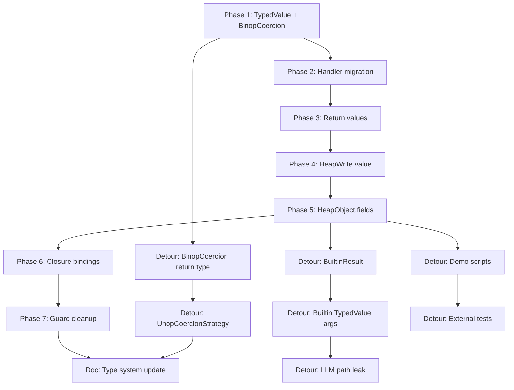

*Tracing the full arc of a multi-phase refactoring — from "Java string concatenation crashes the VM" to "every value in the system carries its type" — done across a dozen sessions with Claude Code over two days.*

---

## Table of Contents

- [The Problem](#the-problem)
- [Phase 1: TypedValue and BinopCoercionStrategy](#phase-1-typedvalue-and-binopcoercionstrategy)
  - [The Design Decision That Shaped Everything](#the-design-decision-that-shaped-everything)
  - [The Boundary Table](#the-boundary-table)
- [Phase 2: Handler Migration](#phase-2-handler-migration)
  - [The Serialize/Deserialize Roundtrip](#the-serializedeserialize-roundtrip)
- [Phase 3: Return Values](#phase-3-return-values)
  - [The Constructor Bug](#the-constructor-bug)
- [Phases 4–6: Heap and Closures](#phases-46-heap-and-closures)
  - [The Double-Wrapping Landmine](#the-double-wrapping-landmine)
- [Phase 7: Cleaning Up After Ourselves](#phase-7-cleaning-up-after-ourselves)
- [Detour: Builtins](#detour-builtins)
  - [BuiltinResult: Side Effects Should Be Declarative](#builtinresult-side-effects-should-be-declarative)
  - [Builtin Args: The Atomic Commit Problem](#builtin-args-the-atomic-commit-problem)
- [More Detours](#more-detours)
  - [BinopCoercionStrategy Return Type](#binopcoercionstrategy-return-type)
  - [UnopCoercionStrategy](#unopcoercionstrategy)
  - [Demo Scripts and LLM Path Leaks](#demo-scripts-and-llm-path-leaks)
  - [The Question That Came After](#the-question-that-came-after)
- [The Shape of the Work](#the-shape-of-the-work)
- [Takeaways](#takeaways)

---

## The Problem

[RedDragon](https://github.com/avishek-sen-gupta/red-dragon) is a multi-language code analysis engine with a universal IR, deterministic VM, and a type system. It parses 15 languages, lowers them to IR, and executes the IR on a virtual machine.

The VM stored values as raw Python primitives — `int`, `str`, `float`, `bool`. Type information lived in a completely separate structure: a `TypeEnvironment` built by a static inference pass before execution. The operators themselves never saw types. They received raw values via `_resolve_reg` and used Python's native operators.

This created an obvious problem. When Java code did `"int:" + 42`, Python raised `TypeError` because it can't concatenate `str` and `int`. The VM caught the exception and degraded the result to a `SymbolicValue` — a placeholder meaning "I don't know what this is." The concrete information was gone. Java, C#, Kotlin, and Scala all auto-stringify non-string operands in string concatenation. The VM had no way to implement this because type information was absent at the point of operation.

The fix looked straightforward: make type information available to operators. What followed was a refactoring that touched almost every layer of the VM, exposed hidden assumptions in constructor handling, revealed that builtins were bypassing the state management contract, and prompted several side detours into coercion protocols, demo scripts, and the question of whether two separate type-tracking mechanisms were still both necessary.

This post traces that arc. It's written partly as documentation and partly because the shape of the work — the way a focused fix expanded into a system-wide migration, the side detours, the bugs that only surfaced because something else changed — is characteristic of refactoring work in general. The AI didn't change the nature of that work. It changed the speed.

All of this was done through conversations with Claude Code, using the [Superpowers](https://github.com/anthropics/claude-code-plugins) skill system. Each major phase started with the *brainstorming* skill — a structured dialogue that forces you to articulate the design before touching code. The brainstorming skill doesn't let you skip ahead to implementation; it walks through clarifying questions, proposes alternative approaches with trade-offs, and only produces a design spec after you've agreed on the direction. From there, the *writing-plans* skill breaks the spec into granular TDD steps, and *subagent-driven development* dispatches fresh agents per task with two-stage review. The discipline of that pipeline — brainstorm, spec, plan, implement, review — shaped the migration as much as the code decisions did.

Task tracking ran through [Beads](https://github.com/anthropics/beads), a local-first issue tracker that lives alongside the repo. Every phase, every detour, every discovered bug got its own Beads task. When I finished a phase and asked *"what next?"*, the answer often came from running `bd ready` — Beads surfacing the next unblocked task. When a detour emerged mid-session (the constructor bug, the builtin side-effect problem), it got filed as a new Beads task immediately, triaged against the existing work, and either addressed in sequence or deferred. The tracker made it possible to context-switch between the main migration and its detours without losing track of what was done and what remained.

The refactoring spanned about a dozen sessions over two days. I'm including specific moments from those conversations — places where I had to course-correct, where I got frustrated with the codebase or the AI's approach, where a question I asked led to discovering something unexpected — because the texture of those interactions is part of the story.

---

## Phase 1: TypedValue and BinopCoercionStrategy

The first design session used the brainstorming skill to work through the problem space. The skill's process is structured: it asks one clarifying question at a time, proposes approaches with trade-offs, and won't let you skip to implementation until a design is approved. In this case, the dialogue went through eight questions before code was discussed.

The skill started with motivation: *"What's the primary goal — language-correct operators, eliminating the side-car type system, or both?"* I said both. Then it asked whether `TypedValue` should wrap everything (even values with unknown types) or only values with known types. It recommended wrapping everything — even with `UNKNOWN` — to eliminate all "is this typed or raw?" branching. I agreed, and this turned out to be the single most important design decision of the entire migration.

The next questions drilled into specifics. Should `TypedValue` subsume `SymbolicValue` and `Pointer`, or wrap them? The skill proposed wrapping — keeping `SymbolicValue` as a value inside `TypedValue` rather than replacing it — which preserved the existing constraint-tracking machinery without duplication. Then: how should BINOP consume types? The skill proposed two approaches: (A) unwrap, operate on raw values, rewrap with inferred type, or (B) full type-driven dispatch where operators receive `TypedValue` throughout. It recommended A as the simpler path. I agreed, but added a requirement: *"BINOP should have access to a pluggable language-specific TypeConversionStrategy."* That addition — mine, not the skill's — became `BinopCoercionStrategy`.

The skill then proposed three migration approaches:

1. **Big Bang** — change everything at once. Rejected as too risky.
2. **Incremental with accessor protocol** — wrap at `apply_update`, migrate handlers one by one. Recommended and chosen.
3. **Transparent wrapper with magic methods** — `TypedValue.__add__` delegates to the underlying value. The skill flagged this as violating the simplest-mechanism principle: `isinstance(val, int)` checks throughout the codebase would silently fail.

The last question was about scope: *"Where should language information live — on the value or on the strategy?"* The skill recommended the strategy: *"A Java Int and a C# Int are the same value with the same type; the difference is in the coercion rules applied to them."* I agreed.

That session produced two things: `TypedValue` and `BinopCoercionStrategy`.

`TypedValue` is a frozen dataclass:

```python
@dataclass(frozen=True)
class TypedValue:
    value: Any       # The raw Python value
    type: TypeExpr   # The inferred or declared type
```

`BinopCoercionStrategy` is a protocol with two methods:

```python
class BinopCoercionStrategy(Protocol):
    def coerce(self, op: str, lhs: TypedValue, rhs: TypedValue) -> tuple[TypedValue, TypedValue]:
        ...
    def result_type(self, op: str, lhs: TypedValue, rhs: TypedValue) -> TypeExpr:
        ...
```

`coerce()` transforms operands before the operator runs. `result_type()` infers the output type. The executor calls both, wraps the result in `TypedValue`, and stores it.

`DefaultBinopCoercion` is a no-op — it passes operands through unchanged and infers types from operator categories (comparisons return `Bool`, arithmetic follows numeric promotion rules). `JavaBinopCoercion` overrides `coerce()` to auto-stringify non-string operands when `+` is used with a `String`.

### The Design Decision That Shaped Everything

The critical decision was: **"language on strategy, not value."** A Java `Int` and a C# `Int` are the same `TypedValue`. The difference is in the injected coercion strategy. This meant we didn't need a `JavaInt` vs. `CSharpInt` distinction. The coercion strategy is selected once at the top of the execution pipeline based on the source language, then threaded through via dependency injection.

The other critical decision: **every value is `TypedValue`, even when the type is `UNKNOWN`**. This eliminated all branching on "is this typed or raw?" throughout the codebase. It sounded like over-wrapping at first. It turned out to be the decision that kept the migration tractable.

### The Boundary Table

The spec documented five boundary crossings where values moved between storage locations (register-to-heap, heap-to-register, local-var-to-closure, closure-to-local-var, register-to-function-arg) and what wrapping/unwrapping happened at each. This table became the roadmap for every subsequent phase. Each phase was essentially: pick a boundary, push TypedValue one layer deeper, update the read sites, run the tests.

After this phase: ~11,274 tests passing.

---

## Phase 2: Handler Migration

Phase 1 wrapped values in `TypedValue` at the `apply_update` boundary — the function that takes a `StateUpdate` and applies it to the VM state. Every handler still produced raw values. `apply_update` wrapped them.

This worked but created a pointless roundtrip. Handlers called `_serialize_value()` to flatten objects into JSON-compatible structures, then `apply_update` called `_deserialize_value()` to reconstruct them. For locally-executed instructions (the vast majority), this was a no-op. The serialization path only existed for the LLM fallback, where an LLM returns a JSON `StateUpdate` that needs deserialization.

This phase had an interesting origin. I was partway through brainstorming the heap fields migration (Phase 5) when I realized that handlers were still producing raw values — the heap fields work would be building on a half-migrated foundation. I interrupted: *"I think then we pause this plan for now, and do red-dragon-132, so that values always arrive as TypedValue."* The heap fields task was deferred in Beads (`bd update red-dragon-f6i --status deferred`), and the handler migration jumped the queue. This is one of those moments where the issue tracker earned its keep — deferring a task mid-brainstorm without losing it.

### The Serialize/Deserialize Roundtrip

The brainstorming for the `apply_update` split was another case where I had to push back on the AI's first instinct. The AI proposed a dual-path `apply_update` with isinstance branching — check if the incoming value is `TypedValue` and take one path, otherwise take the raw path. I said: *"I think `apply_update` should be split into `apply_update` (which accepts only TypedValue) and `apply_update_raw` (the path which LLMs take)."* Then, on reflection: *"On second thoughts, what should probably happen is that in the else clause (the LLM path), the raw update should be transformed into a TypedValue update... that way, the updates from both clauses are the canonical TypedValue update."* The AI adopted this — a `materialize_raw_update` function that converts LLM responses into `TypedValue` updates before they enter the standard pipeline.

The fix split `apply_update` into two paths:
- **Local path:** Handlers produce `TypedValue` directly. `apply_update` stores them with lightweight type coercion.
- **LLM path:** A new `materialize_raw_update` function takes raw values from LLM JSON responses, deserializes them, coerces them, and wraps them in `TypedValue`.

The migration touched every handler in the executor — about 15 handler groups — done one at a time in dependency order: simple value handlers first (`_handle_const`, `_handle_store_var`), then loads (`_handle_load_var`, `_handle_load_field`), then objects, then operators, then the call chain. Each group was a separate commit.

The spec documented six different serialization patterns across handlers (raw value, `_serialize_value(val)`, `sym.to_dict()`, `SymbolicValue` object directly, `Pointer` object directly, heap address string). Each had its own migration path.

After this phase: ~11,449 tests passing.

---

## Phase 3: Return Values

`_handle_return` was still serializing return values via `_serialize_value(val)`, and `_handle_return_flow` was deserializing them back. This was the same roundtrip as Phase 2, just for return values.

The migration exposed a conflation that had been hiding in the return value semantics.

### The Constructor Bug

This was the most frustrating part of the migration, and the brainstorming conversation around it was contentious.

Before TypedValue, `return_value = None` meant two different things: "this instruction doesn't have a return value" and "the function returned None/null." These were indistinguishable. For most code this didn't matter. For constructors, it did.

Constructors in RedDragon work by allocating a heap object, running the constructor body (which stores fields via STORE_FIELD), and returning `self`. The return mechanism had a guard: `if return_value is not None`. This guard prevented constructors from accidentally clobbering their result register with `None` — constructors return the `this` pointer via a different mechanism (STORE_VAR into the caller's local), not via `return_value`.

When `return_value` became a `TypedValue`, the guard broke. `TypedValue(None, Void)` is not `None` — the isinstance check passes, and the constructor's result register gets overwritten with a void value.

The brainstorming for the fix started with me pushing on the void/None distinction. The AI's initial proposal had a `value is not None` guard on the return path — essentially preserving the old ambiguity under a new name. I pushed back: *"Why is there a None check though?"* This forced an explicit discussion of void vs null semantics. Then: *"I'm not comfortable with passing a naked None back."* And finally: *"I want the 'no return value is possible because it is void' scenario to also be represented by a different TypedValue."* This led to adding `VOID` to the type system.

But the real frustration came after implementation. The implementer agent had used `value is not None` as a guard anyway — silently discarding both Void and None TypedValues. I caught this in review: *"So you completely discarded creating Void and None TypedValues?"* followed by *"Produce a plan which accommodates the proper behaviour of using TypedValue, and not your coding convenience."* The fix was redesigned from scratch.

The eventual fix came in two commits:
1. Constructor detection via scope chain inspection — if the current frame is a constructor, skip return value writes to the result register.
2. Replace the `result_reg=None` hack (constructors had been setting their result register to `None` to prevent writes) with a clean `is_ctor` flag on `StackFrame`.

The `is_ctor` idea came from me during the brainstorming: *"Tentative idea: `_try_class_constructor_call` pushes `is_ctor` onto the constructor frame... the `_handle_return_flow` guard only assigns the return value if it is not Void."* The AI refined this into the implementation pattern.

This was a classic refactoring discovery: the old code worked, but only because of an accidental coupling between "None means no value" and "constructors shouldn't write return values." TypedValue made the coupling visible by removing the ambiguity. But it was also a case where the brainstorming process — the back-and-forth about what void means, the insistence on not taking shortcuts — produced a cleaner design than either party would have reached alone.

The fix introduced a three-state return type:
- `typed(None, scalar("Void"))` — void return (no value to write)
- `typed(None, UNKNOWN)` — explicit `return None`
- `typed(42, scalar("Int"))` — concrete return value

After this phase: ~11,449 tests, plus the constructor fix.

---

## Phases 4–6: Heap and Closures

Three more storage locations to migrate: `HeapWrite.value` (Phase 4), `HeapObject.fields` (Phase 5), and `ClosureEnvironment.bindings` (Phase 6).

Phase 4 was modest: `HeapWrite.value` carries `TypedValue`, but `apply_update` unwraps it before storing in `HeapObject.fields`. The heap stays raw for now.

Phase 5 pushed `TypedValue` into the heap itself. `HeapObject.fields` stores `TypedValue` directly. This was the largest single phase because every read site — `_handle_load_field`, `_handle_load_index`, constructor field access, builtin method dispatch — had to stop re-wrapping values that were already wrapped.

Phase 6 was the simplest: three write sites and one read site for closure bindings.

### The Double-Wrapping Landmine

Phase 5 was where I spent the most time reading code and trying to understand the flow. The heap is read from many places — field access, index access, constructor field initialization, alias variable resolution — and each site had its own slightly different wrapping logic. I kept asking *"what does this value look like when it arrives here?"* and tracing through the call chain to find out. The codebase had grown large enough that I couldn't hold the full picture in my head, and the AI's summaries sometimes glossed over details that mattered.

The persistent source of bugs was that `typed_from_runtime()` is not idempotent. If you pass it a `TypedValue`, it wraps it inside another `TypedValue`:

```
typed_from_runtime(TypedValue(42, Int))
→ TypedValue(value=TypedValue(42, Int), type=UNKNOWN)
```

Every read site that previously called `typed_from_runtime(raw_value)` unconditionally had to get an isinstance guard to prevent double-wrapping. The plan warned about intermediate breakage: tasks 1–4 changed write sites to store `TypedValue`, but read sites still called `typed_from_runtime()` unconditionally until tasks 5–7. The test suite was broken between those groups. This was acceptable because both groups were committed atomically.

After Phase 6: ~11,481 tests passing.

---

## Phase 7: Cleaning Up After Ourselves

All storage locations now stored `TypedValue`. The isinstance guards added during the transition — `if isinstance(val, TypedValue)` — were dead code. Phase 7 removed them all and narrowed type annotations. This was a cleanup commit, not a behavioral change.

---

## Detour: Builtins

The TypedValue migration was "done" after Phase 7. But the work exposed two more problems in the builtin system.

### BuiltinResult: Side Effects Should Be Declarative

This detour started with me asking *"what else?"* after the main migration was done. The AI ran an audit and flagged the builtins. The fix went through another round of brainstorming — a shorter one this time, since the pattern was established. The brainstorming skill proposed three approaches: (A) builtins return `ExecutionResult` directly, (B) a lightweight `BuiltinResult` dataclass with value + side effects, or (C) split builtins into two tables (pure vs heap-mutating). I chose B.

But the interesting moment was a correction I made to the AI's initial proposal. It had suggested that only the heap-mutating builtins return `BuiltinResult`, while pure builtins continue returning raw values. I pushed back: *"Pure builtins should also return BuiltinResult."* The point was uniform interface — the caller shouldn't need isinstance branching to figure out what a builtin returned. This was the same principle that drove the "every value is TypedValue, even when the type is UNKNOWN" decision in Phase 1. A Beads task was filed (`red-dragon-vva`), and the plan was generated from the spec.

RedDragon has about 40 built-in functions (`len`, `range`, `print`, `slice`, plus 25 COBOL-specific byte manipulation builtins). Most are pure — they take arguments and return a value. Two are not: `_builtin_array_of` creates a heap object, and `_builtin_object_rest` copies fields from an existing heap object. These two wrote directly to `vm.heap` as a side effect, bypassing the `apply_update` pipeline.

This had always been the case, but it became conspicuous once every other state change flowed through `StateUpdate`. I hadn't been thinking about builtins at all during the TypedValue planning — they seemed orthogonal. They weren't. The fix introduced `BuiltinResult`:

```python
@dataclass(frozen=True)
class BuiltinResult:
    value: TypedValue
    new_objects: list[NewObject] = field(default_factory=list)
    heap_writes: list[HeapWrite] = field(default_factory=list)
```

All builtins return `BuiltinResult`. The executor unpacks it into the `StateUpdate`. No builtin directly mutates `vm.heap`.

The migration was done in eight commits, with an isinstance bridge during the transition so that old-style builtins (returning raw values) and new-style builtins (returning `BuiltinResult`) could coexist. The bridge was removed in the last commit.

### Builtin Args: The Atomic Commit Problem

After builtins returned `TypedValue` via `BuiltinResult`, they still *received* raw Python primitives. `_resolve_reg` stripped the `TypedValue` wrapper before passing arguments. This was a hole: type information was available at the call site but discarded before the builtin could see it.

The fix was conceptually simple: change all builtins from `list[Any]` to `list[TypedValue]` arguments. The implementation was not, because **every builtin and every call site had to change simultaneously**. Changing the executor to pass `TypedValue` args without changing the builtins (which do things like `args[0] + args[1]`) would break all 11,530+ tests.

The plan explicitly mandated: no intermediate commits. All production code changes happen without committing; the single commit occurs after the full test suite passes. This was the only phase where the atomic commit constraint was hard — in every other phase, at least some intermediate states were testable.

This phase touched all 40+ builtins, all method builtins, all 25 COBOL builtins, and the parameter binding code in user function and constructor calls.

After builtins: ~11,530 tests passing.

---

## More Detours

The main migration was done. But work kept surfacing.

### BinopCoercionStrategy Return Type

This one came from me staring at the code and asking: *"Why does `BinopCoercionStrategy.coerce()` return `tuple[Any, Any]`?"*

We'd just spent two days making every value in the system a `TypedValue`. The protocol that coerces binary operands — the thing that started this entire migration — was still stripping types at its return boundary. The AI had implemented it that way in Phase 1, before the rest of the migration made `TypedValue` universal. Nobody caught it because the callers immediately re-wrapped the values. But it meant type information was being discarded and re-inferred at the coercion boundary, which defeated the purpose.

It was a one-commit fix, but I insisted it be filed as its own Beads task and done separately — changing the protocol return type is a distinct concern from the builtin migration, and mixing them would have muddied the commit history. Beads made this easy: file a task, give it a dependency on the current work, and it shows up in `bd ready` at the right time.

### UnopCoercionStrategy

Phase 1 introduced `BinopCoercionStrategy` for binary operators. Unary operators (`-x`, `not x`, `~x`, `#x`) had no equivalent — `_handle_unop` still used `_resolve_reg` (raw values) and `typed_from_runtime` (runtime type inference). The fix followed the same pattern: a `UnopCoercionStrategy` protocol with `coerce()` and `result_type()`, a `DefaultUnopCoercion` implementation, and threading through the executor pipeline via kwargs.

### Demo Scripts and LLM Path Leaks

After the main migration, the AI reported "all tests pass" and I asked: *"Do any of the script files need to be updated?"* They did. Five demo scripts in the `scripts/` directory used `_format_val` to display VM state. None of them handled `TypedValue`. After the heap fields migration, the scripts showed output like `fields={'x': TypedValue(value=42, type=ScalarType(name='Int'))}` instead of `fields={'x': 42}`.

The AI's first fix added an `_unwrap()` helper with isinstance guards. I pushed back: *"Why can't `_unwrap()` unconditionally take a TypedValue and unwrap it instead of all the isinstance nonsense?"* The local variables always store `TypedValue` now — that was the whole point. The guard was leftover thinking from the transition period. The fix was to just use `.value` directly.

Then I asked the AI to *actually run* each of the scripts. Not just run tests — the scripts aren't tests, they're demos that call live LLM backends. The AI had been saying "all tests pass" as if that covered everything. It didn't. Running the scripts exposed formatting bugs that the test suite couldn't catch.

This prompted creating an external test infrastructure: a pytest marker `@pytest.mark.external` and a configuration that excludes external tests by default in both local runs and CI. The scripts now have real tests, they just don't run in the normal suite.

A separate leak was found in `LLMPlausibleResolver._parse_llm_response`, which parsed LLM JSON responses into `StateUpdate` values. The parser produced bare values — not `TypedValue` — which entered the now-TypedValue-only pipeline. I'd asked *"Are there still any bare values passed around anywhere else in the system?"* and the audit found three sites in the LLM resolver. The main migration had been so focused on the local execution path that the LLM fallback path was missed.

### The Question That Came After

After the migration was done, the documentation updated, and the detours resolved, I looked at the codebase and asked: *"We're now storing types alongside every value in TypedValue. Are the separate `register_types` and `var_types` dictionaries in `TypeEnvironment` still required?"*

The answer turned out to be yes — but for a narrower reason than before. `TypedValue.type` carries the *runtime-inferred* type (what the computation produced). `TypeEnvironment` carries the *declared* type (what the source code said). These can differ: Python's `4 / 2` produces `2.0` (a float), but if the variable was declared `int d`, the declared type is `Int`. Write-time coercion exists to reconcile the two.

But the overlap is real. If the pre-operation coercion strategies were made aware of declared types, they could produce the correct type directly, and write-time coercion would become a no-op for locally-executed instructions. It would only remain necessary for LLM-produced updates. I filed this as a future investigation task. The two-layer architecture works, but it's worth asking whether both layers are still earning their keep now that TypedValue has changed the landscape.

This is the kind of question that only becomes askable after a migration is done. Before TypedValue, the question was meaningless — types and values lived in different structures by necessity. After TypedValue, the redundancy is visible.

---

## The Shape of the Work

Here's what the migration looked like as a dependency graph:



The main sequence (Phases 1–7) was planned. The detours were not. Most of them started with me asking *"what next?"* or *"what else?"* after a phase completed — essentially asking the AI to audit the codebase for things I hadn't thought of. This is a pattern I use a lot: finish a unit of work, commit, then ask the AI to look for fallout. It's more effective than trying to anticipate everything upfront.

Beads kept this manageable. Each node in the graph above was a Beads task — `red-dragon-gsl` for the initial TypedValue design, `red-dragon-132` for handler migration, `red-dragon-vva` for BuiltinResult, `red-dragon-x9r` for builtin args, `red-dragon-d5c` for the BinopCoercion return type fix, and so on. When a detour surfaced — the constructor bug, the builtin side-effect problem, the PHP enum — it got filed immediately as a new task with its dependencies. Running `bd ready` after closing a task showed me the next unblocked item, which might be the next planned phase or a detour that had just become unblocked.

There was a concrete example of this working well. Midway through brainstorming the heap fields migration (`red-dragon-f6i`), I realized handlers needed to be migrated first. I interrupted the brainstorming, ran `bd update red-dragon-f6i --status deferred`, created the handler migration task, and pivoted. When the handler migration was done and closed, `bd ready` surfaced the deferred heap fields task automatically. Without the tracker, that kind of mid-session pivot would have meant losing track of the deferred work.

Each major phase also went through the brainstorming skill before implementation began. The early phases (1–3) had longer brainstorming cycles because the patterns weren't established yet. By the later phases, the brainstorming rounds were shorter — the skill would propose an approach, I'd confirm it matched the established pattern, and we'd move to planning. The skill's insistence on proposing alternatives before committing to a direction caught at least two cases where the obvious approach wasn't the best one (the serialize/deserialize split in Phase 2, and the `BuiltinResult` design over direct `StateUpdate` returns).

Each detour emerged from one of three causes:

1. **The migration exposed a pre-existing problem** (constructor bug, builtins bypassing `apply_update`, `BinopCoercionStrategy` return type).
2. **The migration broke something downstream** (demo scripts, LLM path leak).
3. **The migration created an obvious gap** (`UnopCoercionStrategy` — if binops have injectable coercion, why don't unops?).

This is, I think, the normal shape of a refactoring. The plan covers the main sequence. The detours are where the actual learning happens.

Some numbers:

| | |
|---|---|
| Duration | ~2 days |
| Sessions | ~12 |
| Phases | 9 major + 5 detours |
| Commits | ~60 |
| Test count (start) | ~11,274 |
| Test count (end) | ~11,545 |
| Files touched | ~40 |

---

## Takeaways

**A refactoring is a sequence of discoveries, not a sequence of steps.** The plan covered the main migration. The constructor bug, the builtin side-effect problem, the double-wrapping landmine, the LLM path leak — none of these were in the original plan. They emerged because changing one thing made something else visible.

**"Every value is TypedValue, even when the type is UNKNOWN" was the single most important decision.** It eliminated all branching on "is this typed or raw?" and made the migration monotonic — each phase pushed `TypedValue` one layer deeper without introducing conditional paths. Every phase that added isinstance guards for transition purposes removed them later. The guards were temporary scaffolding, not permanent complexity.

**Splitting the local and LLM execution paths was worth the upfront cost.** The serialize/deserialize roundtrip existed because one code path served both local execution and LLM fallback. Once we split them, local execution became a direct path (handler produces TypedValue, `apply_update` stores it) and the LLM path got its own `materialize_raw_update` function. This separated two concerns that had been coupled since the beginning.

**Side effects should be declarative.** The BuiltinResult migration wasn't in the original plan. It became obvious once every other state change flowed through `StateUpdate` — two builtins were writing directly to `vm.heap`, and that was suddenly conspicuous. Making heap mutations declarative via `BuiltinResult(new_objects=..., heap_writes=...)` was the natural conclusion. The refactoring didn't create this problem; it made it visible.

**Non-idempotent wrapping functions are dangerous.** `typed_from_runtime(TypedValue(...))` produces a double-wrapped value. This was the single most error-prone aspect of the migration. In hindsight, making `typed_from_runtime` idempotent (detecting and passing through already-wrapped values) would have prevented an entire class of bugs.

**Atomic commits are sometimes unavoidable.** Most phases allowed incremental commits. The builtin args migration did not — changing the interface without changing all callers simultaneously would break 11,530+ tests. The plan explicitly mandated no intermediate commits. This is a real constraint when doing interface-level changes in a system with high test coverage.

**The brainstorm → spec → plan → implement pipeline prevented false starts.** Every phase that went through the brainstorming skill produced a spec before any code was written. The spec forced me to articulate what was changing, what the boundary conditions were, and what the migration path looked like. Twice, the brainstorming skill proposed an approach I hadn't considered that turned out to be simpler (the serialize/deserialize split, the `BuiltinResult` design). The discipline of writing down the design before implementing it is not new — but having a tool that *enforces* the step, asks the right questions, and proposes alternatives makes it harder to skip when you're tempted to just start coding.

**A local issue tracker changes how you handle surprises.** Detours are the normal shape of a refactoring. The question is whether they derail you or get absorbed into the work. Beads made it trivial to file a new task the moment a detour surfaced, set its dependencies, and continue with the current work. When the current task was done, `bd ready` surfaced whatever was next — planned phase or newly-filed detour. The tracker turned "I should also fix this other thing I just noticed" from a context-switching hazard into a two-second operation. Over a dozen sessions and five detours, that added up.

**The AI didn't change the nature of the work. It changed the throughput.** The design decisions, the boundary table, the phase ordering, the detour triaging — all of that is the same work a human would do. The AI handled the mechanical parts: updating 40+ builtins to accept `TypedValue` args, threading kwargs through five layers of function signatures, updating test assertions across eight test files. The refactoring took two days. Without the AI, the same refactoring would have taken longer, but the intellectual structure would have been identical. The bottleneck was never typing speed. It was understanding what needed to change and in what order.

---

*The code is at [avishek-sen-gupta/red-dragon](https://github.com/avishek-sen-gupta/red-dragon). The type system documentation, updated after this migration, is at `docs/type-system.md`.*
