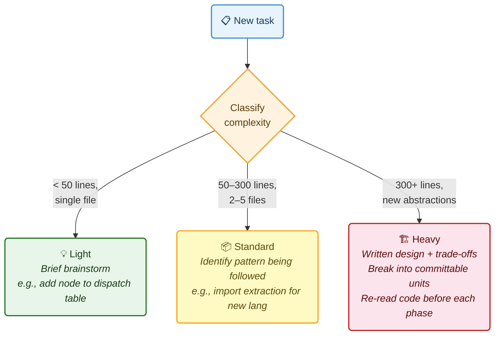
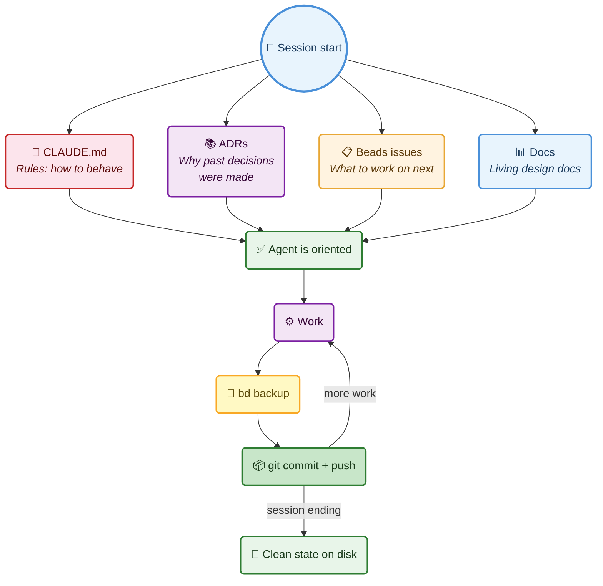
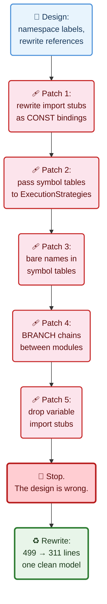
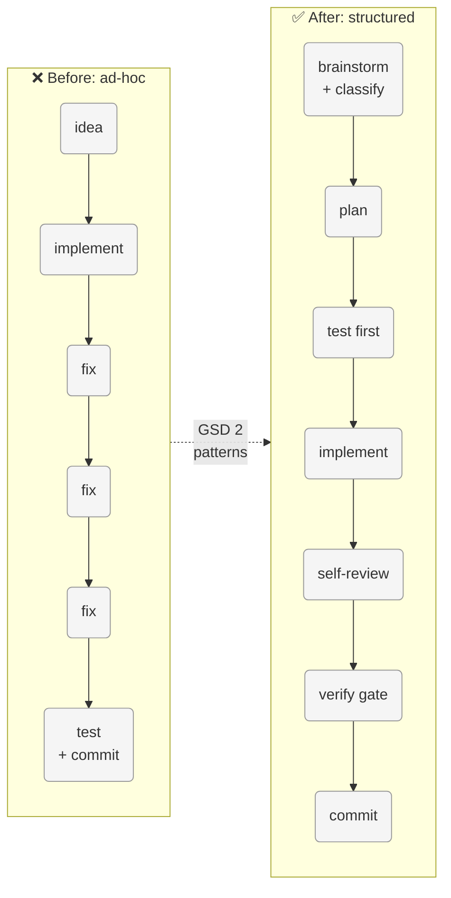

*What happened when I took workflow ideas from a purpose-built coding agent framework and applied them to my own AI-assisted development practice — and the teething issues along the way.*

---

## Context

I've been building [RedDragon](https://github.com/avishek-sen-gupta/red-dragon) — a multi-language code analysis engine — across 400+ sessions with Claude Code. I [wrote about that experience]() earlier: how CLAUDE.md rules evolved reactively, how structured memory (Beads issues, ADRs, gap analyses) solved the session-to-session continuity problem, how TDD changed the quality of AI-generated tests.

What I didn't have was a *systematic* workflow framework. My CLAUDE.md was a collection of individually sensible rules, accumulated reactively over months. It worked, but it was disorganised — duplicate rules scattered across sections, no enforced phase ordering, no complexity-aware ceremony.

I looked at [GSD 2](https://github.com/gsd-build/gsd-2) for ideas.

---

## What GSD 2 Is

GSD 2 is a standalone CLI built on the Pi SDK that controls a coding agent's session programmatically. It's the evolution of the original Get Shit Done prompt framework — from markdown prompts injected into Claude Code to a TypeScript application that manages context windows, dispatches work, tracks cost, detects stuck loops, and recovers from crashes.

I use GSD 2 as my agent harness — it runs the sessions, manages context, and provides the tooling. But the *workflow patterns* I'm describing here — enforced phases, complexity classification, verification gates, fresh-context discipline, state-on-disk — are not GSD-2-specific. They're engineering discipline that applies to any AI coding assistant: Claude Code directly, Cursor, Windsurf, Codex, or whatever comes next. The patterns are about how you structure work, not which tool runs it.

Here's what I took from it.

---

## What I Adopted

### 1. Enforced Phases Per Unit of Work

GSD 2 has a dispatch pipeline: research → plan → implement → verify. Every unit of work goes through these phases in order. The agent doesn't skip ahead.

My previous CLAUDE.md had "The workflow is Brainstorm → Discuss → Plan → Write tests → Implement → Fix → Commit → Refactor" — but it was a suggestion, not an enforcement. Multiple times during the multi-file linker work, implementation started before brainstorming was complete. The linker went through four rounds of compensating patches because the initial design was written without understanding the VM's dispatch model. A proper brainstorm phase — reading the actual VM code, not just designing on paper — would have caught the mismatch on day one.

The new rule: **every non-trivial task goes through brainstorm → plan → test-first → implement → self-review → verify → commit, in that order. Do not skip phases.**


I also added a self-review step between implement and verify — scan your own diff for workaround guards, weak assertions, mutation in loops, stale docs, and missing tests before running the verification gate.

### 2. Complexity Classification

GSD 2 classifies each unit as light, standard, or heavy before dispatching. The classification determines model selection and timeout.

I adapted this for ceremony level:

- **Light** (< 50 lines, single file) — brief brainstorm. Adding a node type to a dispatch table.
- **Standard** (50–300 lines, follows existing patterns) — brainstorm identifies the pattern being followed.
- **Heavy** (300+ lines, new abstractions, multiple subsystems) — brainstorm must produce a written design with trade-offs before any code. Break into independently-committable units. Do not attempt in a single pass.

The multi-file linker was Heavy (500+ lines, new package, touched VM, registry, API, MCP). It should have been broken into smaller units from the start. Instead it was attempted as one continuous stream, which led to the patch-on-patch problem.



### 3. Verification Gate

GSD 2 runs automated verification (lint, test, typecheck) with auto-fix retries before marking a unit complete.

My CLAUDE.md had "run black" and "run tests" as separate bullet points in different sections. The `.importlinter` check wasn't mentioned at all — which is how the CI pipeline broke silently with stale module paths for who knows how long.

The new rule: **three checks in order before every commit — `black`, `lint-imports`, `pytest`. All three must pass.**

```bash
poetry run python -m black .         # formatting
poetry run lint-imports               # architectural contracts
poetry run python -m pytest tests/    # full test suite
```

Having this as a single named concept ("verification gate") instead of scattered bullets makes it harder to skip.

### 4. Fresh Context for Heavy Tasks

GSD 2 creates a fresh agent session for every dispatched unit. The LLM starts with a clean context window containing only the pre-inlined artifacts it needs. This prevents quality degradation from context accumulation.

I can't create fresh sessions mid-conversation. But the underlying insight applies: **design documents can anchor you to a flawed model.** During the linker work, the initial design document described a 7-step linking process with import tables, CALL_FUNCTION rewriting, and entry-module-first ordering. Every one of those assumptions was wrong. But because the design document was in context, the implementation followed it faithfully — then spent four patches compensating for the mismatches.

The new rule: **for Heavy tasks, re-read the actual code before each phase. Don't implement from a design document without verifying its assumptions against the code you're modifying.**

### 5. State on Disk

GSD 2's `.gsd/` directory is the sole source of truth. No in-memory state survives across sessions. This enables crash recovery and session resumption.

I already had Beads for issue tracking and ADRs for decisions. What I was missing was the discipline of **backup before every commit**. Beads state lives in a Dolt database; if a session dies before backup, the issue state is lost. The `bd backup` command exports everything to JSONL files committed to the repo.

The new rule: **`bd backup` before every commit. Issues filed before work starts. Prefer committed partial results over uncommitted complete attempts.** If a session might end, commit with a `WIP:` prefix and file an issue for the remainder.



---

## Teething Issues

### The Patch-on-Patch Problem

The linker was where this adoption was most tested. The original design promised "zero downstream changes" — namespace labels, merge IR, and the existing VM/CFG/registry would just work. It didn't.

The VM resolves function calls by looking up variable names in the scope chain, not by label. The VM's CONST handler converts label strings into `BoundFuncRef`/`ClassRef` via symbol tables. Constructor dispatch uses the class name from ClassRef to look up methods. None of this is label-based. The design document didn't account for any of it.

What followed: patch 1 (rewrite import stubs as CONST label bindings), patch 2 (pass symbol tables to ExecutionStrategies), patch 3 (keep bare names in symbol tables, not namespaced), patch 4 (insert BRANCH instructions to chain module entries), patch 5 (drop variable import stubs so they don't overwrite concrete values).

Five patches. Each one "fixed" the immediate symptom. The underlying problem was that the design was wrong — linking at the label level doesn't work when the VM dispatches at the scope level.



The fix was a rewrite: strip per-module entry labels, concatenate in dependency order, drop import stubs, emit one shared entry label. 499 lines → 311 lines. One clean model instead of five compensating transforms.

If I'd had the "stop and consult when patching" rule from the start, the rewrite would have happened after patch 2, not patch 5.

### Brainstorm Wasn't Enforced

Several times during the session, I had to redirect: "brainstorm with me first", "don't go haring off on your own", "should this have been a separate issue?"

The phase ordering was written down but not enforced by habit. The AI's default is to start implementing the moment it understands the problem. The brainstorm phase needs to be explicit — present options, discuss trade-offs, take input — not a brief internal consideration before diving into code.

This led to a new interaction rule: **brainstorm collaboratively. Present options and trade-offs to the user. Do not pick an approach and start implementing without discussion.**

### Retroactive Issue Filing

The multi-file work started without filing issues. Bugs were discovered and fixed inline — no issue, no claim, no close. Three linker bugs (`red-dragon-khfp`, `red-dragon-qyvn`, `red-dragon-q00i`) were filed retroactively after I noticed the gap.

The fix was simple: make issue filing the first step, not an afterthought. "File an issue before starting work" was already in CLAUDE.md but wasn't being followed consistently.

### Weak Integration Test Assertions

After shipping multi-file support for all 16 languages, I discovered that 9 of the 15 tree-sitter language integration tests had weak assertions — `assert "add" in result` instead of `assert result["answer"] == 30`. These tests would pass even if the cross-module call returned symbolic.

This was a violation of the self-review checklist that I'd just added. The checklist says "weak assertions" is an anti-pattern to scan for. The tests were written before the checklist existed.

Strengthening them exposed two additional bugs: a Pascal frontend gap (`begin...end.` block not lowered) and a Pascal function return bug (`Result` variable not returned). Both were pre-existing single-file bugs, not linker issues — but the weak multi-file assertions had masked them.

This prompted two new rules. First: **after writing tests, review every assertion for specificity.** Replace `assert x is not None` and `assert "name" in result` with concrete value assertions like `assert result == 30`. If a concrete assertion isn't possible, document why. Weak assertions that would pass even when the feature is broken are worse than no assertions — they give false confidence.

Second: **every `xfail` must have a corresponding Beads issue**, and the `xfail` reason string must reference the issue ID. An `xfail` without a tracked issue is a gap that never gets fixed — it just sits there, green in the test report, invisible in the backlog.

### The Theoretical Bug Trap

One of the review findings (`red-dragon-lzae`) was about a fragile state machine in the import stub dropper. After brainstorming, we determined the bug was theoretical — no frontend currently produces the problematic instruction pattern, and adding "just in case" code would violate the "no speculative code without tests" principle. We closed it as won't-fix with a documentation note.

It took a brainstorming session to reach that conclusion. The first instinct (mine and the AI's) was to write a test and fix it. Brainstorming first — "is this actually a bug?" — saved time.

---

## The Reorganised CLAUDE.md

The adoption process surfaced how disorganised my CLAUDE.md had become. "Run black" appeared in three places. "Run tests" appeared in three places. "Brainstorm before work" appeared twice. The verification gate was split across two sections.

I rewrote it from scratch: deduplicated, restructured into a logical reading order (Project Context → Task Tracking → Workflow → Design Principles → Programming Patterns → Testing → Code Review → Implementation → Interaction), and consolidated related guidance.

245 lines → 168 lines. Same rules, less duplication, clearer structure.

---

## What I'd Do Differently

**Start with the verification gate from day one.** The `.importlinter` failure was avoidable. Having "run black" and "run tests" as separate loose rules instead of a single named gate made it easy to skip lint-imports entirely.

**Enforce brainstorm-before-implement from session one.** The linker patch-on-patch problem cost more time than the proper rewrite. A brainstorm phase that reads the actual code — not just designs on paper — would have caught the VM dispatch mismatch immediately.

**Classify complexity before starting.** The multi-file project was obviously Heavy from the start, but was treated as a single unbroken implementation session. Breaking it into independently-committable Light/Standard units would have produced cleaner history and caught issues earlier.

**File issues before work, not after.** Retroactive issue filing is better than no issue filing, but it loses the intent — why was this work started? What was the expected outcome? Issues filed before work serve as specifications. Issues filed after are just bookkeeping.

---

## Summary

GSD 2 is a purpose-built agent framework. I didn't adopt the framework — I adopted five workflow patterns from it:

| Pattern | What It Solved |
|---------|---------------|
| Enforced phases | Skipped brainstorm → wrong design → patch-on-patch |
| Complexity classification | Heavy work attempted as single pass → messy history |
| Verification gate | Scattered "run X" rules → missed lint-imports |
| Fresh context for heavy tasks | Design document anchoring → flawed assumptions carried into implementation |
| State on disk | Missing backups → lost issue state on session crash |

The patterns are tool-agnostic. They work whether you're using GSD 2, Claude Code directly, Cursor, or any other AI coding assistant. The common thread is treating AI-assisted development as an engineering practice that needs the same discipline as human development — phase gates, complexity awareness, verification, and persistent state.



The AI writes code faster than I can. It doesn't write better code without guardrails.
