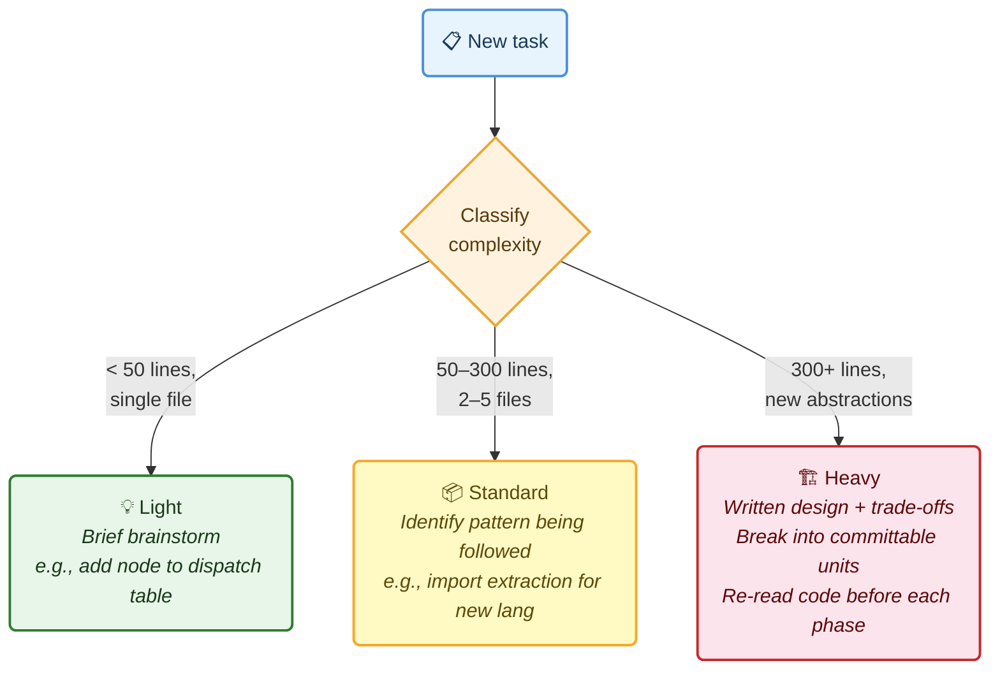
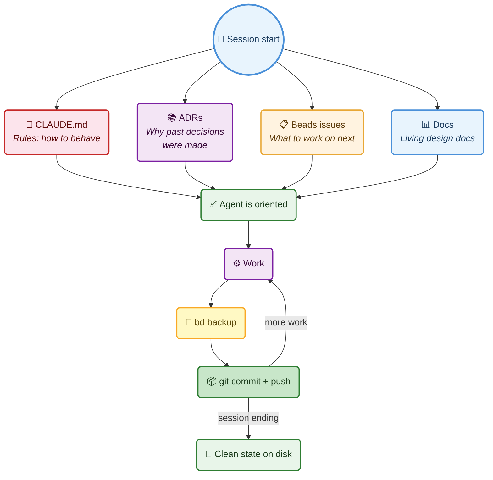
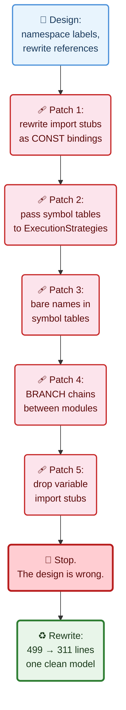
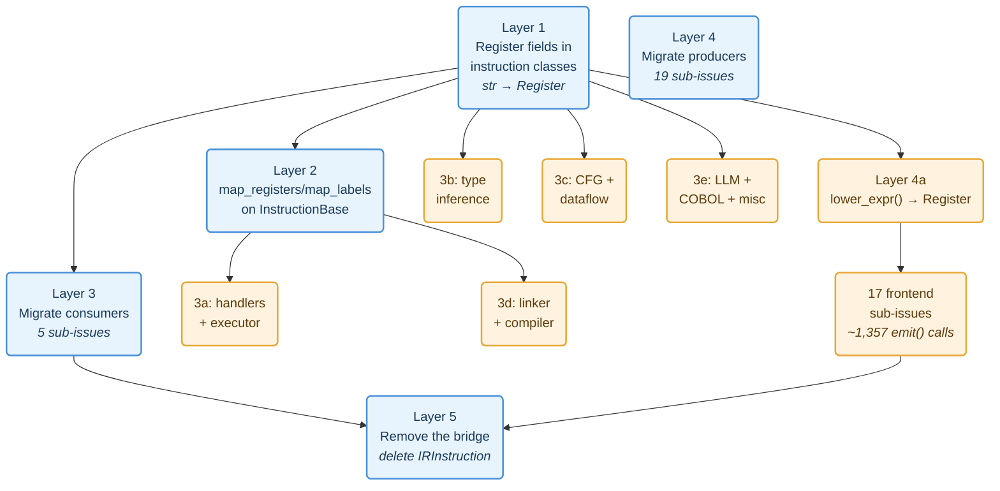
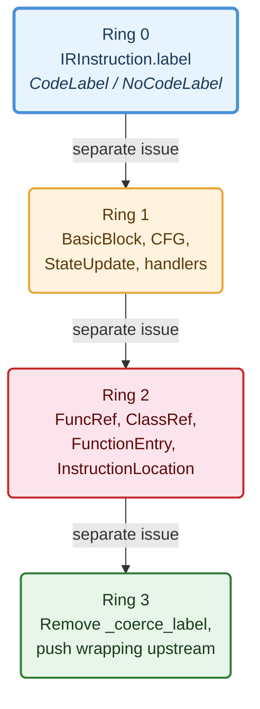
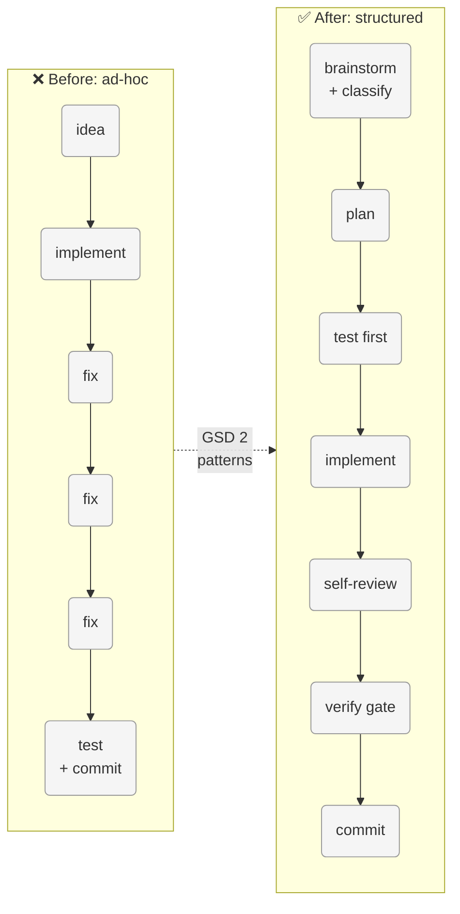

*Two agentic development frameworks applied to the same multi-layer type migration across a 13,000-test compiler pipeline. The first provided process discipline but stalled after the hardest commit. The second completed the work because it planned more thoroughly and stopped to ask.*

---

## Table of Contents

- [Context](#context)
- [What GSD 2 Is](#what-gsd-2-is)
- [What I Adopted](#what-i-adopted)
  - [1. Enforced Phases Per Unit of Work](#1-enforced-phases-per-unit-of-work)
  - [2. Complexity Classification](#2-complexity-classification)
  - [3. Verification Gate](#3-verification-gate)
  - [4. Fresh Context for Heavy Tasks](#4-fresh-context-for-heavy-tasks)
  - [5. State on Disk](#5-state-on-disk)
- [Teething Issues](#teething-issues)
  - [The Patch-on-Patch Problem](#the-patch-on-patch-problem)
  - [Brainstorm Wasn't Enforced](#brainstorm-wasnt-enforced)
  - [Retroactive Issue Filing](#retroactive-issue-filing)
  - [Weak Integration Test Assertions](#weak-integration-test-assertions)
  - [The Theoretical Bug Trap](#the-theoretical-bug-trap)
- [The Reorganised CLAUDE.md](#the-reorganised-claudemd)
- [The Test: Replacing a Stringly-Typed IR with Domain Types](#the-test-replacing-a-stringly-typed-ir-with-domain-types)
  - [The Problem: Strings All the Way Down](#the-problem-strings-all-the-way-down)
- [Chapter 1: CodeLabel, The First Domino](#chapter-1-codelabel-the-first-domino)
  - [The Attempted Cascade](#the-attempted-cascade)
  - [The Revert and the Lesson](#the-revert-and-the-lesson)
  - [What Actually Shipped](#what-actually-shipped)
  - [The Coercion Validator Mistake](#the-coercion-validator-mistake)
  - [The Refactoring Principles That Crystallised](#the-refactoring-principles-that-crystallised)
- [Chapter 2: Register, The Pydantic Trap](#chapter-2-register-the-pydantic-trap)
  - [The Boolean Landmine](#the-boolean-landmine)
  - [The BRANCH_IF Comma Hack](#the-branch_if-comma-hack)
- [Chapter 3: Typed Instructions, Replacing operands: list\[Any\]](#chapter-3-typed-instructions-replacing-operands-listany)
  - [The Original Four-Phase Plan](#the-original-four-phase-plan)
  - [The Plan That Replaced the Plan](#the-plan-that-replaced-the-plan)
  - [The Missing Length Field](#the-missing-length-field)
  - [Layer 1: The 12,924-Test Gauntlet](#layer-1-the-12924-test-gauntlet)
- [Chapter 4: Completing the Migration with Superpowers](#chapter-4-completing-the-migration-with-superpowers)
  - [Why GSD v2 Stalled After Layer 1](#why-gsd-v2-stalled-after-layer-1)
  - [What Superpowers Did Differently](#what-superpowers-did-differently)
  - [The Audit That Rewrote the Plan](#the-audit-that-rewrote-the-plan)
  - [Layers 2 Through 5: Execution](#layers-2-through-5-execution)
  - [Layer 5 Was Not Cleanup](#layer-5-was-not-cleanup)
- [What Went Wrong, Catalogued](#what-went-wrong-catalogued)
- [What I'd Do Differently](#what-id-do-differently)
- [Takeaways](#takeaways)

---

## Context

I've been building [RedDragon](https://github.com/avishek-sen-gupta/red-dragon), a multi-language code analysis engine, across 400+ sessions with Claude Code. I [wrote about that experience]() earlier: how CLAUDE.md rules evolved reactively, how structured memory (Beads issues, ADRs, gap analyses) solved the session-to-session continuity problem, how TDD changed the quality of AI-generated tests.

What I didn't have was a *systematic* workflow framework. My CLAUDE.md was a collection of individually sensible rules, accumulated reactively over months. It worked, but it was disorganised: duplicate rules scattered across sections, no enforced phase ordering, no complexity-aware ceremony.

I looked at [GSD 2](https://github.com/gsd-build/gsd-2) for ideas. Then I stress-tested those ideas against the hardest refactoring the project had seen: replacing every raw string in the IR with domain types.

This post covers both: what I adopted from GSD 2, and what happened when those patterns met a 13,000-test type migration.

---

## What GSD 2 Is

I'd been aware of the original [Get Shit Done prompt framework](https://github.com/gsd-build/gsd) for a while, and had started using it lightly through Claude Code, but I'd never fully embraced it. GSD 2 gave me the opportunity to try the framework whole-heartedly. [GSD 2](https://github.com/gsd-build/gsd-2) is a standalone CLI built on the Pi SDK that controls a coding agent's session programmatically. It's the evolution of the original GSD, from markdown prompts injected into Claude Code to a TypeScript application that manages context windows, dispatches work, tracks cost, detects stuck loops, and recovers from crashes. Importantly, GSD 2 let me keep using my existing infrastructure (my own ADR documents, Beads for issue tracking, and the CLAUDE.md conventions I'd built up over months) while layering its workflow discipline on top.

The *workflow patterns* I'm describing here (enforced phases, complexity classification, verification gates, fresh-context discipline, state-on-disk) are not GSD-2-specific. They're engineering discipline that applies to any AI coding assistant: Claude Code directly, Cursor, Windsurf, Codex, or whatever comes next. The patterns are about how you structure work, not which tool runs it.

Here's what I took from it.

---

## What I Adopted

### 1. Enforced Phases Per Unit of Work

GSD 2 has a dispatch pipeline: research → plan → implement → verify. Every unit of work goes through these phases in order. The agent doesn't skip ahead.

My previous CLAUDE.md had "The workflow is Brainstorm → Discuss → Plan → Write tests → Implement → Fix → Commit → Refactor", but it was a suggestion, not an enforcement. Multiple times during the multi-file linker work, implementation started before brainstorming was complete. The linker went through four rounds of compensating patches because the initial design was written without understanding the VM's dispatch model. A proper brainstorm phase (reading the actual VM code, not just designing on paper) would have caught the mismatch on day one.

The new rule: **every non-trivial task goes through brainstorm → plan → test-first → implement → self-review → verify → commit, in that order. Do not skip phases.**


I also added a self-review step between implement and verify: scan your own diff for workaround guards, weak assertions, mutation in loops, stale docs, and missing tests before running the verification gate.

### 2. Complexity Classification

GSD 2 classifies each unit as light, standard, or heavy before dispatching. The classification determines model selection and timeout.

I adapted this for ceremony level:

- **Light** (< 50 lines, single file): brief brainstorm. Adding a node type to a dispatch table.
- **Standard** (50–300 lines, follows existing patterns): brainstorm identifies the pattern being followed.
- **Heavy** (300+ lines, new abstractions, multiple subsystems): brainstorm must produce a written design with trade-offs before any code. Break into independently-committable units. Do not attempt in a single pass.

The multi-file linker was Heavy (500+ lines, new package, touched VM, registry, API, MCP). It should have been broken into smaller units from the start. Instead it was attempted as one continuous stream, which led to the patch-on-patch problem.



### 3. Verification Gate

GSD 2 runs automated verification (lint, test, typecheck) with auto-fix retries before marking a unit complete.

My CLAUDE.md had "run black" and "run tests" as separate bullet points in different sections. The `.importlinter` check wasn't mentioned at all, which is how the CI pipeline broke silently with stale module paths for who knows how long.

The new rule: **three checks in order before every commit: `black`, `lint-imports`, `pytest`. All three must pass.**

```bash
poetry run python -m black .         # formatting
poetry run lint-imports               # architectural contracts
poetry run python -m pytest tests/    # full test suite
```

Having this as a single named concept ("verification gate") instead of scattered bullets makes it harder to skip.

### 4. Fresh Context for Heavy Tasks

GSD 2 creates a fresh agent session for every dispatched unit. The LLM starts with a clean context window containing only the pre-inlined artifacts it needs. This prevents quality degradation from context accumulation.

I can't create fresh sessions mid-conversation. But the underlying insight applies: **design documents can anchor you to a flawed model.** During the linker work, the initial design document described a 7-step linking process with import tables, CALL_FUNCTION rewriting, and entry-module-first ordering. Every one of those assumptions was wrong. But because the design document was in context, the implementation followed it faithfully, then spent four patches compensating for the mismatches.

The new rule: **for Heavy tasks, re-read the actual code before each phase. Don't implement from a design document without verifying its assumptions against the code you're modifying.**

### 5. State on Disk

GSD 2's `.gsd/` directory is the sole source of truth. No in-memory state survives across sessions. This enables crash recovery and session resumption.

I already had Beads for issue tracking and ADRs for decisions. What I was missing was the discipline of **backup before every commit**. Beads state lives in a Dolt database; if a session dies before backup, the issue state is lost. The `bd backup` command exports everything to JSONL files committed to the repo.

The new rule: **`bd backup` before every commit. Issues filed before work starts. Prefer committed partial results over uncommitted complete attempts.** If a session might end, commit with a `WIP:` prefix and file an issue for the remainder.



---

## Teething Issues

### The Patch-on-Patch Problem

The linker was where this adoption was most tested. The original design promised "zero downstream changes": namespace labels, merge IR, and the existing VM/CFG/registry would just work. It didn't.

The VM resolves function calls by looking up variable names in the scope chain, not by label. The VM's CONST handler converts label strings into `BoundFuncRef`/`ClassRef` via symbol tables. Constructor dispatch uses the class name from ClassRef to look up methods. None of this is label-based. The design document didn't account for any of it.

What followed: patch 1 (rewrite import stubs as CONST label bindings), patch 2 (pass symbol tables to ExecutionStrategies), patch 3 (keep bare names in symbol tables, not namespaced), patch 4 (insert BRANCH instructions to chain module entries), patch 5 (drop variable import stubs so they don't overwrite concrete values).

Five patches. Each one "fixed" the immediate symptom. The underlying problem was that the design was wrong: linking at the label level doesn't work when the VM dispatches at the scope level.



The fix was a rewrite: strip per-module entry labels, concatenate in dependency order, drop import stubs, emit one shared entry label. 499 lines → 311 lines. One clean model instead of five compensating transforms.

If I'd had the "stop and consult when patching" rule from the start, the rewrite would have happened after patch 2, not patch 5.

### Brainstorm Wasn't Enforced

Several times during the session, I had to redirect: "brainstorm with me first", "don't go haring off on your own", "should this have been a separate issue?"

The phase ordering was written down but not enforced by habit. The AI's default is to start implementing the moment it understands the problem. The brainstorm phase needs to be explicit: present options, discuss trade-offs, take input. Not a brief internal consideration before diving into code.

This led to a new interaction rule: **brainstorm collaboratively. Present options and trade-offs to the user. Do not pick an approach and start implementing without discussion.**

### Retroactive Issue Filing

The multi-file work started without filing issues. Bugs were discovered and fixed inline: no issue, no claim, no close. Three linker bugs (`red-dragon-khfp`, `red-dragon-qyvn`, `red-dragon-q00i`) were filed retroactively after I noticed the gap.

The fix was simple: make issue filing the first step, not an afterthought. "File an issue before starting work" was already in CLAUDE.md but wasn't being followed consistently.

### Weak Integration Test Assertions

After shipping multi-file support for all 16 languages, I discovered that 9 of the 15 tree-sitter language integration tests had weak assertions like `assert "add" in result` instead of `assert result["answer"] == 30`. These tests would pass even if the cross-module call returned symbolic.

This was a violation of the self-review checklist that I'd just added. The checklist says "weak assertions" is an anti-pattern to scan for. The tests were written before the checklist existed.

Strengthening them exposed two additional bugs: a Pascal frontend gap (`begin...end.` block not lowered) and a Pascal function return bug (`Result` variable not returned). Both were pre-existing single-file bugs, not linker issues, but the weak multi-file assertions had masked them.

This prompted two new rules. First: **after writing tests, review every assertion for specificity.** Replace `assert x is not None` and `assert "name" in result` with concrete value assertions like `assert result == 30`. If a concrete assertion isn't possible, document why. Weak assertions that would pass even when the feature is broken are worse than no assertions because they give false confidence.

Second: **every `xfail` must have a corresponding Beads issue**, and the `xfail` reason string must reference the issue ID. An `xfail` without a tracked issue is a gap that never gets fixed. It just sits there, green in the test report, invisible in the backlog.

### The Theoretical Bug Trap

One of the review findings (`red-dragon-lzae`) was about a fragile state machine in the import stub dropper. After brainstorming, we determined the bug was theoretical: no frontend currently produces the problematic instruction pattern, and adding "just in case" code would violate the "no speculative code without tests" principle. We closed it as won't-fix with a documentation note.

It took a brainstorming session to reach that conclusion. The first instinct (mine and the AI's) was to write a test and fix it. Brainstorming first ("is this actually a bug?") saved time.

---

## The Reorganised CLAUDE.md

The adoption process surfaced how disorganised my CLAUDE.md had become. "Run black" appeared in three places. "Run tests" appeared in three places. "Brainstorm before work" appeared twice. The verification gate was split across two sections.

I rewrote it from scratch: deduplicated, restructured into a logical reading order (Project Context → Task Tracking → Workflow → Design Principles → Programming Patterns → Testing → Code Review → Implementation → Interaction), and consolidated related guidance.

245 lines → 168 lines. Same rules, less duplication, clearer structure.

---

## The Test: Replacing a Stringly-Typed IR with Domain Types

With the GSD 2 patterns in place, the next major piece of work was the hardest refactoring the project had seen. This was the real test of whether the patterns held up under pressure.

By late March 2026, RedDragon had ~12,900 tests, 121 architectural decision records, 550+ tracked issues, and a problem: the IR was stringly-typed. Every instruction was an `IRInstruction` with an `opcode: Opcode` enum and `operands: list[Any]`. Labels were `str | None`. Registers were bare strings like `"%r0"`. Field names, variable names, function names, operator symbols, and register references were all `str`, distinguished only by position in the operands list.

### The Problem: Strings All the Way Down

The core instruction type looked like this:

```python
@dataclass
class IRInstruction:
    opcode: Opcode
    operands: list[Any] = field(default_factory=list)
    result_reg: str = ""
    label: str | None = None
    source_location: SourceLocation | None = None
```

A `BINOP` instruction had `operands = ["+", "%r1", "%r2"]`. The operator is at index 0. The left register is at index 1. The right register is at index 2. Nothing in the type system distinguishes them. A `STORE_FIELD` had `operands = ["%r0", "name", "%r1"]`: object register, field name, value register. Swap indices 0 and 2 and you get a silent data corruption, not a type error.

The `label` field was `str | None`. 72% of instructions had `label=None`, causing 83+ pyright type errors at sites that assumed non-None. The `result_reg` field was `str`, with the empty string `""` as the sentinel for "no result register." Comparing a register to `""` to check presence was scattered across dozens of files.

This stringly-typed design had served the project well through rapid prototyping. 15 frontends were built against it, plus a VM, a CFG builder, a dataflow analysis engine, a type inference system, an interprocedural analysis pipeline, a multi-file linker, and an MCP server. But as pyright and import-linter tightened the quality gates, the strings became the dominant source of type errors, and every new feature required the same positional-indexing boilerplate.

The goal: replace `IRInstruction` entirely with a union of per-opcode frozen dataclasses, where every register is a `Register` object, every label is a `CodeLabel` object, and every field is named. The migration was planned as five layers, each independently committable, with a compatibility bridge (`Register.__eq__(str)`, `to_typed()`/`to_flat()` converters) that would be removed only in the final layer.

What actually happened was messier.

---

## Chapter 1: CodeLabel, The First Domino

`IRInstruction.label` was `str | None`. The plan was straightforward: introduce a `CodeLabel(value: str)` type and a `NoCodeLabel` null-object singleton, replace `str | None` everywhere, and push the type through adjacents.

### The Attempted Cascade

The first session went well. `CodeLabel` and `NoCodeLabel` were defined. `IRInstruction.label` was updated. 49 files were touched. 12,850 tests passed. The issue was closed.

Then I looked at the adjacents. `BasicBlock.label` was `str`. `cfg.blocks` was `dict[str, BasicBlock]`. `StateUpdate.next_label` was `str`. `label_to_idx` used string keys. The `CodeLabel` type existed, but 19 sites in the interpreter still accessed `.value` directly, breaking the abstraction.

I opened a new issue: *"CodeLabel: eliminate .value leaks, propagate CodeLabel into BasicBlock, StateUpdate, cfg.blocks."*

And then I tried to do it in one pass.

The cascade touched ~40 files. Changing `BasicBlock.label` from `str` to `CodeLabel` cascaded into `cfg.blocks` dict keys, which cascaded into `build_cfg()`, which cascaded into `build_registry()`, which cascaded into the executor's block lookup, which cascaded into the linker's namespace operations, which cascaded into the type inference engine's function signature lookup. Each change was individually simple. Together they formed a dependency chain that crossed every layer of the architecture.

### The Revert and the Lesson

I reverted everything. The commit message reads:

> Attempted CodeLabel propagation into cfg_types/cfg.py. Cascade touches ~40 files. Reverted to clean state, needs a dedicated session.

The lesson was not "the scope was too large." The lesson was that I had violated my own complexity classification. This was obviously Heavy work (300+ lines, new abstractions, multiple subsystems) but I'd treated it as Standard because each individual change seemed small. The individual changes *were* small. The cascade was not.

### What Actually Shipped

The next session took a different approach. Instead of propagating `CodeLabel` into all adjacents at once, I identified three independently-committable rings:

1. **Eliminate `.value` leaks in the immediate adjacents.** Push `CodeLabel` into `BasicBlock.label`, `cfg.blocks` keys, `StateUpdate.next_label`, and the handler/registry layer. One commit. 12,850 tests.

2. **Push wrapping upstream.** `branch_targets()` was returning `list[str]` and callers were wrapping each element in `CodeLabel(...)`. Change `branch_targets()` to return `list[CodeLabel]` directly. Remove downstream wrapping. One commit.

3. **Remove `_coerce_label`.** A helper function that auto-converted strings to `CodeLabel`. It was masking call sites that should have been explicitly updated. One commit.

Each ring was a session. Each ring had its own issue. Each ring went through the verification gate independently. The result was the same as the abandoned single-pass attempt, but arrived safely.

### The Coercion Validator Mistake

During the `CodeLabel` work, the AI proposed a Pydantic `field_validator` that would auto-convert incoming strings to `CodeLabel`. I initially accepted this. It made tests pass immediately, with no caller needing an update.

That was the problem. The validator *masked* every call site that was passing a raw string. Instead of failing loudly (forcing me to find and fix each caller), it silently converted. When I later tried to remove the validator, I discovered dozens of sites that had never been updated.

This produced a rule that went into CLAUDE.md's new "Refactoring Principles" section:

> **No coercion validators.** Do not add Pydantic `field_validator` or `__post_init__` hacks that auto-convert strings to the domain type. These mask call sites that should be explicitly updated. If Pydantic rejects a value, the caller is wrong. Fix the caller.

### The Refactoring Principles That Crystallised

The `CodeLabel` experience generated a full set of type-propagation guidelines. Each one came from a specific mistake:

| Principle | Mistake it prevents |
|-----------|-------------------|
| No coercion validators | Masking unconverted callers |
| Push wrapping to the origin | Re-wrapping at every consumer |
| No defensive `isinstance` checks | Inconsistent callers surviving |
| Domain methods over string extraction | `.value` leaks everywhere |
| Validate at construction, not at use | Double-wrapping going undetected |
| Separate name generation from label generation | `fresh_label()` producing non-labels |
| Serialization at the boundary | `str()` in the middle of pipelines |
| File issues for the next ring | Attempting everything in one session |

These principles were extracted from the CodeLabel work and written into `CLAUDE.md` before the Register migration began. They saved significant time on every subsequent step.

---

## Chapter 2: Register, The Pydantic Trap

With `CodeLabel` done, the next target was `result_reg: str`. The pattern was established: introduce `Register(name: str)` and `NoRegister` singleton, replace `str`, push through adjacents.

The definition was clean:

```python
@dataclass(frozen=True)
class Register:
    name: str
    def __str__(self) -> str:
        return self.name
    def __eq__(self, other: object) -> bool:
        if isinstance(other, str):
            return self.name == other  # compatibility bridge
        if isinstance(other, Register):
            return self.name == other.name
        return NotImplemented
```

`NoRegister` was the null object: `__str__` returned `""`, `is_present()` returned `False`.

### The Boolean Landmine

`IRInstruction.result_reg` was `str`, and the empty string `""` was the sentinel for "no result register." Throughout the codebase, truthiness checks like `if inst.result_reg:` were used to test whether an instruction produced a result.

When `result_reg` became `Register`, the truthiness semantics broke. A `Register("")` is truthy in Python (it's a dataclass instance, not an empty string). `NoRegister` is also truthy (same reason). Every `if inst.result_reg:` check now always evaluated to `True`.

The initial fix was to add `__bool__` to `Register`:

```python
def __bool__(self) -> bool:
    return bool(self.name)
```

This restored the old behaviour: `Register("")` was falsy, `Register("%r0")` was truthy, `NoRegister` was falsy.

But `__bool__` on a domain type is a code smell. It couples the type to the semantics of one particular usage pattern (truthiness as "is present"). The better fix was explicit: replace every `if inst.result_reg:` with `if inst.result_reg.is_present()`. This was 30+ sites across the codebase.

The `__bool__` method was added, used as a temporary bridge, and then removed in a separate commit after all call sites were migrated to `is_present()`. The commit message: *"Register: remove \_\_bool\_\_, use explicit is_present() everywhere."*

The `CodeLabel` principles applied directly: push semantics to the domain type, don't rely on Python's implicit protocols.

### The BRANCH_IF Comma Hack

`BRANCH_IF` stored its branch targets as `operands = ["%r0", "L_true,L_false"]`. Two labels concatenated with a comma in a single string. Callers split on comma to recover the label list.

This was not a design choice. It was an accidental constraint from the early days when `operands` was `list[Any]` and nobody thought about it. The comma string had survived 10 months and 12,000+ tests because it worked.

Replacing it was the right time, since we were already touching `BRANCH_IF` for the `Register` migration. The fix introduced a `branch_targets: tuple[CodeLabel, ...]` field on the typed `BranchIf` instruction, eliminating the comma-separated string entirely.

But the migration was tricky because the comma convention was load-bearing in `cfg.py`, `dataflow.py`, and `registry.py`. Each file had its own slightly different approach to splitting the string:

```python
# cfg.py
targets = inst.operands[-1].split(",")

# dataflow.py
for target in inst.operands[-1].split(","):

# registry.py
branches = inst.operands[-1].split(",") if "," in str(inst.operands[-1]) else [inst.operands[-1]]
```

Three files, three variations, one hack. The structured `branch_targets` field eliminated all of them.

---

## Chapter 3: Typed Instructions, Replacing operands: list\[Any\]

With `CodeLabel` and `Register` established for the metadata fields (`label`, `result_reg`), the next target was the core problem: `operands: list[Any]`.

### The Original Four-Phase Plan

The initial design session produced a four-phase plan:

1. **Define typed instruction classes**: 30 frozen dataclasses, one per opcode
2. **Migrate handler consumers**: VM handlers use `to_typed()` for named field access
3. **Migrate remaining consumers**: CFG, dataflow, type inference, linker, etc.
4. **Migrate frontend producers**: replace `emit(Opcode.X, ...)` with `emit_inst(TypedInstruction(...))`

Phases 1–3 were completed first. Phase 4 started with `common/` (190 calls migrated) and the `emit_inst()` infrastructure.

Then came the realisation: **the plan was incomplete.** The register *operand* fields inside typed instructions were still `str`. A `Binop` had `left: str` and `right: str`. Changing those to `Register` was a separate layer of work that the original plan hadn't accounted for.

### The Plan That Replaced the Plan

The original four phases were dissolved into a five-layer plan, documented in ADR-121 and a dedicated design document:



The five-layer plan had 28 independently-trackable sub-issues. Each sub-issue was a self-contained commit with a test gate. The `Register.__eq__(str)` compatibility bridge would remain until Layer 5, making all preceding layers individually safe.

The key insight was decomposition granularity. Layer 4 alone had 17 sub-issues, one per frontend, because each frontend could be migrated independently. The Rust frontend had 127 `emit()` calls. The COBOL emit context had 9. Mixing them in one commit would have made review and revert impossible.

### The Missing Length Field

Phase 1 of the original plan defined 30 typed instruction classes. Each class was a frozen dataclass with named fields instead of positional operands. The round-trip test (`to_typed(inst).to_flat() == inst`) was the primary verification.

The `LoadRegion` instruction was defined as:

```python
@dataclass(frozen=True)
class LoadRegion(InstructionBase):
    result_reg: Register = NO_REGISTER
    region_reg: str = ""
    offset_reg: str = ""
```

But `LOAD_REGION` in the IR had four operands: region register, offset register, *length*, and a field name. The `length` field was missing from the typed class. The round-trip test caught this immediately (the `to_flat()` output had fewer operands than the input) but the bug existed in the first commit and had to be fixed as a follow-up.

The cause was straightforward: the AI generated the class from the opcode name and the most common operand patterns, without checking the actual `_handle_load_region` handler for the full operand list. The IR reference document listed the correct operands, but the class definition was generated from pattern inference, not from the spec.

Commit message: *"fix: LoadRegion typed instruction, add missing length field."*

The lesson: **generated code that passes a round-trip test is not necessarily correct; the test verifies internal consistency, not completeness.** A class with 3 fields that round-trips perfectly to a 3-operand instruction is still wrong if the real instruction has 4 operands.

### Layer 1: The 12,924-Test Gauntlet

Layer 1 was the riskiest single commit: changing 31 fields across 21 instruction classes from `str` to `Register`, plus updating all `operands` properties, `to_typed()` converters, and `to_flat()` converters.

The `Register.__eq__(str)` bridge was supposed to make this safe: all existing string comparisons would continue to work. And it did, mostly. But several edge cases escaped the bridge:

**1. COBOL literal-in-call-operand.** COBOL frontends occasionally put literal values (not register names) in call argument positions. These weren't registers; they were strings like `"SPACES"` or `"100"`. Wrapping them in `Register(...)` was semantically wrong. The fix was an `_as_register()` helper that checked whether the operand looked like a register name before wrapping.

**2. `_resolve_reg` fallback path.** When the VM's `_resolve_reg` couldn't find a register in the frame, it returned the raw operand as a fallback (for symbolic execution of incomplete programs). After the migration, this fallback returned a `Register` object instead of a string, which leaked into `TypedValue` wrappers and broke downstream comparisons. The fix: `_resolve_reg` fallback returns `str(operand)`, not the raw `Register`.

**3. `_is_temporary_register` in dataflow.** This function subscripted the register name to check character patterns: `reg[1] == 'r' and reg[2:].isdigit()`. After migration, `reg` was a `Register` object, and subscripting it didn't work. The fix: convert to `str` before subscripting.

**4. StoreIndex with SpreadArguments.** Some frontends emitted `STORE_INDEX` with a `SpreadArguments` in the `value_reg` position, a convention for array unpacking. The `value_reg` field was typed as `Register`, not `Register | SpreadArguments`, so the type system rejected it. The fix: preserve `SpreadArguments` in `StoreIndex.value_reg` with a note documenting the frontend convention.

Each of these was a small fix. Together they took as long as the main migration. The commit message for Layer 1 runs to 14 lines documenting the edge cases.

All 12,924 tests passed. 22 xfailed. 1 skipped.

---

## Chapter 4: Completing the Migration with Superpowers

After Layer 1 shipped, the five-layer plan sat at roughly 15% complete. Layers 2 through 5 still needed ~2,200 sites migrated across ~100 files. The GSD v2 patterns had gotten me through the hardest single commit, but the remaining work stalled.

### Why GSD v2 Stalled After Layer 1

The GSD v2 patterns I'd adopted were *rules in CLAUDE.md*: enforce phases, classify complexity, run the verification gate. They worked as guardrails. But they didn't help with the orchestration problem: who breaks down the next 4 layers into sub-issues? Who dispatches work? Who reviews each piece before moving to the next?

With GSD v2 patterns, the agent was too eager. It would see the five-layer plan, start implementing Layer 2, hit an edge case, make a judgment call without consulting me, then discover the judgment was wrong three layers later. The "stop and consult when patching" rule was in CLAUDE.md, but the agent treated it as a suggestion, not a gate.

GSD v2 gave me *process discipline* (phases, verification, state on disk) but not *decision discipline* (when to pause, when to decompose, when to ask).

There were also practical issues. As the session grew long, GSD v2's TUI would behave erratically: freezing the terminal window, scrolling to random sections of the session unprompted. This made it harder to stay oriented during multi-hour work.

A caveat: I did not investigate all of GSD v2's configuration options in depth. It has settings for model selection, timeout behaviour, stuck-loop detection, and other knobs that might have helped. What I'm describing is the out-of-the-box experience with default settings applied to a Heavy refactoring.

### What Superpowers Did Differently

I switched to the [Superpowers](https://github.com/anthropics/claude-code/tree/main/plugins/superpowers) plugin for Claude Code.

**Brainstorming was a real gate.** Superpowers' brainstorming skill forced a structured conversation before any implementation. When I said "execute this plan," it first asked five clarifying questions, one at a time, with multiple choice options and a recommendation. Layer 4 decomposition strategy? One sub-issue per frontend (option A), grouped by size tier (B), or grouped by language family (C)? I picked A. The `lower_expr()` signature change: bundled with frontend migration or separate atomic commit? I picked separate. These decisions shaped the entire execution.

With GSD v2 patterns alone, the agent would have made these decisions silently and started coding.

**Two-stage review after every task.** Superpowers dispatched a fresh subagent per task, then ran a spec compliance review ("did you build what was requested?") followed by a code quality review ("is it well-built?"). The spec reviewer caught the Layer 1 `StoreIndex.value_reg` `SpreadArguments` guard issue. The code quality reviewer caught the `types.UnionType` vs `typing.Union` problem for Python 3.13 that would have broken `map_registers()`.

With GSD v2, self-review was a checklist item. With Superpowers, review was a separate agent with adversarial instructions.

**Issues filed for discovered work.** During Layer 3e, the agent discovered that `registry.py` had 3 `opcode==` comparisons that couldn't be migrated because the instruction list was mixed-type. With GSD v2 patterns, this would have been noted in a commit message and forgotten. With Superpowers, I asked "are there issues filed for any of the new-found follow-up work?" The agent checked, found 4 undocumented items, and filed them immediately, each blocking the epic. The dependency graph stayed honest.

**The plan was revised during execution.** After Layer 3 completed, the agent checked whether the plan's assumptions still held. The Layer 3a estimate of "~100 sites" turned out to be 4 sites (the executor was already clean). Layer 3e estimated "~40 sites" turned out to be 128 (COBOL ir_encoders dominated). The plan was rewritten mid-execution with corrected counts, updated dependency graphs, and new prerequisite issues. The design document became a living record rather than a stale spec.

### The Audit That Revised the Plan

The session started with an audit. I asked the agent to examine `red-dragon-0ibe` and its design doc. It dispatched an exploration subagent that surveyed the entire codebase: every `to_typed()` call, every `inst.operands[` access, every `opcode==` comparison, every `IRInstruction(` construction. The findings were a table with file, line, and count for each migration marker.

The audit revealed that the design doc's estimates were wrong in both directions. Handlers had 0 `to_typed()` calls (not the estimated 72). COBOL `ir_encoders.py` had 106 `IRInstruction` constructions (not counted in the original plan at all). Type inference had a full Opcode-keyed dispatch table that needed replacement (described as "~30 sites, annotation changes only").

This upfront survey took 10 minutes. It saved hours of mid-implementation replanning.

### Layers 2 Through 5: Execution

With the revised plan, execution was systematic:

**Layer 2** (2 commits, small): `Register.rebase(offset)` and `map_registers()`/`map_labels()` on `InstructionBase`. The `types.UnionType` fix (caught by the plan reviewer) was baked into the implementation. 22 new tests.

**Layer 3** (4 commits, 5 sub-issues): Consumer migration. The agent dispatched sub-issues in parallel where dependencies allowed — 3b, 3c, 3e could start immediately after Layer 1, without waiting for Layer 2. Layer 3a was deferred entirely (blocked by COBOL literal operands). Layer 3d used the new `map_registers()` in the linker, deleting the old `_rebase_operand` helper.

**Layer 4a** (1 commit): `lower_expr() -> Register` signature change across 33 files, ~316 methods. Single atomic mechanical commit.

**Layer 4** (15 commits): One per frontend. The agent dispatched batches: 5 small frontends first (C, Lua, TypeScript, C++, Scala), then 4 medium (Go, Python, JavaScript, Pascal), then 6 large (PHP, C#, Java, Kotlin, Ruby, Rust). Plus `_base.py`/`context.py` and COBOL `emit_context.py`. ~1,300 `emit()` calls converted to `emit_inst()`.

**Prerequisites** (3 commits): Before Layer 5 could start, 4 discovered issues needed resolution. COBOL `ir_encoders.py` literal operands → emit CONST instructions for literals instead. 59 remaining COBOL frontend `emit()` calls. Registry mixed-type list. VM/dataflow boundary cleanup.

**Layer 5** (3 commits): Delete `emit()` methods. Add standalone `__str__` (replacing `to_flat()` delegation). Delete `to_flat()` and all flat-to-typed converters. Remove `Register.__eq__(str)` — which broke ~300 test sites that were fixed in a single commit. Delete `IRInstruction` class.

Total: ~32 commits. ~100 files modified. Zero test regressions at any point. 12,944 tests passing throughout.

```mermaid
gantt
    title IRInstruction Elimination — Execution Timeline
    dateFormat X
    axisFormat %s

    section Layer 1-2
    L1: Register fields (33 fields)     :done, l1, 0, 1
    L2a: Register.rebase()              :done, l2a, 1, 2
    L2b: map_registers/map_labels       :done, l2b, 2, 3

    section Layer 3
    3c: CFG/dataflow isinstance         :done, l3c, 3, 4
    3b: Type inference dispatch          :done, l3b, 3, 4
    3d: Linker map_registers            :done, l3d, 3, 4
    3e: LLM/COBOL/registry (128 sites)  :done, l3e, 3, 5

    section Layer 4
    4a: lower_expr -> Register          :done, l4a, 5, 6
    4: 15 frontends (~1300 sites)       :done, l4, 6, 9

    section Prerequisites
    COBOL literal operands              :done, p1, 9, 10
    COBOL frontend emit()              :done, p2, 10, 11
    Registry + boundary cleanup         :done, p3, 9, 10

    section Layer 5
    5a: Refactor inline_ir              :done, l5a, 11, 12
    5C-E: Delete emit/to_flat/__str__   :done, l5ce, 12, 13
    5F: Remove Register.__eq__(str)     :done, l5f, 13, 14
    5G: Delete IRInstruction            :done, l5g, 14, 15
```

### Layer 5 Was Not Cleanup

The plan described Layer 5 as "remove the bridge." The actual scope was larger.

The plan said "delete IRInstruction, to_typed/to_flat, operands properties, Register.__eq__(str)." The survey said ~100 sites. The reality was that `IRInstruction` was referenced in 116 imports across 36 files. `to_typed()` was called at 6 normalization entry points. `Register.__eq__(str)` was load-bearing in ~300 test assertions and ~100 production sites.

Removing `Register.__eq__(str)` was the hardest single step. Every `assert inst.left == "%r0"` became `assert inst.left == Register("%r0")`. Every `frame.registers["%r0"]` became `frame.registers[Register("%r0")]`. The agent fixed 300+ sites across 46 test files in a single commit — a mechanical migration, but one that required understanding each comparison's context to choose the right fix pattern (`.name` extraction vs `Register()` wrapping vs dict key normalisation).

The `IRInstruction` class itself was replaced with a factory function of the same name: callers keep the same `IRInstruction(opcode=Opcode.X, operands=[...])` interface, but the return value is now a typed `InstructionBase` subclass. This preserved backward compatibility for ~50 remaining construction sites (mostly in test helpers and COBOL `inline_ir`) while eliminating the class.

The remaining work — converting those ~50 construction sites to direct typed instruction construction and removing the factory — is tracked as a follow-up. The factory is a thin shim, not a compatibility bridge. The bridge is gone.

---

## What Went Wrong, Catalogued

Looking back across the full arc (adopting GSD 2 patterns, then stress-testing them against the CodeLabel/Register/typed instructions migration) here's what went wrong and what each failure taught.

### 1. The Scope Underestimation Cascade

**What happened:** Every step was individually small. Changing `BasicBlock.label` from `str` to `CodeLabel` was 5 lines. But that change cascaded into 40 files because `BasicBlock.label` was used as a dict key, a lookup value, a comparison target, and a format string argument in every layer of the architecture.

**The failure:** Treating a 40-file cascade as "lots of small changes" instead of Heavy work.

**The lesson:** Scope is not measured by the size of the initial change. It's measured by the size of the cascade. If a type change propagates through more than one architectural layer (frontend → IR → CFG → VM → analysis), it's Heavy by definition, regardless of how small each individual change is.

### 2. The Coercion Validator Anti-Pattern

**What happened:** Adding a Pydantic validator that auto-converted `str` to `CodeLabel` made all tests pass immediately. It also masked every call site that needed manual updating.

**The failure:** Optimising for green tests instead of correctness.

**The lesson:** In a type migration, a failing test at a call site is *information*. It tells you the caller hasn't been updated. Silencing it with auto-coercion destroys that information. Let the caller fail. Fix the caller.

### 3. The Plan-Replanning Problem

**What happened:** The original four-phase typed instruction plan didn't account for operand-level register migration. The plan had to be replaced mid-execution with a five-layer plan that was itself decomposed into 28 sub-issues.

**The failure:** Planning from the end state backward without mapping the current state forward.

**The lesson:** A refactoring plan should start from a precise inventory of the *current* state, not from a vision of the *desired* state. The current state inventory for IRInstruction should have been: "30 typed classes exist, but operand fields are `str`, frontends still use `emit(Opcode.X, ...)`, instruction lists are `list[IRInstruction]`, and `to_typed()`/`to_flat()` serve as the bridge." Working forward from this inventory would have revealed all five layers immediately.

### 4. The Missing Field Bug

**What happened:** `LoadRegion` was defined with 3 fields. The actual instruction had 4 operands. The AI generated the class from pattern inference without checking the handler.

**The failure:** Trusting generated code that passes a self-consistency test.

**The lesson:** Round-trip tests verify internal consistency, not completeness. A class with the wrong number of fields round-trips perfectly, to and from the wrong representation. The verification should include cross-referencing against the authoritative source (the handler, the IR spec, or both).

### 5. The Boolean Truthiness Trap

**What happened:** Replacing `str` result registers with `Register` objects broke every `if inst.result_reg:` check because dataclass instances are always truthy.

**The failure:** Relying on Python's implicit truthiness protocol for domain semantics.

**The lesson:** When you replace a primitive with a domain type, audit all implicit protocol usages: `bool()`, `len()`, `in`, `[]`, comparison operators, string formatting. Each one is a potential semantic break that passes silently.

### 6. The "Just This One More Ring" Temptation

**What happened:** After completing CodeLabel in `IRInstruction.label`, I immediately tried to propagate it into `BasicBlock`, `CFG`, `StateUpdate`, and everything else. In one session.

**The failure:** Treating adjacents as part of the current scope.

**The lesson:** File issues for the next ring. The CodeLabel migration into `IRInstruction.label` was one commit. The propagation into `BasicBlock` and `cfg.blocks` was a separate issue, separate session, separate commit. The propagation into `FuncRef.label` and `ClassRef.label` was a third issue. Each ring is a bounded unit of work.



Each ring was a session. Each session went through the verification gate independently. The total elapsed time was longer than a single pass would have been *if it had worked*. But the single pass didn't work. The ring approach did.

### 7. The Comma Hack Survival

**What happened:** `BRANCH_IF` stored branch targets as a comma-separated string. This survived 10 months and 12,000+ tests.

**The failure:** Not a failure of the refactoring, but a failure of the original design that the refactoring uncovered.

**The lesson:** Stringly-typed representations accumulate hidden conventions that become load-bearing. The comma convention wasn't documented anywhere. It worked because three files independently agreed on the same split logic. Discovering it during a refactoring is how it was always going to be discovered.

---

## What I'd Do Differently

**Start with the verification gate from day one.** The `.importlinter` failure was avoidable. Having "run black" and "run tests" as separate loose rules instead of a single named gate made it easy to skip lint-imports entirely.

**Enforce brainstorm-before-implement from session one.** The linker patch-on-patch problem cost more time than the proper rewrite. A brainstorm phase that reads the actual code, not just designs on paper, would have caught the VM dispatch mismatch immediately.

**Classify complexity before starting.** The multi-file project was obviously Heavy from the start, but was treated as a single unbroken implementation session. Breaking it into independently-committable Light/Standard units would have produced cleaner history and caught issues earlier.

**File issues before work, not after.** Retroactive issue filing is better than no issue filing, but it loses the intent: why was this work started? What was the expected outcome? Issues filed before work serve as specifications. Issues filed after are just bookkeeping.

---

## Takeaways

**The GSD 2 patterns held up as guardrails.** Five workflow patterns adopted from GSD 2, then tested against the hardest refactoring in the project:

| Pattern | What It Solved |
|---------|---------------|
| Enforced phases | Skipped brainstorm → wrong design → patch-on-patch |
| Complexity classification | Heavy work attempted as single pass → messy history |
| Verification gate | Scattered "run X" rules → missed lint-imports |
| Fresh context for heavy tasks | Design document anchoring → flawed assumptions carried into implementation |
| State on disk | Missing backups → lost issue state on session crash |

**Superpowers added what GSD v2 lacked.** GSD v2 gave me process discipline. Superpowers gave me decision discipline and orchestration:

| Capability | GSD v2 (CLAUDE.md rules) | Superpowers (plugin) |
|-----------|-------------------------|---------------------|
| Brainstorming | "brainstorm first" rule, often skipped | Structured gate: one question at a time, options, recommendations |
| Decomposition | Manual, done by me before the session | Agent proposes, I choose: "one per frontend" vs "grouped by family" |
| Review | Self-review checklist | Two-stage: spec compliance reviewer + code quality reviewer (separate agents) |
| Discovered work | Noted in commit messages, often lost | Filed as issues with dependency links to the epic |
| Plan revision | Manual, often deferred | Agent resurveys after each layer, rewrites estimates, updates dependency graph |
| Consultation | "stop and consult" rule, inconsistently followed | Natural pause points at each brainstorming question and review finding |

The distinction matters. GSD v2 tells the agent *what to do* (brainstorm, then plan, then implement). Superpowers tells the agent *when to stop and ask* (is this the right decomposition? did the spec reviewer approve? should this discovered issue block the epic?). For a refactoring that took 32 commits across 100 files, the stopping points were where the real decisions happened.

**They serve different sweet spots.** I would still reach for GSD v2 for greenfield work of moderate complexity where I want to move fast: adding a new frontend, building a new analysis pass, scaffolding a new module. GSD v2's autonomous dispatch is an advantage when the work is well-understood and doesn't require mid-stream design decisions. For Heavy refactoring work that crosses architectural boundaries and accumulates edge cases, Superpowers' consultation model is the better fit.

The patterns are tool-agnostic. They work whether you're using GSD 2, Superpowers, Cursor, or any other AI coding assistant. The common thread is treating AI-assisted development as an engineering practice that needs the same discipline as human development: phase gates, complexity awareness, verification, and persistent state.



**Type migrations cascade. Budget for it.** A single `str → CodeLabel` change in one field cascaded through 40 files. A `str → Register` change in 31 fields required compensating changes in the VM fallback path, the dataflow analysis, the COBOL frontend, and the spread-arguments convention. The cascade is the work. The type change is the trigger.

**Reverts are progress.** The abandoned CodeLabel cascade, attempted, reverted, and documented in the Beads issue, was not wasted time. It produced the scope analysis that made the ring-by-ring approach possible.

**Compatibility bridges make incremental migration possible.** `Register.__eq__(str)` was a deliberate hack: it made `Register` compare equal to raw strings, letting 12,924 tests pass without modification during the migration. The plan explicitly called for removing it in Layer 5, after all consumers had been updated. Without the bridge, every layer would have been a big-bang change.

**The plan will be wrong. Plan for that.** The four-phase plan became a five-layer plan with 28 sub-issues. The CodeLabel single-pass attempt became a four-ring incremental approach. In both cases, the revised plan was better than the original, not because planning was futile, but because the first attempt revealed the real shape of the work.

**Never auto-coerce during a migration.** Pydantic validators, `__post_init__` converters, isinstance-guard wrappers: anything that silently converts the old type to the new type destroys the signal you need. A failing call site is the information. Preserve it.

**Edge cases cluster at the boundaries.** The four Layer 1 edge cases (COBOL literals in call operands, `_resolve_reg` fallback, `_is_temporary_register` subscripting, SpreadArguments in StoreIndex) all occurred at boundaries where the type change met a convention or assumption from a different subsystem. The type change itself was mechanical. The boundary interactions were where the bugs lived.

**Refactoring principles should be written down before the next refactoring, not during it.** The "Refactoring Principles" section of CLAUDE.md, written after the CodeLabel experience, prevented at least three of the same mistakes during the Register migration. Rules extracted from failures and codified before the next attempt compound over time.

**The AI writes the code. You manage the scope.** Across this entire migration, the AI's code was overwhelmingly correct at the mechanical level: updating 31 fields, threading kwargs, updating converters, formatting with Black. Where it failed was scope: generating a class without checking the handler spec (missing length field), proposing coercion validators that masked call sites, not flagging that operand fields needed their own migration layer. The human's job in a type migration is not typing. It's asking "what does this cascade into?" at every step.

The AI writes code faster than I can. It doesn't write better code without guardrails.

---

*The code is at [avishek-sen-gupta/red-dragon](https://github.com/avishek-sen-gupta/red-dragon). The completed elimination plan (with post-implementation findings) is at `docs/design/eliminate-irinstruction-plan.md`. Previous posts in this series: [Building Non-Trivial Systems with an AI Coding Assistant](), [Anatomy of a Refactoring Using AI]().*
