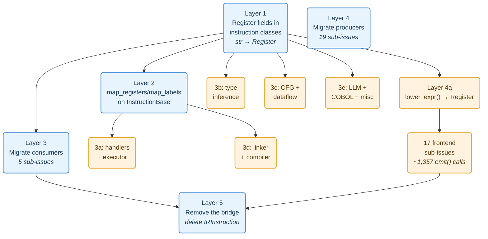
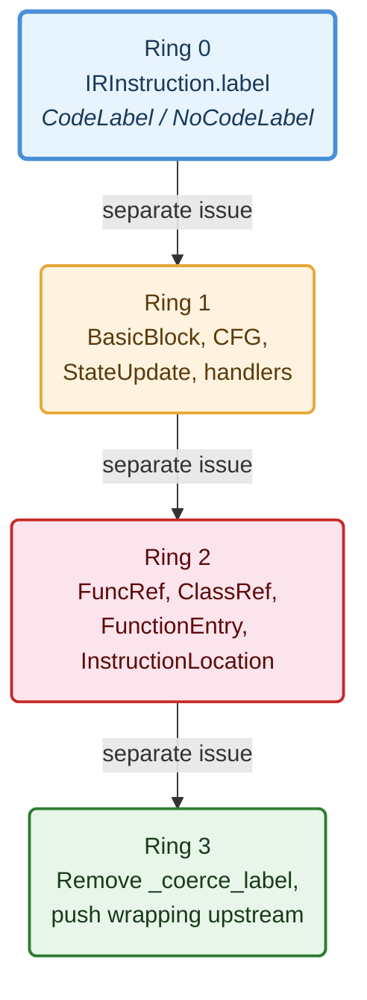

*What happens when you try to replace every raw string in a 13,000-test compiler pipeline with domain types, and everything fights back. A chronicle of cascading scope, abandoned attempts, lesson-producing failures, and the refactoring principles that emerged from the wreckage.*

---

## Table of Contents

- [Context](#context)
- [The Problem: Strings All the Way Down](#the-problem-strings-all-the-way-down)
- [Chapter 1: CodeLabel, The First Domino](#chapter-1-codelabel--the-first-domino)
  - [The Attempted Cascade](#the-attempted-cascade)
  - [The Revert and the Lesson](#the-revert-and-the-lesson)
  - [What Actually Shipped](#what-actually-shipped)
  - [The Coercion Validator Mistake](#the-coercion-validator-mistake)
  - [The Refactoring Principles That Crystallised](#the-refactoring-principles-that-crystallised)
- [Chapter 2: Register, The Pydantic Trap](#chapter-2-register--the-pydantic-trap)
  - [The Boolean Landmine](#the-boolean-landmine)
  - [The BRANCH_IF Comma Hack](#the-branch_if-comma-hack)
- [Chapter 3: Typed Instructions, Replacing operands: list\[Any\]](#chapter-3-typed-instructions--replacing-operands-listany)
  - [The Original Four-Phase Plan](#the-original-four-phase-plan)
  - [The Plan That Replaced the Plan](#the-plan-that-replaced-the-plan)
  - [The Missing Length Field](#the-missing-length-field)
  - [Layer 1: The 12,924-Test Gauntlet](#layer-1-the-12924-test-gauntlet)
- [Chapter 4: What Went Wrong, Catalogued](#chapter-4-what-went-wrong-catalogued)
- [Takeaways](#takeaways)

---

## Context

[RedDragon](https://github.com/avishek-sen-gupta/red-dragon) is a multi-language code analysis engine. It parses source in 15 languages, lowers it to a universal intermediate representation (IR), builds control flow graphs, runs dataflow analysis, and executes programs on a deterministic virtual machine. I've written about [building it with an AI coding assistant](), [a TypedValue refactoring](), and [adopting structured workflow patterns]().

By late March 2026, the project had ~12,900 tests, 121 architectural decision records, 550+ tracked issues, and a problem: the IR was stringly-typed. Every instruction was an `IRInstruction` with an `opcode: Opcode` enum and `operands: list[Any]`. Labels were `str | None`. Registers were bare strings like `"%r0"`. Field names, variable names, function names, operator symbols, and register references were all `str`, distinguished only by position in the operands list.

This post is about the attempt to replace all of that with domain types (`CodeLabel`, `Register`, and per-opcode frozen dataclasses) and the things that went wrong along the way. Not catastrophically wrong. Instructively wrong.

The refactoring is still in progress. What follows is not a success story. It's an interim report from the middle of a multi-week migration, documenting the failures that produced the most useful lessons.

---

## The Problem: Strings All the Way Down

The core instruction type looked like this:

```python
@dataclass
class IRInstruction:
    opcode: Opcode
    operands: list[Any] = field(default_factory=list)
    result_reg: str = ""
    label: str | None = None
    source_location: SourceLocation | None = None
```

A `BINOP` instruction had `operands = ["+", "%r1", "%r2"]`. The operator is at index 0. The left register is at index 1. The right register is at index 2. Nothing in the type system distinguishes them. A `STORE_FIELD` had `operands = ["%r0", "name", "%r1"]`: object register, field name, value register. Swap indices 0 and 2 and you get a silent data corruption, not a type error.

The `label` field was `str | None`. 72% of instructions had `label=None`, causing 83+ pyright type errors at sites that assumed non-None. The `result_reg` field was `str`, with the empty string `""` as the sentinel for "no result register." Comparing a register to `""` to check presence was scattered across dozens of files.

This stringly-typed design had served the project well through rapid prototyping. 15 frontends were built against it, plus a VM, a CFG builder, a dataflow analysis engine, a type inference system, an interprocedural analysis pipeline, a multi-file linker, and an MCP server. But as pyright and import-linter tightened the quality gates, the strings became the dominant source of type errors, and every new feature required the same positional-indexing boilerplate.

The goal: replace `IRInstruction` entirely with a union of per-opcode frozen dataclasses, where every register is a `Register` object, every label is a `CodeLabel` object, and every field is named. The migration was planned as five layers, each independently committable, with a compatibility bridge (`Register.__eq__(str)`, `to_typed()`/`to_flat()` converters) that would be removed only in the final layer.

What actually happened was messier.

---

## Chapter 1: CodeLabel, The First Domino

`IRInstruction.label` was `str | None`. The plan was straightforward: introduce a `CodeLabel(value: str)` type and a `NoCodeLabel` null-object singleton, replace `str | None` everywhere, and push the type through adjacents.

### The Attempted Cascade

The first session went well. `CodeLabel` and `NoCodeLabel` were defined. `IRInstruction.label` was updated. 49 files were touched. 12,850 tests passed. The issue was closed.

Then I looked at the adjacents. `BasicBlock.label` was `str`. `cfg.blocks` was `dict[str, BasicBlock]`. `StateUpdate.next_label` was `str`. `label_to_idx` used string keys. The `CodeLabel` type existed, but 19 sites in the interpreter still accessed `.value` directly, breaking the abstraction.

I opened a new issue: *"CodeLabel: eliminate .value leaks, propagate CodeLabel into BasicBlock, StateUpdate, cfg.blocks."*

And then I tried to do it in one pass.

The cascade touched ~40 files. Changing `BasicBlock.label` from `str` to `CodeLabel` cascaded into `cfg.blocks` dict keys, which cascaded into `build_cfg()`, which cascaded into `build_registry()`, which cascaded into the executor's block lookup, which cascaded into the linker's namespace operations, which cascaded into the type inference engine's function signature lookup. Each change was individually simple. Together they formed a dependency chain that crossed every layer of the architecture.

### The Revert and the Lesson

I reverted everything. The commit message reads:

> Attempted CodeLabel propagation into cfg_types/cfg.py. Cascade touches ~40 files. Reverted to clean state, needs a dedicated session.

The lesson was not "the scope was too large." The lesson was that I had violated my own complexity classification. This was obviously Heavy work (300+ lines, new abstractions, multiple subsystems) but I'd treated it as Standard because each individual change seemed small. The individual changes *were* small. The cascade was not.

### What Actually Shipped

The next session took a different approach. Instead of propagating `CodeLabel` into all adjacents at once, I identified three independently-committable rings:

1. **Eliminate `.value` leaks in the immediate adjacents.** Push `CodeLabel` into `BasicBlock.label`, `cfg.blocks` keys, `StateUpdate.next_label`, and the handler/registry layer. One commit. 12,850 tests.

2. **Push wrapping upstream.** `branch_targets()` was returning `list[str]` and callers were wrapping each element in `CodeLabel(...)`. Change `branch_targets()` to return `list[CodeLabel]` directly. Remove downstream wrapping. One commit.

3. **Remove `_coerce_label`.** A helper function that auto-converted strings to `CodeLabel`. It was masking call sites that should have been explicitly updated. One commit.

Each ring was a session. Each ring had its own issue. Each ring went through the verification gate independently. The result was the same as the abandoned single-pass attempt, but arrived safely.

### The Coercion Validator Mistake

During the `CodeLabel` work, the AI proposed a Pydantic `field_validator` that would auto-convert incoming strings to `CodeLabel`. I initially accepted this. It made tests pass immediately, with no caller needing an update.

That was the problem. The validator *masked* every call site that was passing a raw string. Instead of failing loudly (forcing me to find and fix each caller), it silently converted. When I later tried to remove the validator, I discovered dozens of sites that had never been updated.

This produced a rule that went into CLAUDE.md's new "Refactoring Principles" section:

> **No coercion validators.** Do not add Pydantic `field_validator` or `__post_init__` hacks that auto-convert strings to the domain type. These mask call sites that should be explicitly updated. If Pydantic rejects a value, the caller is wrong. Fix the caller.

### The Refactoring Principles That Crystallised

The `CodeLabel` experience generated a full set of type-propagation guidelines. Each one came from a specific mistake:

| Principle | Mistake it prevents |
|-----------|-------------------|
| No coercion validators | Masking unconverted callers |
| Push wrapping to the origin | Re-wrapping at every consumer |
| No defensive `isinstance` checks | Inconsistent callers surviving |
| Domain methods over string extraction | `.value` leaks everywhere |
| Validate at construction, not at use | Double-wrapping going undetected |
| Separate name generation from label generation | `fresh_label()` producing non-labels |
| Serialization at the boundary | `str()` in the middle of pipelines |
| File issues for the next ring | Attempting everything in one session |

These principles were extracted from the CodeLabel work and written into `CLAUDE.md` before the Register migration began. They saved significant time on every subsequent step.

---

## Chapter 2: Register, The Pydantic Trap

With `CodeLabel` done, the next target was `result_reg: str`. The pattern was established: introduce `Register(name: str)` and `NoRegister` singleton, replace `str`, push through adjacents.

The definition was clean:

```python
@dataclass(frozen=True)
class Register:
    name: str
    def __str__(self) -> str:
        return self.name
    def __eq__(self, other: object) -> bool:
        if isinstance(other, str):
            return self.name == other  # compatibility bridge
        if isinstance(other, Register):
            return self.name == other.name
        return NotImplemented
```

`NoRegister` was the null object: `__str__` returned `""`, `is_present()` returned `False`.

### The Boolean Landmine

`IRInstruction.result_reg` was `str`, and the empty string `""` was the sentinel for "no result register." Throughout the codebase, truthiness checks like `if inst.result_reg:` were used to test whether an instruction produced a result.

When `result_reg` became `Register`, the truthiness semantics broke. A `Register("")` is truthy in Python (it's a dataclass instance, not an empty string). `NoRegister` is also truthy (same reason). Every `if inst.result_reg:` check now always evaluated to `True`.

The initial fix was to add `__bool__` to `Register`:

```python
def __bool__(self) -> bool:
    return bool(self.name)
```

This restored the old behaviour: `Register("")` was falsy, `Register("%r0")` was truthy, `NoRegister` was falsy.

But `__bool__` on a domain type is a code smell. It couples the type to the semantics of one particular usage pattern (truthiness as "is present"). The better fix was explicit: replace every `if inst.result_reg:` with `if inst.result_reg.is_present()`. This was 30+ sites across the codebase.

The `__bool__` method was added, used as a temporary bridge, and then removed in a separate commit after all call sites were migrated to `is_present()`. The commit message: *"Register: remove \_\_bool\_\_, use explicit is_present() everywhere."*

The `CodeLabel` principles applied directly: push semantics to the domain type, don't rely on Python's implicit protocols.

### The BRANCH_IF Comma Hack

`BRANCH_IF` stored its branch targets as `operands = ["%r0", "L_true,L_false"]`. Two labels concatenated with a comma in a single string. Callers split on comma to recover the label list.

This was not a design choice. It was an accidental constraint from the early days when `operands` was `list[Any]` and nobody thought about it. The comma string had survived 10 months and 12,000+ tests because it worked.

Replacing it was the right time, since we were already touching `BRANCH_IF` for the `Register` migration. The fix introduced a `branch_targets: tuple[CodeLabel, ...]` field on the typed `BranchIf` instruction, eliminating the comma-separated string entirely.

But the migration was tricky because the comma convention was load-bearing in `cfg.py`, `dataflow.py`, and `registry.py`. Each file had its own slightly different approach to splitting the string:

```python
# cfg.py
targets = inst.operands[-1].split(",")

# dataflow.py
for target in inst.operands[-1].split(","):

# registry.py
branches = inst.operands[-1].split(",") if "," in str(inst.operands[-1]) else [inst.operands[-1]]
```

Three files, three variations, one hack. The structured `branch_targets` field eliminated all of them.

---

## Chapter 3: Typed Instructions, Replacing operands: list\[Any\]

With `CodeLabel` and `Register` established for the metadata fields (`label`, `result_reg`), the next target was the core problem: `operands: list[Any]`.

### The Original Four-Phase Plan

The initial design session produced a four-phase plan:

1. **Define typed instruction classes**: 30 frozen dataclasses, one per opcode
2. **Migrate handler consumers**: VM handlers use `to_typed()` for named field access
3. **Migrate remaining consumers**: CFG, dataflow, type inference, linker, etc.
4. **Migrate frontend producers**: replace `emit(Opcode.X, ...)` with `emit_inst(TypedInstruction(...))`

Phases 1–3 were completed first. Phase 4 started with `common/` (190 calls migrated) and the `emit_inst()` infrastructure.

Then came the realisation: **the plan was incomplete.** The register *operand* fields inside typed instructions were still `str`. A `Binop` had `left: str` and `right: str`. Changing those to `Register` was a separate layer of work that the original plan hadn't accounted for.

### The Plan That Replaced the Plan

The original four phases were dissolved into a five-layer plan, documented in ADR-121 and a dedicated design document:



The five-layer plan had 28 independently-trackable sub-issues. Each sub-issue was a self-contained commit with a test gate. The `Register.__eq__(str)` compatibility bridge would remain until Layer 5, making all preceding layers individually safe.

The key insight was decomposition granularity. Layer 4 alone had 17 sub-issues, one per frontend, because each frontend could be migrated independently. The Rust frontend had 127 `emit()` calls. The COBOL emit context had 9. Mixing them in one commit would have made review and revert impossible.

### The Missing Length Field

Phase 1 of the original plan defined 30 typed instruction classes. Each class was a frozen dataclass with named fields instead of positional operands. The round-trip test (`to_typed(inst).to_flat() == inst`) was the primary verification.

The `LoadRegion` instruction was defined as:

```python
@dataclass(frozen=True)
class LoadRegion(InstructionBase):
    result_reg: Register = NO_REGISTER
    region_reg: str = ""
    offset_reg: str = ""
```

But `LOAD_REGION` in the IR had four operands: region register, offset register, *length*, and a field name. The `length` field was missing from the typed class. The round-trip test caught this immediately (the `to_flat()` output had fewer operands than the input) but the bug existed in the first commit and had to be fixed as a follow-up.

The cause was straightforward: the AI generated the class from the opcode name and the most common operand patterns, without checking the actual `_handle_load_region` handler for the full operand list. The IR reference document listed the correct operands, but the class definition was generated from pattern inference, not from the spec.

Commit message: *"fix: LoadRegion typed instruction, add missing length field."*

The lesson: **generated code that passes a round-trip test is not necessarily correct; the test verifies internal consistency, not completeness.** A class with 3 fields that round-trips perfectly to a 3-operand instruction is still wrong if the real instruction has 4 operands.

### Layer 1: The 12,924-Test Gauntlet

Layer 1 was the riskiest single commit: changing 31 fields across 21 instruction classes from `str` to `Register`, plus updating all `operands` properties, `to_typed()` converters, and `to_flat()` converters.

The `Register.__eq__(str)` bridge was supposed to make this safe: all existing string comparisons would continue to work. And it did, mostly. But several edge cases escaped the bridge:

**1. COBOL literal-in-call-operand.** COBOL frontends occasionally put literal values (not register names) in call argument positions. These weren't registers; they were strings like `"SPACES"` or `"100"`. Wrapping them in `Register(...)` was semantically wrong. The fix was an `_as_register()` helper that checked whether the operand looked like a register name before wrapping.

**2. `_resolve_reg` fallback path.** When the VM's `_resolve_reg` couldn't find a register in the frame, it returned the raw operand as a fallback (for symbolic execution of incomplete programs). After the migration, this fallback returned a `Register` object instead of a string, which leaked into `TypedValue` wrappers and broke downstream comparisons. The fix: `_resolve_reg` fallback returns `str(operand)`, not the raw `Register`.

**3. `_is_temporary_register` in dataflow.** This function subscripted the register name to check character patterns: `reg[1] == 'r' and reg[2:].isdigit()`. After migration, `reg` was a `Register` object, and subscripting it didn't work. The fix: convert to `str` before subscripting.

**4. StoreIndex with SpreadArguments.** Some frontends emitted `STORE_INDEX` with a `SpreadArguments` in the `value_reg` position, a convention for array unpacking. The `value_reg` field was typed as `Register`, not `Register | SpreadArguments`, so the type system rejected it. The fix: preserve `SpreadArguments` in `StoreIndex.value_reg` with a note documenting the frontend convention.

Each of these was a small fix. Together they took as long as the main migration. The commit message for Layer 1 runs to 14 lines documenting the edge cases.

All 12,924 tests passed. 22 xfailed. 1 skipped.

---

## Chapter 4: What Went Wrong, Catalogued

Looking back across the full arc (CodeLabel, Register, typed instructions, the five-layer plan) here's what went wrong and what each failure taught.

### 1. The Scope Underestimation Cascade

**What happened:** Every step was individually small. Changing `BasicBlock.label` from `str` to `CodeLabel` was 5 lines. But that change cascaded into 40 files because `BasicBlock.label` was used as a dict key, a lookup value, a comparison target, and a format string argument in every layer of the architecture.

**The failure:** Treating a 40-file cascade as "lots of small changes" instead of Heavy work.

**The lesson:** Scope is not measured by the size of the initial change. It's measured by the size of the cascade. If a type change propagates through more than one architectural layer (frontend → IR → CFG → VM → analysis), it's Heavy by definition, regardless of how small each individual change is.

### 2. The Coercion Validator Anti-Pattern

**What happened:** Adding a Pydantic validator that auto-converted `str` to `CodeLabel` made all tests pass immediately. It also masked every call site that needed manual updating.

**The failure:** Optimising for green tests instead of correctness.

**The lesson:** In a type migration, a failing test at a call site is *information*. It tells you the caller hasn't been updated. Silencing it with auto-coercion destroys that information. Let the caller fail. Fix the caller.

### 3. The Plan-Replanning Problem

**What happened:** The original four-phase typed instruction plan didn't account for operand-level register migration. The plan had to be replaced mid-execution with a five-layer plan that was itself decomposed into 28 sub-issues.

**The failure:** Planning from the end state backward without mapping the current state forward.

**The lesson:** A refactoring plan should start from a precise inventory of the *current* state, not from a vision of the *desired* state. The current state inventory for IRInstruction should have been: "30 typed classes exist, but operand fields are `str`, frontends still use `emit(Opcode.X, ...)`, instruction lists are `list[IRInstruction]`, and `to_typed()`/`to_flat()` serve as the bridge." Working forward from this inventory would have revealed all five layers immediately.

### 4. The Missing Field Bug

**What happened:** `LoadRegion` was defined with 3 fields. The actual instruction had 4 operands. The AI generated the class from pattern inference without checking the handler.

**The failure:** Trusting generated code that passes a self-consistency test.

**The lesson:** Round-trip tests verify internal consistency, not completeness. A class with the wrong number of fields round-trips perfectly, to and from the wrong representation. The verification should include cross-referencing against the authoritative source (the handler, the IR spec, or both).

### 5. The Boolean Truthiness Trap

**What happened:** Replacing `str` result registers with `Register` objects broke every `if inst.result_reg:` check because dataclass instances are always truthy.

**The failure:** Relying on Python's implicit truthiness protocol for domain semantics.

**The lesson:** When you replace a primitive with a domain type, audit all implicit protocol usages: `bool()`, `len()`, `in`, `[]`, comparison operators, string formatting. Each one is a potential semantic break that passes silently.

### 6. The "Just This One More Ring" Temptation

**What happened:** After completing CodeLabel in `IRInstruction.label`, I immediately tried to propagate it into `BasicBlock`, `CFG`, `StateUpdate`, and everything else. In one session.

**The failure:** Treating adjacents as part of the current scope.

**The lesson:** File issues for the next ring. The CodeLabel migration into `IRInstruction.label` was one commit. The propagation into `BasicBlock` and `cfg.blocks` was a separate issue, separate session, separate commit. The propagation into `FuncRef.label` and `ClassRef.label` was a third issue. Each ring is a bounded unit of work.



Each ring was a session. Each session went through the verification gate independently. The total elapsed time was longer than a single pass would have been *if it had worked*. But the single pass didn't work. The ring approach did.

### 7. The Comma Hack Survival

**What happened:** `BRANCH_IF` stored branch targets as a comma-separated string. This survived 10 months and 12,000+ tests.

**The failure:** Not a failure of the refactoring, but a failure of the original design that the refactoring uncovered.

**The lesson:** Stringly-typed representations accumulate hidden conventions that become load-bearing. The comma convention wasn't documented anywhere. It worked because three files independently agreed on the same split logic. Discovering it during a refactoring is how it was always going to be discovered.

---

## Takeaways

**Type migrations cascade. Budget for it.** A single `str → CodeLabel` change in one field cascaded through 40 files. A `str → Register` change in 31 fields required compensating changes in the VM fallback path, the dataflow analysis, the COBOL frontend, and the spread-arguments convention. The cascade is the work. The type change is the trigger.

**Reverts are progress.** The abandoned CodeLabel cascade, attempted, reverted, and documented in the Beads issue, was not wasted time. It produced the scope analysis that made the ring-by-ring approach possible. The commit *"chore: update red-dragon-7eq9 with cascade analysis from attempted refactoring"* was one of the most useful commits in the migration.

**Compatibility bridges make incremental migration possible.** `Register.__eq__(str)` was a deliberate hack: it made `Register` compare equal to raw strings, letting 12,924 tests pass without modification during the migration. The plan explicitly called for removing it in Layer 5, after all consumers had been updated. Without the bridge, every layer would have been a big-bang change.

**The plan will be wrong. Plan for that.** The four-phase plan became a five-layer plan with 28 sub-issues. The CodeLabel single-pass attempt became a four-ring incremental approach. In both cases, the revised plan was better than the original, not because planning was futile, but because the first attempt revealed the real shape of the work.

**Never auto-coerce during a migration.** Pydantic validators, `__post_init__` converters, isinstance-guard wrappers: anything that silently converts the old type to the new type destroys the signal you need. A failing call site is the information. Preserve it.

**Edge cases cluster at the boundaries.** The four Layer 1 edge cases (COBOL literals in call operands, `_resolve_reg` fallback, `_is_temporary_register` subscripting, SpreadArguments in StoreIndex) all occurred at boundaries where the type change met a convention or assumption from a different subsystem. The type change itself was mechanical. The boundary interactions were where the bugs lived.

**Refactoring principles should be written down before the next refactoring, not during it.** The "Refactoring Principles" section of CLAUDE.md, written after the CodeLabel experience, prevented at least three of the same mistakes during the Register migration. Rules extracted from failures and codified before the next attempt compound over time.

**The AI writes the code. You manage the scope.** Across this entire migration, the AI's code was overwhelmingly correct at the mechanical level: updating 31 fields, threading kwargs, updating converters, formatting with Black. Where it failed was scope: generating a class without checking the handler spec (missing length field), proposing coercion validators that masked call sites, not flagging that operand fields needed their own migration layer. The human's job in a type migration is not typing. It's asking "what does this cascade into?" at every step.

---

The migration is ongoing. Layers 2–5 of the IRInstruction elimination are tracked as issues in [Beads](https://github.com/avishek-sen-gupta/red-dragon). Layer 4 alone, migrating ~1,357 `emit()` calls across 17 frontend files to typed instruction constructors, has 17 independently-committable sub-issues, each one a session. The end state is a world where `operands: list[Any]` doesn't exist, `IRInstruction` is deleted, and every field on every instruction carries its domain type.

The refactoring principles that emerged from the failures documented here (ring-by-ring propagation, no auto-coercion, cascade budgeting, reverts-as-progress) are the durable output. The code will eventually be correct. The principles will prevent the next migration from repeating the same mistakes.

---

*The code is at [avishek-sen-gupta/red-dragon](https://github.com/avishek-sen-gupta/red-dragon). The elimination plan is at `docs/design/eliminate-irinstruction-plan.md`. Previous posts in this series: [Building Non-Trivial Systems with an AI Coding Assistant](), [Anatomy of a Refactoring Using AI](), [Evolving Workflow Patterns: Borrowing from GSD 2]().*
