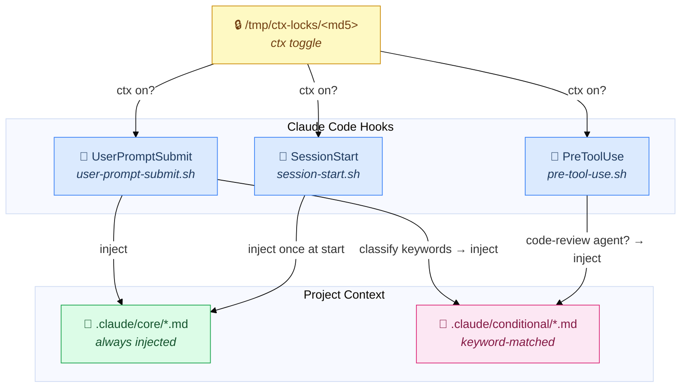

*How I structure CLAUDE.md, hooks, skills, and a context-injector plugin for a 13,000-test Python codebase with Claude Code.*

---

## Table of Contents

- [The Problem](#the-problem)
- [The CLAUDE.md Architecture](#the-claudemd-architecture)
  - [Core: Always Present](#core-always-present)
  - [Conditional: Injected on Demand](#conditional-injected-on-demand)
- [Deterministic Gates](#deterministic-gates)
- [The Context Injector Plugin](#the-context-injector-plugin)
  - [Design](#design)
  - [Hook Overview](#hook-overview)
  - [UserPromptSubmit: Keyword Classification](#userpromptsubmit-keyword-classification)
  - [PreToolUse: Agent-Triggered Injection](#pretooluse-agent-triggered-injection)
  - [SessionStart: Core Context on Resume](#sessionstart-core-context-on-resume)
  - [Toggle with /ctx](#toggle-with-ctx)
- [Skills I Use Frequently](#skills-i-use-frequently)
  - [Workflow Skills (Superpowers)](#workflow-skills-superpowers)
  - [Domain Skills](#domain-skills)
  - [Code Review Skills](#code-review-skills)
- [The Full Hook Configuration](#the-full-hook-configuration)
- [Learnings](#learnings)

---

## The Problem

CLAUDE.md started as a single file. It worked well for a few weeks. Then it grew — workflow rules, coding standards, testing patterns, design principles, review checklists, tool guidance, project context. By the time it reached a few thousand tokens, two things happened:

1. **The model stopped following the later sections.** Instructions buried past the first screen of content would be present in the context window but consistently ignored. The effective CLAUDE.md was the first half.

2. **The context was wasteful.** A prompt asking to fix a formatting issue didn't need the design principles section. A refactoring session didn't need the COBOL-specific project context. Everything was injected unconditionally, every time.

The response was a layered architecture: split CLAUDE.md into *core* (always needed) and *conditional* (injected only when the current task requires it), and enforce quality through deterministic pre-commit gates rather than model instructions.

---

## The CLAUDE.md Architecture

The project's `.claude/` directory is organised as follows:

```
.claude/
  core/                      # always injected when ctx is on
    project-context.md       # language, tooling, issue tracker, external deps
    workflow.md              # phases, complexity classification, commit rules
    implementation.md        # coding style, interaction rules
    tools-search.md          # when to use ast-grep vs grep vs knowledge graph
  conditional/               # injected only when keywords match
    design-principles.md
    testing-patterns.md
    code-review.md
    refactoring.md
    tools-skills.md
  skills/                    # project-local skill overrides
    audit-asserts/
    documentation/
    grill-me/
    improve-codebase-architecture/
    migration-planner/
    tdd/
  settings.json              # hooks and permissions
```

### Core: Always Present

The four core files cover what the model needs for every non-trivial task:

- **project-context.md** — language (Python 3.13+), package manager (Poetry), test framework (pytest-xdist), formatter (Black), architectural contracts (import-linter), issue tracker (Beads), external dependencies (JDK 17+ for COBOL, Neo4j optional).

- **workflow.md** — the mandatory phase sequence: Brainstorm → Plan → Test first → Implement → Self-review → Verify → Commit. Complexity classification (Light / Standard / Heavy). The verification gate. Commit discipline. Data security rules.

- **implementation.md** — coding style (functional, no mutation loops), interaction style (brainstorm collaboratively, stop and consult on fix-on-fix), and scripting conventions (temp files in `/tmp/`, no `python -c` with multiline strings).

- **tools-search.md** — when to use ast-grep (structural patterns, multi-line, call sites) versus plain Grep (keywords, imports, constants), and how to use the code-review-graph MCP knowledge graph for codebase navigation without full scans.

### Conditional: Injected on Demand

Five conditional files are only injected when the current prompt's keyword signature matches:

| File | Injected when |
|------|--------------|
| `design-principles.md` | implement, add, build, create, fix, refactor, migrate, ... |
| `testing-patterns.md` | test, tdd, assert, coverage, xfail, integration test, ... |
| `code-review.md` | review, pr, diff, check, feedback, critique, approve |
| `refactoring.md` | refactor, rename, extract, move, split, merge, simplify, ... |
| `tools-skills.md` | implement, refactor, verify, audit, scan, lint, ... |

The design principles file contains the coding conventions (functional style, no defensive programming, domain-typed values, no static methods). The testing patterns file contains TDD rules, assertion specificity requirements, xfail conventions, and the unit/integration split. The code-review file has the self-review anti-pattern checklist.

---

## Deterministic Gates

Quality is enforced by a pre-commit hook, not by model instructions.

```
.claude/hooks/pre-commit
```

On every `git commit`, the hook runs automatically:

1. **Talisman** — secret detection (API keys, tokens, credentials)
2. **Black** — formatting (auto-fixes and re-stages so the commit is always clean)
3. **import-linter** — architectural contracts (e.g., VM must not import frontend lowering code)
4. **pytest** — full test suite, 13,254 tests across unit and integration
5. **bd backup** — Beads issue tracker backup

If any gate fails, the commit is rejected. The model is instructed: *"When ready to commit, just commit."* The hook handles the checks.

This means instructions like "always run Black before committing" and "always run the full test suite" are redundant — they're replaced by a gate that cannot be bypassed without `--no-verify`. The CLAUDE.md rules for formatting and testing are there for awareness, not enforcement.

The gates that *are not* in the hook — Pyright type checking — are called out explicitly:

> **Pyright is not in the pre-commit hook** — run it manually when working on type annotations.

If a check is in the hook, there's no need to remind the model. If it's only in CLAUDE.md, there is.

---

## The Context Injector Plugin

The context-injector is a small Claude Code plugin that lives at `~/.claude/plugins/context-injector/`. It's installed into projects via a shell script and wires three hooks into the project's `settings.json`. The plugin is generic — it knows nothing about any specific project. Projects provide the content; the plugin provides the injection logic.

Source: [github.com/avishek-sen-gupta/context-injector](https://github.com/avishek-sen-gupta/context-injector)

### Design

One constraint drove the design:

**No project pollution.** The plugin should not write any files into the project directory. Toggle state in particular should never appear in `.gitignore`, `.gitmodules`, or anywhere tracked.

The toggle state is stored in `/tmp/ctx-locks/<md5-of-project-path>`. The MD5 of the project's absolute path uniquely identifies the project within the same machine without touching the project directory. The lockfile is created or deleted by the `/ctx` command.

### Hook Overview



### UserPromptSubmit: Keyword Classification

The main hook. When ctx mode is on, it:

1. Reads the prompt from JSON stdin (using `sed`)
2. Lowercases it for case-insensitive matching
3. Classifies into five boolean flags: DESIGN, TESTING, REVIEW, REFACTORING, SKILLS
4. Always injects core context
5. Injects whichever conditional files match

The classification is keyword-based, not semantic — a few dozen `grep -qiEw` invocations on a lowercase string. False positives (injecting design-principles when only a test is needed) waste tokens but are harmless. False negatives (not injecting testing-patterns when TDD is required) lead to the model skipping test-first. The keyword lists are broad rather than precise.

The keyword groupings:

```
DESIGN / TESTING / REFACTORING / SKILLS triggered by:
  implement, add, build, create, fix, feature, bug, write, emit,
  lower, migrate, introduce, wire, hook, support, handle, extend,
  port, close

TESTING also triggered by:
  test, tdd, assert, coverage, xfail, failing, passes, red-green,
  fixture, integration test, unit test

REFACTORING / DESIGN / SKILLS also triggered by:
  refactor, rename, extract, move, split, merge, simplify, clean,
  reorganize, restructure, consolidate, decompose, inline, deduplicate

REVIEW triggered by:
  review, pr, diff, check, feedback, critique, approve

TESTING / SKILLS also triggered by:
  verify, audit, scan, lint, sweep, validate, ensure, confirm,
  gate, black, lint-imports
```

A sample of what the model sees at the start of a prompt:

```
[invariants injected: core testing-patterns tools-skills]

## Project Context
...

## Testing Patterns
...
```

### PreToolUse: Agent-Triggered Injection

When Claude Code invokes the `Agent` tool with a `subagent_type` containing `code-review`, the hook prepends `code-review.md` and `design-principles.md` to the agent's context, so code-review subagents apply the project's review rubric rather than generic heuristics.

```sh
if [ "$TOOL" = "Agent" ] && printf '%s' "$SUBAGENT" | grep -qi "code-review"; then
  cat "$COND_DIR/code-review.md"
  cat "$COND_DIR/design-principles.md"
fi
```

### SessionStart: Core Context on Resume

On session start (new session, resume, compact, clear), core context is injected once. This covers the case where the model resumes a conversation mid-task without a `UserPromptSubmit` event having fired yet.

### Toggle with /ctx

The `/ctx` command is a global Claude Code command installed at `~/.claude/commands/ctx.md`. It accepts `on`, `off`, or no argument (toggles):

```bash
/ctx on    # touch /tmp/ctx-locks/<md5>
/ctx off   # rm /tmp/ctx-locks/<md5>
/ctx       # toggle
```

Installing the plugin into a project wires the hooks but doesn't automatically enable ctx — the first `/ctx on` or `/ctx` starts injection.

---

## Skills I Use Frequently

Claude Code skills are markdown files that expand into structured prompts when invoked. They're installed at `~/.claude/commands/<skill>.md` for global availability, or at `.claude/skills/<skill>/` for project-local overrides.

### Workflow Skills (Superpowers)

The [Superpowers plugin](https://github.com/crmne/claude-superpowers) provides a suite of workflow skills that introduce pause points at specific decision moments:

| Skill | When I use it |
|-------|--------------|
| `superpowers:brainstorming` | Before any feature or refactoring. Structured exploration: read the relevant code, identify two approaches, evaluate trade-offs. |
| `superpowers:writing-plans` | For Heavy tasks (300+ lines, multiple subsystems). Produces a phased plan with independently-committable units. |
| `superpowers:executing-plans` | To hand off an existing plan to fresh subagent context. |
| `superpowers:test-driven-development` | Enforces red-green-refactor. Writes failing tests before implementation. |
| `superpowers:systematic-debugging` | On any unexpected behavior: diagnose before patching. Prevents fix-on-fix spirals. |
| `superpowers:requesting-code-review` | Before merging: two-stage review (spec compliance, then code quality). |
| `superpowers:verification-before-completion` | Before claiming work is done. Catches "it passes locally" assumptions. |
| `superpowers:finishing-a-development-branch` | End-of-branch checklist: tests, docs, issues filed. |

These skills are most useful not for the content they inject but for the pauses they introduce — points where the model stops and checks before proceeding.

### Domain Skills

Project-local skills live in `.claude/skills/` and override or supplement the global equivalents:

- **`tdd`** — project-specific TDD rules: xfail conventions, both unit and integration required, assertion specificity requirements, no mocking with `unittest.mock.patch`.

- **`migration-planner`** — injects domain-type migration strategies during brainstorming. Covers ring-by-ring decomposition, compatibility bridges, audit-first approach, and implicit protocol auditing (truthiness, `in`, comparison operators that silently break when a `str` is replaced by a domain type).

- **`audit-asserts`** — scans test files for assertion-vs-name mismatches. Used at the end of a development cycle to catch tests where the assertion doesn't match what the test name promises.

- **`improve-codebase-architecture`** — explores a scoped module for architectural opportunities. Used when a subsystem has accumulated enough technical debt to warrant a dedicated session.

- **`grill-me`** — interviews me about a design until the approach is well-defined. Useful when a feature is underspecified.

- **`documentation`** — project-specific documentation update skill. Knows which living documents (README, ADRs, type-system.md, linker-design.md) need updating when specific kinds of changes are made.

### Code Review Skills

- **`code-review:review-local-changes`** — review of uncommitted changes using specialised subagents (contracts reviewer, security auditor, bug hunter, test coverage reviewer).
- **`code-review:review-pr`** — same, for a named branch or PR.
- **`code-review-graph:review-delta`** — token-efficient delta review using the code knowledge graph, limited to changes since the last commit.

The `ast-grep` skill is also worth mentioning: a `PreToolUse` hook on the `Grep` tool reminds the model to check whether the search pattern is structural (use `ast-grep`) or keyword-only (Grep is fine). This prevents grep-based searches missing multi-line patterns or indentation variations.

---

## The Full Hook Configuration

The `settings.json` wiring for the above:

```json
{
  "hooks": {
    "PreToolUse": [
      {
        "hooks": [{
          "command": "~/.claude/plugins/context-injector/hooks/pre-tool-use.sh",
          "type": "command"
        }]
      },
      {
        "matcher": "Grep",
        "hooks": [{
          "type": "command",
          "command": "echo '{\"hookSpecificOutput\": {\"hookEventName\": \"PreToolUse\", \"additionalContext\": \"ast-grep check: structural pattern (constructor/call sites/argument shapes/multi-line)? -> use ast-grep skill instead. Keyword/import/constant only? -> Grep OK.\"}}'",
          "statusMessage": "ast-grep check..."
        }]
      }
    ],
    "SessionStart": [
      {
        "hooks": [{
          "type": "command",
          "command": "~/.claude/plugins/context-injector/hooks/session-start.sh"
        }]
      }
    ],
    "UserPromptSubmit": [
      {
        "hooks": [{
          "command": "~/.claude/plugins/context-injector/hooks/user-prompt-submit.sh",
          "type": "command"
        }]
      }
    ]
  }
}
```

Three hook points, four active hooks. The Grep hook is the only one not from the context-injector plugin — it's a one-liner that fires a static reminder, no external script needed.

---

## Learnings

**Separate "enforced by gate" from "enforced by instruction."** If a quality check matters enough to put in CLAUDE.md, put it in a pre-commit hook too. The hook runs unconditionally; the instruction doesn't. The verification gate replaced a list of "always run X before committing" rules with a single mechanism.

**Conditional injection reduces noise.** Injecting everything on every prompt crowds out the actual task. Keyword classification is crude but works well enough: a prompt containing "add a test for the COBOL frontend" reliably triggers TESTING injection; "what does this function return?" reliably doesn't.

**The lockfile approach keeps the project directory clean.** Storing toggle state in `/tmp/` with an MD5-keyed filename means no `.gitignore` entry, no project file to track, and no risk of accidentally committing toggle state.

**Skills are useful for the pauses they introduce, not just the content.** `superpowers:brainstorming` stops the model from implementing before reading the relevant code. `superpowers:systematic-debugging` stops it from patching before diagnosing.

**Plugin extraction pays off across projects.** The context-injector started as ad-hoc hooks in `settings.json`. Extracting it into a plugin with an install script meant the same logic could be applied to other projects. The project provides `.claude/core/` and `.claude/conditional/`; the plugin does the wiring.

**The pre-commit hook catches things the model misses.** The gate has caught Black violations introduced while editing adjacent code, import-linter violations from shortcut imports added during a refactoring, and test regressions from changes that appeared safe. The model's self-review is a useful check, but the hook is the reliable one.
