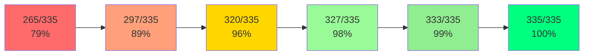
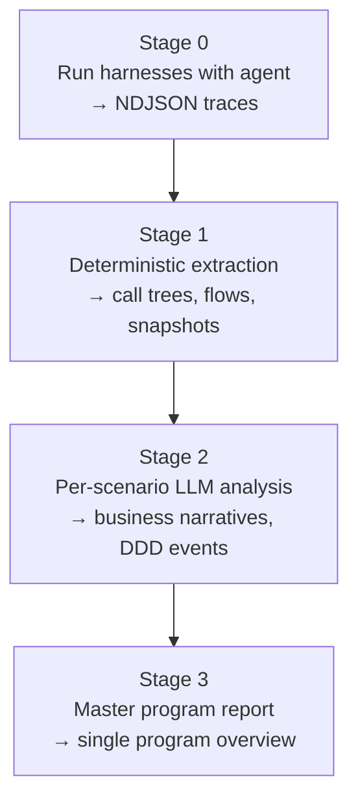
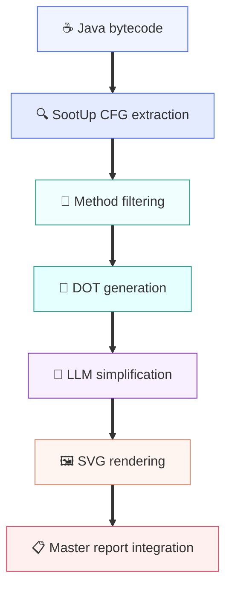
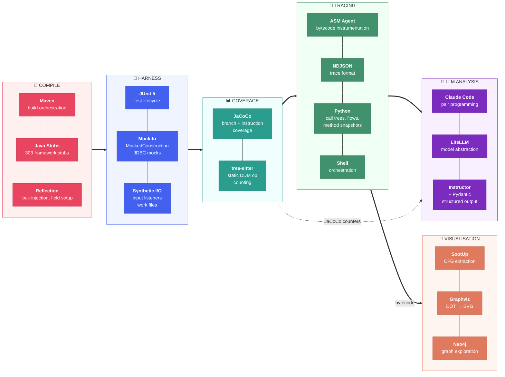

*A ten-day account of building a test harness and analysis pipeline for transpiled Natural/ADABAS programs — from initial compilation failures through DDM operation capture, service-layer coverage, runtime tracing, and LLM-driven documentation. The goal: extract enough understanding from legacy code to support modernisation decisions, without access to the original runtime environment.*

---

## Table of Contents

- [The Starting Point](#the-starting-point)
- [Day 1: Making It Compile](#day-1-making-it-compile)
- [Day 2: The Harness Idea](#day-2-the-harness-idea)
  - [Screens, Locks, and Work Files](#screens-locks-and-work-files)
  - [The Error Handler Trap](#the-error-handler-trap)
- [Day 3: Capturing DDM Operations](#day-3-capturing-ddm-operations)
  - [What the Stubs Were Missing](#what-the-stubs-were-missing)
  - [Condition Setters: The Silent Data Loss](#condition-setters-the-silent-data-loss)
- [Day 4: Closing DDM Coverage Gaps](#day-4-closing-ddm-coverage-gaps)
  - [The Work File Problem](#the-work-file-problem)
  - [100% DDM Coverage](#100-ddm-coverage)
- [Day 5: Service Layer Harnesses](#day-5-service-layer-harnesses)
  - [Three Tiers of Database Stubbing](#three-tiers-of-database-stubbing)
- [Day 6: The Trace Pipeline](#day-6-the-trace-pipeline)
  - [From Bytecode Agent to NDJSON](#from-bytecode-agent-to-ndjson)
  - [Stages of Analysis](#stages-of-analysis)
- [Day 7: LLM-Driven Documentation](#day-7-llm-driven-documentation)
  - [Grounding in Real Data](#grounding-in-real-data)
- [Day 8: Control Flow Graphs](#day-8-control-flow-graphs)
  - [SootUp and Method Filtering](#sootup-and-method-filtering)
- [Tools and Techniques](#tools-and-techniques)
- [What I Learned](#what-i-learned)
  - [On Stubs as Understanding](#on-stubs-as-understanding)
  - [On Coverage as a Map](#on-coverage-as-a-map)
  - [On LLMs and Legacy Code](#on-llms-and-legacy-code)
  - [On the Progression of Understanding](#on-the-progression-of-understanding)

---

## The Starting Point

I had a collection of Java source files — about 16 programs and several hundred supporting classes — that had been mechanically transpiled from Natural/ADABAS. Natural is a 4GL from Software AG, designed for mainframe business applications. ADABAS is the database it typically talks to. The transpiler had converted the Natural source into Java, preserving the original control flow (including `GOTO`-style jumps via labeled blocks) while mapping Natural data types to the transpiler runtime framework's custom memory and numeric classes.

The programs weren't runnable. They had zero declared Maven dependencies, no framework source, and no database. Every class referenced a framework that wasn't included in the extraction. The transpiled code contained `sourceTrace(N, "NNNN <source>")` calls that echoed the original Natural source lines — breadcrumbs from the transpiler that would turn out to be extremely useful later.

The question was: can you extract enough understanding from this code to support modernisation planning, without ever running it against a real database or application server?

---

## Day 1: Making It Compile

The first day was entirely about getting `mvn compile` to succeed. The extracted code referenced hundreds of framework classes — the base DDM class, the library and application classes, the variable-length memory abstraction, and more — none of which were present. I needed to write stub implementations for all of them.

This turned into approximately 303 new files across all modules and 24 modifications to existing files. The stubs needed to satisfy the compiler without reproducing the framework's actual behaviour. For instance, the variable-length memory class needed enough of its API to compile the transpiled field assignments, but the BCD encoding, overflow cascading, and memory layout were best-effort approximations.

Maven dependency wiring between the modules (`app_module`, `commons_module`, `base_module`, `framework_module`, `framework_stubs`) was the other half of the work. The original codebase had implicit dependencies everywhere — classes in one module referencing classes in another with no declared relationship.

By end of day, everything compiled. Nothing ran.

---

## Day 2: The Harness Idea

The programs couldn't be run normally — they expected a presentation layer, database connections, work file descriptors, and an application server lifecycle. But the transpiled Java preserved the original control flow faithfully. If I could set up enough of the surrounding infrastructure to get past the initial guards, the business logic would execute.

The idea was simple: write setup classes that pre-populate the fields a program checks during its first few `input()` calls, register a bounded input listener that feeds synthetic input and terminates after a fixed number of screens, then call `program.invoke()` and observe what happens.

### Screens, Locks, and Work Files

Three problems emerged immediately.

First, the framework's `input()` call delegated to a `lock_.wait()` on an input record object that expected a presentation thread to signal it. No presentation thread existed. The harness needed to inject a lock object via reflection and register an input listener that would automatically respond to screen events and eventually throw a termination exception to break out of the input loop.

Second, the work file factory crashed on empty work file descriptors. Setting a library parameter to disable work file opening bypassed this, but it also meant no work file I/O — a limitation I'd have to work around later.

Third, the program's library accessor cast to the application class, but I was constructing a different library subclass. The `ClassCastException` happened inside the error handler, so the real error was masked. Switching to the correct application class (with a shared singleton to avoid repeated construction failures from static state) fixed this.

### The Error Handler Trap

The transpiled programs all called `fetchReturn("ERROR_HANDLER")` or similar from their `onError()` handlers. Without stub implementations of these error-handler programs, the error handler itself threw `ClassNotFoundException`, causing every program to report PARTIAL status regardless of the actual error. Creating three no-op program subclasses with lowercase class names (to match the framework's naming convention) let the error handlers complete gracefully.

With these fixes, programs started running. Not correctly — they hit null pointers in DDM operations and exited early on validation checks — but they ran, and I could see the execution flow.

---

## Day 3: Capturing DDM Operations

The whole point of running these programs was to see what database operations they performed. In Natural/ADABAS, data access is done through DDM (Data Definition Module) views — generated classes that map field names to database columns and provide condition-setter methods for building queries.

I had already added a stub logger to the framework stubs, gated behind a system property (`-DstubTrace=true`). Now I extended the base DDM class — the class all DDM views inherit from — with structured operation logging: each `find()`, `read()`, `store()`, `update()`, `delete()` call would record the operation type, table name, and the WHERE clause built from accumulated conditions.

### What the Stubs Were Missing

The first harness runs showed bare `SELECT * FROM <table>` for every operation — no WHERE clauses at all. The condition-setter methods in the DDM views (things like `entityIdCondition(int op, NumericVal val)`) had been generated as empty bodies. They received the search operator and value from the transpiled program but discarded them silently.

I needed to wire up 20 condition-setter methods across 18 DDM view files. Each method needed to call `addCondition()` with the correct table and column names. The naming convention was mechanical: strip `Condition` from the method name, convert camelCase to `UPPER_SNAKE_CASE` for the column, strip `DDM` from the class name and prepend `T_` for the table. One exception: a condition setter for a temporary table's instance number mapped to a longer, hyphen-separated column name (not the compressed form), verified against the field declaration comment in the source.

### Condition Setters: The Silent Data Loss

This was the first major lesson about stub fidelity. The stubs compiled fine with empty condition-setter bodies. The programs ran fine. The harness reported operations. Everything *looked* correct. But the WHERE clauses were empty, which meant the captured SQL was useless for understanding data access patterns. The bug was invisible unless you knew what the output should look like.

After wiring up all condition setters, the SQL operations showed meaningful queries: `SELECT * FROM T_ENTITY_MASTER WHERE ENTITY_REF = ? AND STATUS = ?`. Now I could see what each program was actually asking the database.

---

## Day 4: Closing DDM Coverage Gaps

With operation capture working, I could measure coverage: how many of the DDM operations statically present in the source code were actually exercised by the harness? A tree-sitter-based analyzer (a separate Maven module using tree-sitter's Java bindings) scanned all program source files, counted every `find()`, `read()`, `store()`, `update()`, `delete()` call, and diffed them against the runtime JSON output.

Initial coverage: 265 out of 335 static operations exercised (79%).

### The Work File Problem

One program had a loop that wrote results to work file 1, then read them back for further processing. The write side crashed because the synthetic work file (my harness replacement for real work files) had no output stream. The six DDM operations inside the `readWork()` loop never executed.

The fix had two parts: give the synthetic work file a `getDataOutputStream()` that silently discards writes (backed by a `ByteArrayOutputStream`), and inject a synthetic work file with pre-populated records that the `readWork()` loop could consume. The synthetic record needed specific field values (a particular record type code, a non-zero conflict instance counter) to satisfy the guards before the DDM operations.

After this fix, that program went from 4 captured operations to 14.

### 100% DDM Coverage

The gap-closing campaign ran over roughly 40 iterations of adding setup classes. Each setup targeted a specific code path — a particular PF key state, a specific input field combination, a branch condition that needed to be true. The source trace strings in the transpiled code were invaluable here: I could trace which Natural source lines executed (by their sequence numbers) and identify exactly which condition was blocking the next DDM operation.



The final two gaps turned out to be dead code — `FIND_NUMBER` operations behind conditions that could never be true given the preceding logic. Confirming this required reading the Natural source comments embedded in the source trace calls and tracing the condition chain backwards. They weren't gaps in the harness; they were unreachable paths in the original program.

---

## Day 5: Service Layer Harnesses

The 16 transpiled programs sat inside a Java service layer — service classes that instantiated programs, set up their inputs, called `invoke()`, and processed their outputs. These services also had their own business logic: report generation, validation rules, data transformation. JaCoCo branch coverage on the service layer was the next target.

### Three Tiers of Database Stubbing

Service methods typically obtained JDBC connections and instantiated DAOs. Three patterns emerged for stubbing these, in order of preference:

**Anonymous subclass override.** Subclass the service impl in the harness, override only the DB-touching method, return synthetic data. The rest of the business logic runs normally:

```java
ReportServiceImpl svc = new ReportServiceImpl() {
    @Override
    public Map<String,List<ReportVo>> extractDataFromSource(String d) {
        return Map.of("202401", List.of(new ReportVo()));
    }
};
svc.generateReport("202401");
```

**Mockito `MockedConstruction`.** Intercept DAO constructor calls inside the method under test with `Mockito.mockConstruction()`. Configure the mock to return hardcoded results. This worked well when the service method constructed its own DAO internally.

**Mockito JDBC mocks.** Mock `Connection`, `PreparedStatement`, and `ResultSet` directly. Pass the mocked connection to the DAO constructor. This exercises the full DAO body — including result-set iteration — without a live database, and lets you capture the SQL that was issued via `ArgumentCaptor`.

The third tier was the most informative: it confirmed exactly what SQL a DAO generated and how it iterated results, which fed back into the domain model understanding.

The harness tests eventually moved from scattered `main()` methods into proper JUnit 5 tests in a dedicated `test_harness` module. The monolithic `testAll()` methods got split into individual scenario tests, each targeting a specific code path with a clearly named setup.

---

## Day 6: The Trace Pipeline

With harnesses exercising code paths and JaCoCo measuring coverage, the next question was: what does each program *actually do* at runtime? Not what the source code says it could do, but what it does for a specific set of inputs.

### From Bytecode Agent to NDJSON

I built an ASM-based Java agent (separate from the original stub logger instrumentation) that captured three things at runtime:

1. **SQL statements** at JDBC call sites
2. **Line-level execution traces** — which source lines ran, in order
3. **Branch decisions** with runtime values — which `if` was taken, what the operands were

The agent emitted NDJSON (newline-delimited JSON) — one event per line, with a type tag, timestamp, thread ID, and call stack. A shell script ran every harness test class with the agent attached and collected the trace files.

### Stages of Analysis

The analysis pipeline had four stages, each building on the previous:



**Stage 0** was pure execution — run the harness, collect the trace. No analysis.

**Stage 1** was deterministic extraction. A Python script parsed the NDJSON, built call trees, extracted execution flows (the sequence of method entries/exits with branch decisions), and produced method-level snapshots. It also generated Neo4j-compatible output for graph exploration. No LLM involvement — just data transformation.

**Stage 2** fed each scenario's extracted data to an LLM (via LiteLLM for model abstraction, with Instructor and Pydantic for structured output). The prompt asked for a business narrative, decision points, data operations, and a DDD event graph. The LLM saw the actual execution trace and the source code, not just a summary.

**Stage 3** synthesised all scenarios for a program into a single master report: what the program does overall, how its scenarios relate, what coverage gaps remain.

---

## Day 7: LLM-Driven Documentation

The Stage 2 and 3 reports were useful but had a problem: the LLM would confabulate coverage information. It would claim methods were "likely uncovered" based on pattern matching against the source code, rather than checking actual JaCoCo data.

### Grounding in Real Data

The fix was straightforward: feed JaCoCo coverage data directly into the Stage 3 prompt. Instead of asking "what do you think is uncovered?", the prompt said "here are the methods with zero instruction coverage according to JaCoCo; explain what each one does and why it might matter for modernisation."

I also added a token budget guard — the master report prompt could get large when a program had many scenarios, and blowing the context window produced truncated or incoherent output. The guard estimated prompt size before submission and trimmed scenario detail if needed.

A separate improvement: capturing DDM operations in the NDJSON trace stream itself (not just in the base DDM class's static log). This meant Stage 1 extraction could see DDM operations interleaved with the execution flow, giving the LLM richer context about when and why each database operation happened.

The generated documentation wasn't perfect, but it was *grounded*. Every claim about a DDM operation could be traced back to a specific harness run. Every coverage gap referenced an actual JaCoCo counter. The LLM was doing summarisation and explanation, not invention.

---

## Day 8: Control Flow Graphs

The last piece was visual: static control flow graphs for key methods. SootUp (the successor to the Soot static analysis framework) could parse Java bytecode and produce intraprocedural CFGs. I wrote a CFG extractor in Java that loaded the compiled classes, extracted CFGs for business-logic methods, and emitted DOT format.

### SootUp and Method Filtering

SootUp produced a CFG for every method in every class — but the transpiled code contained many generated methods: source trace helpers, field accessors, framework callbacks. The CFG extractor needed to filter these out to focus on the 10-15 business methods per class that actually contained domain logic.

The filtering went through several iterations. The first pass used a prefix blacklist (`get`, `set`, `is`, `hash`, `equals`, `toString`, `sourceTrace`). This was too aggressive — it filtered out `getReport()` methods that contained real logic. The second pass used SootUp's instruction count per method body as a size heuristic: skip methods under 10 bytecode instructions, skip methods whose name matched common accessor patterns AND were under 20 instructions, keep everything else. This produced a clean set of core business methods.

An LLM pass over the DOT output simplified node labels (replacing bytecode instruction details with semantic descriptions) and added a visual legend. The final SVGs were embedded in the master report markdown.



---

## Tools and Techniques

### At a Glance

```mermaid
block-beta
    columns 6

    block:compile:1
        columns 1
        h1["🔧 Build"]
        Maven
        Stubs["Java Stubs"]
        Reflection
    end

    block:harness:1
        columns 1
        h2["🧪 Testing"]
        JUnit5["JUnit 5"]
        Mockito
        SynIO["Synthetic I/O"]
    end

    block:coverage:1
        columns 1
        h3["📊 Coverage"]
        JaCoCo
        treesitter["tree-sitter"]
        space
    end

    block:trace:1
        columns 1
        h4["🔬 Tracing"]
        ASM["ASM Agent"]
        NDJSON
        Python
    end

    block:analysis:1
        columns 1
        h5["🤖 LLM"]
        Claude["Claude Code"]
        LiteLLM
        Instructor
    end

    block:visual:1
        columns 1
        h6["🎨 Visual"]
        SootUp
        Graphviz
        Neo4j
    end

    style compile fill:#fff0f0,stroke:#e94560
    style harness fill:#f0f4ff,stroke:#4361ee
    style coverage fill:#f0fffe,stroke:#2a9d8f
    style trace fill:#f0fff4,stroke:#40916c
    style analysis fill:#f8f0ff,stroke:#7b2cbf
    style visual fill:#fff5f0,stroke:#e07a5f

    style h1 fill:#e94560,stroke:#e94560,color:#fff
    style h2 fill:#4361ee,stroke:#4361ee,color:#fff
    style h3 fill:#2a9d8f,stroke:#2a9d8f,color:#fff
    style h4 fill:#40916c,stroke:#40916c,color:#fff
    style h5 fill:#7b2cbf,stroke:#7b2cbf,color:#fff
    style h6 fill:#e07a5f,stroke:#e07a5f,color:#fff

    style Maven fill:#fce4e4,stroke:#e94560,color:#333
    style Stubs fill:#fce4e4,stroke:#e94560,color:#333
    style Reflection fill:#fce4e4,stroke:#e94560,color:#333
    style JUnit5 fill:#e4ebff,stroke:#4361ee,color:#333
    style Mockito fill:#e4ebff,stroke:#4361ee,color:#333
    style SynIO fill:#e4ebff,stroke:#4361ee,color:#333
    style JaCoCo fill:#e4fffe,stroke:#2a9d8f,color:#333
    style treesitter fill:#e4fffe,stroke:#2a9d8f,color:#333
    style ASM fill:#e4ffe9,stroke:#40916c,color:#333
    style NDJSON fill:#e4ffe9,stroke:#40916c,color:#333
    style Python fill:#e4ffe9,stroke:#40916c,color:#333
    style Claude fill:#f0e4ff,stroke:#7b2cbf,color:#333
    style LiteLLM fill:#f0e4ff,stroke:#7b2cbf,color:#333
    style Instructor fill:#f0e4ff,stroke:#7b2cbf,color:#333
    style SootUp fill:#ffe9e4,stroke:#e07a5f,color:#333
    style Graphviz fill:#ffe9e4,stroke:#e07a5f,color:#333
    style Neo4j fill:#ffe9e4,stroke:#e07a5f,color:#333
```



### Data Flow

The pipeline used roughly 20 tools across six phases. The diagram below shows how data flowed between them — each phase's output fed the next.



---

## What I Learned

### On Stubs as Understanding

Writing stubs is reverse engineering. Every stub method I implemented forced a question: what does this method actually need to do for the caller to proceed? The condition-setter methods were the clearest example — they compiled fine as empty bodies, the programs ran, but the output was meaningless. The fidelity of your stubs determines the fidelity of your understanding.

The progression was: minimal stubs that compile → stubs that don't crash → stubs that produce correct-shaped output → stubs that capture the data flowing through them. Each level revealed something the previous level hid.

### On Coverage as a Map

JaCoCo coverage wasn't a quality metric here — it was a *navigation tool*. Each uncovered method was a question: why didn't the harness reach this code? The answer was always one of three things:

1. **Missing input state** — the setup didn't provide the right field values to pass a guard condition.
2. **Missing infrastructure** — a work file, screen listener, or framework callback wasn't wired up.
3. **Dead code** — the path was genuinely unreachable.

Categories 1 and 2 were fixable and always taught something about the program's control flow. Category 3 was rare but valuable to confirm — dead code in transpiled programs often indicates Natural subroutines that were included in the extraction but never called from the extracted entry points.

### On LLMs and Legacy Code

The LLM was most useful when I gave it structured, grounded data and asked for summarisation and explanation. It was least useful when I asked it to infer facts about the codebase — it would pattern-match against the source and produce plausible-sounding claims that weren't checkable without JaCoCo or trace data.

The pattern that worked: deterministic extraction first (Stage 1), LLM analysis second (Stage 2), with the LLM operating on the extracted data rather than raw source. This is the same principle as RAG, applied to code analysis: don't ask the model to remember or deduce facts; give it the facts and ask it to explain them.

### On the Progression of Understanding

The ten days followed a clear arc, and each phase's output became the next phase's input:

```mermaid
graph LR
    A["🔧 Compile"] ==> B["▶️ Run"]
    B ==> C["💾 Capture<br/>DDM ops"]
    C ==> D["📊 Measure<br/>coverage"]
    D ==> E["🔁 Close<br/>gaps"]
    E ==> F["🔬 Trace<br/>execution"]
    F ==> G["🏗️ Extract<br/>structure"]
    G ==> H["📝 Generate<br/>docs"]
    H ==> I["🎨 Visualise<br/>control flow"]

    style A fill:#fff0f0,stroke:#e94560,color:#333
    style B fill:#fce4e4,stroke:#e94560,color:#333
    style C fill:#f0f4ff,stroke:#4361ee,color:#333
    style D fill:#e4ebff,stroke:#4361ee,color:#333
    style E fill:#f0fffe,stroke:#2a9d8f,color:#333
    style F fill:#e4fffe,stroke:#2a9d8f,color:#333
    style G fill:#f0fff4,stroke:#40916c,color:#333
    style H fill:#f8f0ff,stroke:#7b2cbf,color:#333
    style I fill:#fff5f0,stroke:#e07a5f,color:#333
```



What surprised me was how much understanding came from the *process* of closing coverage gaps, not from reading the source code directly. Each gap forced me to trace a specific path through the program, understand why it wasn't being reached, and figure out what input state would activate it. By the time I hit 100% DDM coverage, I had a mental model of each program's control flow that no amount of source reading would have given me.

The documentation pipeline (Stages 0-3) then *formalised* that understanding into artefacts that someone else could read. But the understanding came first, from the iterative cycle of: run, measure, investigate, fix, repeat.

---

*The tooling described here — harness framework, trace agent, analysis pipeline, coverage loop — was built incrementally over ten days using Claude Code as a pair programming partner. The agent handled mechanical tasks (writing stub methods, wiring condition setters, generating boilerplate test classes) while I focused on the analytical questions: which code paths matter, what the DDM operations mean, how the programs relate to each other. That division of labour — human for judgment, agent for volume — is what made it possible to cover 335 DDM operations and 16 programs in the time available.*
