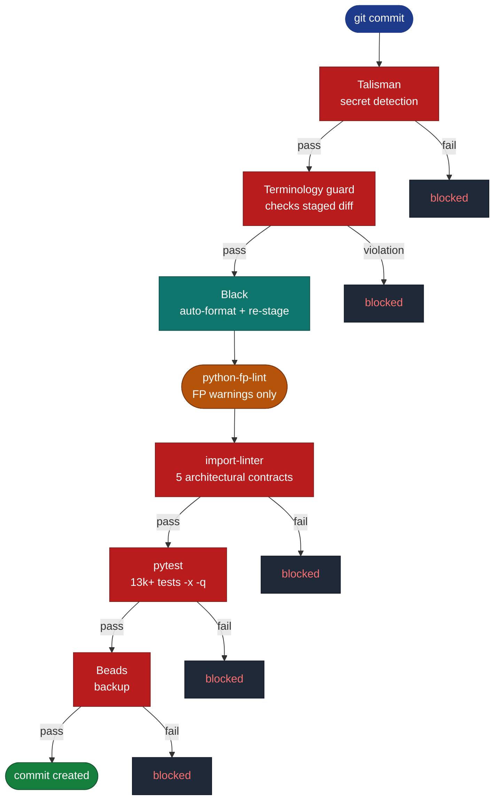
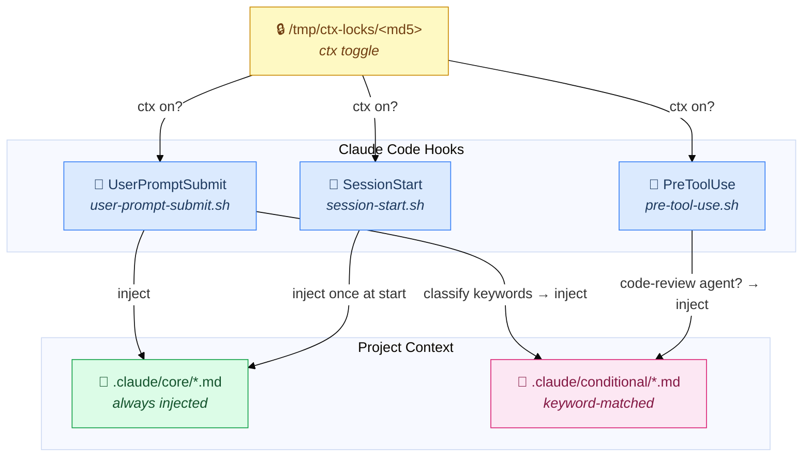
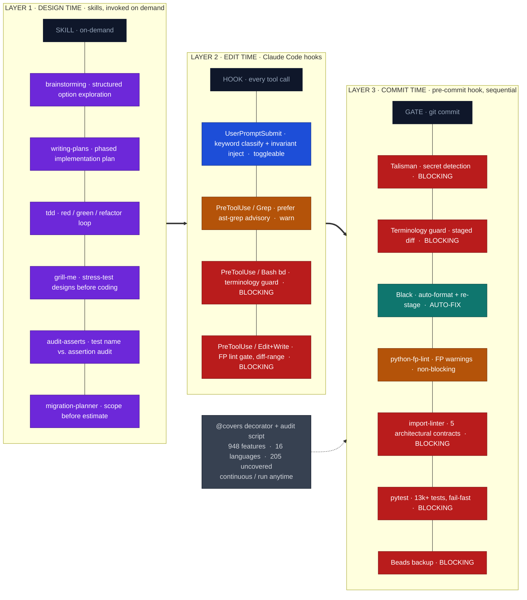

*[RedDragon](https://github.com/avishek-sen-gupta/red-dragon) is a multi-language interpreter/compiler that lowers 16 languages (Python, Java, Go, TypeScript, Rust, C, C++, C#, JavaScript, Kotlin, Lua, PHP, Ruby, Swift, Scala, COBOL) down to a shared IR. With 13,000+ tests across 16 frontends, keeping quality high and coverage visible requires a harness that operates at several layers simultaneously. This post documents that harness in full: how language feature coverage is tracked through feature enums, how the pre-commit pipeline is structured, and how Claude Code's hook system is wired to enforce workflow discipline at edit time.*

*This is a work in progress. The harness described here reflects the current state of the tooling, but it is actively evolving: new gates get added as pain points emerge, non-blocking warnings get promoted to blockers as violation counts drop, and the hook and skills infrastructure grows alongside the codebase. Treat this as a snapshot, not a finished design.*

---

## Table of Contents

- [CLAUDE.md: The LLM Guidance Layer](#claudemd-the-llm-guidance-layer)
- [Language Feature Coverage Tracking](#language-feature-coverage-tracking)
  - [Feature Enums: Self-Documenting Members](#feature-enums-self-documenting-members)
  - [The @covers Decorator](#the-covers-decorator)
  - [The Coverage Audit Script](#the-coverage-audit-script)
  - [What Uncovered Means](#what-uncovered-means)
- [The Pre-commit Pipeline](#the-pre-commit-pipeline)
  - [Talisman: Secret Detection](#talisman-secret-detection)
  - [Terminology Guard](#terminology-guard)
  - [Black: Auto-format](#black-auto-format)
  - [Python FP Lint: Functional Programming Warnings](#python-fp-lint-functional-programming-warnings)
  - [import-linter: Architectural Contracts](#import-linter-architectural-contracts)
  - [Full Test Suite](#full-test-suite)
  - [Beads Backup](#beads-backup)
- [Claude Code Hooks: Pre/Post Tool Use](#claude-code-hooks-prepost-tool-use)
  - [UserPromptSubmit: Contextual Invariant Injection](#userpromptsubmit-contextual-invariant-injection)
  - [PreToolUse: The Gate Layer](#pretooluse-the-gate-layer)
- [Skills and Workflow Automation](#skills-and-workflow-automation)
  - [Superpowers: Core Development Lifecycle Skills](#superpowers-core-development-lifecycle-skills)
  - [Project-Level Skills](#project-level-skills)
  - [Plugins: Context Injector and Python FP Lint](#plugins-context-injector-and-python-fp-lint)
- [The Full Picture](#the-full-picture)
- [Conclusion](#conclusion)

---

## CLAUDE.md: The LLM Guidance Layer

`CLAUDE.md` is Claude Code's project instruction file. It is loaded at the start of every session and provides the model with baseline knowledge about the project. RedDragon's `CLAUDE.md` is **thin by design**: it delegates to a set of imported files rather than encoding everything inline.

```markdown
# RedDragon: Agent Instructions

#import .claude/core/project-context.md
#import .claude/core/workflow.md
#import .claude/core/implementation.md
#import .claude/core/tools-search.md
#import .claude/conditional/design-principles.md
```

The four core files cover: what the project is and how it is structured (`project-context.md`), how to interact and commit (`workflow.md`), coding conventions and guard rules (`implementation.md`), and when to use which search tool (`tools-search.md`). The conditional `design-principles.md` is also always loaded here, in addition to being injected dynamically by the `UserPromptSubmit` hook when relevant prompts are classified.

This layer tells the model *how to work*: which test directories to use, when to brainstorm before coding, how to handle Talisman warnings, which formatting tool to run. It is effective for orienting the model and establishing defaults.

What it cannot do is *guarantee* those defaults are followed. Guidance in a prompt is a suggestion; it degrades across long contexts, gets overridden by competing instructions, and fails silently. [Liu et al. (2023), *Lost in the Middle*](https://arxiv.org/abs/2307.03172) showed that retrieval performance degrades most severely for information in the middle of the context window, which is exactly where `CLAUDE.md` ends up as conversation history grows. The `UserPromptSubmit` hook re-injects invariant files on every prompt to keep guidance recent, but even that is probabilistic. **"Most cases" is not a constraint.** Everything below this section exists because LLM guidance alone is not sufficient.

---

## Language Feature Coverage Tracking

*Each of the 16 language frontends has a feature enum that enumerates every construct the language supports, implemented or not. A decorator on test methods links tests to enum members. An audit script computes the gap.*

### Feature Enums: Self-Documenting Members

Each of the 16 language frontends has a dedicated `features.py` file at `interpreter/frontends/{lang}/features.py` (COBOL lives at `interpreter/cobol/features.py`). Each file contains a single `XxxFeature(Enum)` class whose members use **string values as documentation** rather than `auto()`:

```python
class PythonFeature(Enum):
    """Semantic features of the Python language."""

    # Declarations
    VARIABLE_DECLARATION = "simple name = value assignments at statement level"
    FUNCTION_DECLARATION = "def f(...): function definitions"
    CLASS                = "class C: class body definitions"

    # Control flow
    IF_ELSE          = "if / elif / else conditional branching"
    WHILE_LOOP       = "while cond: loop statements"
    FOR_LOOP         = "for x in iterable: loop statements"
    MATCH_STATEMENT  = "match subject: structural pattern matching (Python 3.10+)"

    # Pattern Matching
    CAPTURE_PATTERN  = "case x: name capture in match cases"
    SEQUENCE_PATTERN = "case [a, b]: sequence destructuring patterns"
    MAPPING_PATTERN  = 'case {"key": v}: mapping destructuring patterns'
    ...
```

The string value serves a dual purpose: it acts as human-readable documentation when the enum is displayed in audit reports, and it confirms at a glance what the feature covers. There are currently **948 features** defined across the 16 language enums.

### The @covers Decorator

Every test method that exercises a language feature is annotated with `@covers`:

```python
from tests.covers import covers
from interpreter.frontends.java.features import JavaFeature

class TestJavaInterface:
    @covers(JavaFeature.INTERFACE)
    def test_interface_method_lowering(self):
        result = run("""
            interface Greeter { String greet(String name); }
        """, "java")
        assert result == ...
```

The decorator is a **no-op at runtime**; it just attaches a `_covers` frozenset to the function object:

```python
def covers(*features: Enum) -> Callable[[_F], _F]:
    def _decorator(func: _F) -> _F:
        func._covers = frozenset(features)
        return func
    return _decorator
```

This means **zero test overhead**. The metadata only matters to the audit script.

---

### The Coverage Audit Script

[`scripts/feature_coverage_audit.py`](https://github.com/avishek-sen-gupta/red-dragon/blob/main/scripts/feature_coverage_audit.py) performs a three-phase static analysis:

**Phase 1: Feature module discovery.** It globs `interpreter/frontends/*/features.py` and `interpreter/cobol/features.py`, imports each module, and collects every enum member along with its string description.

**Phase 2: Test file scanning.** It uses Python's `ast` module (**not regex**) to walk all `test_*.py` files under `tests/unit/` and `tests/integration/`, extracting every `@covers(XxxFeature.MEMBER)` reference **without executing any code**:

```python
def _covers_refs_in_file(path: Path) -> frozenset[FeatureRef]:
    tree = ast.parse(path.read_text())
    return frozenset(
        FeatureRef(enum_class_name=arg.value.id, member_name=arg.attr)
        for node in ast.walk(tree)
        if isinstance(node, (ast.FunctionDef, ast.AsyncFunctionDef))
        and node.name.startswith("test_")
        for dec in node.decorator_list
        if isinstance(dec, ast.Call)
        and isinstance(dec.func, ast.Name)
        and dec.func.id == "covers"
        for arg in dec.args
        if isinstance(arg, ast.Attribute) and isinstance(arg.value, ast.Name)
    )
```

**Phase 3: Gap computation.** For each language, the covered set (enum members that appear in at least one `@covers`) is subtracted from the full member set to produce the uncovered list.

The output is a JSON coverage report plus a summary table:

```
  c           :  33 /  48 covered  (15 uncovered)
  cobol        :  87 / 106 covered  (19 uncovered)
  cpp          :  38 /  84 covered  (46 uncovered)
  csharp       :  71 /  94 covered  (23 uncovered)
  go           :  40 /  44 covered  (4 uncovered)
  java         :  50 /  72 covered  (22 uncovered)
  javascript   :  33 /  38 covered  (5 uncovered)
  kotlin       :  51 /  59 covered  (8 uncovered)
  lua          :  19 /  25 covered  (6 uncovered)
  pascal       :  38 /  47 covered  (9 uncovered)
  php          :  46 /  55 covered  (9 uncovered)
  python       :  35 /  55 covered  (20 uncovered)
  ruby         :  67 /  72 covered  (5 uncovered)
  rust         :  46 /  60 covered  (14 uncovered)
  scala        :  43 /  53 covered  (10 uncovered)
  typescript   :  16 /  36 covered  (20 uncovered)
  ──────────────────────────────────────────────────
  TOTAL: 948 features across 16 languages, 205 uncovered
```

The script also supports `--gaps-doc docs/frontend-lowering-gaps.md` to regenerate a full Markdown report with a summary table and per-language uncovered feature lists.

---

### What Uncovered Means

The feature enums are meant to be a **comprehensive inventory of the language**: every feature the language has, whether or not RedDragon supports it yet. An enum member with no `@covers` annotation is not a mistake in the enum; it is a **documented gap**: RedDragon's frontend does not yet handle this construct.

This makes the coverage audit a **living gap analysis** as much as a test quality report. Running the audit tells you two things simultaneously: which features are implemented and tested, and which features are known to be missing. As of this writing there are 948 features across 16 languages, with 205 uncovered. The uncovered features are documented gaps: constructs the language has that RedDragon does not yet implement. The number moves as new features are added to the enums and implementation catches up.

---

## The Pre-commit Pipeline

*Seven gates run in sequence on every `git commit`. The hook logic lives in [`.claude/hooks/pre-commit`](https://github.com/avishek-sen-gupta/red-dragon/blob/main/.claude/hooks/pre-commit) (**versioned in the repo**); `.git/hooks/pre-commit` simply delegates to it. Blocking gates exit non-zero to abort the commit; non-blocking gates warn and continue.*



### Talisman: Secret Detection

[Talisman](https://github.com/thoughtworks/talisman) scans all staged files for patterns that look like secrets: API keys, tokens, private key headers, high-entropy strings. It runs before everything else. If it flags something, the commit is blocked and you must either fix the content or add an explicit whitelist entry to `.talismanrc`. The `.talismanrc` policy is **append-only**: existing entries are never modified, new entries are added at the end.

---

### Terminology Guard

The terminology guard is a two-part system that prevents sensitive terms from entering tracked artifacts. A custom script at [`scripts/check-terminology`](https://github.com/avishek-sen-gupta/red-dragon/blob/main/scripts/check-terminology) scans staged content for a blocklist of domain-specific vocabulary that should not appear in a public repository. This operates independently of Talisman: Talisman looks for secrets, the terminology guard looks for project-specific identifiers. Both block on failure. This matters because RedDragon is used in consulting contexts where client names, system codes, and vendor identifiers must never appear in a public repository.

**The blocklist** lives at `~/.config/git/blocklist.txt`, one regex pattern per line, case-sensitive, applied via `grep -E`. It covers project names, government domain identifiers, vendor framework names, and reference system codes. An exclude-list at `~/.config/git/blocklist-exclude.txt` can whitelist specific file glob patterns.

**At commit time**, [`scripts/check-terminology`](https://github.com/avishek-sen-gupta/red-dragon/blob/main/scripts/check-terminology) scans the staged diff using `git diff --cached --diff-filter=ACMR -U0`. It only looks at added lines (lines starting with `+`, excluding the `+++` header). If a forbidden term appears in a new or modified line, the commit is blocked with a formatted table showing the commit reference, file:line location, matched term, and 60-character context snippet with the term highlighted:

```
 Forbidden terms in staged changes
──────────────────────────────────────────────────────────────────────────────────────────
  COMMIT         LOCATION                       TERM       CONTEXT
──────────────────────────────────────────────────────────────────────────────────────────
  staged         src/parser.py:42               "REDACTED" ...client = REDACTEDClient()...
──────────────────────────────────────────────────────────────────────────────────────────
  1 hit(s)

  Blocklist: ~/.config/git/blocklist.txt
  Fix the content or update the blocklist to proceed.
```

**For history scanning**, [`scripts/scan-history`](https://github.com/avishek-sen-gupta/red-dragon/blob/main/scripts/scan-history) performs a retroactive audit of the entire git history using the same blocklist. It runs two passes:

1. **File contents**: uses `git log --all -G "$PATTERN"` to find commits that introduced the pattern, then walks each affected file at that commit SHA with `git show "$sha:$file"` to extract matching lines and their locations.
2. **Commit messages**: scans `git log --all --format='%h %s %b'` for forbidden terms in the subject and body of every commit message.

Both scans produce the same formatted table output. The script is run manually (not as a hook) to audit historical exposure, typically when the blocklist is updated.

The shared formatting logic (`print_table_header`, `print_table_row`, `snippet_around`) lives in [`scripts/lib-terminology.sh`](https://github.com/avishek-sen-gupta/red-dragon/blob/main/scripts/lib-terminology.sh), which both the pre-commit guard and the history scanner source. This ensures consistent output format between the commit gate and the retrospective scan.

**At the AI agent level**, the [`bd-terminology-guard.sh`](https://github.com/avishek-sen-gupta/context-injector/blob/main/hooks/bd-terminology-guard.sh) PreToolUse hook intercepts Beads write commands before they reach the issue tracker. This catches the case where the AI composes an issue title or body containing a sensitive term; without this hook, the term could end up in the issue database even though it never touches a file.

---

### Black: Auto-format

[Black](https://github.com/psf/black) runs on the entire repository and is non-blocking in the sense that it auto-corrects and re-stages the formatted files (`git add -u`) before the later gates run. If you commit with non-Black-formatted code, the commit still goes through, but the staged content becomes Black-formatted.

---

### Python FP Lint: Functional Programming Warnings

[`python-fp-lint`](https://github.com/avishek-sen-gupta/python-fp-lint) is a custom linter that enforces functional programming conventions across `interpreter/`. It runs three backends in sequence, each responsible for a different class of violation.

The obvious alternative for structural rules would be Semgrep, but Semgrep's rule registry and advanced features are gated behind account creation and a paywall, and I firmly believe that [useful software should be free](https://github.com/avishek-sen-gupta/red-dragon/blob/main/PHILOSOPHY.md). ast-grep is **fully open, runs entirely offline**, and its YAML rule format is simpler for custom rules. For the patterns needed here (single-node structural matches on mutation syntax), it is more than sufficient.

**Backend 1: [ast-grep](https://github.com/ast-grep/ast-grep) (structural pattern rules).** Twenty-eight custom YAML rules match syntactic mutation patterns that ast-grep can detect with a single-node structural match. The rules cover direct mutation (subscript assignment `d[k] = v`, augmented assignment `x += y`, attribute mutation `self.x = y`, loop mutation), collection mutation methods (`list.append/insert/remove/pop/extend`, `set.add/discard`, `dict.update/clear/setdefault`), and annotation hygiene (`list`/`dict` parameter types, unfrozen dataclasses, `None`-defaulted parameters). Using ast-grep here rather than regex is deliberate: these are multi-token structural patterns (`$OBJ[$KEY] = $VAL`, `@dataclass` without `frozen=True`) that span more than one token and would require fragile regexes or a full parser to match correctly otherwise.

**Backend 2: [Ruff](https://github.com/astral-sh/ruff) (general code quality).** The selected rule sets are `E`/`W` (pycodestyle), `F` (Pyflakes), `I` (isort), `B` (flake8-bugbear), `UP` (pyupgrade), `SIM` (flake8-simplify), `RUF` (Ruff-specific), `BLE` (blind-except), `T20` (print statements), `TID252` (tidy-imports), and `C901` (McCabe complexity). These cover standard quality checks that have nothing to do with FP style but are useful to have in a single pass.

**Backend 3: [beniget](https://github.com/serge-sans-paille/beniget) (def-use chain reassignment detection).** Variable reassignment (binding the same name twice in the same scope) cannot be detected by ast-grep, because the pattern spans multiple statements and requires knowing whether a name was already defined earlier in the same scope. [beniget](https://github.com/serge-sans-paille/beniget) builds a def-use chain for each Python module by walking the AST and tracking every definition and use of every name. The `ReassignmentGate` queries `duc.locals` to find names with more than one definition node in the same scope and reports the second and subsequent assignments as violations.

**Current limitation: this only catches local variable reassignment. Object member reassignment (`self.x = y`) is not detected by this backend; those cases are caught by the `no-attribute-augmented-mutation` ast-grep rule, which covers augmented assignment only (`self.x += y`), not simple attribute writes.**

Currently **non-blocking** (`|| true`): the codebase has accumulated violations from before the linter existed, and the migration toward functional patterns is incremental. The intent is to make it blocking once the violation count reaches zero.

The linter lives in its own venv at `~/.claude/plugins/python-fp-lint/venv/` and is invoked directly:

```bash
~/.claude/plugins/python-fp-lint/venv/bin/python \
    -m python_fp_lint check "$REPO_ROOT/interpreter/" || true
```

---

### import-linter: Architectural Contracts

[import-linter](https://import-linter.readthedocs.io/) enforces five architectural contracts:

| Contract | Rule |
|---|---|
| VM must not import frontend lowering code | Prevents lowering logic bleeding into the VM |
| IR module must not import other interpreter modules | Keeps IR as a pure data type layer |
| Project module must not import VM internals | Enforces the project/VM boundary |
| Language frontends must not import each other | Prevents cross-frontend coupling |
| COBOL module only imported by frontend factory | Isolates the COBOL frontend |

These are **blocking**. A contract violation fails the commit.

---

### Full Test Suite

`poetry run python -m pytest tests/ -x -q` runs all 13,000+ tests with fail-fast (`-x`). This is the most expensive gate (~50 seconds) but **it runs last, after all the cheaper gates have passed**. It is **blocking**.

One deliberate omission: **coverage measurement** (`--cov`) is not part of the pre-commit hook. At 13,000+ tests, adding coverage instrumentation locally would push commit time past the point of acceptability. Coverage runs in CI instead, where the cost is paid asynchronously and doesn't interrupt the development loop.

---

### Beads Backup

[Beads](https://beads.sh) is the issue tracker used for this project. The pre-commit hook calls `bd backup` to snapshot the issue database before the commit lands. This ensures the issue tracker state is always in sync with the code history. **Blocking**: if the backup fails, the commit is blocked.

---

## Claude Code Hooks: Pre/Post Tool Use

*Shell scripts wired into Claude Code's event system. `UserPromptSubmit` injects project invariants into every prompt. `PreToolUse` blocks edits that violate architectural or terminology constraints.*

Claude Code's hook system allows shell scripts to intercept tool calls before they execute (PreToolUse). RedDragon uses this to enforce workflow discipline **at the point where the AI agent is making edits, not just at commit time**.

All hooks are configured in `.claude/settings.json`:

```json
{
  "hooks": {
    "PreToolUse": [
      { "matcher": "Grep",  "hooks": [{ "command": "...ast-grep advisory..." }] },
      { "hooks":            [{ "command": "bd-terminology-guard.sh" }] },
      { "matcher": "Edit",  "hooks": [{ "command": "lint-check.sh" }] },
      { "matcher": "Write", "hooks": [{ "command": "lint-check.sh" }] }
    ],
    "UserPromptSubmit": [{ "hooks": [{ "command": "user-prompt-submit.sh" }] }],
  }
}
```

### UserPromptSubmit: Contextual Invariant Injection

Every time a message is submitted, [`user-prompt-submit.sh`](https://github.com/avishek-sen-gupta/context-injector/blob/main/hooks/user-prompt-submit.sh) classifies the prompt using keyword matching and injects the relevant invariant files into the conversation context. The classification is purely lexical (no LLM involved):

```sh
# Keyword families → context categories
if grep -qiEw 'implement|add|build|create|fix|feature|...'; then
  DESIGN=1; TESTING=1; REFACTORING=1; SKILLS=1
fi
if grep -qiEw 'test|tdd|assert|coverage|...'; then
  TESTING=1
fi
if grep -qiEw 'refactor|rename|extract|move|...'; then
  DESIGN=1; REFACTORING=1; SKILLS=1
fi
if grep -qiEw 'review|pr|diff|...'; then
  REVIEW=1
fi
```

The injected invariant files live in `.claude/core/` (always injected) and `.claude/conditional/` (injected when the corresponding category fires). This means a prompt like "implement COBOL array support" automatically injects design principles, testing patterns, and tools/skills context, while a prompt like "what does this function do?" only injects core context.

**What gets injected.** The invariant files are split into two directories:

- `.claude/core/`: four files injected on every prompt regardless of classification: `project-context.md` (language, toolchain, module map), `workflow.md` (interaction style, commit protocol), `implementation.md` (coding conventions, guard rules), `tools-search.md` (when to use ast-grep vs grep vs the graph MCP).
- `.claude/conditional/`: five files injected only when the corresponding category fires: `design-principles.md` (DESIGN), `testing-patterns.md` (TESTING), `refactoring.md` (REFACTORING), `tools-skills.md` (SKILLS), `code-review.md` (REVIEW).

A prompt classified as DESIGN+TESTING+REFACTORING+SKILLS (e.g. "implement COBOL array support") injects all nine files. A prompt classified as none of the above (e.g. "what does this function do?") injects only the four core files.

**The `/ctx` slash command** controls the injection gate. It is implemented as a Claude Code user command at `~/.claude/commands/ctx.md`, which delegates to the `ctx` binary at `~/.claude/plugins/context-injector/bin/ctx`:

```sh
/ctx          # toggle on ↔ off
/ctx on       # enable injection
/ctx off      # disable injection
/ctx status   # print {"active": true|false}
```



The state is a per-project lockfile at `/tmp/ctx-locks/<project-hash>`. The hash is derived from `$PWD`, so each project has an independent toggle; switching it off in one repo doesn't affect another. The hook [`user-prompt-submit.sh`](https://github.com/avishek-sen-gupta/context-injector/blob/main/hooks/user-prompt-submit.sh) checks for the lockfile at the start of every run; if absent, it exits immediately without injecting anything.

The injection mechanism works through Claude Code's `UserPromptSubmit` hook return value: the hook writes its output to stdout, and Claude Code prepends that output to the user's message before it reaches the model. From the model's perspective, the invariants appear at the top of the incoming message, not as a separate system prompt. This means the injected content is visible in the conversation and can be referenced explicitly.

`/ctx off` is useful when you want a raw conversation without the invariant overhead: exploring an unfamiliar part of the codebase, doing a quick calculation, or asking a question where the injected design principles would be noise. `/ctx on` (or toggling back) restores normal operation; no session restart required.

---

### PreToolUse: The Gate Layer

Three hooks run before tool calls:

**1. ast-grep advisory (on `Grep`):** When the agent is about to run a Grep, an advisory fires reminding it to prefer `ast-grep` for structural patterns (constructor shapes, multi-line call sites) and reserve `Grep` for simple keyword/import/constant searches.

**2. Terminology guard (all `Bash` tool calls with `bd` write commands):** The [`bd-terminology-guard.sh`](https://github.com/avishek-sen-gupta/context-injector/blob/main/hooks/bd-terminology-guard.sh) hook intercepts any `bd create`, `bd update`, `bd note`, or similar Beads write commands and checks them against the blocklist. If a sensitive term appears in the issue text, the command is blocked (exit 2) before it reaches Beads.

**3. Python FP lint gate (on `Edit` and `Write`):** The [`lint-check.sh`](https://github.com/avishek-sen-gupta/context-injector/blob/main/hooks/lint-check.sh) hook receives the full tool event JSON on stdin (including the file path and the new/modified content), runs `python_fp_lint hook-check`, and blocks the edit if violations appear in the modified line range. Critically, this operates on the **diff range**: it only flags violations introduced or modified by the current edit, **not pre-existing violations in unchanged lines**. This prevents the linter from blocking edits in files that already had violations before you touched them.

```sh
# Exit 0 = allow, Exit 2 = block
cat | $LINT_CMD hook-check
```

The gate is toggled with `/lint on` and `/lint off`, which create/remove a lockfile at `/tmp/ctx-lint/<project-hash>`.

---

## Skills and Workflow Automation

*Hooks enforce runtime constraints at the tool level. Skills encode workflow knowledge at the task level: how to approach a problem, what questions to ask, what patterns to follow. They are loaded on demand via Claude Code's Skill tool.*

### Superpowers: Core Development Lifecycle Skills

The [Superpowers](https://github.com/anthropics/claude-plugins-official) plugin provides a suite of lifecycle skills that cover the full development loop:

| Skill | Purpose |
|---|---|
| `brainstorming` | Structured option exploration before touching code. Presents trade-offs, seeks user input before committing to an approach. |
| `writing-plans` | Produces a detailed, phased implementation plan from a spec before any coding begins. |
| `executing-plans` | Executes a written plan using subagent orchestration, one step at a time. |
| `test-driven-development` | Red/green/refactor loop with explicit constraints on what to write at each phase. |
| `systematic-debugging` | Root cause analysis before patching. Forces diagnosis before solution. |
| `verification-before-completion` | Checklist run before claiming work is complete: tests pass, no regressions, no TODOs left behind. |
| `requesting-code-review` | Invokes specialized review agents before merging. |
| `receiving-code-review` | Structures how to process and respond to review feedback. |
| `dispatching-parallel-agents` | When 2+ independent tasks exist, launches them as concurrent subagents. |
| `subagent-driven-development` | Orchestrates independent implementation tasks across a plan in parallel. |
| `finishing-a-development-branch` | Checklist for branch completion: cleanup, docs, tests, commit hygiene. |
| `writing-skills` | For creating or editing skill files themselves. |
| `using-git-worktrees` | Isolates feature work in a temporary worktree to avoid polluting the working directory. |

The key constraint from `using-superpowers` is that skills are loaded **before any response**, even before a clarifying question. The rule: if there is **even a 1% chance a skill applies**, invoke it first. Crucially, the developer does not need to explicitly trigger a skill; the agent is expected to recognise when one applies and invoke it without being asked.

---

### Project-Level Skills

RedDragon has six project-specific skills in `.claude/skills/`:

**`tdd`**: The project's TDD skill extends the Superpowers TDD skill with RedDragon-specific conventions: where integration tests go (`tests/integration/`), what a correct `@covers` annotation looks like, how to use `run()` to exercise the VM rather than unit-testing the lowering step in isolation.

**`audit-asserts`**: Periodic audit of test name vs. assertion mismatches. Batches test files across parallel agents (batches of ~20), collects P0/P1/P2 violations, deduplicates against existing Beads issues, and files new ones. The most recent audit (#16 as of this writing) covered 331 files and found 0 P0 violations.

**`grill-me`**: Interview mode. When invoked, the AI asks probing questions about every aspect of a plan or design, walking each branch of the decision tree and providing a recommended answer for each question. Used before committing to significant architectural changes. Useful for surfacing assumptions that haven't been examined.

**`migration-planner`**: Activates during brainstorming when the task is a large-scale type migration (e.g., replacing `str` with a domain type across function signatures, dict keys, and data classes). Provides a scope-first discipline: count before you plan, don't estimate. Provides three migration strategies (big-bang, parallel-run, incremental) with trade-off analysis.

**`documentation`**: Updates all living docs (README, ADRs, IR lowering gaps, frontend design docs, HTML presentations) to reflect current codebase state. Does not touch immutable spec files under `docs/superpowers/specs/`.

**`improve-codebase-architecture`**: Explores the codebase for deep module opportunities (à la Ousterhout), surfaces integration risk at module seams, and proposes refactors as Beads RFC issues.

---

### Plugins: Context Injector and Python FP Lint

**[Context Injector](https://github.com/avishek-sen-gupta/context-injector)** is the plugin that powers the `UserPromptSubmit` hook described above. Toggle: `/ctx on` / `/ctx off`.

**[Python FP Lint](https://github.com/avishek-sen-gupta/python-fp-lint)** enforces functional programming conventions at edit time. The PreToolUse gate blocks edits that introduce FP violations into the modified lines. Toggle: `/lint on` / `/lint off`. The same linter runs in the pre-commit hook as a non-blocking warning pass over the full `interpreter/` directory.

**Additional plugins and skill sources used in this project:**

- [code-review-graph](https://github.com/tirth8205/code-review-graph): builds a Tree-sitter AST graph of the codebase for token-efficient, impact-aware code review via MCP
- [claude-mem](https://github.com/thedotmack/claude-mem): persistent cross-session memory with timeline, search, and smart-outline MCP tools
- [ast-grep agent-skill](https://github.com/ast-grep/agent-skill): structural code search skill; the CLAUDE.md mandate to prefer `ast-grep` over plain `grep` is enforced by a PreToolUse advisory wired to every `Grep` call

---

## The Full Picture



The harness operates at three layers, with feature coverage sitting orthogonal as a continuous property rather than a gate:

**Layer 1, design time (skills):** `brainstorming` structures option exploration before coding begins; `tdd` enforces red/green/refactor discipline; `grill-me` examines designs before committing to them; `audit-asserts` audits test name vs. assertion consistency; `migration-planner` scopes large changes before estimating.

**Layer 2, edit time (Claude Code hooks):** Every prompt gets relevant invariants injected (`UserPromptSubmit`). Every edit to `interpreter/` is checked for FP violations in the modified line range (`PreToolUse`). Every Beads write is screened for sensitive terms (`PreToolUse`).

**Layer 3, commit time (pre-commit pipeline):** Secret detection, terminology, formatting, FP warnings, architectural contracts, the full test suite, and issue tracker backup run in sequence. Most are blocking; a violation stops the commit.

The three layers are designed so that violations are caught close to where they are introduced: design problems during brainstorming, bad edits before they are written to disk, and bad commits before they enter the history.

---

## Conclusion

The goal behind this harness is **reliability, discoverability, and rigour** in an AI-assisted development context. Each of those properties requires a different kind of investment.

**Reliability / Repeatability / Reproducibility** means that a constraint either holds or it does not; it does not depend on whether the AI had the right context, or whether the right instruction was in scope, or whether the model happened to follow it this session. Every gate in the pre-commit pipeline, every PreToolUse hook, every import-linter contract, and every `@covers` annotation is a *deterministic check*. It runs the same way every time and produces the same result for the same input. Asking the AI to "remember not to import across module boundaries" or "make sure you annotate every new test with `@covers`" is *a prompt instruction, not a constraint*. **Prompt instructions degrade across context boundaries, get overridden by other instructions, and fail silently.** A blocking git hook does not forget.

**Discoverability** requires that the codebase itself be *automation-friendly*:

- The `@covers` decorator exists so that coverage auditing can be done statically, without executing tests or parsing output.
- The feature enum string values exist so that audit reports are self-describing without a separate documentation file.
- The `VAR_DEFINITION_OPCODES` frozenset in `ir.py` exists so that dataflow analysis can identify definition sites without pattern-matching over opcode names scattered across the codebase.

These are small structural choices that make the codebase *queryable by scripts and agents without interpretation*. **A codebase that lacks these hooks forces automation to guess; a codebase that provides them allows automation to be exact.**

**Rigour** comes from a specific division of labour: *build constraints using AI, but do not rely on the AI to impose them*. The terminology blocklist was written with AI assistance; the blocklist itself is a flat text file checked by a shell script. The import-linter contracts were designed with AI help; the contracts run as a deterministic linter step. The skills encode workflow knowledge refined through conversation; the skills themselves are Markdown files loaded and followed mechanically. In each case, the AI did the authoring work, but *the resulting artifact is a static, executable constraint that runs without the AI*. **The non-deterministic layer is reserved for work that genuinely requires judgment:** exploring design trade-offs, writing implementation code, interpreting test failures, deciding what to file as an issue.

**Nested feedback loops.** The harness is structured as a set of loops, each operating at a different granularity and cost:

- **Design time (skills):** fire before a line of code is written; a skill invocation costs nothing.
- **Edit time (Claude Code hooks):** fire before a change is saved; a PreToolUse block costs one rejected edit.
- **Commit time (pre-commit pipeline):** fires before a change enters history; a failed commit costs a full test run.
- **Continuous (coverage audit):** runs orthogonal to all three; a gap costs a backlog issue.

Each loop catches a different class of problem. The loops are deliberately ordered so that the cheapest checks run first. **Problems caught in an inner loop are cheaper to fix than problems that escape to an outer one.** The design goal is not to make any single gate comprehensive, but to ensure that each class of violation has a loop it cannot escape.

This is not a finished design. Some gates are still non-blocking warnings that will become blockers as violation counts drop. Some constraints that currently exist only as prompt instructions will eventually become code. The direction is consistent: *push enforcement into deterministic mechanisms wherever possible*, and make what remains explicit and auditable.
