There is an optimistic and a pessimistic reading of what GenAI does to the problem of large legacy codebases.

The optimistic reading: the model can read Java faster than you can, it knows the framework idioms, and it can generate a plausible test stub in seconds. True.

The pessimistic reading: the model will trace a ten-layer call chain, confidently conclude that some domain flag has a specific value at the point your test reaches the validation service, and be completely wrong. There was a null check at layer three that short-circuits, a swallowed `catch` at layer five that logs silently, and a database-driven flag at layer eight that flips the branch. **The test will compile, run, pass, and test nothing.**

The pessimistic reading is also true.

This post is about that gap: what goes wrong when you use an LLM to reason about a ~2M-line J2EE codebase, and which classical program analysis techniques help by supplying structured, pre-computed facts instead of asking the model to derive them from source text.

The running example is the **Ralph Loop**: an AI-orchestrated test coverage campaign over a large legacy J2EE codebase with approximately two million lines of code, zero pre-existing unit tests, and no test harness.

Aside: The Ralph loop is your basic `while` loop, where the condition is a fitness function, and the body executes a series of instructions (deterministic or LLM-driven) until the fitness function is satisfied. In this case, the fitness function is a measure of the code coverage, and the instructions are the test cases generated by the LLM.

The codebase is actively maintained, but it has grown into a monolith spanning JSF, Spring, JMS, Hibernate, raw JDBC, and more. Documentation exists at the flow level; what is not documented is the code itself: the cross-layer interactions, the edge cases, and the conditions under which a particular DAO actually emits SQL. The goal is an **executable specification**: tests that capture what each flow does at a level of precision no design document reaches, and that break the moment the behaviour changes.

At two million lines with no existing harness, manual test writing is not a credible option (well, it is, what else were you going to do pre-LLM, anyway? But any sort of automation would have always reduced the tedium). The exercise consisted of the following loops:
- Two Ralph loops, one nested in the other. The outer loop iterates over action methods, which are entry points in the request-processing framework, measuring cumulative JaCoCo coverage and ranking the next highest-value target. The inner loop takes one action method, drives coverage toward 90%, and commits the tests. For the purposes of this post, we will stick to the execution of this inner loop.
- A Ralph loop to build tests to exercise the DAO layer, in order to capture the emitted SQL (through JDBC-level tracing or Hibernate mechanisms).


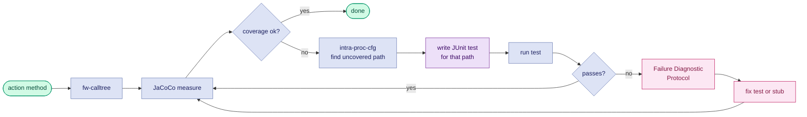

---

The seven techniques described in this post rely on the following tools. Each links to the section where it is discussed.

| Tool / Technique | Purpose |
|---|---|
| JaCoCo [➔](#technique-1-coverage-statistics-as-a-deterministic-compass) | Coverage measurement; drives target selection in the outer loop |
| `buildcg` [➔](#technique-2-cfgs-and-slicing) | One-time callgraph construction from compiled JARs |
| `fw-calltree` [➔](#technique-2-cfgs-and-slicing) | Forward calltree query from a given entry point |
| `intra-proc-cfg` [➔](#technique-2-cfgs-and-slicing) | Intraprocedural CFG extraction for a single method |
| `flat-cfg-path-to-line` [➔](#technique-2-cfgs-and-slicing) | Flat statement sequence from method entry to a target line |
| `reaching-conditions` [➔](#technique-5-reaching-conditions) | Branch predicates (with polarity) on each CFG path to a target |
| `ddg-slice` [➔](#technique-4-dataflow-analysis) | Intraprocedural def-use chains; variable origin tracing |
| `ctags` + `ast-emit` [➔](#technique-3-source-extraction-with-ctags-and-ast-emit) | Symbol indexing and batch source-body extraction |
| `ast-grep` [➔](#technique-3-source-extraction-with-ctags-and-ast-emit) | Structural code search by AST pattern |
| `CapturingConnection` [➔](#applying-techniques-dao-sql-capture) | JDBC-level SQL capture against H2 |
| AspectJ CatchRecorder [➔](#technique-7-dynamic-tracing) | Swallowed-exception tracing at catch sites |
| JFR Exception Recorder [➔](#technique-7-dynamic-tracing) | Throw-site capture for implicit JVM exceptions |
| ASM Trace Agent [➔](#technique-7-dynamic-tracing) | Full method-entry/exit execution trace |

---

## Contents

1. [Tests as Specification and Harness](#tests-as-specification-and-harness)
2. [The Problem: What Goes Wrong](#the-problem-what-goes-wrong)
3. [The Ralph Loop as a Context-Engineering Harness](#the-ralph-loop-as-a-context-engineering-harness)
4. [Why Not Just Use the IDE?](#why-not-just-use-an-lsp-server)
5. [Technique 1: Coverage Statistics as a Deterministic Compass](#technique-1-coverage-statistics-as-a-deterministic-compass)
6. [Technique 2: CFGs and Slicing](#technique-2-cfgs-and-slicing)
7. [Technique 3: Source Extraction with ctags and ast-emit](#technique-3-source-extraction-with-ctags-and-ast-emit)
8. [Technique 4: Dataflow Analysis](#technique-4-dataflow-analysis)
9. [Technique 5: Reaching Conditions](#technique-5-reaching-conditions)
10. [Technique 6: DAO SQL Capture](#applying-techniques-dao-sql-capture)
11. [Technique 7: Dynamic Tracing](#technique-7-dynamic-tracing)
12. [Why Tools, Not Just an LLM](#why-tools-not-just-an-llm)
13. [Four Diagnostic Incidents](#four-diagnostic-incidents)
14. [Where LLMs Fit In](#where-llms-fit-in)
15. [Caveats](#caveats)
16. [References](#references)

---

## Tests as Specification and Harness

In an [older post from 2011](/2023/01/10/tests-proof-probability.html), I gave a probabilistic argument that writing a test increases the posterior probability that a piece of code is correct by a factor of 2^n (where n is the output bit width). The argument is rough, but the intuition holds: every test that passes constrains the space of possible implementations, reducing entropy: tests are evidence.

That argument was made in the context of human developers. In the GenAI context, the same point applies but becomes more important.

**Tests as a quantitative map.** A coverage report (JaCoCo's `instruction_pct`, for example) tells the model precisely which code has been exercised and which has not. It is a computed fact about execution history. In the inner Ralph loop, the model starts by querying a coverage JSON emitted from JaCoCo XML into a node-per-method structure. The output is a ranked list of uncovered methods, sorted by missed bytecode instructions. The model knows *what* to target before it reads production code.

**Tests as machine-readable intent.** A test method named `placeOrder_whenCustomerIsCorporate_andPurchaseOrderNumberIsAbsent_shouldReturnValidationError` communicates several things that the model can exploit: the class under test, the business condition being checked, the expected outcome, and by implication, the fields and mock stubs needed to trigger it. That information is available as text even to a model with no execution capability.

**Failing tests as precise diagnostic reports.** A test failure is not "something is broken somewhere." It is a specific assertion, a stack trace, a set of actual vs expected values, and, if you instrument correctly, a log of every service call that was or was not made. This is far more information-dense than a bug report.

**Tests as proof of functional equivalence.** Whether rewriting, migrating to microservices, or upgrading a framework, a deterministic test harness is the only reliable way to prove functional equivalence between old and new. The tests written today are the specification the replacement must satisfy. An LLM summary of what the code does is a best-effort interpretation: plausible, useful for orientation, but not a contract. A passing test is a contract: it captures exactly what inputs produce what outputs, and breaks the moment the code diverges. An LLM summary will survive a rewrite; a test will catch when the rewrite is wrong.

| Concern | LLM summary | Test suite |
|---|---|---|
| Invariants documented | partial | yes |
| Input/output contracts | inferred | exact |
| Edge cases covered | guessed | verified |
| Survives refactor | no | yes |
| Proves equivalence | no | yes |
| Runs in CI | no | yes |

Tests are a long-term investment, but still they pay dividends immediately; whether you are modernising, refactoring, or enhancing legacy code.

**LLMs layer on top of tests, not underneath them.** An LLM can read a passing test suite, a coverage report, and a set of call trees and produce useful summaries: what a flow does, which edge cases are covered, what an undocumented action class appears to intend.

This is something I've found models to be very good at: synthesis of structured evidence. What is not a good use is asking it to guess about facts that static analysis can compute exactly, such as execution paths, guarding conditions, or emitted SQL.

The shift is this: in the pre-AI era, tests were primarily for human confidence. In the AI era, they are also infrastructure for machine comprehension. **A codebase with good test coverage is a codebase that is simultaneously understandable at multiple levels of abstraction.**

---

## The Problem: What Goes Wrong

Before we discuss techniques, let's be explicit about *what* can go wrong when AI models are tasked with writing tests based on reasoning about source code.

**Attention drift.** Ask a model to trace a call chain through ten method boundaries and it will drift. The types it attributed to a parameter at layer two will have been quietly replaced by a plausible but wrong type by layer seven. The argument that a particular service method accepts a domain object not a raw `String` will be forgotten. The mock will be stubbed for the wrong type signature. The test will compile because the model also writes an `@SuppressWarnings`, or because the actual type is `Object`, and the failure will be silent.

**Token burn.** A realistic J2EE action method has 30–50 transitive callees once you include validators, service managers, DAO helpers, and utility methods. Reading all of them is not feasible within a context window if you also want to do anything useful with what you have read. The model must either truncate or hallucinate.

**Path explosion and static over-confidence.** The model reads a condition:

```java
if (requestType == RequestType.TYPE_B) {
    // type-B-specific validation
}
```

It assumes this branch is taken because the surrounding code seems to be about type-B processing. It writes a test that sets `requestType = TYPE_B`. But three layers up, the action's `execute()` method has already set `requestType` to `TYPE_A` based on a request parameter that the model did not follow. The branch is never entered. The test passes because the validation path is skipped, not because validation passed.

**The silent exception.** Production J2EE code of a certain vintage is full of:

```java
catch (Exception e) {
    logger.error("Something went wrong: " + e.getMessage(), e);
}
```

The exception is swallowed. The method returns `null` or a default object. The test checks the return value, gets `null`, and the model's first instinct is to conclude that the method is supposed to return null in this case. It is not. The test is measuring a broken execution path and recording it as expected behaviour.

**Unscoped exploration.** Even when the task is to write a test for a single, well-identified method in a well-scoped flow, a model without structured artifacts will begin grepping through files to re-derive information it could have received directly. Given an action class name, it will grep for the class, read the file, find a called method name, grep for that, read that file, and repeat, re-constructing a call graph one hop at a time. Each hop is a context allocation and a potential point of drift. This happens reliably: the prompt engineering work in the Ralph Loop required repeated reinforcement to keep the model querying coverage JSON rather than scanning files, using `ast-emit` rather than reading method bodies manually, and invoking `intra-proc-cfg` rather than reasoning about control flow from source text.

The problem with all of the above is that **the model has no ground truth about *what actually executed*.** It is reasoning from source text, which is a model of what the code might do, not a record of what it did. As a side effect, many more tokens are burned from reasoning about code paths.

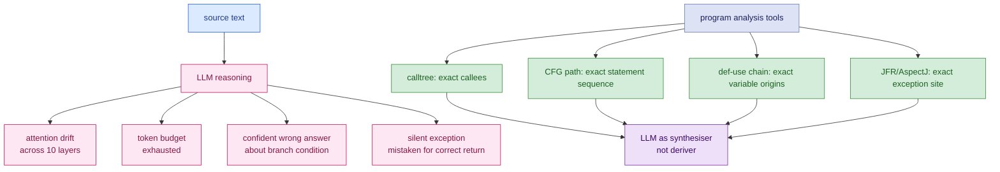

---

## The Ralph Loop as a Context-Engineering Harness

The Ralph loop is a context-engineering harness. Each step in the loop **replaces a reasoning burden on the model with a tool call that produces a structured artifact.**

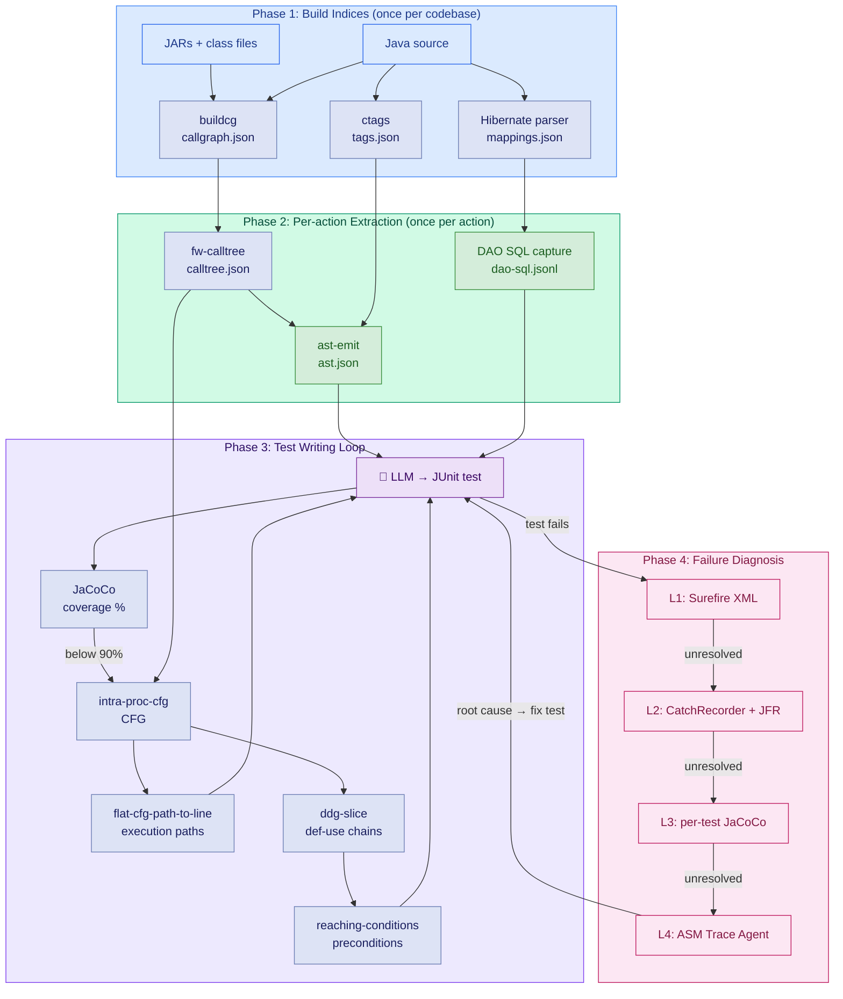

| What the model would otherwise do | What the harness provides instead | Tool |
|---|---|---|
| Guess which methods are untested | Coverage JSON, queried with `jq` | JaCoCo |
| Decide what the entry point calls | Call graph scoped to application classes | `buildcg` + `fw-calltree` |
| Read source files to understand called methods | Batch-extracted method bodies, one JSON file | `ast-emit` + `ctags` |
| Reason about which conditions reach a target line | DFS path enumeration, flat statement sequence | `intra-proc-cfg` + `flat-cfg-path-to-line` |
| Figure out what test data forces a specific path | Def-use chains for the relevant variables | `ddg-slice` |
| Infer which preconditions are necessary to reach a target | Polarity-annotated branch predicates on the path to the target | `reaching-conditions` |
| Guess what SQL will execute | Captured JDBC statements against H2 | `CapturingConnection` |
| Diagnose why a test returns an unexpected value | L1 Surefire → L2 CatchRecorder/JFR → L3 per-test JaCoCo → L4 ASM trace | diagnostic protocol |

At every stage, the model's role shifts from *derivation* to *application*. It is given facts and asked to generate oe debug code that encodes those facts as test setup. **The quality of information in LLM context reinforces model capability**: a model operating on pre-computed program analysis artifacts is a different instrument from one operating on source text and being asked to perform the analysis internally.

---

## Why not just use an LSP server?

A language server (JDTLS, IntelliJ's LSP, or similar) is the obvious first answer to "how does an LLM navigate a codebase?" It provides call hierarchies, type information, go-to-definition, and reference search. For editing and navigation it excels. For structured test generation it stops well short.

**What a language server provides:** `callHierarchy/incomingCalls` resolves callers by declared static type; `textDocument/implementation` finds concrete implementations of an interface method; `resolveStackTraceLocation` maps stack frames to source lines; hover types and go-to-definition: accurate, real-time, incremental.

**Where it gets harder.**

- **Call graph:** LSP call hierarchy is implemented via syntactic reference search with local type inference, not whole-program analysis. Concrete coverage of polymorphic dispatch varies by language server: jdtls uses reference-based search with type-aware filtering, which handles more cases than pure static-type resolution but less than CHA or RTA; clangd's virtual function resolution is partial; pyright's is best-effort given Python's dynamic dispatch. CHA, RTA, and points-to analyses (Andersen, Steensgaard, k-CFA) operate over information the protocol does not expose, such as the full set of instantiated types or a flow-sensitive abstract heap. You can partially recover virtual targets by combining `callHierarchy/incomingCalls` with `textDocument/implementation` for each virtual call site, but the result remains incomplete and is subject to the server's eventually-consistent index.
- **CFG and paths:** CFG is not part of the LSP spec; JDTLS exposes none, so branch enumeration, path extraction, and reaching conditions are unavailable through the protocol.
- **Dataflow:** no def-use chains, no backward slice, no heap edges anywhere in the spec.
- **Latency model:** even for what the protocol does provide, the interactive request-response model is a poor fit for batch graph work. A forward calltree to depth 4 with a branching factor of 4 requires on the order of 340 sequential requests, each depending on the last. An application call graph is a batch computation; issuing it one hop at a time is impractical at scale.

| Question | Language server | Bytecode tools |
|---|---|---|
| Which methods are reachable from this entry? | partial: reference-based with local type inference; polymorphic coverage varies by server and is structurally bounded by what the protocol exposes | `buildcg` + `fw-calltree`: exact, from bytecode |
| What are the execution paths through this method? | none | `intra-proc-cfg` + `flat-cfg-path-to-line` |
| What conditions guard each path? | none | `reaching-conditions` |
| What does this variable depend on? | none | `ddg-slice` |
| Trace test failure to root cause | partial: stack frame location only | `ddg-slice` + diagnostic protocol |

The dividing line: a language server answers *"what is this thing and where is it?"* Bytecode tools answer *"why does the program behave this way and what must be true to reach this line?"* The first is navigation. The second is analysis. Both matter, but only analysis can drive test generation.

---

## Technique 1: Coverage Statistics as a Deterministic Compass

The first intervention is the cheapest: **replace open-ended exploration with coverage-guided targeting**.

Instead of asking the model "what should we test next?", compute the answer outside the model and give it as input. **The outer Ralph loop does exactly this.**

1. Run JaCoCo over the full test suite.
2. Run a script that builds a JSON dashboard: for each action method in the flow, the calltree size and the current coverage percentage.
3. Select the action with the most uncovered instructions that does not yet have an E2E test.
4. Hand the action class and method name to the inner loop.

The model never has to decide what to work on. That decision is made by a deterministic function of the coverage data. Its job is only to decide *how* to cover the chosen target.

**Within the inner loop, the same principle applies at finer granularity.** After each iteration, the loop re-runs the coverage measurement and queries for the remaining uncovered methods: both completely uncovered non-trivial methods (the primary targets) and partially covered methods with more paths to exercise.

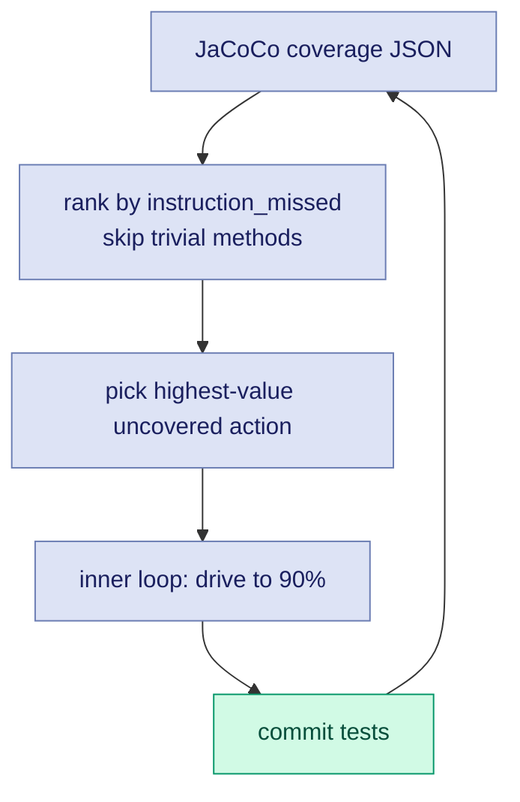

I applied two other heuristics:
- **Skip methods with fewer than 50 missed bytecode instructions**; they are almost certainly getters, delegates, or wrappers, and the cost of writing and maintaining tests for them exceeds the coverage value.
- **If two consecutive iterations produce no coverage gain, do not let the model give up; investigate.** The stall is usually due to a missed branch in an already-touched method, not a genuinely unreachable code path.

---

## Technique 2: CFGs and Slicing

Coverage tells the model *what* to cover. CFG analysis tells it *how*.

**Intraprocedural CFGs.** For a single method, a control flow graph encodes every possible execution order: which statements can follow which, which branches exist, and which paths are feasible from entry. Instead of asking the model to read a 200-line method and reason about which conditions must hold to reach line 147, you can extract the CFG programmatically and compute the path.

For a given target line, the inner loop uses `intra-proc-cfg` to extract the method's CFG, then `flat-cfg-path-to-line` to compute the flat statement sequence from method entry to that line.

**The output is a sequence of statements (with line numbers) that must execute, in order, to reach the target.** Each conditional statement in the sequence implies a constraint: a mock must return a particular value, or a field must be set to a particular state. The model reads this sequence and has a much more direct path to writing a test which exercises that path.

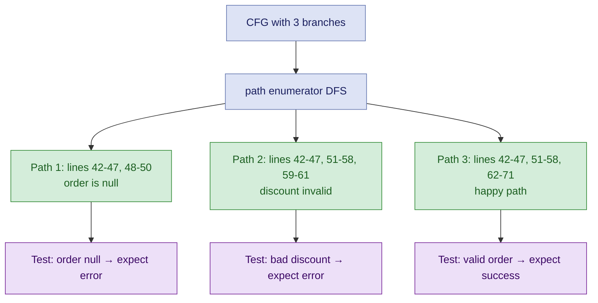

The key point is simple: **the LLM does not need to derive the path. It needs to follow a pre-computed path.** This turns an open-ended reasoning problem into constrained instruction-following. The expectations of the LLM having to reason about code are thus vastly reduced.

The diagrams below show the two steps towards getting this trace:
- The first one isolates the target subgraph as a bounded region (`xtrace`).
- Within that bounded region, highlight the specific path through it as a single traversal (`ftrace-slice`).

{: style="width:50%"}
{: style="width:50%"}

**Interprocedural slices via calltrees.** A single method's CFG covers intra-method control flow. For multi-layer reasoning (for example: what mock return value at the service layer causes the action layer to take this branch?) you need an interprocedural view.

A calltree is a forward slice of the call graph rooted at a specific entry point. The diagram below shows a fictional example: `ProcessOrderAction.execute` is the entry; the tree fans out through the service and DAO layers, pruned to application classes only.

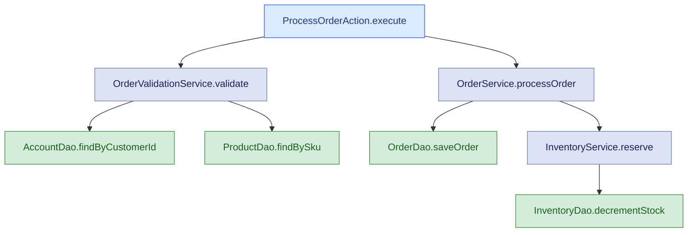

**The inner loop generates one calltree per action method.** The `--pattern` flag prunes the callgraph to methods whose class names match the pattern. This eliminates JDK internals, third-party library internals, and framework machinery, which are typically not mockable and not relevant to test construction. What remains is the application's own call structure, which is exactly what the model needs.

The two tools behind this are `buildcg`, which generates `callgraph.json` from the compiled JAR in a single pass (no source required, no running process), and `fw-calltree`, which queries the pre-built graph per action, per session. The split matters: `buildcg` is expensive and runs once, offline (for 2MLoC, takes about 10-15 mins, without parallelism); `fw-calltree` is cheap and runs on demand.

Both tools are built on [SootUp](https://soot-oss.github.io/SootUp/) and [Qilin](https://github.com/QilinPTA/Qilin). SootUp parses the compiled JAR and produces the Jimple IR used for CFG extraction (`intra-proc-cfg`), def-use chain computation (`ddg-slice`), and reaching conditions. Qilin can be added, to contribute points-to analysis, narrowing each virtual call site to the reachable targets instead of every method compatible with the declared type (for this exercise, it was not). The result is still a conservative over-approximation, but with far fewer spurious edges than naive class hierarchy analysis.

**A note on polymorphic dispatch artifacts:** Static callgraphs resolve virtual method calls to *all* possible callees across the codebase, not just the ones that will be dispatched at runtime. A `catch (Exception e) { e.getMessage() }` will appear in the callgraph as edges to `getMessage()` on every Exception subclass ever loaded. These entries are spurious. The inner loop excludes them from coverage accounting via `--exclude-pattern '\.exception\.'` and logs them to a glitches file for later review. Allowing them to inflate the coverage denominator would make the coverage numbers meaningless.

**Backward tracing and source-to-sink analysis:** The flat path computation above is a backward trace: given a target line, find the constraints that must hold at each predecessor node on the path from entry to target. Generalised, this is the backward slice. Source-to-sink analysis is the forward counterpart: given a source, find the sinks it can reach. Both are mechanically extractable and useful when the question is "how do I get this value to reach this code?"

---

## Technique 3: Source Extraction with ctags and ast-emit

The calltree gives you a list of method signatures. The model needs the source bodies. Two tools close this gap, and the reason to name them explicitly is that the naive approach (asking the model to find and read relevant files) does not scale.

`ctags` builds a flat symbol index over the entire Java source tree once, upfront. No daemon, no language server, no compiler. The result is a tag file that maps every class, method, field, and constructor to its defining file and line number. Given a 47-node calltree, every method body can be located with a single index lookup per node, with no directory crawling, no grep, and no false positives from overloaded names in comments.

`ast-emit` uses that index to collect all 47 method bodies in one pass, writing them to `ast.json`. A domain extractor searching for `new Entity()` instantiations and Claude reading source for intent summaries both consume this artifact directly. Neither has to search the codebase. The model receives the relevant source as structured input, not as a pile of files to navigate.

A language server is slower to reach a usable state, requires a persistent process, and can fail under memory pressure. For a batch lookup of known symbol locations, ctags is simpler and more reliable. The indexing step takes a couple of minutes on a large codebase and runs once.

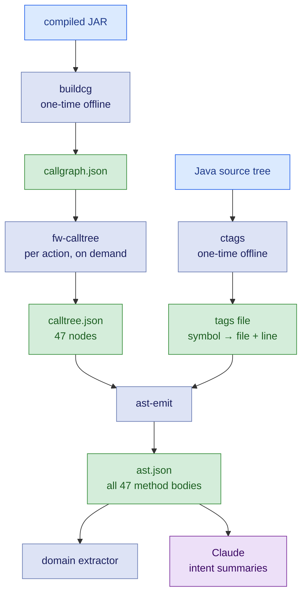

There is also `ast-grep` for the complementary case: finding code by structure rather than by symbol name. When you need all method calls where the first argument is a string literal, or all `new Entity()` instantiations regardless of which entity, `ast-grep` matches by code shape with an AST-aware pattern language. No language server required; it runs against raw source files.

---

## Technique 4: Dataflow Analysis

CFG path analysis tells you which statements execute. Dataflow analysis tells you what values those statements operate on and where those values originate.

**Intraprocedural dataflow.** Reaching definitions tell you, at each use of a variable, which assignment to that variable can reach it. Use-def chains are the concrete representation: for variable `X` used at line 120, the use-def chain might show that `X` was last assigned at line 80 (`X = service.fetchAccount(customerId)`) and at line 30 (`X = null`). The model now knows that to have a non-null `X` at line 120, the mock for `service.fetchAccount` must return a non-null account.

Without this, the model reads the code, notes that `X` is used at line 120, and guesses at the assignment history. For short methods with obvious flow, it usually guesses correctly. For methods with 200 lines, multiple reassignments, and conditionally-executed assignments, it frequently does not.

**Interprocedural dataflow.** The harder version: a parameter passed into a top-level method propagates through several layers before it affects the condition the test needs to trigger. Interprocedural dataflow analysis tracks this propagation. The question "what input to the action layer causes the validation service to take the error path?" is fundamentally a dataflow question: it requires tracing the relevant field of the input object through the call chain to the validation check.

In practice, full interprocedural dataflow analysis on a million-line codebase is expensive. A pragmatic approximation works well: use the calltree to identify the relevant parameter at each layer, then use intraprocedural dataflow within each method to determine what transformation it applies. Even partial use-def summaries can drastically reduce the depth of reasoning required from the model.

In the Ralph loop, intraprocedural dataflow is computed by `ddg-slice`: given the CFG and a variable of interest, it computes where the variable is defined (DEF sites) and where it is read or tested (USE sites). Given the target execution path, the chain from entry to target determines what test data must be set up. The USE site at a null check tells you the variable must be non-null; the USE site at a field read tells you the field must have a specific value; the USE site at a facade call tells you the object must be in a state the facade will accept. The model reads the def-use chain and translates it directly into mock setup and object construction.

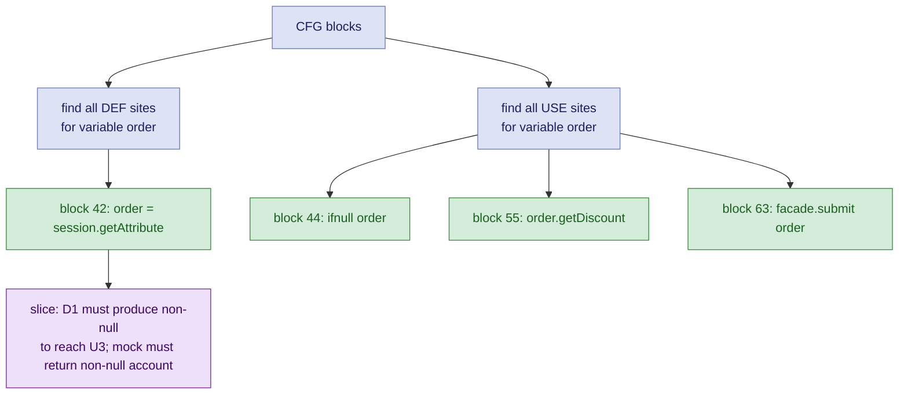

---

## Technique 5: Reaching Conditions

`reaching-conditions` handles the precondition side explicitly. For each DFS path from method entry to a target sink line, it extracts every explicit branch condition (`JIfStmt` instructions along the path) and every implicit null assumption (field reads and virtual calls that will NPE if null). Each condition comes with its polarity (whether it was true or false on that path). The output is a structured list of preconditions that the model can translate directly into the arrange section of a JUnit test. The model is not reasoning about the CFG; it is transcribing a machine-computed answer to "what must be true to reach this line."

The diagram below shows a concrete example: the red-highlighted spine traces the path to the sink, with each branch predicate annotated at the decision point: `obj1 != null`, `x >= 0`, `obj2 != null`, `y <= 3`. The green nodes are the conditions that must be satisfied; everything else in the CFG is irrelevant to reaching the sink.

{: style="width:50%"}

---

## Applying Techniques: DAO SQL Capture

### Finding the DAO Boundaries

Before capturing SQL, you need to know which DAOs in the calltree are genuine database boundaries. This sounds obvious (look for classes with "Dao" in the name) but in a large legacy codebase it is not. The forward calltree from an action method will contain dozens of nodes, and the DAO layer is not uniformly structured.

In this codebase, all genuine DAOs implement a common marker interface. That makes the initial candidate set computable: walk the calltree and filter to nodes whose class implements the interface. This is a codebase-specific condition; the pattern will differ elsewhere (a common base class, a naming convention, an annotation), but the principle is the same: a structural property computed from the call graph identifies the candidates.

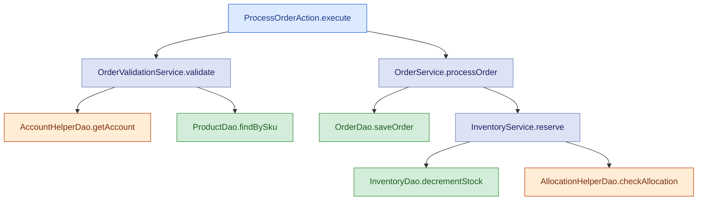

Green nodes are confirmed DB boundaries. Orange nodes implement the DAO interface but need further investigation.

### Eliminating False Positives

The DAO interface is implemented by both genuine DB-accessing classes and helper classes that happen to be wired polymorphically but do not touch the database. `AccountHelperDao` may delegate to a cache or an aggregation service; `AllocationHelperDao` may read from an in-memory map populated at startup. Treating them as DB boundaries and expecting SQL capture from them produces false positives in the coverage accounting: the harness runs them, captures nothing, and the gap looks like a CapturingConnection failure rather than a correct result.

The filter is a second-pass calltree. For each candidate, run a deep forward calltree from that class's methods and scan the resulting node set for Hibernate and JDBC entry points: package prefixes (`org.hibernate`, `java.sql`) and known Hibernate method names (`Session.createQuery`, `Query.list`, `Query.setParameter`, `PreparedStatement.executeQuery`, and so on). A class whose deep calltree reaches none of these is not a database boundary.

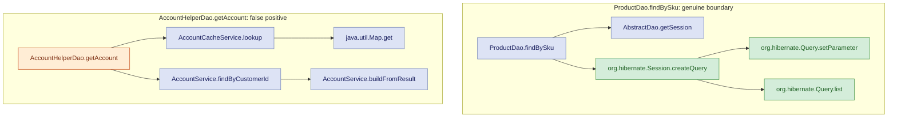

`ProductDao.findBySku` reaches `org.hibernate.Session` and `org.hibernate.Query` directly: confirmed boundary. `AccountHelperDao.getAccount` descends into cache and service layers and reaches only `java.util.Map.get`: no JDBC, no Hibernate, eliminated.

The output of this two-pass process is a confirmed set of genuine database boundaries worth exercising with the SQL capture harness.

### Capturing the SQL

Static analysis tells you that `OrderDao.saveOrder` will be called. It does not tell you what SQL will execute. For a Hibernate-backed J2EE codebase, that gap is real: Hibernate generates SQL dynamically from HQL plus an Oracle dialect at runtime. You cannot predict the exact statement from reading HQL, and you cannot run Oracle in CI.

`CapturingConnection` is a JDBC `Connection` proxy wired into the Hibernate session factory in place of the real Oracle connection. Every call to `prepareStatement` or `prepareCall` is intercepted, logged to a JSONL file, and forwarded to H2. The result is a ground-truth record of the exact SQL the application intends to execute (including Oracle-specific syntax, bind parameters, and stored procedure calls) without modifying a single line of production code. It captures both standard `PreparedStatement` execution and JDBC-batched statements, which Hibernate uses for bulk writes.

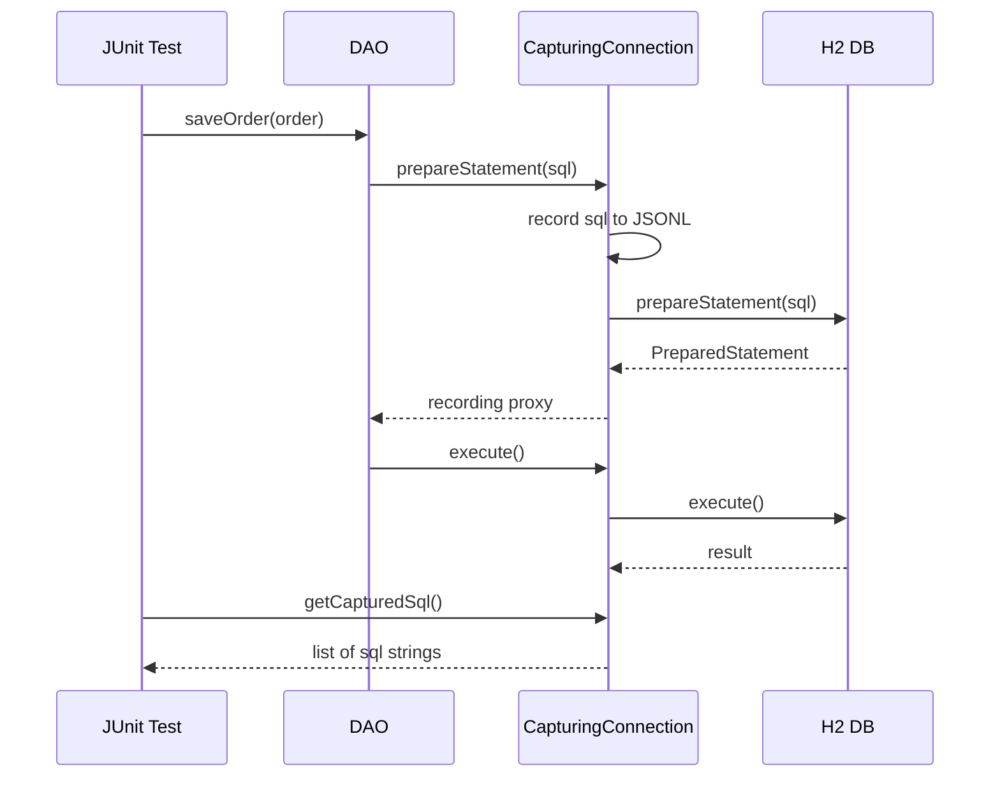

Running the DAO exercise harness against a target action flow produces a ground-truth record of every SQL statement that will execute. When the model writes a test for a DAO method, it can assert on that record directly. This is not something static analysis can supply.

### Verifying Test Efficacy

How do we make sure that every SQL-emitting DAO is exercised correctly (i.e., actually emitting SQLs through their tests)? There is also a verification step for that.

- Assemble the list of all the relevant DAOs in the flow under test.
- Run all the DAO exercise harnesses and log the emitted SQLs, keyed by DAO class/method. It doesn't matter if unrelated DAOs run or not.
- Filter the SQLs which are emitted only for the relevant DAOs.
- Make sure that those SQLs are not empty (or, if there are multiple tests for the same DAO class/method, there should be at least one non-empty SQL for that group).

---

## Technique 7: Dynamic Tracing

All of the above techniques are static. They tell you what *should* happen based on the structure of the code. Legacy codebases have a habit of confounding static analysis.

Runtime polymorphism, configuration loaded from a database at startup, feature flags in a properties file that nobody has updated since 2009, JNDI lookups that silently fail and return null: these are not visible in the CFG. The only way to know what actually executed is to observe it executing.

When a test fails unexpectedly, the inner Ralph loop follows a four-level escalation protocol. Each level is more invasive than the last; you only escalate when the previous level cannot identify the root cause.

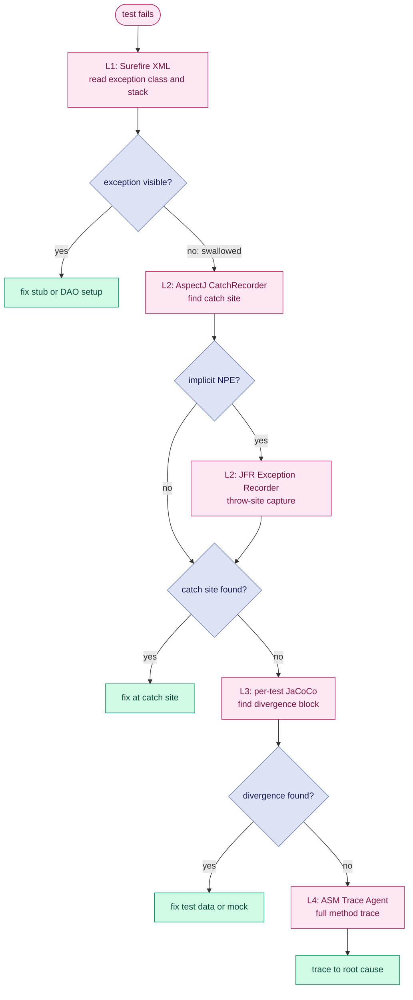

**Level 1: Surefire XML.** Zero overhead. The test report gives the exception class, message, and stack trace. This resolves most failures: wrong stub return type, missing mock setup, assertion on the wrong field. If the exception class is visible and the stack trace points somewhere useful, fix it here and never proceed to Level 2.

**Level 2: AspectJ CatchRecorder and JFR Exception Recorder.** Two complementary tools for the class of failures where an exception is thrown somewhere inside application code and swallowed before it surfaces.

The AspectJ CatchRecorder weaves `after-throwing` advice onto every catch block in the application code. When an exception is caught, it logs the exception type, message, and catch site (class, method, line), without modifying a single source file. This is the difference between "the method returned null, I don't know why" and "the method returned null because a `NullPointerException` was caught at line 87 of `AccountServiceImpl.updateAccount()` before the expected service call was reached." The first leaves the model guessing. The second gives it a precise starting point.

The CatchRecorder has a blind spot: it only sees exceptions that land in user-code catch blocks. JVM-thrown implicit NPEs, `ArrayIndexOutOfBoundsException`, and exceptions caught inside Hibernate or Struts internals are invisible to it. The JFR Exception Recorder fills this gap. It captures every `jdk.JavaExceptionThrow` event at the throw site (before any catch block runs) with a full stack trace, filtered to application class prefixes. Implicit NPEs that were previously invisible become structured entries in `jfr-throws.json`. The combination means that **no exception, thrown or swallowed anywhere in the execution, can escape unrecorded.**

**Level 3: Per-test JaCoCo.** Enable coverage for the failing test in isolation and compare the executed blocks against the CFG path the test was designed to exercise. The first block that appears in the CFG path but not in the coverage report is the divergence point: the test did not reach it. The branch just before that block determines why. This resolves failures where the test data or mock return values drove execution down the wrong branch.

**Level 4: ASM Trace Agent.** The heaviest tool. A bytecode instrumentation agent rewrites class bytecode as it is loaded to insert `ENTRY` and `EXIT` probes at every method boundary. The resulting trace is a complete execution record: which methods ran, in what order, and which did not. Enabling it is a one-line Maven Surefire change:

```xml
<argLine>@{argLine}
  -javaagent:${user.home}/tools/logging-agent.jar=prefix=com/example/app/web/ActionClass,com/example/app/service/ValidationServiceImpl
  -Dlogging.agent.trace=true
  -Dlogging.agent.branch=true</argLine>
```

The `prefix=` parameter confines instrumentation to the classes of interest. The resulting trace looks like:

```
[Enter] ActionClass::processRequest
[Enter] BusinessLogicService::processRequest
[Branch] BusinessLogicService::processRequest:LINE IFEQ val=0 → TAKEN
[Enter] ValidationServiceImpl::validateAttributes
[Exit]  ValidationServiceImpl::validateAttributes
```

**Absent entries are as informative as present ones.** If `validateAttributes` does not appear, the code never reached it, not as a hypothesis, but as a fact. Sometimes stubs, mocks, and test data all look correct but the test still exercises the wrong branch. Without the trace you are guessing which path was taken. The agent proves it.

The governing principle across all four levels is: **prefer observation over inference**. When a test fails unexpectedly, use instrumentation to get the runtime record instead of reasoning from source.

---

## Why Tools, Not Just an LLM

| | Without tools | With tools |
|---|---|---|
| Call graph | Re-derived hop by hop, incomplete | `buildcg` + `fw-calltree`: exact, from bytecode |
| CFG paths | Guessed, misses branches | `intra-proc-cfg` + `flat-cfg-path-to-line`: exhaustive DFS |
| Preconditions | Manual AST tracing | `reaching-conditions`: explicit predicates with polarity |
| Source bodies | File hunting across 100k lines | `ast-emit`: batch-extracted, one JSON |
| SQL | Inferred from HQL, wrong | `CapturingConnection`: captured at runtime |

Without pre-computed artifacts, each reasoning step consumes tokens and compounds errors. Token cost grows with uncertainty.

---

## Four Diagnostic Incidents

These are from the actual Ralph Loop campaign, not constructed illustrations.

**CFG-guided closure of five uncovered lines in `processOrder`.** After the order processing service's entry method reached 90% instruction coverage, JaCoCo identified five specific lines still uncovered (286, 295, 309, 324, 331). Rather than reading the method source and reasoning about what conditions reach each line, `flat-cfg-path-to-line.sh` was run against the precomputed CFG for each target. Every target had exactly two distinct execution paths from method entry. The flat trace JSONs, which were ordered lists of statements with branch conditions, were handed directly to the model, which read off the mock return values and input field assignments needed for each path and generated the corresponding tests. The five targets were closed in one pass. The key point is that the model was not asked to reason about control flow: it was asked to transcribe a machine-computed answer into test setup code, which it does reliably.

**Fifty-two DAOs with no SQL.** The SQL coverage tool reported fifty-two DAO methods all returning `sqls=[]` from the capture harness. The first instinct would have been to read the source files individually. Instead, `fw-calltree` was run against `callgraph-all.json` for a sample of the failing methods. Every traversal converged on the same node: `org.hibernate.impl.SessionImpl.connection()`. The codebase used the deprecated `session.connection()` call to drop below Hibernate into raw JDBC for stored procedure execution, a pattern the SQL-detection regex did not recognise as SQL-emitting. One line added to the detection pattern resolved all fifty-two misses at once. Reading fifty-two source files would have found the same answer eventually, but only after substantial token expenditure and with meaningful probability of the model identifying the pattern incorrectly.

**Three tests that passed but measured nothing.** The SQL coverage tool reported three lookup-value DAO methods as EMPTY: tests existed, tests ran, but `sqls=[]` in every record. The model's initial reading of the test code found them structurally correct: correct class, correct method call, correct SQL capture recording invocation. The EMPTY classification from the tool was the signal that something was suppressing SQL emission. Re-reading the tests with that question in focus revealed it: `byCondition_basic` was passing an empty `StringBuilder`, causing `SQLGrammarException` before the query engine could run; `setParameterByMap_basic` was passing a `null` Query object, causing an immediate NPE. Both exceptions were caught and silently ignored by the test's `catch (Exception ignored)`. The fix was to call complete DAO methods that exercise the helpers internally, rather than calling the helpers directly with invalid inputs. Without the EMPTY signal from the coverage tool, the tests would have been counted as passing coverage.

**A 149-node calltree with no SQL.** `fw-calltree` on a payment method DAO's `insert` returned 149 nodes, which looks like a well-connected method. Inspecting the structure showed only two DAO methods in those 149 nodes; the remaining 147 were domain object getters and setters. The actual SQL-emitting path was behind a Spring DI `invokeinterface` on a field typed as a profile change DAO interface. Static analysis cannot resolve `invokeinterface` on injected fields without whole-program points-to analysis, and the callgraph edge did not exist. The calltree output surfaced this in one query: no `SessionImpl`, no `createQuery`, no SQL nodes anywhere in 149 nodes. The test infrastructure could then be adjusted accordingly. Tracing this through source files would have required following the injection wiring manually, and the model would likely not have identified the absent callgraph edge as the root cause.

---

## Where LLMs fit in

The clearest way to state the division of labour is this: the static and dynamic tools answer structural questions with precision and no hallucination. Claude reads those answers and produces the synthesis a developer needs: intent, narrative, data contracts, and test stubs. Neither half is useful alone.

| Question | Who answers it | Why |
|---|---|---|
| What code is reachable? | `buildcg` + `fw-calltree` | Deterministic over bytecode; no hallucination possible |
| What are the execution paths? | `intra-proc-cfg` + `flat-cfg-path-to-line` | Exhaustive DFS enumeration; not guesswork |
| What conditions guard each path? | `reaching-conditions` | Extracted from branch opcodes; exact polarity |
| What does each variable depend on? | `ddg-slice` | Def-use computation; no inference |
| What SQL does this path execute? | `CapturingConnection` | Actual runtime capture; not HQL interpretation |
| What does this code intend to do? | Claude | Natural language reasoning over source; no compiler can do this |
| What is the test's business scenario? | Claude | Mapping structural facts to domain narrative |
| What stubs and assertions follow? | Claude | Code generation from structured evidence |

The boundary between the two columns is the boundary between what a compiler can know and what requires language. Static tools produce verifiable facts. Claude produces synthesis. **The flaw in most naive LLM-for-legacy-code approaches is to ask LLM to do both.**

---

## Caveats

The toolchain described here substantially reduces what the LLM needs to derive on its own. It does not eliminate the need for human judgment, and the loop is not completely fire-and-forget (yet).

- **The model still drifts.** Even with pre-computed artifacts available, models revert to familiar patterns: grepping source files instead of querying the coverage JSON, reading a method body manually instead of using `ast-emit`, reasoning about paths instead of invoking `intra-proc-cfg`. The Ralph loop prompt needed iterative refinement to establish tool-use discipline: which tools to call first, in what order, and when to stop exploring and start generating.

- **The loop itself needed maintenance.** New failure modes prompted updates to the outer loop prompt and diagnostic protocol. Framework patterns produced callgraph artifacts that the `--exclude-pattern` heuristic missed. The loop converged on its current form through iteration, not design upfront.

- **Other techniques can be brought to bear.** The seven techniques described here are the ones that proved most useful in practice. Others are available depending on the failure mode.
  - **Dominator analysis** computes which nodes every path to a target must pass through: the mandatory checkpoints that any test for a given target must exercise, regardless of which branch is taken. This is useful for identifying which mock setups are non-negotiable. Escape analysis can determine which objects cross method boundaries and therefore which fields cannot be independently mocked.
  - **Alias analysis** (which reads of a variable refer to the same heap location) is already present in `ddg-slice`: the current implementation uses a conservative may-alias approximation (every pair of references is assumed to potentially alias), which is sound but imprecise; full Qilin-backed alias resolution is available when greater precision is needed. These were not needed at full precision in this campaign, but the infrastructure (SootUp's analysis passes) is the same; the level of precision can be dialled up without replacing anything already there.
- **Human judgment is still in the loop.** The model generates tests from structured artifacts, but someone still has to decide which action flows are worth targeting, what coverage threshold is meaningful, and whether a passing test is testing the right thing.

---

## References

- [Tests increase our Knowledge of the System: A Proof from Probability]()
- [java-bytecode-tools](https://github.com/avishek-sen-gupta/java-bytecode-tools): bytecode agent, calltree analysis, CFG path extraction, ddg-slice, reaching-conditions
- [SootUp](https://soot-oss.github.io/SootUp/): modern Java bytecode analysis framework; provides the Jimple IR used for CFG extraction, def-use analysis, and call graph construction
- [Qilin](https://github.com/QilinPTA/Qilin): context-sensitive points-to analysis for Java; resolves virtual dispatch in call graph construction
- [JaCoCo: Java Code Coverage Library](https://www.jacoco.org/jacoco/)
- [AspectJ Load-Time Weaving](https://eclipse.dev/aspectj/)
- [Universal Ctags](https://ctags.io/): symbol indexing for source lookup
- [ast-grep](https://ast-grep.github.io/): structural code search with AST-aware patterns
- [Java Flight Recorder (JFR)](https://docs.oracle.com/javacomponents/jmc-5-4/jfr-runtime-guide/about.htm#JFRUH170): `jdk.JavaExceptionThrow` event for throw-site capture
