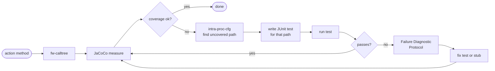
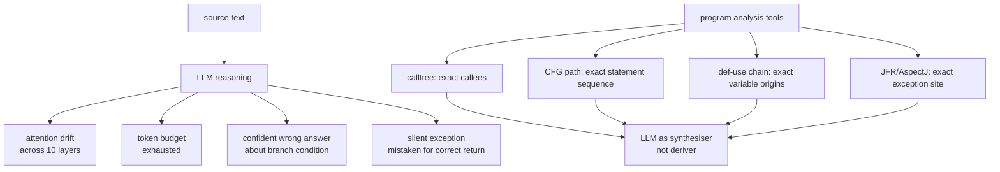
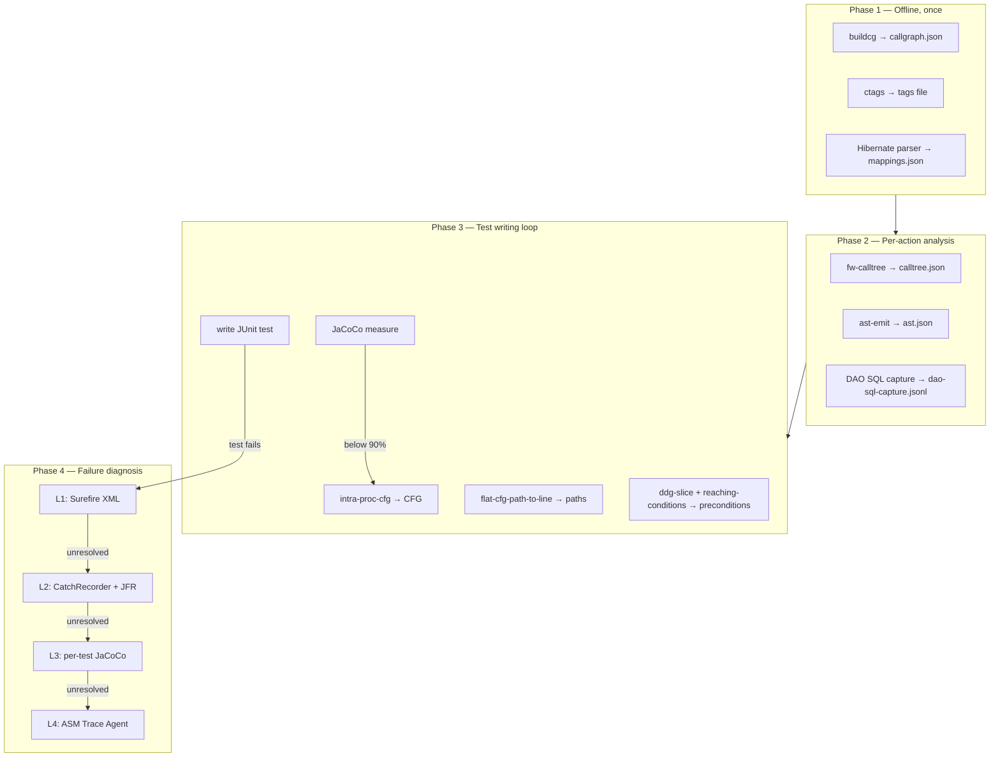
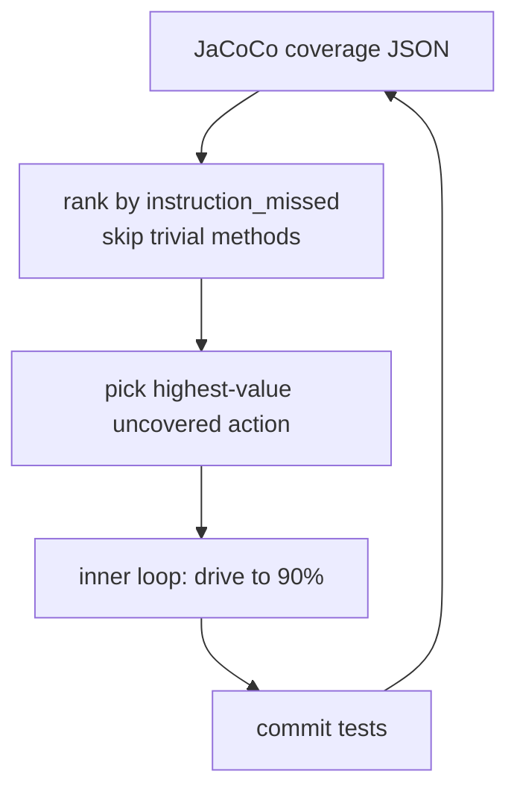
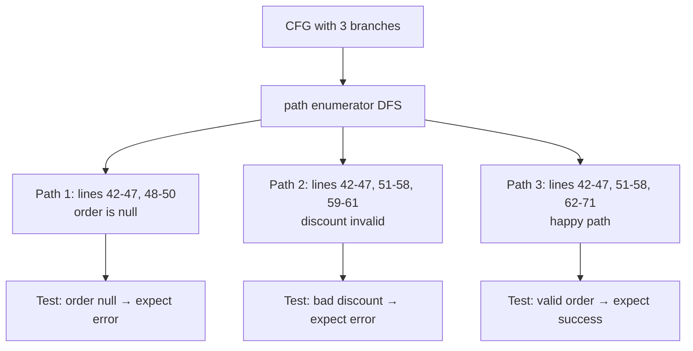
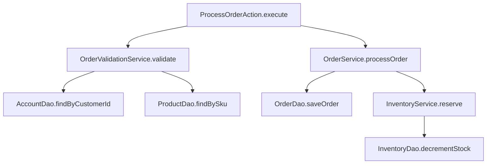
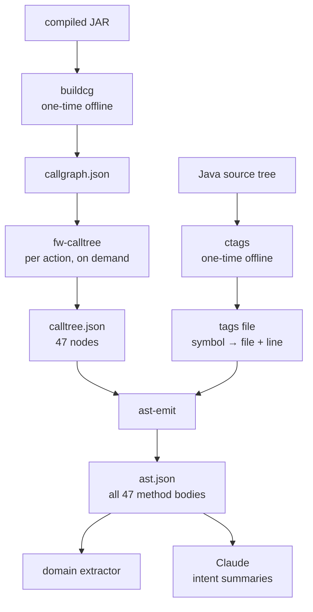
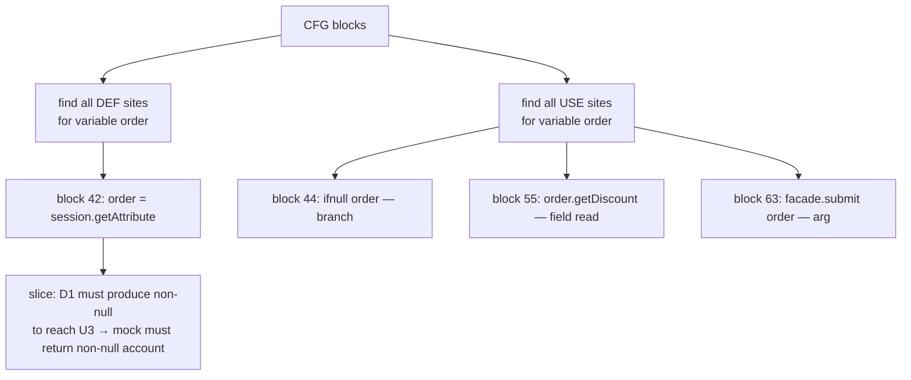
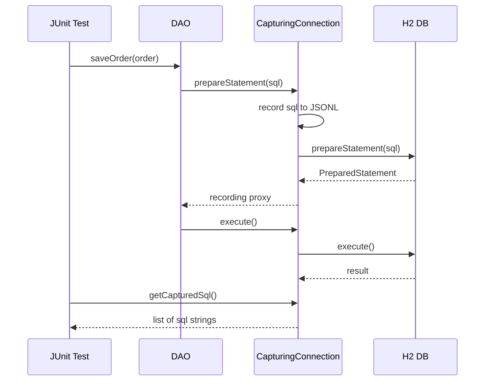
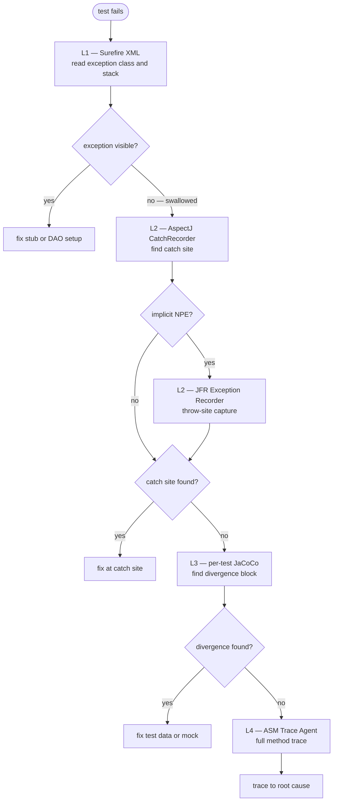

There is an optimistic and a pessimistic reading of what GenAI does to the problem of large legacy codebases.

The optimistic reading: the model can read Java faster than you can, it knows the framework idioms, and it can generate a plausible test stub in seconds. True.

The pessimistic reading: the model will trace a ten-layer call chain, confidently conclude that some domain flag has a specific value at the point your test reaches the validation service, and be completely wrong. There was a null check at layer three that short-circuits, a swallowed `catch` at layer five that logs silently, and a database-driven flag at layer eight that flips the branch. **The test will compile, run, pass, and test nothing.**

The pessimistic reading is also true.

This post is about the gap between those two readings. It is about what *actually* goes wrong when you try to use an LLM to reason about a ~1M-line J2EE codebase, and about a set of techniques drawn from classical program analysis that can close that gap by giving the model structured, pre-computed facts instead of asking it to derive those facts from source text.

The running example is the **Ralph Loop**: an AI-orchestrated test coverage campaign over a large legacy J2EE codebase. The outer loop iterates over action methods in a request-processing flow, measuring cumulative JaCoCo coverage and picking the next highest-value target. The inner loop takes one action method, generates its interprocedural calltree, drives coverage from some initial percentage toward 90%, and commits the tests. The model is the engine; the program analysis tools are the guardrails.



_This post has not been written or edited by AI._

---

## Tests as Navigation Infrastructure

In an [older post from 2011](/2023-01-10-tests-proof-probability.html), I gave a probabilistic argument that writing a test increases the posterior probability that a piece of code is correct by a factor of 2^n (where n is the output bit width). The argument is rough, but the intuition holds: every test that passes constrains the space of possible implementations, reducing entropy. Tests are evidence.

That argument was made in the context of human developers. In the GenAI context, the same point applies but acquires new dimensions.

**Tests as a quantitative map.** A coverage report (JaCoCo's `instruction_pct`, for example) tells the model precisely which code has been exercised and which has not. This is not something the model needs to infer from reading source. It is a computed, authoritative fact about execution history. In the inner Ralph loop, the model's first act in each iteration is not to read source code; it is to query a coverage JSON emitted by a small script that wraps JaCoCo's XML report into a node-per-method structure. The output is a ranked list of uncovered methods, sorted by the number of missed bytecode instructions. The model reads this list, not the source of those methods. It knows *what* to target before it reads a single line of production code.

**Tests as machine-readable intent.** A test method named `processOrder_whenAccountIsResidential_andRemarkIsMissing_shouldReturnValidationError` communicates several things that the model can exploit: the class under test, the business condition being checked, the expected outcome, and by implication, the fields and mock stubs needed to trigger it. That information is available as text even to a model with no execution capability.

**Failing tests as precise diagnostic reports.** A test failure is not "something is broken somewhere." It is a specific assertion, a stack trace, a set of actual vs expected values, and, if you instrument correctly, a log of every service call that was or was not made. This is far more information-dense than a bug report.

The shift is this: in the pre-AI era, tests were primarily for human confidence. In the AI era, they are also infrastructure for machine navigation. **A codebase with good test coverage is a codebase with a navigable map.**

---

## The Problem: What Goes Wrong

Before we discuss techniques, it is worth being precise about *what* goes wrong.

**Attention drift.** Ask a model to trace a call chain through ten method boundaries and it will drift. The types it attributed to a parameter at layer two will have been quietly replaced by a plausible but wrong type by layer seven. The argument that a particular service method accepts a domain object not a raw `String` will be forgotten. The mock will be stubbed for the wrong type signature. The test will compile because the model also writes an `@SuppressWarnings`, or because the actual type is `Object`, and the failure will be silent.

**Token burn.** A realistic J2EE action method has 30–50 transitive callees once you include validators, service managers, DAO helpers, and utility methods. Reading all of them is not feasible within a context window if you also want to do anything useful with what you have read. The model must either truncate or hallucinate.

**Path explosion and static over-confidence.** The model reads a condition:

```java
if (requestType == RequestType.TYPE_B) {
    // type-B-specific validation
}
```

It assumes this branch is taken because the surrounding code seems to be about type-B processing. It writes a test that sets `requestType = TYPE_B`. But three layers up, the action's `execute()` method has already set `requestType` to `TYPE_A` based on a request parameter that the model did not follow. The branch is never entered. The test passes because the validation path is skipped, not because validation passed.

**The silent exception.** Production J2EE code of a certain vintage is full of:

```java
catch (Exception e) {
    logger.error("Something went wrong: " + e.getMessage(), e);
}
```

The exception is swallowed. The method returns `null` or a default object. The test checks the return value, gets `null`, and the model's first instinct is to conclude that the method is supposed to return null in this case. It is not. The test is measuring a broken execution path and recording it as expected behaviour.

The problem with all of the above is that **the model has no ground truth about *what actually executed*.** It is reasoning from source text, which is a model of what the code might do, not a record of what it did.



---

## The Ralph Loop as a Context-Engineering Harness

Stepping back, the Ralph loop is not primarily a test generation tool. It is a context-engineering harness. Each step in the loop **replaces a reasoning burden on the model with a tool call that produces a structured artifact.**



| What the model would otherwise do | What the harness provides instead | Tool |
|---|---|---|
| Guess which methods are untested | Coverage JSON, queried with `jq` | JaCoCo |
| Decide what the entry point calls | Call graph scoped to application classes | `buildcg` + `fw-calltree` |
| Read source files to understand called methods | Batch-extracted method bodies, one JSON file | `ast-emit` + `ctags` |
| Reason about which conditions reach a target line | DFS path enumeration, flat statement sequence | `intra-proc-cfg` + `flat-cfg-path-to-line` |
| Figure out what test data forces a specific path | Def-use chains for the relevant variables | `ddg-slice` |
| Infer which preconditions are necessary to reach a target | Polarity-annotated branch predicates on the path to the target | `reaching-conditions` |
| Guess what SQL will execute | Captured JDBC statements against H2 | `CapturingConnection` |
| Diagnose why a test returns an unexpected value | L1 Surefire → L2 CatchRecorder/JFR → L3 per-test JaCoCo → L4 ASM trace | diagnostic protocol |

At every stage, the model's role shifts from *derivation* to *application*. It is given facts and asked to generate code that encodes those facts as test setup. That is a task it does well. Deriving the facts from scratch, under attention drift and token pressure, is a task it does poorly.

**The underlying issue is not the model's intelligence. It is information quality.** A model operating on structured, pre-computed program analysis artifacts is a different instrument from a model operating on source text and being asked to perform the analysis internally. Classical program analysis tools (CFG extractors, dataflow analyzers, bytecode agents) exist precisely because these computations are too important to leave to informal reasoning. That was true before LLMs. It is still true.

---

## Technique 1: Coverage Statistics as a Deterministic Compass

The first intervention is the cheapest: replace open-ended exploration with coverage-guided targeting.

Instead of asking the model "what should we test next?", compute the answer outside the model and give it as input. The outer Ralph loop does exactly this:

1. Run JaCoCo over the full test suite.
2. Run a script that builds a JSON dashboard: for each action method in the flow, the calltree size and the current coverage percentage.
3. Select the action with the most uncovered instructions that does not yet have an E2E test.
4. Hand the action class and method name to the inner loop.

The model never has to decide what to work on. That decision is made by a deterministic function of the coverage data. The model's agency is confined to *how* to cover the chosen target, where its capability is useful.

Within the inner loop, the same principle applies at finer granularity. After each iteration, the loop re-runs the coverage measurement and queries for the remaining uncovered methods — both completely uncovered non-trivial methods (the primary targets) and partially covered methods with more paths to exercise.



Two heuristics worth keeping: first, skip methods with fewer than 50 missed bytecode instructions; they are almost certainly getters, delegates, or wrappers, and the cost of writing and maintaining tests for them exceeds the coverage value. Second, if two consecutive iterations produce no coverage gain, do not let the model give up; investigate. The stall is usually due to a missed branch in an already-touched method, not a genuinely unreachable code path.

---

## Technique 2: CFGs and Slicing

Coverage tells the model *what* to cover. CFG analysis tells it *how*.

**Intraprocedural CFGs.** For a single method, a control flow graph encodes every possible execution order: which statements can follow which, which branches exist, and which paths are feasible from entry. Instead of asking the model to read a 200-line method and reason about which conditions must hold to reach line 147, you can extract the CFG programmatically and compute the path.

For a given target line, the inner loop uses `intra-proc-cfg` to extract the method's CFG, then `flat-cfg-path-to-line` to compute the flat statement sequence from method entry to that line.

The output is a sequence of statements (with line numbers) that must execute, in order, to reach the target. Each conditional statement in the sequence implies a constraint: a mock must return a particular value, or a field must be set to a particular state. The model reads this sequence and translates it directly into arrange-act-assert structure. **It is not reasoning about the code; it is executing a recipe.**



The key insight: **the LLM does not need to derive the path. It needs to follow a pre-computed path.** This converts an open-ended reasoning problem into constrained instruction-following, which models are considerably better at.

The diagrams below show two views of the same idea: the left isolates the target subgraph as a bounded region, the right highlights the specific path through it as a single traversal.

<div style="display:flex; gap:1rem; justify-content:center; margin:1.5rem 0;">
  <figure style="text-align:center; margin:0;">
    
    <figcaption style="font-size:0.85em; color:#666;">Target region bounded in the CFG</figcaption>
  </figure>
  <figure style="text-align:center; margin:0;">
    
    <figcaption style="font-size:0.85em; color:#666;">Single path selected through the region</figcaption>
  </figure>
</div>

**Interprocedural slices via calltrees.** A single method's CFG covers intra-method control flow. For multi-layer reasoning (for example: what mock return value at the service layer causes the action layer to take this branch?) you need an interprocedural view.

A calltree is a forward slice of the call graph rooted at a specific entry point. The diagram below shows a fictional example: `ProcessOrderAction.execute` is the entry; the tree fans out through the service and DAO layers, pruned to application classes only.



The inner loop generates one calltree per action method. The `--pattern` flag prunes the callgraph to methods whose class names match the pattern. This eliminates JDK internals, third-party library internals, and framework machinery, which are typically not mockable and not relevant to test construction. What remains is the application's own call structure, which is exactly what the model needs.

The two tools behind this are `buildcg`, which generates `callgraph.json` from the compiled JAR in a single pass (no source required, no running process), and `fw-calltree`, which queries the pre-built graph per action, per session. The split matters: `buildcg` is expensive and runs once, offline; `fw-calltree` is cheap and runs on demand.

Both tools are built on [SootUp](https://soot-oss.github.io/SootUp/) and [Qilin](https://github.com/QilinPTA/Qilin). SootUp is a rewrite of the Soot Java bytecode analysis framework. It parses the compiled JAR and produces a Jimple intermediate representation that is the shared substrate for CFG extraction (`intra-proc-cfg`), def-use chain computation (`ddg-slice`), and reaching conditions. Qilin contributes the points-to analysis: it computes, for each call site, which concrete methods the virtual dispatch can resolve to given the actual dataflow, rather than every method compatible with the declared type. This matters because class hierarchy analysis (CHA), the naive alternative, adds call graph edges from every virtual call site to every method that could conceivably be dispatched, producing call graphs that are far too dense to be useful as LLM context. Qilin's context-sensitive analysis narrows each call site to the reachable targets. The callgraph is still a conservative over-approximation (points-to analysis is sound, not exact), but the reduction in spurious edges is substantial.

**A note on polymorphic dispatch artifacts.** Static callgraphs resolve virtual method calls to *all* possible callees across the codebase, not just the ones that will be dispatched at runtime. A `catch (Exception e) { e.getMessage() }` will appear in the callgraph as edges to `getMessage()` on every Exception subclass ever loaded. These entries are spurious. The inner loop excludes them from coverage accounting via `--exclude-pattern '\.exception\.'` and logs them to a glitches file for later review. Allowing them to inflate the coverage denominator would make the coverage numbers meaningless.

**Backward tracing and source-to-sink analysis.** The flat path computation above is, in essence, a backward trace: given a target line, find the constraints that must hold at each predecessor node on the path from entry to target. Generalised, this is the backward slice — the set of program points that influence the value at the target. Source-to-sink analysis is the forward counterpart: given a source (an input, a tainted value), find all sinks (outputs, writes, service calls) that it can reach. Both are mechanically extractable and make excellent LLM context when the question is "how do I get this value to reach this code?"

---

## Technique 3: Source Extraction with ctags and ast-emit

The calltree gives you a list of method signatures. The model needs the source bodies. Two tools close this gap, and the reason to name them explicitly is that the naive approach (asking the model to find and read relevant files) does not scale.

`ctags` builds a flat symbol index over the entire Java source tree once, upfront. No daemon, no language server, no compiler. The result is a tag file that maps every class, method, field, and constructor to its defining file and line number. Given a 47-node calltree, every method body can be located with a single index lookup per node, with no directory crawling, no grep, and no false positives from overloaded names in comments.

`ast-emit` uses that index to collect all 47 method bodies in one pass, writing them to `ast.json`. A domain extractor searching for `new Entity()` instantiations and Claude reading source for intent summaries both consume this artifact directly. Neither has to search the codebase. The model receives the relevant source as structured input, not as a pile of files to navigate.

A language server is slower to reach a usable state, requires a persistent process, and can fail under memory pressure. For what amounts to a batch lookup of known symbol locations, ctags is more reliable and requires no infrastructure. The indexing step takes a couple of minutes on a large codebase; it runs once.



There is also `ast-grep` for the complementary case: finding code by structure rather than by symbol name. When you need all method calls where the first argument is a string literal, or all `new Entity()` instantiations regardless of which entity, `ast-grep` matches by code shape with an AST-aware pattern language. No language server required; it runs against raw source files.

---

## Technique 4: Dataflow Analysis

CFG path analysis tells you which statements execute. Dataflow analysis tells you what values those statements operate on and where those values originate.

**Intraprocedural dataflow.** Reaching definitions tell you, at each use of a variable, which assignment to that variable can reach it. Use-def chains are the concrete representation: for variable `X` used at line 120, the use-def chain might show that `X` was last assigned at line 80 (`X = service.fetchAccount(customerId)`) and at line 30 (`X = null`). The model now knows that to have a non-null `X` at line 120, the mock for `service.fetchAccount` must return a non-null account.

Without this, the model reads the code, notes that `X` is used at line 120, and guesses at the assignment history. For short methods with obvious flow, it usually guesses correctly. For methods with 200 lines, multiple reassignments, and conditionally-executed assignments, it frequently does not.

**Interprocedural dataflow.** The harder version: a parameter passed into a top-level method propagates through several layers before it affects the condition the test needs to trigger. Interprocedural dataflow analysis tracks this propagation. The question "what input to the action layer causes the validation service to take the error path?" is fundamentally a dataflow question: it requires tracing the relevant field of the input object through the call chain to the validation check.

In practice, full interprocedural dataflow analysis on a million-line codebase is expensive. A pragmatic approximation works well: use the calltree to identify the relevant parameter at each layer, then use intraprocedural dataflow within each method to determine what transformation it applies. Even partial, tool-extracted use-def summaries ("field `statusCode` is read at line 340 of `validateAttributes`; its value comes from `request.getItem().getCode()`, which was set in the action layer at line 210 from the HTTP request parameter `itemCd`") radically reduce the depth of reasoning required from the model.

In the Ralph loop, intraprocedural dataflow is computed by `ddg-slice`: given the CFG and a variable of interest, it computes where the variable is defined (DEF sites) and where it is read or tested (USE sites). Given the target execution path, the chain from entry to target determines what test data must be set up. The USE site at a null check tells you the variable must be non-null; the USE site at a field read tells you the field must have a specific value; the USE site at a facade call tells you the object must be in a state the facade will accept. The model reads the def-use chain and translates it directly into mock setup and object construction.



---

## Technique 5: Reaching Conditions

`reaching-conditions` handles the precondition side explicitly. For each DFS path from method entry to a target sink line, it extracts every explicit branch condition (`JIfStmt` instructions along the path) and every implicit null assumption (field reads and virtual calls that will NPE if null). Each condition comes with its polarity — whether it was true or false on that path. The output is a structured list of preconditions that the model can translate directly into the arrange section of a JUnit test. The model is not reasoning about the CFG; it is transcribing a machine-computed answer to "what must be true to reach this line."

The diagram below shows a concrete example: the red-highlighted spine traces the path to the sink, with each branch predicate annotated at the decision point — `obj1 != null`, `x >= 0`, `obj2 != null`, `y <= 3`. The green nodes are the conditions that must be satisfied; everything else in the CFG is irrelevant to reaching the sink.

<figure style="text-align:center; margin:1.5rem 0;">
  = 0, obj2 != null, y <= 3" style="max-height:500px;">
  <figcaption style="font-size:0.85em; color:#666;">Reaching conditions to the sink: branch predicates annotated on the necessary path</figcaption>
</figure>

---

## Technique 6: DAO SQL Capture

Static analysis tells you that `OrderDao.saveOrder` will be called. It does not tell you what SQL will execute. For a Hibernate-backed J2EE codebase, that gap is real: Hibernate generates SQL dynamically from HQL plus an Oracle dialect at runtime. You cannot predict the exact statement from reading HQL, and you cannot run Oracle in CI.

`CapturingConnection` is a JDBC `Connection` proxy wired into the Hibernate session factory in place of the real Oracle connection. Every call to `prepareStatement` or `prepareCall` is intercepted, logged to a JSONL file, and forwarded to H2. The result is a ground-truth record of the exact SQL the application intends to execute (including Oracle-specific syntax, bind parameters, and stored procedure calls) without modifying a single line of production code. It captures both standard `PreparedStatement` execution and JDBC-batched statements, which Hibernate uses for bulk writes.



Running the DAO exercise harness against a target action flow produces a ground-truth record of every SQL statement that will execute. That record is the data contract. When the model writes a test for a DAO method, it knows what SQL will be issued and can assert on it. When the SQL changes in production, the test catches it. This is not something that static analysis can supply.

---

## Technique 7: Dynamic Tracing

All of the above techniques are static. They tell you what *should* happen based on the structure of the code. Legacy codebases have a habit of confounding static analysis.

Runtime polymorphism, configuration loaded from a database at startup, feature flags in a properties file that nobody has updated since 2009, JNDI lookups that silently fail and return null: these are not visible in the CFG. The only way to know what actually executed is to observe it executing.

When a test fails unexpectedly, the inner Ralph loop follows a four-level escalation protocol. Each level is more invasive than the last; you only escalate when the previous level cannot identify the root cause.



**Level 1: Surefire XML.** Zero overhead. The test report gives the exception class, message, and stack trace. This resolves most failures: wrong stub return type, missing mock setup, assertion on the wrong field. If the exception class is visible and the stack trace points somewhere useful, fix it here and never proceed to Level 2.

**Level 2: AspectJ CatchRecorder and JFR Exception Recorder.** Two complementary tools for the class of failures where an exception is thrown somewhere inside application code and swallowed before it surfaces.

The AspectJ CatchRecorder weaves `after-throwing` advice onto every catch block in the application code. When an exception is caught, it logs the exception type, message, and catch site (class, method, line), without modifying a single source file. This is the difference between "the method returned null, I don't know why" and "the method returned null because a `NullPointerException` was caught at line 87 of `ModificationServiceImpl.doModify()` before the expected service call was reached." The first leaves the model guessing. The second gives it a precise starting point.

The CatchRecorder has a blind spot: it only sees exceptions that land in user-code catch blocks. JVM-thrown implicit NPEs, `ArrayIndexOutOfBoundsException`, and exceptions caught inside Hibernate or Struts internals are invisible to it. The JFR Exception Recorder fills this gap. It captures every `jdk.JavaExceptionThrow` event at the throw site (before any catch block runs) with a full stack trace, filtered to application class prefixes. Implicit NPEs that were previously invisible become structured entries in `jfr-throws.json`. The combination means that **no exception, thrown or swallowed anywhere in the execution, can escape unrecorded.**

**Level 3: Per-test JaCoCo.** Enable coverage for the failing test in isolation and compare the executed blocks against the CFG path the test was designed to exercise. The first block that appears in the CFG path but not in the coverage report is the divergence point: the test did not reach it. The branch just before that block determines why. This resolves failures where the test data or mock return values drove execution down the wrong branch.

**Level 4: ASM Trace Agent.** The heaviest tool. A bytecode instrumentation agent rewrites class bytecode as it is loaded to insert `ENTRY` and `EXIT` probes at every method boundary. The resulting trace is a complete execution record: which methods ran, in what order, and which did not. Enabling it is a one-line Maven Surefire change:

```xml
<argLine>@{argLine}
  -javaagent:${user.home}/tools/logging-agent.jar=prefix=com/example/app/web/ActionClass,com/example/app/service/ValidationServiceImpl
  -Dlogging.agent.trace=true
  -Dlogging.agent.branch=true</argLine>
```

The `prefix=` parameter confines instrumentation to the classes of interest. The resulting trace looks like:

```
[Enter] ActionClass::processRequest
[Enter] BusinessLogicService::processRequest
[Branch] BusinessLogicService::processRequest:LINE IFEQ val=0 → TAKEN
[Enter] ValidationServiceImpl::validateAttributes
[Exit]  ValidationServiceImpl::validateAttributes
```

**Absent entries are as informative as present ones.** If `validateAttributes` does not appear, the code never reached it, not as a hypothesis, but as a fact. Sometimes stubs, mocks, and test data all look correct but the test still exercises the wrong branch. Without the trace you are guessing which path was taken. The agent proves it.

The governing principle across all four levels is: **prefer observation over inference**. Do not reason from source code when a test fails unexpectedly. Use the appropriate instrumentation tool to get the actual runtime record. That is not a fallback; it is a first-class debugging technique.

---

## Why Tools, Not Just an LLM

| | Without tools | With tools |
|---|---|---|
| Call graph | Re-derived hop by hop, incomplete | `buildcg` + `fw-calltree`: exact, from bytecode |
| CFG paths | Guessed, misses branches | `intra-proc-cfg` + `flat-cfg-path-to-line`: exhaustive DFS |
| Preconditions | Manual AST tracing | `reaching-conditions`: explicit predicates with polarity |
| Source bodies | File hunting across 100k lines | `ast-emit`: batch-extracted, one JSON |
| SQL | Inferred from HQL, wrong | `CapturingConnection`: captured at runtime |

Without pre-computed artifacts, each reasoning step consumes tokens and compounds errors. Aimless file search triggers earlier context compaction, destroying accumulated reasoning just as it becomes useful. Token cost grows with uncertainty.

---

## Where Claude Fits In

The clearest way to state the division of labour is this: the static and dynamic tools answer structural questions with precision and no hallucination. Claude reads those answers and produces the synthesis a developer needs: intent, narrative, data contracts, and test stubs. Neither half is useful alone.

| Question | Who answers it | Why |
|---|---|---|
| What code is reachable? | `buildcg` + `fw-calltree` | Deterministic over bytecode; no hallucination possible |
| What are the execution paths? | `intra-proc-cfg` + `flat-cfg-path-to-line` | Exhaustive DFS enumeration; not guesswork |
| What conditions guard each path? | `reaching-conditions` | Extracted from branch opcodes; exact polarity |
| What does each variable depend on? | `ddg-slice` | Def-use computation; no inference |
| What SQL does this path execute? | `CapturingConnection` | Actual runtime capture; not HQL interpretation |
| What does this code intend to do? | Claude | Natural language reasoning over source; no compiler can do this |
| What is the test's business scenario? | Claude | Mapping structural facts to domain narrative |
| What stubs and assertions follow? | Claude | Code generation from structured evidence |

The boundary between the two columns is the boundary between what a compiler can know and what requires language. Static tools produce verifiable facts. Claude produces synthesis — the layer where structured data becomes actionable understanding. **The error in most naive LLM-for-legacy-code approaches is to ask Claude to do both.** The result is that it does neither well.

---

## Caveats

The toolchain described here substantially reduces what the LLM needs to derive on its own. It does not eliminate the need for human judgment, and the loop is not fire-and-forget.

**The model still drifts.** Even with pre-computed artifacts available, models will revert to familiar patterns: grepping source files instead of querying the coverage JSON, reading a method body manually instead of using `ast-emit`, reasoning about paths instead of invoking `intra-proc-cfg`. The Ralph loop prompt required iterative refinement to establish consistent tool-use discipline — explicit instructions about which tools to call first, in what order, and when to stop exploring and start generating. **Getting a model to use a structured artifact rather than fall back to open-ended source reading is a prompt engineering problem in its own right**, and one that needs revisiting whenever the model's behaviour regresses.

**The loop itself needed maintenance.** New failure modes prompted updates to the outer loop prompt and diagnostic protocol. A new class of swallowed exception needed a new diagnostic step. Framework patterns produced callgraph artifacts that the `--exclude-pattern` heuristic missed. The loop converged on its current form through iteration, not design upfront.

**Other techniques can be brought to bear.** The seven techniques described here are the ones that proved most useful in practice. Others are available depending on the failure mode. Dominator analysis computes which nodes every path to a target must pass through: the mandatory checkpoints that any test for a given target must exercise, regardless of which branch is taken. This is useful for identifying which mock setups are non-negotiable. Escape analysis can determine which objects cross method boundaries and therefore which fields cannot be independently mocked. Alias analysis — which reads of a variable refer to the same heap location — is already present in `ddg-slice`: the current implementation uses a conservative may-alias approximation (every pair of references is assumed to potentially alias), which is sound but imprecise; full Qilin-backed alias resolution is available when greater precision is needed. These were not needed at full precision in this campaign, but the infrastructure (SootUp's analysis passes) is the same; the level of precision can be dialled up without replacing anything already there.

**Human judgment is still in the loop.** The model generates tests from structured artifacts, but someone has to decide which action flows are worth targeting, what coverage threshold is meaningful, and whether a passing test is testing the right thing. **The tools provide facts. Deciding which facts matter is not automated.**

---

## References

- [Tests increase our Knowledge of the System: A Proof from Probability](/2023-01-10-tests-proof-probability.html)
- [Datalog for CFG analysis: How and Why](/2025-06-22-datalog-for-graph-analysis.html)
- [java-bytecode-tools](https://github.com/avishek-sen-gupta/java-bytecode-tools) — bytecode agent, calltree analysis, CFG path extraction, ddg-slice, reaching-conditions
- [SootUp](https://soot-oss.github.io/SootUp/) — modern Java bytecode analysis framework; provides the Jimple IR used for CFG extraction, def-use analysis, and call graph construction
- [Qilin](https://github.com/QilinPTA/Qilin) — context-sensitive points-to analysis for Java; resolves virtual dispatch in call graph construction
- [JaCoCo: Java Code Coverage Library](https://www.jacoco.org/jacoco/)
- [AspectJ Load-Time Weaving](https://www.eclipse.org/aspectj/doc/released/devguide/ltw.html)
- [Universal Ctags](https://ctags.io/) — symbol indexing for source lookup
- [ast-grep](https://ast-grep.github.io/) — structural code search with AST-aware patterns
- [Java Flight Recorder (JFR)](https://docs.oracle.com/en/java/java-se/17/docs/specs/jfr-event-names.html) — `jdk.JavaExceptionThrow` event for throw-site capture
- Cooper, Harvey, and Kennedy: "A Simple, Fast Dominance Algorithm" (2001)
