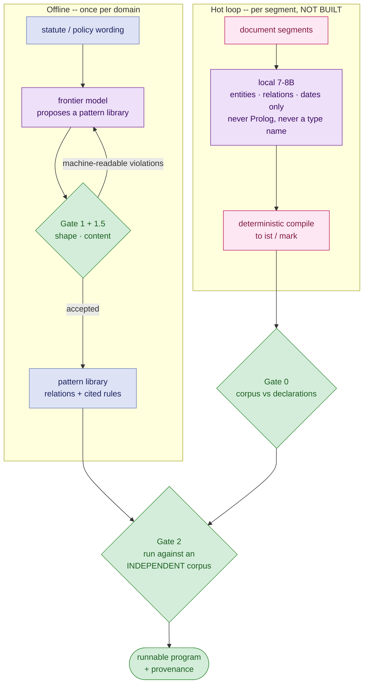

In [Rigour by Design](/2026/08/24/rigour-by-design.html) I argued that the spec ladder has four rungs, that almost everyone is parked on the bottom one, and that what GenAI actually made cheap is the labour of climbing. That post ends with a link to a repository and one sentence of description. This post is what is actually in it.

It is a working log, not a product announcement. Some of it worked, a good deal of it was wrong until execution proved it wrong, one whole architecture was deleted, and the single most important claim in the project remains unmeasured. I am going to be precise about which is which, because the failure modes turned out to be more instructive than the successes.

The short version: I took a real statute — the Singapore Land Titles Act — and tried to express it as a SWI-Prolog program that you can *run*, where every rule cites the provision it encodes and every answer can be read back to the source. Then I tried to get a language model to write that program, behind deterministic gates that decide whether its output is admissible.

One thing to get out of the way at the start, because it changes how everything below should be read: **none of the Prolog was written by a human.** Not the libraries the authoring loop produced, and not the ones I will call *reference* libraries — those were authored interactively, in a session, with me directing and reviewing rather than typing. So the axis that does real work here is not human versus model. It is **interactive, under review, with unbounded rounds and a human in every one of them** versus **one call per domain, checked by a gate, with no human in the loop at all**. What a human contributed is the representation, the gates, and the judgment about which encodings were wrong.

---

## Contents

1. [What the Experiment Was](#what-the-experiment-was)
2. [Version One, and Why It Was Deleted](#version-one-and-why-it-was-deleted)
3. [The Representation: Nine Predicates](#the-representation-nine-predicates)
4. [Where the Model Sits, and Where It Doesn't](#where-the-model-sits-and-where-it-doesnt)
5. [Four Gates, and Why None Subsumes Another](#four-gates-and-why-none-subsumes-another)
6. [What the Gates Actually Caught](#what-the-gates-actually-caught)
7. [Asking Questions of the Program](#asking-questions-of-the-program)
8. [Compiling the Spec Down to Readable Python](#compiling-the-spec-down-to-readable-python)
9. [The Tradeoffs, Stated Precisely](#the-tradeoffs-stated-precisely)
10. [What This Does Not Establish](#what-this-does-not-establish)
11. [The Scale Ceiling](#the-scale-ceiling)
12. [What Is Actually Novel Here](#what-is-actually-novel-here)
13. [When to Do This, and When Not To](#when-to-do-this-and-when-not-to)
14. [Back to the Ladder](#back-to-the-ladder)

---

## What the Experiment Was

The thesis, in the form I wrote it down mid-session:

> Instead of giving a pile of prose to an LLM and having it answer questions or convert it into code — with the prose forever dependent on a human or a model to interpret it as a "spec" — build a formal logical specification which is almost an intermediate language: portable, queryable, and convertible into executable code with a high degree of mechanisability.

That is the [spec ladder](/2026/08/24/rigour-by-design.html#the-spec-ladder) argument with a concrete artifact attached. The domain is land administration: titles, instruments, caveats, mortgages. The source is imperfect markdown. The output is a logic program plus provenance, where every asserted term traces back to the character span that justifies it.

One constraint shaped everything, and it is worth stating first because most of the design follows from it: **all inference in the hot loop was meant to be strictly local** — Ollama, a 7–8B model, on hardware you own. That is not asceticism. It is what you are forced into when the documents are a land registry's and cannot leave the building. A 7–8B model cannot be trusted to author a formal specification. So the entire architecture is an answer to the question: *what can you get out of a weak model, if a deterministic checker gets the final say?*

---

## Version One, and Why It Was Deleted

The first architecture was the obvious one. Bootstrap an ontology of entity types and relations from the document. Extract facts per segment. Extract rules by having the model fill slots in a fixed set of rule templates. Compile to Prolog. Validate with a Prolog meta-program. Feed the findings back into a refinement loop. The whole thing ran as a single autonomous graph with human-in-the-loop as the only stop.

It ran end to end on real statute text with `qwen2.5:14b` locally. The headline result was genuinely encouraging, and it is the reason I still believe the guardrail principle:

- Every model output compiled to **valid Prolog**, and the final program **loaded clean in `swipl`**.
- Name normalisation produced valid atoms for all 33 proposed entity types and 56 relations.
- Closed-world extraction *skipped* 38 fact candidates that used unknown relations or the wrong arity, rather than admitting them.
- Rules were template-only, so all 69 constraints were well-formed by construction.

The form was perfect. The **meaning** was bad, and that is the finding.

- The model turned s.119(4) — a *directional* prohibition, "the Registrar shall not register a dealing prohibited by the caveat" — into a *symmetric* mutual exclusion. Structurally impeccable, legally inverted.
- It over-generated obligations, converting nearly every relation it had seen into "every caveat must have X", including plainly conditional ones.
- It filled typed argument slots with the literal word `"string"` or `"date"`, producing facts like `has_grounds(_, "string")`. These *promoted to accepted*, because the type checker validated literal **positions** and not literal **values**.
- Given a segment that was a bare source-citation line containing no normative content at all, it hallucinated five rules with **fabricated quotations** — invented statute-like text that was not in the segment.

The last one is the most useful, because the fix was purely deterministic and it worked completely: require every proposed rule to carry an evidence quote, and reject the rule unless the quote is a literal substring of the segment. All five hallucinated rules were rejected. Paraphrased or fabricated evidence correlates with bogus rules, and a substring check suppresses them without any model in the loop.

But no amount of guardrailing fixed the central problem. The representation itself was too weak to carry the meaning:

- **Time was a string.** `role(f_abc, time, "2019-03-03")`, or worse, `"the third business day after filing"`. Prolog cannot order strings. So "what held before X", "is this within 21 days", "which registration came first" were all unaskable — and statutes are made almost entirely of those questions.
- **Identity was a name.** Entity ids hashed `type:name`, which over-merges (every "mortgage" in the corpus collapses to one) and under-merges ("the mortgage", "first mortgage", "second mortgage" fracture into three) *simultaneously*.
- **A type was one opaque atom.** So every distinction got crammed into the atom: `registered_mortgage`, `instrument_of_transfer` — an event outcome and a subtype baked into a label where nothing can reason about them.
- **Facts had no context.** `register(registrar, mortgage)` asserted flatly is implicitly true *everywhere*, which is false. Torrens land law turns precisely on the register differing from the world, and on what a party knew.

So it went. Around 11,800 lines of pipeline were deleted in two commits, and the modules that served the old representation went with it rather than being carried forward broken. That is worth naming as a decision: the temptation is always to keep the code and patch the model underneath it. The stages *encoded* the bad representation, and maintaining a stage that emits a vocabulary nothing downstream reads is worse than having no stage.

---

## The Representation: Nine Predicates

What replaced it is a coordinate model. The whole domain-neutral core is nine names in 97 lines, and it mentions no dimension, no sort, no relation and no verb:

```prolog
ist(Ctx, Statement).                    % Statement holds in Ctx
asserts(Ctx, Record).                   % INDEX -- whose account. Not a dimension.
mark(Ctx, Dim, at|lower|upper, Value).  % where Ctx sits on a dimension

dimension(Dim).                         % declared per domain
within(Dim, Point, Extent).
precedes(Dim, P1, P2).                  % OPTIONAL, strict; its presence enables bounds
offset(Dim, Point, Quantity, Point2).   % OPTIONAL -- point construction

at_or_before(Dim, A, B).                % derived
holds_in(Statement, QueryContext).      % derived -- the only query form
```

**`ist` is McCarthy's "is true in context"**, lifted whole from *Notes on Formalizing Context* (IJCAI-93). The generating rule is one sentence:

> Anything with its own lifetime gets an id, and its value or extent attaches to that id. Anything that varies gets a dimension. Whether something "holds" is membership of a query position inside an extent.

Three consequences are worth pulling out, because each one dissolved a problem I expected to need machinery for.

**There is no Event Calculus.** An event is simply a context positioned at a *point*; a state is a context with a *lower* bound and possibly an *upper* one. Persistence is extent-completion by derived `mark/4` rules. This means inertia is not a property of time — it follows from any dimension carrying a directed order. So the `version` dimension has it too, and "in force from the 1993 Act until repealed" is structurally the same shape as "effective from registration until discharge". The same core machinery answers *"was this a caveat under the Act as it stood in 1990?"* and *"was it effective in mid-2020?"*, with no code specific to either.

**Types are patterns asked at a point,** not stored labels. `caveat(Cav, Q)` is a rule, not an atom. Which kills the `registered_mortgage` problem at the root.

**Closing conditions need no ordering logic.** A fluent's extent is clipped if *any* upper mark falls in the gap. So "earliest terminator wins" fell out of the definition rather than being implemented. A caveat that can lapse at five years, be withdrawn expressly, or be deemed withdrawn fourteen days after an unrectified deficiency notice just has three `upper` mark rules, each citing its own provision, and they compose.

Here is the s.121 fragment, which is the whole idea in twelve lines:

```prolog
% s.121(1)(b) "at the expiration of 5 years from the date of the lodgment"
%  -- an UPPER bound, and the reason offset/4 exists: the point is
%  CONSTRUCTED, not compared.
mark(ctx(effective(Cav)), time, upper, T2) :-
    ist(CL, lodges(_, Cav)), mark(CL, time, at, T1),
    offset(time, T1, years(5), T2).

% s.117(3) "if, within a period of not less than 14 days ... the caveat is
% not rectified, it shall be deemed to have been withdrawn".
mark(ctx(effective(Cav)), time, upper, T2) :-
    ist(CN, notice_of_deficiency(Cav)), mark(CN, time, at, T1),
    offset(time, T1, days(14), T2),
    \+ ( ist(CR, rectified(Cav)), mark(CR, time, at, TR),
         at_or_before(time, TR, T2) ).
```

One rule, one provision, one citation. That is [Bench-Capon and Coenen's isomorphism principle](https://link.springer.com/article/10.1007/BF00871902) from 1992, and it is the thing that makes an amendment a mechanical edit rather than an audit. Fourteen provisions in the caveat library point at character spans into a content-addressed document version, so a rule can be read against the sentence it encodes — and a gate checks that every declared provision actually cites text. On its first run that gate found a *dead* declaration: a provision nothing called, left over from an abandoned modelling attempt. It found dead vocabulary, not a missing comment.

Three sorts (`entity`, `quantity`, `text`) and four shipped dimensions (`time`, `version`, `space`, `money`). "Dimension" turns out to mean *ordered value domain*, and positioning a context in one is optional — nothing is positioned in `money`, but its `precedes/3` and `offset/4` are exactly what "exceeds $500" and "the residue after costs" needed. Quantity arithmetic looked like a gap in the vocabulary and was actually a value domain nobody had declared. Four clauses closed it.

---

## Where the Model Sits, and Where It Doesn't

The founding tenet was: **the LLM never writes Prolog and never invents structure.** It fills schema-constrained slots; deterministic code compiles terms.

That tenet survives where it matters — the hot loop, thousands of calls per corpus, a weak local model. It was **deliberately broken in one place**, and the reasoning is worth reproducing because it is the sort of decision that usually goes undocumented:

The authoring tier is *one call per domain*. Its output is small, static, and mechanically checked before anything depends on it. Putting a Pydantic schema plus a JSON→Prolog compiler in front of it would buy back one frontier call per domain, in exchange for several hundred lines and a **second copy of the grammar** to keep in step with the checker. Worse, it would only ever fix violations the shape gate already catches. Every defect that actually produced a *wrong answer* — event/state conflation, misuse of rule precedence, a missing definition — cleared the shape gate and needed execution to find.

The question was asked twice and answered no twice, with revisit conditions written down: *if authoring starts running per-document rather than per-domain; if the repair loop stops converging in about two rounds; or if something other than `swipl` consumes the output.* A tenet with stated conditions for its own reversal is worth more than a tenet.



The dashed-in-spirit box is real: **the hot loop does not exist yet.** More on that below.

---

## Four Gates, and Why None Subsumes Another

| | Reads | Catches | Can run inside the repair loop? |
|---|---|---|---|
| **Gate 0** `fact_check.pl` | a *corpus*, against a library's declarations | undeclared relations, arity mismatches, a mark kind contradicting the relation's declared class | yes |
| **Gate 1** `shape_check.pl` | the library *file* | grammar: legal goals, sorts, exactly one cited provision per rule | yes |
| **Gate 1.5** `content_check.pl` | the library *file* | a library that is perfectly on-grammar and authors nothing | yes |
| **Gate 2** `acceptance.pl` | the library **run** against a corpus | rules that derive nothing, rules that derive everything, two rules with identical extensions | **no, deliberately** |

Gate 2 sits outside the loop on purpose. It needs a corpus, and **a corpus authored to satisfy the gate compromises the gate**. A model that writes its own fixtures writes them to agree with itself.

The repair contract is blunt: a checker returning a negative verdict wants a repair, and the violation list goes back as the next prompt; a checker that *raises* is saying no repair exists, and the loop propagates it rather than retrying. Exhausting the round budget is a **result**, not an exception — whether that is fatal is the caller's judgment. Three tiers had independently written this control flow before it was factored into 118 shared lines.

One detail decides whether any of this works: **the gate must return specific, machine-readable violations.** `undeclared_relation(effective/1)` is actionable. "Try again" is not. An early real run reported "0 violations" four times in a row and gave up, which is the degenerate case of the same principle — a rejection carrying nothing the model can act on is not a rejection, it is a refusal.

---

## What the Gates Actually Caught

This is the part I would want to read, so here it is in detail.

### The authoring runs

**Land Titles Act, ss.115–121.** `claude-sonnet-4-5` via Bedrock at temperature 0 — chosen deliberately over the strongest available model, because a weaker one tests the gate harder. The first one-shot experiment came back `SHAPE_FAIL` with **13 violations**. The split is the finding, not the count:

*Right, including all four failure modes the prompt warned about:* event/state classes assigned and assigned **correctly**; rule-precedence machinery correctly left untouched; no context variable shared across conjuncts; the core derived type all but identical to the reference library's. It also produced 28 derived rules, cited 14 provisions, and kept the section order asked for.

*Wrong, and every instance caught:* six relations used but never declared — including the central fluent, so it wrote eight rules over a term missing from its own vocabulary — and one context term naming a different statement than it carried. **All bookkeeping.** None of it was the silent semantic kind that took three attempts to get right in the reference libraries, with a human reviewing each one.

Wired into a repair loop, the same task converged in **two rounds**: round one produced two violations, round two was `SHAPE_OK` with 17 relations, 16 provisions, 25 derived rules and 9 derived mark rules.

And the accepted library was **better than the reference library in one place**, which is worth recording rather than hiding: for s.119(1) it declared acceptance as an *event* and being-in-order as a *state* whose lower bound derives from that event, where the reference library treats the latter as the event itself. The one-call-plus-a-gate run applied the discipline the prompt teaches at a point the reviewed interactive sessions had let slide. More rounds and a human in each of them is not uniformly better than one round and a checker.

**A second domain.** The NY standard fire policy — chosen because an insurer's wording is copyright and this one is a statutory form, so it can live in the repository. Same loop, same shape of result: round one produced **10 violations** (four uses of a goal outside the permitted grammar, six undeclared relations), round two was `SHAPE_OK`. Different domain, same split: everything the gate caught was vocabulary discipline.

### The model found a hole in the gate

While authoring the caveat sections it wrote:

```prolog
\+ holds_in(extended(Cav), ctx(effective(Cav)))
```

That passes a *fluent's* context where a *query* context belongs. `holds_in` reads `at` marks off its second argument and a fluent context carries `lower`/`upper` instead — so the goal **fails silently** rather than erroring. The shape gate said nothing, because that argument position was unconstrained. It is now checked, and the check exists because a model did something nobody had thought to forbid. That is the loop paying for itself in a way I did not anticipate: adversarial coverage of your own grammar.

### What Gate 1 structurally cannot see

Running the acceptance criteria for the first time found four defects, **every one of which the shape gate accepts because every one is grammatically perfect**:

- A rule had a condition that constrained nothing, so an argument ranged over every entity in the corpus and "Alice may lodge lot 5 as a caveat" was derivable.
- A duty rule read an *acceptance* — an event, marked at a point — with `holds_in`. So the duty to notify existed **only on the day the caveat was accepted** and evaporated overnight. This was the third appearance of the same event/fluent conflation in this codebase, each time in a library that a human had read and approved.
- Two predicates had never once been run: no fixture exercised the provision they encoded.
- Every fixture declared a predicate `discontiguous` but not `multifile`, so loading two corpus files together made SWI-Prolog silently discard all but the last file's clauses. The gate reported false vacuity — **a wrong answer with no error**.

And on the authored insurance library, Gate 2 caught something a shape gate structurally cannot: the library cited a provision in all 63 rules and defined the citation mechanism in **none of them**. Every rule failed on an unknown procedure. The shape gate passed it, because that gate asks whether a rule *carries* a citation, never whether a citation *resolves*. Gate 2 reported it as total vacuity. The root cause was a defect in the prompt, which had listed the mechanism among the core predicates the model must never redefine.

Because the event/state error kept recurring — and kept surviving review — it was made **syntactic**. Relations now declare a class — `relation(lodges, [entity,entity], event)` — and the empirical basis is that the class is a *function of the relation*: across the whole caveat corpus, every extracted relation had exactly one mark kind. Two things follow. The gate can now reject reading an event as a state at a rule's own query context, and both historical instances are replanted as tests and both are caught. And the mark kind can be assigned **deterministically from the declaration** — which takes the hardest judgment in the representation out of the extraction model's hands entirely. It emits a relation, its arguments and a date; deterministic code decides whether that is a point or a bound.

*Find the error you keep making; find a declaration that makes it syntactic.* That is the transferable technique here, and it is not specific to Prolog or to law.

### The gate for saying nothing

A library can pass every check above and still be **inert**: on-grammar, every provision cited, and every rule a filter over facts that a corpus must already assert. Such a library can restate its input and nothing else.

The measured gap turned out to be total rather than marginal, which is what made the check worth building: 12, 8 and 30 authoring rules on the three shipped libraries across three domains, against **0** on an authored screen-validation library whose rules all bottomed out in flags. That library asserted "this notice has not expired" as a *corpus fact*, while the source document gave the expiry **date**. The document licensed a rule and the library declined to write one.

Two other candidate smells were tried against the same libraries and **discarded for firing on the reference libraries**, which I mention because negative results in heuristic design almost never get written down. One of them found 24 instances in one authored library and 0 in another doing the identical thing under different names — so it measured naming, not modelling.

### A corpus is a third thing a model produces

Encoding forty scenarios into Prolog facts, one independent model call per scenario, produced a subtle composition failure: every call numbered its contexts `c1, c2, c3`, so `c1` appeared in 36 of 40 files and marks from one scenario attached to statements from another. Gate 0 reported it as 29 systematic mark-kind errors; namespacing every invented atom by scenario id took it to 6.

**The residual 6 are the real finding.** A classification — "this was a fire", "this was lightning" — is neither an event nor a bounded state. The encoder dates it because the scenario narrative dates it; the library declares it a state. That is a genuine modelling question the representation has not settled, and it surfaced only because a gate counted.

---

## Asking Questions of the Program

A specification you cannot interrogate is barely a specification. So there is a query tier: a natural-language question in, a Prolog transcript and an answer out.

Four steps, and only the first and last involve a model:

```
question -> a CHECKED query structure           (model, gated)
         -> Prolog goals at one or more points  (deterministic)
         -> answer + evidence read off the marks (Prolog)
         -> prose, printed BESIDE the transcript (model)
```

The model never writes Prolog text. It picks a predicate from the introspected vocabulary, its arguments, and the points to ask at. Deterministic code renders that into goals and checks them against the loaded program *first*. Free text cannot be gated — a goal string can name a predicate that does not exist, and the only way to find out is to run it. A structure is checkable in a few lines.

The gate is strict about arity for one reason: **a goal with the wrong arity fails silently, and a silent failure reads exactly like a well-formed "no".** For a question-answering tool that is the worst possible outcome, because nobody can tell it went wrong.

Asking at *several* points is the normal case, not an extra. Most real questions about a statute are comparative, and the interesting answer is the one that changes:

> *Alice lodged a caveat over lot 5 in March 2019, and a buyer now wants dealing1 registered against that lot. Is the Registrar barred from registering it in mid-2020, and would that still be so in mid-2025?*

```prolog
?- must_not_register(dealing1, q_mid_2020).    % yes
?- must_not_register(dealing1, q_mid_2025).    % no

evidence (marks bounding the relevant contexts):
   effective(cav1): time lower = d(2019,3,3)
   effective(cav1): time upper = d(2024,3,3)
   lodges(alice,cav1): time at  = d(2019,3,3)
```

The date that decides this — 3 March 2024 — appears nowhere in the source documents. It is constructed by the five-year rule in s.121(1)(b). And the explanation cites it because the engine gathers evidence **mechanically**: the marks bounding every context whose statement mentions an entity the question is about. The dates in the explanation are read off the program rather than recalled.

The prose step is the weakest link and is treated as such — given the transcript and nothing else, told not to introduce facts, and its output always printed *beside* the run rather than instead of it. **An explanation nobody can check is worse than no explanation.**

Two results from that tier are worth reporting honestly.

**The near-miss the gate cannot catch.** Asked whether Alice's underlying claim was *justified*, the model composed `claimant(alice, Q)` — valid vocabulary, real entity, and **a different question**, since being a claimant is not having a good claim. The gate checks that a predicate exists. It never checks that the predicate answers what was asked. **Vocabulary checking is not semantic checking**, and no amount of grammar work makes it so. The two fixes are both outside the gate: an explicit route to decline, because a system that cannot say "I can't" will always say *something*; and human-readable glosses in the vocabulary the model reads, so near-neighbours can be distinguished in prose where nothing mechanical can separate them.

Declining is deliberately never retried. A model that has read the vocabulary and concluded it cannot answer is more likely right than a second attempt is to find something — retrying only pressures it into naming an adjacent predicate.

There is a companion example next door, and the pair is the point. Whether Alice's claim is *good* is not answerable here and never will be: it needs contract and property law, evidence, and a court. That is the law, not a gap in the library. Whether the Registrar **must not consider** it is squarely answerable, because s.117(5) says he must not. A statute's refusal to decide something is itself a provision with content. One is declined, one is answered, and the system knows which side of the line it is on.

**The lossy rendering.** In three of the recorded examples the query used an unbound variable to enumerate solutions, and the rendered transcript surfaced only the first one. The prose tier then said, correctly, *"the transcript does not settle the question."* The Prolog was right; the presentation layer was lossy; and the interpretation step refused to fill the gap by invention. I count that as the design working and the implementation not — but I would rather report a tier that declines than one that confabulates the other three answers.

---

## Compiling the Spec Down to Readable Python

If the specification is the artifact of record, you should be able to project it into the language you actually ship. So there is a generator: a pattern library in, a self-contained Python module out. One dataclass per entity kind, one method per derived predicate, and one period method per fluent.

**Attempt one was rejected, and it passed every correctness test.** It was a Prolog-to-Python transpiler: nested closures over a store, generated names like `_derived_mark_1` and `_Anon29`, `continue` loops. It agreed with Prolog on every enumerated case and it was unreadable, which defeats the entire purpose. Attempt two is expression-first — a conjunction is `and`, an existential is `any(...)`, a negation is `not`. Same correctness bar, output a human can review.

The design constraint that decided everything: **readability information lives in the spec, never in the generator.** A generator that guessed `lodges(Party, Caveat)` should render as "lodged_by" would be land law in disguise, custom to one statute. Every readable name in the output comes from a declaration the library author wrote. The mortgages library declares *none* of them and still compiles end to end, reading the raw statement store — which is what degrading gracefully has to mean, and it is a test.

Here is what comes out for the caveat lapse rules quoted earlier:

```python
def effective_period(self, cav: str) -> Extent:
    """When effective(cav) holds, on the time axis.

    s.121(1)(b) — "(b) at the expiration of 5 years from the date of the
    lodgment of the caveat, ..."

    s.117(3) — "(3) If upon investigation it is found that a caveat does not
    comply with the requirements of this Act, the Registrar shall give notice
    ... and if, within a period of not less than 14 days ... the caveat is not
    rectified, it shall be deemed to have been withdrawn."
    """
    caveat = self.registry.caveats.get(cav)
    if caveat is None or caveat.lodged_by is None:
        return Extent(dim="time", stated=False)
    # without the statement there is no context to hang marks on, and an
    # unstated fluent covers nothing -- which is not the same as an
    # unconstrained one, which covers everything.

    starts: list[date] = []
    ends: list[date] = []
    ...
    if caveat.lodged_by is not None and caveat.lodged_on is not None:
        ends.append(add_years(caveat.lodged_on, 5))              # s.121(1)(b)
    if caveat.deficiency_notice_on is not None and not (
        caveat.rectified_on is not None
        and caveat.rectified_on <= caveat.deficiency_notice_on + timedelta(days=14)
    ):
        ends.append(caveat.deficiency_notice_on + timedelta(days=14))  # s.117(3)
```

The statutory limits are on the page as ordinary date arithmetic, the citation is in the docstring quoting the actual provision text, and there is no Prolog runtime hiding behind it. An equivalence suite runs every predicate through both engines and diffs.

Two engineering details that generalise well beyond this project:

**Never emit a `...` stub.** The first cut emitted `...` for every derived predicate. `...` evaluates to `None`, which is falsy — so each stubbed rule silently answered **"no"**, indistinguishably from a rule that means it. Anything the compiler cannot render faithfully now *raises*, naming the clause, the goal and the reason, and the module exports an `UNTRANSLATED` list so which methods are trustworthy is visible in the artifact without running anything.

**The equivalence suite caught four defect classes, each of which had been giving a plausible wrong answer.** They are a good checklist for anyone building a similar projection:

1. **An index runs opposite to a dimension.** Silence about a dimension is *unconstrained*; a context asserting no record answers *no* record-scoped question. Getting the polarity backwards made two copies of the data disagree.
2. **An empty extent read as unconstrained.** A loader bug dropped a field, a date came out `None`, the extent came out empty, empty read as "no bounds", and **every caveat was effective forever**. `stated=False` (covers nothing) versus no marks (covers everything) is the asymmetry to watch.
3. **A dropped conjunct.** A derived call with an unbound argument emitted the scan and discarded the call — so it answered yes for any entity at all.
4. **A rebound parameter.** A store pattern named its loop targets after already-bound variables, widening "this mortgage" to "any mortgage".

Every one of those produces confident, well-formed, wrong answers. None of them is visible by reading the output. This is the concrete argument for keeping two engines and diffing them, rather than trusting a translation.

---

## The Tradeoffs, Stated Precisely

| Decision | What it buys | What it costs |
|---|---|---|
| Nine-predicate domain-neutral core | Two Parts of one Act plus a whole insurance policy form fit with **no core changes**. Rule validity over legislative versions works through the same machinery as facts over time, with no code specific to it. | Sort conformance became nearly vacuous. Collapsing to `entity` + `quantity` means the only checkable sort is quantity, so the gate's sort checking catches roughly one class of error. Real cost, knowingly paid. |
| Types derived, not stored | Kills `registered_mortgage`-style label pollution outright. A type is a question you can ask at a point. | Every type question costs a resolution rather than a lookup. Irrelevant at this scale, unknown at corpus scale. |
| Frontier model writes Prolog offline; local model never does | One call per domain; the artifact is small, static, and checked. No second copy of the grammar to maintain. | Breaks the founding tenet, in one place, with stated reversal conditions. And the local tier it protects **does not exist yet**, so the split is architecturally justified and empirically untested. |
| Gate 2 outside the repair loop | The acceptance corpus stays independent of the model that wrote the rules. | A whole class of defect is only found *after* the loop reports success. Every serious defect so far was in that class. And the independence is only as real as the sourcing: on the land domain the corpus and the library came out of the same sessions, so it is a principle honoured in the insurance design and not in the land one. |
| "It checks; it does not compute" | Aggregates need no arithmetic if their value is *stated* — and for document extraction it usually is; a certificate of sale carries the residue. Priority needs no sorting if rank is a declared position. Several problems that looked like they needed a computation layer evaporated. | Wrong side of the line for any engine that must **perform** a distribution rather than test one. That engine would need a computation layer this deliberately does not have. |
| One unstratified rule shape accepted | `holds_in` inside a `mark` body is a genuinely useful abstraction when deriving new bounds. | It can fail to terminate. Accepted deliberately, reproduced in a fixture, and the failure is **loud** — a stack trace naming the exact cycle, not a wrong answer. |
| Provenance as positioned statements, not extra arguments | A provision's span **varies by version**: s.115 as enacted and as amended are different words in different documents. So provenance has to be positioned, and only a statement can carry marks. An amendment adds a second citation with its own version bounds and the existing machinery picks the right one. | More indirection than a citation string on the rule. |

Two things I expected to be hard and were not, and one I expected to be easy and was not.

*Not hard:* **partial holding**. "According to the extent of his interest", "freed from the mortgage absolutely or to any lesser extent" — both look like they need graded truth. Neither does, and the commercial legal DSLs agree: eFLINT parameterises acts, Symboleo parameterises obligations, Catala computes an amount, and **none of them makes "holds" partial**. A quantity that *changes* is a reified term whose value varies by context. An extent that *limits* is an ordinary comparison on the money dimension.

*Not hard:* **deeming**. A deemed fact is just one whose bound the statute supplies. No special machinery.

*Harder than expected:* **rule precedence.** An `overrides/2` relation was declared for it. It is now used in exactly **zero** rules across two libraries, and both of the Act's precedence forms defeated it. A conditional carve-out ("except as otherwise provided in s.129(1)") encoded as an override took the whole section **dark** — no dealing was ever prohibited — because the carve-out displaces the section only for the dealings the other section reaches; it is a condition on the dealing, not a precedence between rules. And the case the mechanism was *designed* for — "despite any other provision of this Act" — is worse: overriding the general priority rule kills the registration ordering that the overriding provision itself presupposes. **The override eats its own premise.** Both encode correctly as an exception clause inside the general rule, which is Catala's prioritised-default shape. A reader who sees "except" and reaches for a precedence relation will silently disable a section, and nothing will error.

---

## What This Does Not Establish

This is the section I most want people to read.

**Nothing extracts anything.** Every fact in every fixture was put into the repository by a model — interactively, or by a generation script — rather than extracted from a document. There is no seam from a document to `ist`/`mark`. The project's founding premise is extracting a model from imperfect markdown with a local 7–8B model, and in the current architecture that is **entirely untested**. The demo answers questions about a knowledge base that was assembled in directed sessions rather than read out of a document — which is exactly the part a viewer will assume was automated. Building it needs *instrument* documents (a folio, a lodged caveat, a judgment) that this corpus does not contain: the Act gives rules, not records.

**There is no baseline.** I never measured whether a strong model, handed the 6KB statute extract and the same eleven questions, answers them all correctly with no machinery at all. It very likely does. The case for this apparatus has to rest on auditability, on consistency across thousands of documents, on reliable as-at-date reasoning, and on the answer being reconstructible from the source — and **none of those has been measured**. That omission is the largest hole in the work, and it is not a small one: it is the difference between a demonstration and evidence.

**The gates check hygiene, not fidelity.** No gate establishes that a library is a correct *reading* of its source. A library can be well-formed, non-vacuous, non-degenerate, fully cited, and still misread the provision it points at. **Every serious defect found so far was of that kind.** A human reading rule against provision remains irreducible — made cheap by the one-rule-one-provision convention, but not eliminated.

**The rules and the fixtures they are checked against share an author.** This is the sharpest consequence of everything being model-written. The land corpus and the land libraries came out of the same interactive sessions, so a shared misreading of a provision would produce a library and a fixture that agree with each other and both diverge from the statute — and every gate would report success. The insurance experiment was designed specifically to break that circularity, with a blind oracle committed before the library existed, and it is the experiment that did not finish. So the independence property the architecture depends on is currently a design commitment rather than a demonstrated one.

**Sample size is small and the prompt was loaded.** Two Parts of one Act plus one policy form. The "frontier model avoided all four failure modes" result is a handful of runs with those four failure modes spelled out in the prompt. Two further runs did not complete at all and are not counted — one model was not subscribed in the account used, another exceeded a ten-minute budget.

**The second-domain experiment is incomplete.** The design was a genuine blind test: one model call writes forty scenarios with expected verdicts from the policy alone, seeing no grammar and no hint that a logic model exists; that oracle is committed to git **before** the library is authored, so the commit order is the evidence it was blind; a third call encodes the scenarios into facts *without ever seeing the verdicts*. The library was authored, the corpus was encoded, the corpus gate was built and run. **The final diff — derived answers against withheld verdicts — was never run.** So the strongest available evidence in the whole project remains uncollected. I would rather say that than quote the parts that did finish as though they were the result.

**Coreference is untouched, and it is the sharpest live risk.** A wrong entity id does not produce an error; it produces a well-formed *false statement*. A caveat whose lodgement and acceptance are given different ids ends up with no lower bound and reads as effective since the dawn of time. The negation ambiguity compounds it: `\+ rectified(Cav)` reads "not rectified", and in a lossy extraction it *also* reads "we did not extract the rectification". Those give opposite legal outcomes and the program cannot tell them apart.

---

## The Scale Ceiling

The authoring loop handles a policy wording and a dozen sections of a statute. It does not reach the whole Act, and the reason is **not** the context window — which is the interesting part.

The arithmetic: the caveat library covers 7 real sections in 652 lines with 37 rules — roughly 93 lines and 5 rules per section. The full Land Titles Act has 184 real sections. That extrapolates to something like 17,000 lines and 900 rules. No single model call produces that, however large its input window, because the binding constraint is the **output** budget — and the repair contract makes it worse by demanding the *entire file* back on every round, since the whole file is re-checked from scratch.

The second constraint is attention dilution. The four failure modes the prompt warns about are exactly the discipline that decays across a long generation. The shape gate catches bookkeeping. It cannot catch a misreading, and misreadings are what long-form drift produces.

There is a design for this — decompose the document into a *structure map* of citable spans, cluster, author per cluster, reconcile — and its central commitment is to **assume nothing about document structure**, because the real target is not statutes. It is validation-rule tables, standard operating procedures, and design documents intermingled with architecture docs. Any design keyed on sections and numbered clauses degrades *silently* on most of that, silently because a document with no citations yields a reference graph with no edges — a perfectly valid graph that produces one cluster per unit and no error anywhere.

The one guard in that design worth stealing regardless: a span's recorded text must be a **verbatim substring** of the source at the recorded offsets. Total, free, mechanical. A model that hallucinates a span fails a string comparison rather than surviving as a well-formed false citation. It is the same move as the evidence gate that killed five hallucinated rules in the very first shakedown.

That design is written down. It is not built.

---

## What Is Actually Novel Here

Very little, and I want to be blunt about it, because a project like this generates a lot of prose that reads as claims.

`ist(c, p)` is McCarthy, 1993, lifted whole. Contexts carrying coordinates is Guha's 1991 thesis and Cyc's microtheories. Statute-as-logic-program is Sergot, Sadri and Kowalski's British Nationality Act paper in *CACM*, 1986 — forty years old. One-rule-one-provision is Bench-Capon and Coenen, 1992, cited by name in the code. Derived types as patterns is ordinary Prolog. Fluents and inertia are Event Calculus, same 1986 vintage. Storing extents as separate endpoint facts rather than interval terms is how temporal databases have stored valid-time for decades. "LLM writes a DSL, a checker rejects it, repair" is now a standard pattern. "Natural language to structured query to execution to natural language" is text-to-SQL with a validator.

The reified-value pattern I made the biggest fuss about — a name as a term whose *spelling* is a separate positioned statement, which closed three gaps at once — is McCarthy and Buvač's `value(c, term)`, and it was **already in the design document's own bibliography**. The project rediscovered a citation it had in front of it. And Catala already does the defeasibility part properly, with prioritised defaults as a first-class language construct rather than this project's exception-clauses-by-convention.

Three things might be worth something, hedged:

- **Turning your most frequent modelling error into a grammar violation.** I conflated an event with the fluent it starts three separate times. Declaring the relation's class made the error *syntactically* checkable, and both historical instances are now caught as tests. The general move transfers.
- **"It checks; it does not compute"** as an explicit scoping decision. Several hard problems evaporated. For document extraction it is the right side of the line, and I have not seen it drawn this explicitly. The mechanism underneath — uninterpreted function symbols — is entirely standard.
- **Dimensions versus indices.** "No order at all means it is not a dimension" killed a coordinate that was wrong and replaced it with a plain index. A clarification, not a discovery.

A careful assembly of forty-year-old ideas, with one or two sharp engineering moves and a scoping decision that does real work. That is the honest summary, and it is also the point of the [previous post](/2026/08/24/rigour-by-design.html#what-ai-actually-changed): **none of this was ever wrong, it was expensive.** What changed is that encoding it got cheap enough to try on a weekend.

---

## When to Do This, and When Not To

**Not worth it** when the document is short-lived, low-volume, or low-stakes; when one competent person can hold the whole rule set in their head; when nobody will ever need to ask "what was the answer as at a date two years ago"; or when there is no second document to be consistent with. Handing the statute to a good model and asking is faster, and until somebody runs the baseline nobody can honestly tell you it is worse.

**Worth considering** when the answer must be *reconstructible* — where a regulator, an auditor or a court will ask why, and "the model said so" ends the conversation badly; when the same rules are applied across thousands of documents and consistency between them is the actual product; when the source **amends** and you need to know what changed and what it broke, which is exactly what one-rule-one-provision buys; when the rules must be queried both forwards and backwards, since a relation runs in both directions and a function does not; or when the data cannot leave the building, which forces you into a weak model and therefore into a strong checker.

**The domain matters more than the technique.** This works on governance documents because they already *are* rule systems: they have citable units, defined terms, explicit temporal operators, and a tradition of being read literally. A marketing brief has none of that, and no amount of Prolog will give it any.

---

## Back to the Ladder

Everything above is one long attempt to occupy the [third rung of the spec ladder](/2026/08/24/rigour-by-design.html#the-spec-ladder) — declarative, machine-checkable, interrogable — and to find out what it costs in practice rather than in principle.

Four things from the earlier post now have receipts, and one has a correction.

**"AI proposes; the verifier disposes"** is the load-bearing claim, and it held — more completely than I expected, because *every* proposal in the chain turned out to be a model's: the representation's libraries, the corpora, the query compositions, the projected Python, the blind oracle. The model contributed candidate generation, which is what it is good at, and contributed nothing to any decision. The check is what converged, not the model — two rounds on one domain, two on another.

The uncomfortable corollary is in the comparison the two authoring paths make possible. One path had a human in every round, unlimited rounds, and full review. The other had one call and a gate. The gated path produced a *better* encoding of s.119(1) than the reviewed path did, and the reviewed path is where all three instances of the event/fluent conflation came from. Human review caught the errors it was looking for and waved through the ones it was not. A mechanical check does not get tired at round nine.

**"Only a machine-checkable artifact makes an LLM worth looping"** held for a sharper reason than I gave it credit for. It is not just that a wall of prose cannot fail. It is that the rejection has to be *specific*: `undeclared_relation(effective/1)` converges, "0 violations" four times in a row does not, and "your spec seems inconsistent" is not a check at all.

**"Least power"** decided the local tier: the weak model emits a relation, its arguments and a date, and deterministic code decides everything else — including the mark kind, which is the single judgment most often got wrong. The way to make a 7–8B model safe is not a better prompt. It is to leave it less to decide.

**The correction, and it is the one that matters.** In the earlier post I wrote that a model's nondeterminism sits in the gap between the spec and the program. That is true and incomplete. In this experiment the nondeterminism moved *up*, into the gap between the **source document** and the spec — and no gate I built can close it. Every gate reads the library, or runs it. **None of them reads the statute.** Well-formed, non-vacuous, fully cited, and a misreading, is a state this system can reach and cannot detect. The gates made the cheap errors free to find, which is genuinely worth having, and they left the expensive ones exactly where they were: with a human, reading a rule against the provision it cites.

That is a smaller claim than "verified". It is also the honest one, and it is where the work is.

The repository is at [github.com/avishek-sen-gupta/doc-pipeline](https://github.com/avishek-sen-gupta/doc-pipeline), including the recorded model runs, the round-by-round violation journals, the fixtures that are *expected* to fail, and the evaluation document recording which encodings were wrong until running them proved it.
