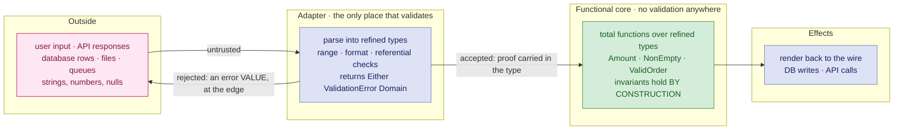
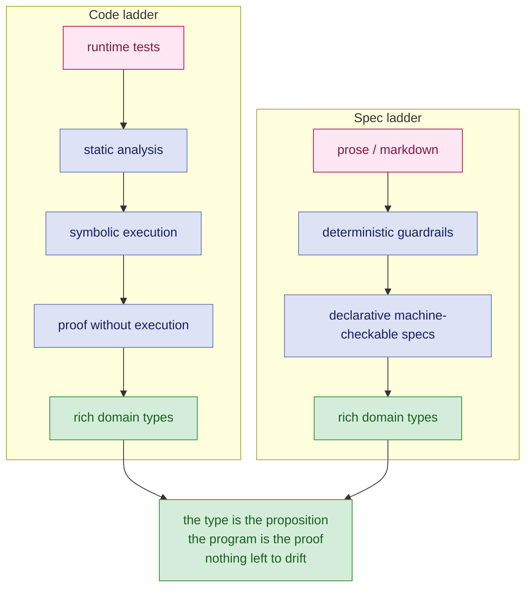

Software is hard. Personally, I oppose the position that "writing software was never the hard part", and believe that that is what people say when they have either not explored the space of writing maintainable, extensible software well enough, or have not seen the impact of decisions (both good and bad) that go into building systems that are either maintainable and understandable, or become a tangled, friction-laden maintenance nightmare.

Let me clarify at length what I mean by "writing software".

<div class="callout" style="--callout-accent: #b04a2f" markdown="1">
**What it is not:** not merely knowing and wielding the syntax / API of the language / tech stack through and through to get the job done. This is necessary but not sufficient. If that were the case, we would all be writing in assembly language.

**What it is:** Being able to express domain intention in code, in such a way that said intention is recoverable (ideally mechanically) from the code with minimal context.
</div>

We write specifications in plain text. That's just the way it is. Regardless of how it gets translated, intention always begins its life in plain text. The majority of computing history has been around closing the gap between our mental intent and its expression in executable code.

We'd like to express our intentions to the computer at a level of abstraction closer to our thought processes. This is what programming languages are for, and, more recently, why **LLMs seem to have become a viable step-up in expressing these intentions**. But they are also the source of a lot of slop. Slop code is different from plain text slop though: working code is working code, however bad the quality.

<div class="callout" style="--callout-accent: #b04a2f" markdown="1">
However, I argue that the current discussion of how well we can write **specifications**, is short-sighted, and merely a checkpoint on a sliding scale where, in the logical extreme, **the specification is the code**.
</div>

Ideally, like any programming language, how do we express our intention at a higher abstraction without sacrificing precision?

There are two scenarios where these bear fruit:

- **Reasoning about existing (possibly legacy) code:** This happens mostly during reverse engineering, recovering semantic understanding from existing code. The question then is: **what is the best way to model the existing code precisely enough to recover intent and express it unambiguously, without drowning in tech/language-specific details?**
- **Encoding domain reasoning in code that we write:** This happens when we are developing new software. The question then is: **what is the best way to minimise the delta between our mental model and its expression in code?**

Both of these are two sides of the same coin, and both lead to the same question: how do we express our intention at a higher abstraction without sacrificing precision?

We have been doing this with programming languages for the longest time, and the temptation is to treat LLMs as another jump in abstraction, and many do. This is not a tenable position, though. The sort of abstractions we have been building programming languages for, do not sacrifice precision. Regardless of the language, the computer does exactly what we tell it to do, no more, no less (sometimes to the chagrin and frustration of the humans writing this code). Plain text, and by extension, LLMs, are inherently a lossy medium, if used to express precise intent for consumption and interpretation by a machine.

## The Theses

This is not to dissuade people from using LLMs for programming. The central theses I present in this article are:

<div class="callout" style="--callout-accent: #2980b9" markdown="1">
- Shift the programming model left, from implicit human understanding to explicit deterministic encoding at runtime, and to explicit type- and structure-level encoding of domain reasoning, such that semantic errors and ambiguity are impossible by construction.
- Just like good software engineering practices are useful for future (and current) comprehension and reasoning of code to humans and teams, they are as useful to LLM agents for tracing and reasoning through code.
- The interesting thing about GenAI is not what it makes newly possible; it is what it makes newly affordable: these are the techniques which enable the two points above; and I don't see a lot of people spending that windfall on the thing worth buying.
</div>

**This is an opinionated position, and it is still evolving.** I purposefully took a somewhat extreme stance when writing this, because I want to represent something of a mental north star, regardless of the level of feasibility; that depends upon several factors: the language, the tooling, the maturity of the engineering team(s), and so on.

Every technique and tool I am going to describe here predates GenAI by years, and in many cases, decades. Dependent types, TLA+, Dafny, abstract interpretation, Prolog, property-based testing. None of it was ever wrong. It was expensive, needed skill, and slow work that was hard to defend to anyone holding a budget. So most of us stayed on the bottom rung of the ladder and called it pragmatism.

What got cheap in the last three years is exactly the labour that kept us down there. Spending it on generating more unverified code faster wastes the opportunity, which is what most teams continue to do.

---

## Contents

- [AI Proposes; the Verifier Disposes](#ai-proposes-the-verifier-disposes)
- [The Curry-Howard Isomorphism in Ninety Seconds](#the-curry-howard-isomorphism-in-ninety-seconds)
- [The Program Is the Proof](#the-program-is-the-proof)
- [The Zoo of Behaviour Verification](#the-zoo-of-behaviour-verification)
- [Correct by Construction vs. Correct by Observation](#correct-by-construction-vs-correct-by-observation)
- [Markdown Specifications Are Bullshit](#markdown-specifications-are-bullshit)
- [Flavours of Specifications](#flavours-of-specifications)
- [A Specification You Can Interrogate](#a-specification-you-can-interrogate)
- [Model the Domain, Not Just the Behaviour](#model-the-domain-not-just-the-behaviour)
- [We should borrow more: Domains in Types](#we-should-borrow-more-domains-in-types)
- [The Practical Architecture when using Constrained Domain Types](#the-practical-architecture-when-using-constrained-domain-types)
- [Tradeoffs when using Constrained Domain Types](#tradeoffs-when-using-constrained-domain-types)
- [Both Ladders End in the Same Place](#both-ladders-end-in-the-same-place)
- [What AI Actually Changed, and Why the Fundamentals Matter More Now, Not Less](#what-ai-actually-changed-and-why-the-fundamentals-matter-more-now-not-less)
- [Rigour Theatre](#rigour-theatre)
- [How does all this come together?](#how-does-all-this-come-together)
- [Where This Is Over-Engineering](#where-this-is-over-engineering)
- [Conclusion](#conclusion)

---

## AI Proposes; the Verifier Disposes

If you want one architectural principle out of this article, it is the heading of this section. Everything after it is the argument for why these four bets and not some other four; if you read nothing else, read this.

As a *design-time* proposer, a model is welcome absolutely anywhere, as long as the output goes through a deterministic gate before anyone depends on it. Same model, opposite rules, depending on which side of the build it sits.

Here is what it decomposes into.

**Executable specs, graded by criticality.** The model proposes toward specs that run. Forward: FP discipline first, to get a verifiable substrate at all, then formalism where the language and the stakes both justify it. The verifier disposes by running them: deterministic pass/fail with no human in the gate, and a postcondition violation that localises the fault to one unit rather than to a service.

On inherited code you do not get to choose, and the bottom rung is the only one on offer. Characterisation tests are the way up: they pin existing behaviour as an executable spec, and AI has collapsed the cost of writing them at volume. Two catches, both worth stating.

**They pin the bugs exactly as written.** A characterisation test encodes what the system does, not what it should do, so what you have bought is a regression net, not a specification of intent, which may result in domain SMEs being unpleasantly surprised when the code behaviour does not match their understanding of what _should_ happen. That is, however, a different problem, and falls in the domain of reverse engineering. I have written about the mechanics of this at length in [Harnessing LLMs with Deterministic Program Analysis](/2026/05/21/harnessing-llms-with-deterministic-program-analysis.html), and may write on more of my experiences going forward.

**Legibility and traceability.** Code structured to be read by the next model, not just by the next human. Types encode intent as a machine-readable spec. Traceability is emitted *forward*, at the point of construction, never reverse-engineered later. The verifier disposes via the type checker, which is a verifier of intent, and via structure that makes reasoning safe without global context. I talk about this in more detail [here](#we-should-borrow-more-domains-in-types).

**Functional core, imperative shell.** Propose pure functions with no hidden state; quarantine effects at the seam. The verifier disposes because for a pure function the output *is* the full contract: you can regenerate the implementation freely with no side-effect risk, and safety and liveness properties become model-checkable. I talk about this in more detail [here](#what-ai-actually-changed-and-why-the-fundamentals-matter-more-now-not-less).

**Composable systems, bounded contexts.** The unit of comprehension should be a bounded context, not the system, so that no global understanding is required to change anything. The context-window framing is a useful test of whether you have actually drawn the boundary or merely named it: if a context cannot be understood without also loading four of its neighbours, it is not a bounded context, it is a folder. Plenty of contexts in real systems fail that test, and that is a finding about the design rather than about the tooling. The verifier disposes at the contract-checked boundary: a proposal cannot violate a neighbour's contract without something catching it mechanically.

Every one of those four is an ordinary architectural virtue that predates all of this. What changed is that each one now also determines whether a machine can safely participate in your codebase.

The rest of this article is why, which turns out to be a theorem from 1934.

---

## The Curry-Howard Isomorphism in Ninety Seconds

The Curry-Howard Isomorphism says that logic and programming are the same structure under two different names.

| Logic | Programming |
|---|---|
| proposition | type |
| proof | program |
| A implies B | function `A -> B` |
| A and B | pair `(A, B)` |
| A or B | sum `Either A B` |
| modus ponens | calling the function |
| **checking a proof** | **type-checking** |

A claim like "every valid order yields an invoice" is a **proposition**. Written as a type, it is:

```haskell
invoice :: ValidOrder -> Invoice
```

**The proof of that proposition is an implementation of that type**:

```haskell
invoice o = ...
```

**If it compiles, the claim holds.** Type-checking *is* proof-checking. Curry found this in 1934, Howard found it again in 1969. It is a theorem, not a nice way of talking about types.

There is one catch, and it matters enormously in the languages most of us actually ship in. Only a *total* function is a proof. Throw an exception, return null, or loop forever, and you have proved nothing at all. The compiler will be perfectly happy anyway. Most of the industry's type systems are logics with a hole in them, and everybody has agreed not to look at the hole.

---

## The Program Is the Proof

A proposition is a type. **A proof of it is a program of that type.** This is exact, not a metaphor. So your running code is already the most exact statement of what your system does. A type, a model, a test, a diagram, a paragraph of English: every one of them is an *approximation* of that program, and the only reason you buy an approximation is that it is cheaper than the thing it approximates.

That gives you exactly one question to ask about every technique below. **How much of the proof does it buy, and what does it cost?**

Not "Is this rigorous?", not "Is this best practice?". How much of the proof, and at what price, and we will talk of different techniques, at different levels of fidelity, that we can use.

---

## The Zoo of Behaviour Verification

Here are the ways to be sure your code does what you think, in descending order of certainty and ascending order of regret. The ordering is the point, so for the rest of this article I will call the positions in it rungs, and the whole thing the behaviour ladder.

| Technique | What you actually get | Earliest it applies | Cost to adopt |
|---|---|---|---|
| **Formal verification:** model checking and program verification: TLA+, Dafny, etc. | proves a model, not your code | before any code is written | high: learning the tool, and deciding which properties are worth proving |
| **Correct by construction:** rich domain types, dependent types (Lean, Idris), illegal states made unrepresentable | depends upon type system and programmer discipline | write / compile time | moderate: a strong type system, plus modelling discipline |
| **Symbolic execution:** abstract interpretation, reaching conditions, taint analysis | works on actual code, depends upon tooling maturity | post-compile | high: specialised setups |
| **Static analysis:** lint and immutability, cyclomatic complexity, architectural import constraints | commit and integration gates | build time | low: mostly off the shelf |
| **Static analysis (reverse engineering):** control-flow graphs, data-flow analysis, def-use chains, call graphs | recovered, not encoded | any time, on code that already exists | low to moderate, depending on tooling for the language |
| **Pre-production runtime:** tests, assertions, ordinary business logic, coverage and assertion quality | instances of the proof, not the proof | build / integration time | low: standard in every language |
| **Production runtime guardrails:** monitors, circuit breakers, rate limiters, etc. | instances of the proof, and only after the fact | production | low: standard in most deployment environments |
| **Prose / Markdown:** verified by a human in code review, or by production, and by nothing else | nothing here can fail | any time | near zero, and you get what you pay for |

One axis does not fit in that table, because it does not track the ordering at all.

### How generally applicable is this technique (Narrower -> Wider)?

Production runtime guardrails (cross-functional requirements) -> Static analysis (building blocks) -> Pre-production runtime (both behaviours and CFRs, but specific instances) -> Symbolic execution (behaviours across multiple histories) -> Correct by construction (general program correctness) -> Formal verification (general program correctness, not performance)

There is an asymmetry in that table that I want to talk about.

- **The 'Correct by Construction' rung is forward.** You encode the property while you are writing the code, and the compiler checks that you did not contradict yourself.
- **'Static Analysis (Reverse Engineering)' is a somewhat special case, since it is mostly run when comprehending existing code.** You are recovering properties from code that somebody else wrote, years ago, without any conscious intention of making them recoverable. That's reverse engineering. Obviously, a lot of this analysis actually happens inside compilers when they are lowering code, but that is usually transparent to the program writer.
- The remaining ones can usually be applied in either direction.
- **Static analysis** and **Pre-Production Runtime Guardrails** are the cheapest rungs, and there is no excuse whatsoever for skipping them. If your review process consists of senior engineers reading diffs for style and cyclomatic complexity, you are paying six figures for a linter.

---

## Correct by Construction vs. Correct by Observation

Runtime is where most teams find out they were wrong. It is the most expensive place to find out, and the latest. You are not required to work this way, and can shift left, like we have been doing for many software engineering practices in recent years.

In this context, "shift left" does not mean "test earlier", which is still runtime, just sooner. Moving your integration suite from Friday to Tuesday does not change the epistemology of what you are doing: you are still observing instances and generalising.

<div class="callout" style="--callout-accent: green" markdown="1">
**The point is to move the correctness argument out of execution altogether.**
</div>

---

## Markdown Specifications Are Bullshit

I mean specifications written in markdown *for machine consumption*. Prose for humans is fine and always has been. Prose as the artifact you hand to a code generator and call the source of truth is not.

**English is the least exact model of a program you can write.** The current fashion is to hand that to a probabilistic system and call the result a methodology. You have stacked two independent sources of ambiguity on top of each other and given the stack a name and a logo.

Here is the operational problem. **Nothing in that document can be checked.** Not for internal consistency, and not against the code that supposedly implements it. So the checking falls to a human reading a diff, and to production.

"But it's readable." Readable by whom, to decide what? A specification nobody can execute cannot fail. People hear that as a feature. A specification that cannot fail, can drift merrily from intent without any alarms.

Prose sits *below* the bottom rung of the behaviour ladder. A test at least fails.

To be clear about what I am not saying, because it is the obvious objection: requirements arrive in English, and they always will. Prose is fine, and unavoidable, as the *input* to the encoding step. What it cannot be is the artifact of record, the thing you diff, gate on, and point at when two people disagree. Every technique below is a way of getting the intent out of the English and into something that can fail.

---

## Flavours of Specifications

We still prefer executable specifications, and this can mean several things depending upon the fidelity and effort you want to put into building:

### The Code is the Spec
**The most faithful executable specification is the program itself.** It does not always lend itself to easy reading, but it becomes readable when constraints and rules are expressed fluently as part of the code, i.e., a combination of the type system and the behaviours.

In the extreme case you can dispense with any other form of documentation: the code IS the spec. If the program's interfaces are defined by its types, the logic of the program is the proof that these interfaces are satisfied. This is Curry-Howard at its logical extreme. Code that is correct by construction is also cheaper to test, cheaper to change, and cheaper for a machine to reason about. More details [here](#we-should-borrow-more-domains-in-types).

### Tests
Tests are the current workhorse of the industry: remarkably low-effort to implement, incapable of drifting silently (assuming your CI pipeline / build system is in order), a safety net for existing code in the absence of strong type and behaviour guarantees, and a useful design tool (if you are practising TDD). They also need to be maintained, and they can become unreadable if not written with care.

However,and, most importantly, **they represent instances of the proof of behaviour, not a general proof**. You can write tests showing that 2, 4 and 6 are even. That says precisely nothing about 8. This is not a reason to skip tests, since most business logic is simple enough that instances will do. It is a reason to be honest about what a green build is evidence *of*. Tests are the rung you can always afford; that is not an argument for stopping there.

### Domain Specific Languages (DSLs)
A lot of domain modelling emerges from prose, and, as stated before, prose cannot be checked. A DSL for business logic is the way out: machine-checkable for consistency, queryable, executable. In the extreme case the code implements the DSL directly, but often the logic is better expressed in a more flexible language. One class of languages I've seen particularly suitable for this is Logic Programming: Prolog is the exemplar in this category. I have written about my experiments with extracting out a DSL from a law document in [this post](/2026/08/24/a-statute-as-a-runnable-logic-program).

### Static Models
The next level of modelling involves various forms of static analysis: dataflow analysis, which can prove that certain values are never null or that certain functions are never called with certain arguments; dominator analysis, which answers whether this chunk always executes when reaching a certain region of functionality. These are useful for catching bugs, but they are not as powerful as a full proof system. They are building blocks for more abstracted analysis, e.g., answering "which factors affect the interest rate?" might start with dataflow analysis of the interest rate variable.

Static analysis pays the same tax in a different currency. A control-flow graph is precise right up until it hits polymorphism, at which point the call edges point to multiple futures, and further facts must be mined (e.g., dependency wiring configuration) to disambiguate. Every soundness/precision trade-off in an analyser is a place where the model and the code diverge quietly.

### Formal Methods
Formal methods, meaning model checking and program verification, are where you model chunks of functionality, assert invariants and properties, and have the tool verify that they hold. This is the space of tools like Dafny, TLA+, etc. They are very powerful, but they require investment in learning them, and more careful thinking about which properties are worth proving (e.g., two users cannot log into the same account).

Different techniques here model different aspects of logic: you'd write a TLA+ spec to verify the safety / liveness of one piece of code, and maybe use Dafny to assert something about a data structure in another. These are not usually used to model the full business domain of a program. TLA+ proves your model has no deadlock. Dafny proves the function you specified is correct. Neither of them has seen your production code. The proof is only ever as good as the model's resemblance to what you actually shipped, and that resemblance is maintained by hand, by humans, under deadline.

---

## A Specification You Can Interrogate

The rung above guardrails is where it gets interesting, because a declarative spec is a program you can ask questions of. Here is the smallest possible example, written in Prolog.

```prolog
% the domain, stated once
parent(rajesh, meera).
parent(meera, arun).
grandparent(X, Z) :- parent(X, Y), parent(Y, Z).

:- \+ grandparent(X, X).   % invariant: nobody is their own grandparent
```

```prolog
?- grandparent(rajesh, arun).  % forward
   true.

?- grandparent(X, arun).       % backward
   X = rajesh.

?- grandparent(rajesh, Z).     % backward
   Z = arun.
```

One clause, three questions. You did not write a lookup function and you did not write an inverse lookup function. Resolution ran the rule backwards from the goal, because the rule is a *relation*, not a procedure.

In markdown you would write "a grandparent is the parent of a parent", and then check every consequence of that sentence by hand, forever, every time anything else in the document changed.

Note also what the invariant is. It is not a comment. It is not a team convention that gets mentioned in onboarding. Breaking it is a mechanical failure, not a reviewer being alert on a Thursday afternoon.

The limit is worth stating plainly: **this does not stop an LLM writing a wrong spec.** You can check consistency, not intent. What it does stop is the model being wrong across six paragraphs that nobody reads carefully. And because the check is mechanical, iteration is close to free.

It is also exactly why prose specs cannot be rescued by better models. A wall of text cannot fail, so the loop never closes, so a human has to sit in the middle of it reading everything. You automated the proposing and kept the expensive half.

An experiment on how to extract a deterministic, queryable knowledge base with forward and backward inference from a text document, is documented in [A Statute as a Runnable Logic Program](/2026/08/24/a-statute-as-a-runnable-logic-program).

---

## Model the Domain, Not Just the Behaviour

The grandparent example is trivial on purpose. Put settlement eligibility, tenure calculation, or chain of custody in its place. The mechanism does not change.

The point is that you can ask questions of a domain, deterministically, before a single line of production code exists. Contradictions show up as failed queries. The alternative is two people discovering three sprints later that they meant different things by the same word, which is how most requirements defects actually happen.

Rich typing does the same job, in the language you actually ship. Not "amount is an `int`, validated somewhere upstream, probably", but an amount that cannot be *constructed* outside its valid range. The constructor is the specification.

Domain modelling and type design are the same discipline viewed from two ends. Treat types as annotation and you are wasting the best checker you already have installed and are already paying for.

A worked example of the declarative approach is at [github.com/avishek-sen-gupta/doc-pipeline](https://github.com/avishek-sen-gupta/doc-pipeline).

But, there is a lot more we can do with types. Keep reading.

---

## We should borrow more: Domains in Types

I love types. Programmers are no strangers to typed programming languages. Currently, we use types as mere data holders with runtime behaviour. You say: "Yeah, well, that's what a type is". I say: "We can do more, a lot more." There is a lot more that we can borrow from work done in other programming languages in recent years, which push the possibilities of what we can encode in types themselves without depending upon runtime behaviour.

<div class="callout" style="--callout-accent: green" markdown="1">
Traditional programming separates concerns: write code, then validate it at runtime. Type systems can invert this: encode the constraints themselves into types. A program that type-checks is a program that provably respects all domain rules, no runtime validation needed (for that logic).
</div>

### Levels of Expressiveness

**Level 1: Plain Types (Foundation)**

This example is in Haskell, and simply states that a function takes in two `Int` values, and returns an `Int`. No constraints. Both inputs unchecked. In usual 'enterprise' code, validations happen at runtime in the body of the function.

```haskell
divide :: Int -> Int -> Int  -- Accepts any integers, could crash on zero
```

**Level 2: Refined Types (Constraints on Values)**

The second level is where we can start encoding constraints on types. These constraints The refinement `x > 0` is a logical predicate on the value. The type system (using SMT solvers like Z3) proves this predicate holds. Division by zero becomes impossible.

```haskell
{-@ type Pos = {x:Int | x > 0} @-}
{-@ divide :: Int -> Pos -> Int @-}
divide a b = a `div` b  -- Proven safe: b is always positive
```

**Level 3: Dependent Types (Constraints on Structure)**

This example is in Idris, and allows you to encode very arbitrary propositions as part of the type. Your program's correctness proof is embedded in its type signature. Type-checking *is* proof verification.
This example is in Idris, and allows you to encode the fact that the input list is sorted, before even running the program. NOTE: I do not know Idris (currently working through Lean 4), but the type signature is very similar across these kinds of languages, so it should look familiar.

```idris
insert :: (x : Int) -> (xs : List Int) -> (prf : Sorted xs) -> Sorted (insert x xs)
```
Types can depend on values. Here, the type of the result depends on the *structure* of the input list (whether it's sorted). You cannot construct an unsorted list: the type system enforces ordering.

Arbitrary mathematical theorems become part of the type. Your program's correctness proof is embedded in its type signature. Type-checking *is* proof verification.

---

## The Practical Architecture when using Constrained Domain Types

None of the above helps if the data arrives as a string. External data (user input, API responses, database records, a CSV somebody emailed you) arrives unvalidated, and no type system will change that. What it changes is *where* you deal with it.

The move is to confine validation to an adapter layer at the system boundary. The adapter performs runtime checks and converts unverified data into refined types, once. Everything inside is then proven correct by the type system, so the core assumes its invariants hold and concentrates on behaviour. That splits the problem into two halves with completely different rules: the adapter is where you write defensive code, and the core is where you reason about correctness.



The arrow that does the work is the one in the middle. A value crosses it exactly once, and it changes kind when it does: `String` becomes `EmailAddress`, `int` becomes `Quantity`, `Order` becomes `ValidOrder`. That change of kind is the record that the check happened, which is why nothing downstream has to ask again. This is what Alexis King called "parse, don't validate": a validating function returns a boolean and throws the knowledge away, while a parsing function returns a *narrower type* and keeps it.

Four rules make the split hold and distinguish it from ordinary defensive programming.

- **The refined type has exactly one way in.** A private constructor plus a smart constructor returning `Either ValidationError Amount`. If anything outside the adapter can call `Amount(-5)`, the type guarantees nothing and you are back to reading call sites.
- **Failure is a value at the boundary and an impossibility inside.** The adapter returns errors; the core has no error path for invariant violations, because there is no way to construct the violation. When a core function does have to fail for domain reasons ("insufficient funds"), that is a return type, not an exception.
- **Every entry point is an adapter, including the ones that look internal.** Deserialisation is parsing. A database read is parsing. A message off a queue is parsing. The most common way this architecture rots is a repository that hands the core a row it built with raw constructors, because "it came from our own database".
- **The core never re-checks.** If you find a defensive `if` inside the core, either the type is too wide or somebody did not trust it. Both are worth fixing at the type rather than at the call site.

What you get, concretely, is that validation logic stops being a cross-cutting concern and becomes its own layer, separate from any other logic. It is the part of the system you test hardest, because it is the only part that can be handed garbage, and it is small enough to test exhaustively. Property-based testing lands naturally here: generate arbitrary bytes, assert that everything either parses into a value satisfying the invariant or is rejected with a specific error.

For AI-assisted work, the surface area of code that needs careful auditing shrinks. The adapter is where a model should be writing careful, paranoid, heavily tested code, and the core is where its output is safest to accept, because a function over refined types cannot be wrong in the ways generated code is usually wrong. It cannot forget a null check that the type made impossible, and it cannot invent a state the constructor refuses to build.

Potential defects concentrate at the boundary. You have not removed the possibility of bad data, you have moved every opportunity for it into one layer. A bug there is now a wrong assumption everywhere downstream, silently, with the type system asserting it is fine. That is a much better place to be than the alternative validation-riddled runtime logic approach, because it is one small layer to review rather than a full codebase to search and reason about.

## Tradeoffs when using Constrained Domain Types

**Advantages:** Correctness proven before runtime. Impossible states become literally unrepresentable. Downstream code is simpler and faster (no checks).

**Costs:** Steeper learning curve. Proof obligations can become unwieldy when moving beyond refinement types. Complex non-linear arithmetic may require manual lemmas. Development is slower (more annotation).

**Reality:** A lot of runtime validation in enterprise code today, can be shifted to the compile phase with Refinement Types (Level 2). Level 3 opens up lots of tantalising possibilities, but can be complex work depending upon the complexity of the constraint.

Why am I talking about this? Because, by improving the expressibility of our code, we get the following consequences:

- **Simpler logic in the functional core**, since validation is not interspersed with actual runtime code; in fact, I wager that what we call a huge amount of business logic in code, could largely collapse into nothingness, or just side effects (database calls, network calls, etc.) based on exhaustive pattern matching on types.
- **Errors and human assumptions surface earlier in the type system.** Run-of-the-mill defensive programming patterns stand out, and become amenable to refactoring to type constraints.
- **Validations and actual side effect-free runtime logic become clearly delineated**, since validations move to the edge, and are no longer part of the functional core. Thus, this becomes a useful architectural constraint.
- **The surface area of change reduces**: since the domain changes less often, change around side effects like I/O remain confined to the edges.
- **AI context becomes richer and more compressed**, because constraints are specified ONCE, at the type level, instead of being spread across the codebase.
- By the same token, and, **more importantly**, humans understand the code better, faster.
- From a purist's perspective, **we move closer to closing the gap between a readable spec and executable code**, i.e, we are closer to "The Code is the Specification".

---

## Both Ladders End in the Same Place

That is not a coincidence.



The code ladder climbs to rich domain types: behaviour encoded at compile time, where the illegal program does not typecheck. The spec ladder climbs to rich domain types: the domain encoded at compile time, where the illegal state does not typecheck. At the top, the spec and the program stop being two artifacts that can drift apart. They are one artifact.

This matters specifically for AI-assisted construction. **A model's nondeterminism does not sit everywhere. It sits in the gap between the spec and the program.** That gap is the translation step, and translation is where guessing happens. Every rung you climb narrows it. At the limit there is no translation step left for anything to be wrong in.

You will not reach the limit, and I am not suggesting you try. What matters is which way you are walking.

---

## What AI Actually Changed, and Why the Fundamentals Matter More Now, Not Less

AI did not add a rung to either ladder. It collapsed the cost of climbing them.

That distinction is the whole argument. Dependent types did not get more expressive because a model can write Lean. TLA+ did not get better at liveness. What changed is that the tedious, skilled, slow labour of *encoding* things (writing the property, writing the model, writing the characterisation test, writing the query) got an order of magnitude cheaper.

Immutability. Pure functions. Small composable units. Explicit failure. Contracts at the seams. Types that mean something.

This is not nostalgia. These are the properties that make code comprehensible at a local scale, without necessarily keeping the entire model in your head all the time, and that leads to code that is safe to keep. Every one of them was a good idea when humans wrote all the code, and we have always given the same reasons: you can read a pure function without holding the rest of the system in your head, you can pass around an immutable value without wondering who else is going to write to it, and you can compose small units without the combination surprising you. And now, LLMs reap these benefits for the same reasons.

Think about what an agent has to do before it can safely change a line of your code. It has to work out what that code does, what it touches, and what breaks elsewhere if it changes. That is the same job you do when you open an unfamiliar file, with one important difference: the agent does it with whatever fits in its context window, and nothing else. It cannot walk over and ask the person who wrote it. It cannot remember the incident in March. Everything it reasons with, it has to recover from the code in front of it. So every property that shrinks the amount of code you must read in order to be sure of something, is worth more to the agent than it ever was to you.

**Purity bounds what has to be read at all.** For a pure function, the signature plus the body is the entire contract. There is no elsewhere. Nothing in the rest of the codebase can change what it does, which means a model reasoning about it in isolation is reasoning correctly, not optimistically. A method that mutates four fields, reads a clock and writes to a queue has a contract smeared across the whole system, and to reason about it soundly you would have to read the whole system. No context window is big enough for that, and no amount of prompt engineering will substitute for it.

**Immutability deletes the aliasing question.** Most of the genuinely hard questions in code comprehension are some version of "who else holds a reference to this, and when do they write to it?" Answering it requires global knowledge, which is precisely the thing an agent does not have and a human acquires slowly and expensively. Under immutability the question does not arise, because the answer cannot matter.

**Composability makes local reasoning sound rather than merely convenient.** If a unit is small, has explicit inputs and outputs, and does not reach outside itself, then understanding the unit is understanding the unit. This is what lets an agent work usefully with a partial view of the system: the view it has is not a fragment of the truth, it is the whole truth about that piece. Bounded contexts are the same principle applied one level up.

**Explicit failure removes the control flow the model cannot see.** A `Result` or an `Either` in the signature is a fact sitting in front of the reader. An exception thrown eleven frames down is not in anything the model is looking at, and it is not in anything you are looking at either during code review. The difference is that you will eventually find out in production; the model will confidently generate a caller that has no idea the path exists.

---

## Rigour Theatre

Now the objection to everything above, which I think is the strongest one available, and which I would rather state myself than have stated at me.

Making rigour cheap to produce also makes the *appearance* of rigour cheap to produce. A model will write you a TLA+ spec that model-checks clean, a dependent type that is inhabited, a property test that passes on ten thousand cases, all of which formalise the wrong thing. Consistency is mechanical: intent isn't, and always originates in the human brain. You can check that the spec does not contradict itself; you cannot check that it is the spec you meant.

And rigorous-looking artifacts borrow authority. Nobody re-reads the invariant. It has a `\A` in it, it went green in CI, and the reviewer who might have caught that it quantifies over the wrong set has already scrolled past. Prose at least advertises that it is unverified. A proof of the wrong proposition is the same failure with better clothes, and the more of it you generate, the less any individual piece gets read.

The second failure is the gate itself. "Deterministic pass/fail with no human in the gate" describes what should happen. What actually happens, when you point an agent at a red build and tell it to make the build green, is that making the build green is the goal it optimises. The assertion gets weakened. The test gets an `@Ignore` and a plausible comment. The postcondition acquires a special case for exactly the input that was failing. The mock gets adjusted until the thing under test is no longer under test. None of this is malice, and all of it is what "satisfy the verifier" means when the verifier is the only thing being satisfied.

All of these have the same mitigation. The property, the invariant, the contract, the assertion: these are the artifacts where human judgement is least substitutable, and they are exactly the artifacts you should be **not accept unreviewed**. Generate the implementation freely. Read the specification like it matters, because it is the only place your intent lives, and keep it in version control where a change to it shows up in a diff rather than in an incident.

So: AI proposes, the verifier disposes, and somebody still has to own the verifier. That is not a hole in the argument. It is where the argument was always going to land, and it is a much better place to be spending expensive human attention than reading diffs for style.

---

## How does all this come together?

Different routes, depending upon the rigour you need and the effort you are willing to invest. You can mix and match, but the idea is to not stay stuck at the status quo. Below are some examples of how you could pick and choose.

### Route 1: Current

The status quo. Everything is established by running the code, whether it's through tests in the dev environment or through manual testing in a staging environment (or, horrors, in production!).

1. Human writes
2. LLM reads and writes code (TDD as needed)
3. Validation boundaries and side effects tested through integration tests / mocks
4. Cross-component interactions tested through integration tests

### Route 2: Current, with (some) behavioural modelling

One rung up, applied selectively. The critical sections get a proof, and everything else stays as it was.

1. Human writes
2. LLM reads and writes code (TDD as needed)
3. **Model critical sections in Dafny, etc. to verify behaviour guarantees**
4. Validation boundaries and side effects tested through integration tests / mocks
5. Cross-component interactions tested through integration tests

### Route 3: Machine-checkable specs + behavioural modelling + functional core using constrained types

The full climb. The spec is an artifact that runs, the interactions are proven, and the core carries its invariants in its types.

1. Human writes
2. **LLM reads and writes specs in a DSL** (e.g., a declarative logic programming language)
3. **TLA+ to model component interactions and prove guarantees**
4. **Functional core using constrained types**
5. TDD validation boundaries and side effects
6. Cross-component interactions tested through integration tests

### Route 4: The "code is the specification"

The limit case. There is no separate spec artifact to drift, because the types and the core are the spec. In my mind, this is the best possible outcome, but it is also the hardest to achieve, because it depends upon tooling, team maturity, and willingness of stakeholders to accept that there is no material difference between the spec and the code (which is not a technical problem :-).

1. Human writes
2. **LLM reads and writes functional core using constrained types**
3. TDD validation boundaries and side effects
4. Cross-component interactions tested through integration tests

### What each route actually buys

| | Where the spec lives | Proven before runtime | Established by running |
|---|---|---|---|
| **1. Current** | in someone's head, and in prose | nothing | all behaviour, all boundaries, all interactions |
| **2. + behavioural modelling** | prose, plus a model of the critical sections | safety and liveness of what you chose to model | everything else |
| **3. Specs + modelling + typed core** | a DSL you can query, plus a TLA+ model | domain consistency, component interactions, every invariant in the core | boundaries and side effects only |
| **4. Code is the specification** | the types and the core, and nowhere else | every invariant the types encode | boundaries and side effects only |

Route 4 is not strictly more rigorous than Route 3. It drops the queryable spec and the interaction model, and buys back the fact that nothing can drift, because there is only one artifact. Which of the two you want depends on whether your risk is misunderstanding the domain, in which case you want the DSL you can interrogate, or concurrency and protocol errors, in which case you want the TLA+ model.

---

## Where This Is Over-Engineering

Climbing costs real engineering labour, and I am not going to pretend otherwise.

If the thing is low-volume, short-lived and not critical, this is over-engineering and you should not do it. Volume, longevity and criticality are what decide, and they decide per system, not per organisation. Anyone who tells you the ladder is always worth climbing is doing ideology, not engineering.

Rigour also looks slower up front, and sometimes it genuinely is. I am not going to claim it is secretly faster. What I will claim is that a lot of what gets built without it does not survive contact with production, and that cost lands on somebody's budget anyway, just later, and filed under a different name.

---

## Conclusion

The argument stems from one line: your program is the proof, everything else you write about it is an approximation because it is cheaper, and the ROI of the approximation depends upon how much of the proof it buys and at what price.

That question used to have depressing answers. The techniques at the top of the ladder (dependent types, model checking, declarative domain models, program analysis) were never wrong, they were expensive, and most of us settled at the bottom and called it pragmatism. What changed in the last three years is not the ladder. It is the price of climbing it. The tedious, skilled, slow labour of encoding things is the exact labour that got cheap, and spending that windfall on generating more unverified code faster is the mistake almost everyone is currently making.

So: AI proposes, the verifier disposes. Executable specs rather than prose that cannot fail. Types and structure that carry intent, because the next reader of your code is as likely to be a machine working from a context window as a human working from memory. A functional core with the effects quarantined, because purity is what makes code tractable to a verifier and to an agent alike. Boundaries drawn well enough that a change stays local. None of it is new.

What it does not buy you is the judgement about what to encode. Consistency is mechanical; intent never becomes so. The invariant that quantifies over the wrong set will check clean forever, and a gate that nobody owns is a gate that gets optimised around. The expensive human attention does not disappear. It moves, from reading diffs to writing and reading the properties that everything else is checked against, which is a considerably better place for it to be.

<div class="callout" style="--callout-accent: #b04a2f" markdown="1">
**So the job of AI here is to make rigour cheap. Not to make judgement optional: that stays human.**
</div>
