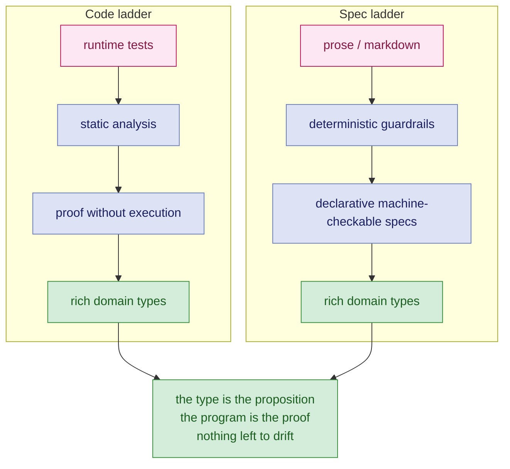
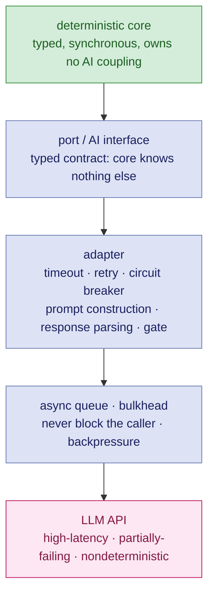

Software is hard. Personally, I oppose the position that "writing software was never the hard part", and believe that that is what people say when they have not explored the space of writing maintainable, extensible software well enough, or have not seen the impact of decisions (both good and bad) that go into building systems that are either maintainable and understandable, or become a morass of tangled, friction-laden maintenance nightmare.

Let me clarify at length what I mean by "writing software".

**What it is not:** not merely knowing and wielding the syntax / API of the language / tech stack through and through to get the job done. This is necessary but not sufficient. If that were the case, we would all be writing in assembly language.

**What it is:** Being able to express domain intention in code, in such a way that said intention is recoverable (ideally mechanically) from the code with minimal context.

We'd like to express our intentions to the computer at a level of abstraction closer to our thought processes. This is what programming languages are for, and, more recently, why LLMs have become a viable step-up in expressing these intentions. But they are also the source of a lot of slop. Slop code is different from plain text slop though: working code is working code, however bad the quality. However, I argue that the degree and fidelity of the encoding of our mental model in software, starts not from the code, but from the specifications that we write, and in the logical extreme, **the specification is the code**.

For the longest time, we have been writing specifications in plain text, which is a poor medium for encoding a mental model. Ideally, like any programming language, how do we express our intention at a higher abstraction without sacrificing precision?

There are two scenarios where these bear fruit:

- **Reasoning about existing (possibly legacy) code:** This happens mostly during reverse engineering, recovering semantic understanding from existing code. The question then is: **what is the best way to model the existing code precisely enough to recover intent and express it unambiguously, without drowning in tech/language-specific details?**
- **Encoding domain reasoning in code that we write:** This happens when we are developing new software. The question then is: **what is the best way to minimise the delta between our mental model and its expression in code?**

Both of these are two sides of the same coin, and both lead to the same question: how do we express our intention at a higher abstraction without sacrificing precision?

We have been doing this with programming languages for the longest time, and the temptation is to treat LLMs as another jump in abstraction. This is not a tenable position, though. the sort of abstractions we have been building programming languages for, do not sacrifice precision. Regardless of the language, the computer does exactly what we tell it to do, no more, no less (sometimes to the chagrin and frustration of the humans writing this code). Plain text, and by extension, LLMs, are inherently a lossy medium, if used to express precise intent for consumption and interpretation by a machine.

This is not to dissuade people from using LLMs for programming. The central theses I present in this article are:

- Shift the programming model left, from implicit human understanding to explicit deterministic encoding at runtime, and to explicit type- and structure-level encoding of domain reasoning, such that semantic errors and ambiguity are impossible by construction.
- Just like good software engineering practices are useful for future (and current) comprehension and reasoning of code to humans and teams, they are as useful to LLM agents for tracing and reasoning through code.
- The interesting thing about GenAI is not what it makes newly possible; it is what it makes newly affordable: these are the techniques which enable the two points above; and I don't see a lot of people spending that windfall on the thing worth buying.

This is an opinionated position, and it is still evolving. I purposefully took a somewhat extreme stance when writing this, because I want to represent something of a mental north star, regardless of the level of feasibility; that depends upon several factors: the language, the tooling, the maturity of the engineering team(s), and so on.

Every technique and tool I am going to describe here predates GenAI by years. Dependent types, TLA+, Dafny, abstract interpretation, Prolog, property-based testing. None of it was ever wrong. It was expensive, needed skill, and slow work that was hard to defend to anyone holding a budget. So most of us stayed on the bottom rung of the ladder and called it pragmatism.

What got cheap in the last three years is exactly the labour that kept us down there. Spending it on generating more unverified code faster wastes the opportunity, and that is what most teams are doing.

---

## Contents

- [The Curry-Howard Isomorphism in Ninety Seconds](#the-curry-howard-isomorphism-in-ninety-seconds)
- [The Program Is the Proof](#the-program-is-the-proof)
- [The Zoo of Behaviour Verification](#the-zoo-of-behaviour-verification)
- [Correct by Construction vs. Correct by Observation](#correct-by-construction-vs-correct-by-observation)
- [Markdown Specifications Are Bullshit](#markdown-specifications-are-bullshit)
- [Flavours of Specifications](#flavours-of-specifications)
- [A Specification You Can Interrogate](#a-specification-you-can-interrogate)
- [Model the Domain, Not Just the Behaviour](#model-the-domain-not-just-the-behaviour)
- [Both Ladders End in the Same Place](#both-ladders-end-in-the-same-place)
- [What AI Actually Changed](#what-ai-actually-changed)
- [The Fundamentals Matter More Now, Not Less](#the-fundamentals-matter-more-now-not-less)
- [What You Inherited Sets Your Floor, Not Your Ceiling](#what-you-inherited-sets-your-floor-not-your-ceiling)
- [AI Proposes; the Verifier Disposes](#ai-proposes-the-verifier-disposes)
- [The Harness Is the Trust Boundary](#the-harness-is-the-trust-boundary)
- [Where This Is Over-Engineering](#where-this-is-over-engineering)

---

## The Curry-Howard Isomorphism in Ninety Seconds

The Curry-Howard Isomorphism says that logic and programming are the same structure under two different names.

| Logic | Programming |
|---|---|
| proposition | type |
| proof | program |
| A implies B | function `A -> B` |
| A and B | pair `(A, B)` |
| A or B | sum `Either A B` |
| modus ponens | calling the function |
| **checking a proof** | **type-checking** |

A claim like "every valid order yields an invoice" is a proposition. Written as a type, it is:

```haskell
invoice :: ValidOrder -> Invoice
```

The proof of that proposition is an implementation of that type:

```haskell
invoice o = ...
```

If it compiles, the claim holds. Type-checking *is* proof-checking. Curry found this in 1934, Howard found it again in 1969. It is a theorem, not a nice way of talking about types.

There is one catch, and it matters enormously in the languages most of us actually ship in. Only a *total* function is a proof. Throw an exception, return null, or loop forever, and you have proved nothing at all. The compiler will be perfectly happy anyway. Most of the industry's type systems are logics with a hole in them, and everybody has agreed not to look at the hole.

---

## The Program Is the Proof

A proposition is a type. A proof of it is a program of that type. This is exact, not a metaphor. So your running code is already the most exact statement of what your system does. A type, a model, a test, a diagram, a paragraph of English: every one of them is an *approximation* of that program, and the only reason you buy an approximation is that it is cheaper than the thing it approximates.

That gives you exactly one question to ask about every technique below. **How much of the proof does it buy, and what does it cost?**

Not "is this rigorous?", not "is this best practice?". How much of the proof, at what price.

---

## The Zoo of Behaviour Verification

Here are five ways to be sure your code does what you think, in descending order of certainty and ascending order of regret.

| Technique | What it is | What you actually get |
|---|---|---|
| **Formal Verification** | Includes model checking, formal verification. Tools like TLA+, Dafny, etc. | proves a model, not your code |
| **Correct by construction** | rich domain types, dependent types (Lean, Idris), illegal states made unrepresentable | depends upon type system and programmer discipline |
| **Symbolic execution** | abstract interpretation, reaching conditions, taint analysis | works on actual code, depends upon tooling maturity |
| **Static analysis** | lint and immutability, cyclomatic complexity, architectural import constraints | commit and integration gates |
| **Static analysis (Reverse Engineering)** | control-flow graphs, data-flow analysis, def-use chains, call graphs | recovered, not encoded |
| **Pre-Production Runtime** | Tests, assertions, ordinary business logic, coverage and assertion quality | instances of the proof, not the proof |
| **Production Runtime Guardrails** | Monitors, Circuit Breakers, Rate Limiters, etc. | instances of the proof, not the proof |
| **Prose / markdown** | verified by a human in code review, or by production, and by nothing else | nothing here can fail |

These have different orders depending upon the criterion.

### How early in the lifecycle can this technique be applied (Earlier -> Later)?

Formal Verification (before any actual code is written) -> Correct by Construction (write / compile-time) -> Static analysis (build time) -> Pre-Production Runtime Guardrails (build / integration time) -> Symbolic execution (post-compile) -> Production Runtime Guardrails (production)

### How Easy is it to apply this technique (Easier -> Harder)?

Static analysis (some standard, some depend upon tooling maturity) -> Pre-Production Runtime Guardrails (standard on most languages) -> Production Runtime Guardrails (standard in many deployment environments) -> Correct by Construction (strongly typed language and programming + modelling discipline) -> Formal Verification (learning and usage experience) -> Symbolic execution (specialised setups)

### How generally applicable is this technique (Narrower -> Wider)?

Production Runtime Guardrails (Cross-Functional Requirements) -> Static analysis (Building Blocks) -> Pre-Production Runtime Guardrails (Both Behaviours and CFRs, but specific instances) -> Symbolic execution (Behaviours across multiple histories) -> Correct by Construction (General Program Correctness) -> Formal Verification (General Program Correctness, not Performance)

There is an asymmetry in that table that I want to talk about.

- **The 'Correct by Construction' rung is forward.** You encode the property while you are writing the code, and the compiler checks that you did not contradict yourself.
- **'Static Analysis (Reverse Engineering)' is a somewhat special case, since it is mostly run when comprehending existing code.** You are recovering properties from code that somebody else wrote, years ago, without any conscious intention of making them recoverable. That's reverse engineering. Obviously, a lot of this analysis actually happens inside compilers when they are lowering code, but that is usually transparent to the program writer.
- The remaining ones can usually be applied in either direction.
- **Static analysis** and **Pre-Production Runtime Guardrails** are the cheapest rungs, and there is no excuse whatsoever for skipping them. If your review process consists of senior engineers reading diffs for style and cyclomatic complexity, you are paying six figures for a linter.

---

## Correct by Construction vs. Correct by Observation

Runtime is where most teams find out they were wrong. It is the most expensive place to find out, and the latest. You are not required to work this way. It is a choice, and mostly an unexamined one.

This is what shift-left should mean. Most people use it to mean "test earlier", which is still runtime, just sooner. Moving your integration suite from Friday to Tuesday does not change the epistemology of what you are doing: you are still observing instances and generalising. The point is to move the correctness argument out of execution altogether.

---

## Markdown Specifications Are Bullshit

I mean specifications written in markdown *for machine consumption*. Prose for humans is fine and always has been. Prose as the artifact you hand to a code generator and call the source of truth is not.

English is the least exact model of a program you can write. The current fashion is to hand that to a probabilistic system and call the result a methodology. You have stacked two independent sources of ambiguity on top of each other and given the stack a name and a logo.

Here is the operational problem. **Nothing in that document can be checked.** Not for internal consistency, and not against the code that supposedly implements it. So the checking falls to a human reading a diff, and to production.

"But it's readable." Readable by whom, to decide what? A specification nobody can execute cannot fail. People hear that as a feature. A specification that cannot fail, can drift merrily from intent without any alarms.
Prose sits *below* the bottom rung of the behaviour ladder. A test at least fails.

---

## Flavours of Specifications

We still PREFER executable specifications, and this can mean several things depending upon the fidelity and effort you want to put into building:

### The Code is the Spec
The most faithful executable specification is the program itself. It does not always lend itself to easy reading and comprehension, but this becomes readable when constraints and rules are expressed readably as part of the code, i.e., a combination of the type system and the behaviours.

In the most extreme case, if the code is highly readable, you could dispense with any other form of documentation: the code IS the spec. If the program's interfaces are defined by its types, the logic of the program is the proof that these interfaces are satisfied. This is Curry-Howard at its logical extreme. Code that is correct by construction is also cheaper to test, cheaper to change, and cheaper for a machine to reason about. Same property, showing up in three different places on the balance sheet.

### Tests
The next form of executable specification are tests, and they are the current workhorse of the industry. They can be remarkably low-effort to implement, never drift, and double as a safety net for existing code, in the absence of strong type and behaviour guarantees. They also double as a useful design tool if you are practising TDD.

Their disadvantages are that: they need to be maintained, they can become unreadable, and, most importantly, they represent instances of the proof of behaviour, not a general proof (most business logic is simple enough that this is not a deal-breaker). You can write tests showing that 2, 4 and 6 are even. That says precisely nothing about 8. A test is one instance of the proof, not the proof. This is not a reason to skip tests, it is a reason to be honest about what a green build is evidence *of*.

### Domain Specific Languages (DSLs)
A lot of domain modelling emerges from prose. As stated before, prose cannot be checked. There has been a lot of interest in Domain Specific Languages (DSLs) for modelling business logic. Usually, we'd like DSLs to be machine-checkable for consistency, allow queries, and executable. In the extreme case, the actual code implements the DSL directly, but many times, logic may be better expressed in a more flexible language.

One class of languages I've seen particularly suitable for this is Logic Programming: Prolog is the exemplar in this category. I have written about my experiments with extracting out a DSL from a law document in [here](/2026/08/24/a-statute-as-a-runnable-logic-program).

### Static Models
The next level of modelling involve various forms of static analysis. Examples are dataflow analysis, which can be used to prove that certain values are never null, or that certain functions are never called with certain arguments. These are useful for catching bugs, but they are not as powerful as a full proof system. Other examples include dominator analysis (does this code chunk always execute when reaching a certain region of functionality?), etc.

Static models are used as building blocks to do more abstracted analysis, e.g., answering the question "which factors affect the interest rate?" might involve doing some dataflow analysis of the interest rate variable. Static analysis pays the same tax in a different currency. A control-flow graph is precise right up until it hits polymorphism, at which point the call edges point to multiple futures, and further facts must be mined (e.g., dependency wiring configuration) to disambiguate. Every soundness/precision trade-off in an analyser is a place where the model and the code diverge quietly.

### Formal Methods
The next level of executable specification involve formal methods, which include model checking and program verification. For these, you typically model chunks of functionality, and assert invariants and certain properties of the program. Then, depending upon the tool and technique, these properties are verified to hold (or not hold).

This is the space of tools like Dafny, TLA+, etc. These techniques are very powerful, but they require extra investment in learning them, require more careful thinking when deciding what properties are useful to prove (e.g., two users cannot log into the same account), and the usefulness / applicability of the proof is dependent upon the fidelity of the model, i.e., if a program is modelled incorrectly, the proof will not be applicable to the actual system.

The part worth noting: different techniques in this category are used for modelling different aspects of logic, i.e., you'd write a TLA+ spec for verifying the safety / liveness of a particular piece of code, and maybe use Dafny to assert something sbout a data structure for another piece of logic. These are not usually used to model the full business domain of a program. TLA+ proves your model has no deadlock. Dafny proves the function you specified is correct. Neither of them has seen your production code. The proof is only ever as good as the model's resemblance to what you actually shipped, and that resemblance used to be maintained by hand, by humans, under deadline.

---

## A Specification You Can Interrogate

The rung above guardrails is where it gets interesting, because a declarative spec is a program you can ask questions of. Here is the smallest possible example, written in Prolog.

```prolog
% the domain, stated once
parent(rajesh, meera).
parent(meera, arun).
grandparent(X, Z) :- parent(X, Y), parent(Y, Z).

:- \+ grandparent(X, X).   % invariant: nobody is their own grandparent
```

```prolog
?- grandparent(rajesh, arun).  % forward
   true.

?- grandparent(X, arun).       % backward
   X = rajesh.

?- grandparent(rajesh, Z).     % backward
   Z = arun.
```

One clause, three questions. You did not write a lookup function and you did not write an inverse lookup function. Resolution ran the rule backwards from the goal, because the rule is a *relation*, not a procedure.

In markdown you would write "a grandparent is the parent of a parent", and then check every consequence of that sentence by hand, forever, every time anything else in the document changed.

Note also what the invariant is. It is not a comment. It is not a team convention that gets mentioned in onboarding. Breaking it is a mechanical failure, not a reviewer being alert on a Thursday afternoon.

The limit is worth stating plainly: **this does not stop an LLM writing a wrong spec.** You can check consistency, not intent. What it does stop is the model being wrong across six paragraphs that nobody reads carefully. And because the check is mechanical, iteration is close to free.

It is also exactly why prose specs cannot be rescued by better models. A wall of text cannot fail, so the loop never closes, so a human has to sit in the middle of it reading everything. You automated the proposing and kept the expensive half.

An experiment on how to extract a deterministic, queryable knowledge base with forward and backward inference from a text document, is documented in [A Statute as a Runnable Logic Program](/2026/08/24/a-statute-as-a-runnable-logic-program)

---

## Model the Domain, Not Just the Behaviour

The grandparent example is trivial on purpose. Put settlement eligibility, tenure calculation, or chain of custody in its place. The mechanism does not change.

The point is that you can ask questions of a domain, deterministically, before a single line of production code exists. Contradictions show up as failed queries. The alternative is two people discovering three sprints later that they meant different things by the same word, which is how most requirements defects actually happen.

Rich typing does the same job, in the language you actually ship. Not "amount is an `int`, validated somewhere upstream, probably", but an amount that cannot be *constructed* outside its valid range. The constructor is the specification.

Domain modelling and type design are the same discipline viewed from two ends. Treat types as annotation and you are wasting the best checker you already have installed and are already paying for.

A worked example of the declarative approach is at [github.com/avishek-sen-gupta/doc-pipeline](https://github.com/avishek-sen-gupta/doc-pipeline).

---

## Both Ladders End in the Same Place

That is not a coincidence.



The code ladder climbs to rich domain types: behaviour encoded at compile time, where the illegal program does not typecheck. The spec ladder climbs to rich domain types: the domain encoded at compile time, where the illegal state does not typecheck. At the top, the spec and the program stop being two artifacts that can drift apart. They are one artifact.

This matters specifically for AI-assisted construction. **A model's nondeterminism does not sit everywhere. It sits in the gap between the spec and the program.** That gap is the translation step, and translation is where guessing happens. Every rung you climb narrows it. At the limit there is no translation step left for anything to be wrong in.

You will not reach the limit, and I am not suggesting you try. What matters is which way you are walking.

---

## What AI Actually Changed

AI did not add a rung to either ladder. It collapsed the cost of climbing them.

That distinction is the whole argument. Dependent types did not get more expressive because a model can write Lean. TLA+ did not get better at liveness. What changed is that the tedious, skilled, slow labour of *encoding* things — writing the property, writing the model, writing the characterisation test, writing the query — got an order of magnitude cheaper.

---

## The Fundamentals Matter More Now, Not Less

Immutability. Pure functions. Small composable units. Explicit failure. Contracts at the seams. Types that mean something.

This is not nostalgia. These are the properties that make code checkable, and checkable is what makes generated code safe to keep. Every one of them was a good idea when humans wrote all the code, and we have always given the same reasons: you can read a pure function without holding the rest of the system in your head, you can pass around an immutable value without wondering who else is going to write to it, and you can compose small units without the combination surprising you. What has changed is who else is reading.

Think about what an agent has to do before it can safely change a line of your code. It has to work out what that code does, what it touches, and what breaks elsewhere if it changes. That is the same job you do when you open an unfamiliar file, with one important difference: the agent does it with whatever fits in its context window, and nothing else. It cannot walk over and ask the person who wrote it. It cannot remember the incident in March. Everything it reasons with, it has to recover from the code in front of it. So every property that shrinks the amount of code you must read in order to be sure of something, is worth more to the agent than it ever was to you.

**Purity bounds what has to be read at all.** For a pure function, the signature plus the body is the entire contract. There is no elsewhere. Nothing in the rest of the codebase can change what it does, which means a model reasoning about it in isolation is reasoning correctly, not optimistically. A method that mutates four fields, reads a clock and writes to a queue has a contract smeared across the whole system, and to reason about it soundly you would have to read the whole system. No context window is big enough for that, and no amount of prompt engineering will substitute for it.

**Immutability deletes the aliasing question.** Most of the genuinely hard questions in code comprehension are some version of "who else holds a reference to this, and when do they write to it?" Answering it requires global knowledge, which is precisely the thing an agent does not have and a human acquires slowly and expensively. Under immutability the question does not arise, because the answer cannot matter.

**Composability makes local reasoning sound rather than merely convenient.** If a unit is small, has explicit inputs and outputs, and does not reach outside itself, then understanding the unit is understanding the unit. This is what lets an agent work usefully with a partial view of the system: the view it has is not a fragment of the truth, it is the whole truth about that piece. Bounded contexts are the same principle applied one level up.

**Explicit failure removes the control flow the model cannot see.** A `Result` or an `Either` in the signature is a fact sitting in front of the reader. An exception thrown eleven frames down is not in anything the model is looking at, and it is not in anything you are looking at either during code review. The difference is that you will eventually find out in production; the model will confidently generate a caller that has no idea the path exists.

None of this is a separate discipline you take up for the benefit of machines. It is the same functional programming discipline we have been arguing for since long before any of this, and it pays in all the usual places: pure, immutable, composable code is cheaper to test, cheaper to change, cheaper to verify, and now, cheaper for a machine to contribute to safely. That last one is not a bonus. Increasingly it is the constraint that decides whether a machine can contribute to your codebase at all without degrading it.

**So the job of AI here is to make rigour cheap. Not to make judgement optional.**

---

## What You Inherited Sets Your Floor, Not Your Ceiling

Two situations, two sets of obligations.

**Inherited: you do not get to choose.** No types, no specs, no tests. The bottom rung is the only one on offer. That is a starting point, not a verdict.

Characterisation and property tests pin behaviour as an executable spec, and AI has collapsed the cost of writing them at volume. The catch is real and needs saying: **they pin the bugs exactly as written.** A characterisation test encodes what the system does, not what it should do. A human still has to say which behaviours were intended. What you have bought is a regression net, not a specification of intent.

Then give the model the rung above: call graphs, def-use chains, reaching conditions, coverage. Computed facts rather than guesses. I have written about the mechanics of this at length in [Harnessing LLMs with Deterministic Program Analysis](/2026/05/21/harnessing-llms-with-deterministic-program-analysis.html).

**Greenfield: you have no excuse.** Immutability, a pure core, explicit failure, algebraic data types, from the first commit.

You will, at some point, want to verify something formally. Maybe not on day one, maybe not with this team, but the option only exists if the code was built for it. Functional programming discipline is not a consolation prize for teams who will never write a proof. It is the *precondition*. Purity and immutability are what make a function tractable to a verifier at all. A method that mutates four fields and reads a clock is not hard to verify, it is outside the domain of the tools.

And if you never climb higher, it has already paid for itself in ordinary human reasoning. Your ceiling depends heavily on the language: Java is hostile to verification, Rust is not.

Tests are the rung you can always afford. That is not an argument for stopping there.

---

## AI Proposes; the Verifier Disposes

If you want one architectural principle out of all of this, it is the heading of this section.

As a *design-time* proposer, a model is welcome absolutely anywhere, as long as the output goes through a deterministic gate before anyone depends on it. Same model, opposite rules, depending on which side of the build it sits.

Here is what it decomposes into.

**Executable specs, graded by criticality.** The model proposes toward specs that run. Forward: FP discipline first, to get a verifiable substrate at all, then formalism where the language and the stakes both justify it. Legacy: characterisation tests as executable specs. The verifier disposes by running them: deterministic pass/fail with no human in the gate, and a postcondition violation that localises the fault to one unit rather than to a service.

**Legibility and traceability.** Code structured to be read by the next model, not just by the next human. Types encode intent as a machine-readable spec. Traceability is emitted *forward*, at the point of construction, never reverse-engineered later. The verifier disposes via the type checker, which is a verifier of intent, and via structure that makes reasoning safe without global context.

**Functional core, imperative shell.** Propose pure functions with no hidden state. Quarantine effects at the seam, so the model never reasons about or touches side effects. The verifier disposes because for a pure function the output *is* the full contract: you can regenerate the implementation freely with no side-effect risk, and safety and liveness properties become model-checkable.

**Composable systems, bounded contexts.** One bounded context fits in one context window, which makes the bounded context the unit of comprehension and means no global understanding is required. The verifier disposes at the contract-checked boundary: a proposal cannot violate a neighbour's contract without something catching it mechanically.

Every one of those four is an ordinary architectural virtue that predates all of this. What changed is that each one now also determines whether a machine can safely participate in your codebase.

---

## The Harness Is the Trust Boundary

Not just scaffolding. The trust boundary.

An agent is a component. Components have typed contracts: input schema, output schema, invariants. "But it's nondeterministic" does not get you out of that; it is an argument for a *stricter* contract, not the absence of one. A chain of agent calls is a program, and every hop is a function call.

The harness is software you own and test, not glue you paste together. If you have not tested the harness, you have not tested the system, because the agent is not the system.

And record, as they happen, which call, which model version, which prompt, and which gate decision. Reconstructing that afterwards is the genuinely expensive part of debugging an agentic failure, and it is unnecessary.



An LLM is a distributed-systems dependency: high-latency, partially-failing, nondeterministic. Treat it as one and the engineering becomes completely ordinary — you already know how to build this. Pretend otherwise and you will meet all three of those properties in production, at the same time, on a Friday.

---

## Where This Is Over-Engineering

Climbing costs real engineering labour, and I am not going to pretend otherwise.

If the thing is low-volume, short-lived and not critical, this is over-engineering and you should not do it. Volume, longevity and criticality are what decide, and they decide per system, not per organisation. Anyone who tells you the ladder is always worth climbing is doing ideology, not engineering.

Rigour also looks slower up front, and sometimes it genuinely is. I am not going to claim it is secretly faster. What I will claim is that a lot of what gets built without it does not survive contact with production, and that cost lands on somebody's budget anyway — just later, and filed under a different name.
