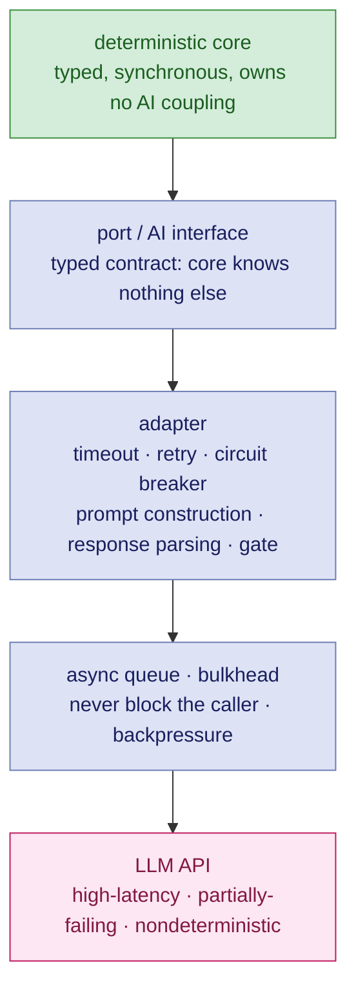

A model that proposes unstructured facts is something you have to trust. A model that proposes a thousand candidates against a deterministic check is a *search*. Only the second one is worth building on.

**The check is what converges here, not the model.** Coverage ranks the next target. The consistency check throws out the bad spec. The typechecker throws out the bad program. The model contributes candidate generation, which is the part it is genuinely good at, and contributes nothing to the decision, which is the part it is bad at.

Which is why "the LLM might write a bad spec" is not much of an objection. Of course it will. Iterating against a mechanical check costs almost nothing, and the bad ones never leave the loop.

## Spec to Code:

And not in bloody plaintext.

Today's AI-authored code is tomorrow's legacy code. That part is not new. The new part is the *rate*. It piles up faster than any team could previously manage, and nobody in the building feels they wrote it, which removes the last informal mechanism by which intent used to survive.

Recovering intent from code is the single most expensive thing our industry does, and in the general case it is undecidable. There is an entire consulting sector doing it badly and expensively, and I have spent a good deal of time in it.

So the direction is not a stylistic preference. **The spec goes forward into code. You do not reconstruct it afterwards.**

But note the trap, because it is currently the most popular thing in the field: a prose spec pointed forward is still unfalsifiable. The direction on its own buys you nothing. You have automated the drift instead of removing it. "Spec" here means whichever rung you actually paid for — guardrails, a declarative model, or types.

If your artifact of record is generated prose describing code that was generated from prose, there is no source of truth anywhere in that loop. You have a fast way to add to a system nobody understands.

---

## The Harness Is the Trust Boundary

A short detour, because this section is about a different problem from the rest of the article: not building software *with* AI, but building software that *contains* it. If you are not shipping an LLM inside the product, skip to the next section.

Not just scaffolding. The trust boundary.

An agent is a component. Components have typed contracts: input schema, output schema, invariants. "But it's nondeterministic" does not get you out of that; it is an argument for a *stricter* contract, not the absence of one. A chain of agent calls is a program, and every hop is a function call.

The harness is software you own and test, not glue you paste together. If you have not tested the harness, you have not tested the system, because the agent is not the system.

And record, as they happen, which call, which model version, which prompt, and which gate decision. Reconstructing that afterwards is the genuinely expensive part of debugging an agentic failure, and it is unnecessary.

An LLM is a distributed-systems dependency: high-latency, partially-failing, nondeterministic. Treat it as one and the engineering becomes completely ordinary — you already know how to build this. Pretend otherwise and you will meet all three of those properties in production, at the same time, on a Friday.

---
