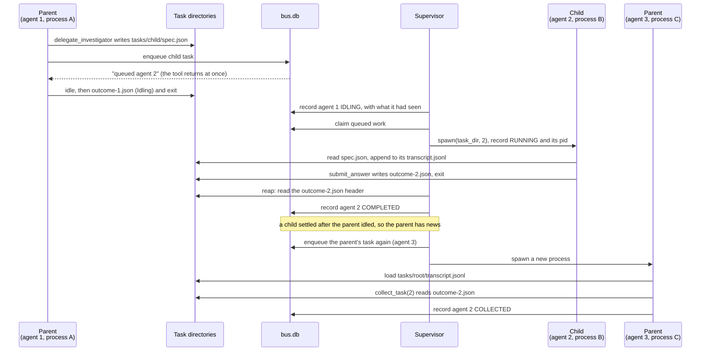
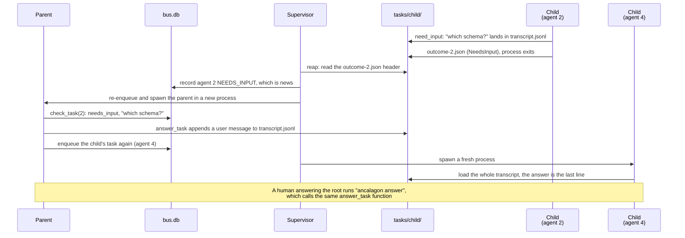

**There are many agent harnesses, but this one is mine.**

I love determinism: probabilistic results where a well-studied proven techniques can give an unambiguous answer, gives me the ick; so sue me! :-)

Ancalagon is an agent harness I've been building for reverse engineering work: given a data structure and a goal, an agent either works the structure directly with tools, or generates a deterministic traversal program — plus the typed contracts for its own analysis touch points — and runs that under supervision. This post isn't really about what it does so much as why it's shaped the way it is; here then are some of the principles I tried to embody in the design of this library:

- The harness (with the model) is just one component in a system, not the whole system
- It is developer-first: contracts are not optional, and it is meant to be modified and tinkered with
- The library borrows OS primitives for its runtime; this includes agent lifecycle management, observability, etc.

## What it actually is

Run it as intended and it's a real system: `uv run ancalagon run --config ancalagon.toml --run-dir "$RUN_DIR"` starts a tree of processes. A CLI writes a task to disk, a supervisor spawns a worker subprocess per attempt, and every hand-off between them is a row in a SQLite database (`bus.db`) or a file. There's a schema, a migration command, a fork command that replays a run's history into a new one. This is not a thin wrapper around an API call; it's a small distributed system, and I'm not going to pretend otherwise.

However, the supervisor and the database are not needed for a somewhat frequent situation: running a single agent, and getting back an answer. Underneath the CLI is a plain function call:

```python
from ancalagon.session_for import session_for

session = session_for(config, spec, ctx, transcript, run_dir, llm, clock, fs, web)
outcome = session.run()
```

(You can do the same thing from the CLI also by setting `max_depth = 1`)

That's the whole seam. Call it directly — no subprocess, no `bus.db`, no supervisor — and you have one agent running inside your own process. The collaborators that the full system uses for coordinating multiple agents (a bus, a set of children, a letterbox, a meter) default to null objects — `NO_BUS`, `NO_CHILDREN`, `NO_LETTERBOX`, `UNMETERED` — so a role that names `delegate_<role>` or `idle` still gets a tool of that exact name and schema, and every call on it just refuses with a reason instead of crashing. `examples/embed_one_agent.py` is the worked version: 117 lines that build a `Config` in Python, hand one agent `list_dir` and `read_file`, and ask it which of four short notes contradicts the others, with no `bus.db` created anywhere — the script's own last line globs for one and prints an empty list.

So it's both things, deliberately: a CLI-driven system with real infrastructure when you want resumability and multiple agents coordinating, and a library call when you just want one agent inside a program you already have. A framework that owns the loop can usually only be extended through hooks it anticipated. Having the low-level call available means you're not stuck waiting for one.

## One process per attempt, and no process is required to resume

Every attempt at a task is a real OS subprocess. `SubprocessSpawner` is, by its own header comment, "the only place in the codebase that starts an OS process" — the supervisor's poll loop claims queued work, hands each task a `pid` through `Spawner.spawn(task_dir, agent_id)`, and records that pid against the agent in `bus.db`. There's no actor runtime underneath this, no green threads, no pool of resident workers waiting for messages — the supervisor's only way of checking one is still alive is `os.kill(pid, 0)`, and reaping a hung one after `timeout_s` is `SIGKILL`.

What the supervisor does *not* do is restart anything. A crash is recorded as `CRASHED`, a timeout as `TIMED_OUT`, and the decision about what happens next is pushed up to whichever agent delegated that task — it reads the status on its own next turn and decides to retry, escalate, or give up. There's no restart strategy running underneath you the way there would be in a supervision tree that auto-restarts; supervision here means "notice death and report it accurately," nothing more.

So what makes a task resumable isn't the process at all — nothing survives between attempts anywhere in memory, by design. Idling makes this plain: there's no suspend, no parked coroutine, no thread sitting on a condition variable. `Session.run()` returns an `Idling` outcome the same way it returns `Completed` or `Failed`, `worker.py` writes it to `outcome-<agent>.json`, and the process exits normally, exactly like it would have on any other outcome. Idling *is* the process ending. The only thing distinguishing it from a crash, mechanically, is that it chose to end and left a tidy transcript behind — the last tool call was actually answered before the process went away, rather than left hanging.

What makes either case resumable is `transcript.jsonl`. Starting a fresh attempt means spawning a new process that loads that file and carries on; the only wrinkle is a worker that actually crashed mid-tool-call, which can leave the transcript ending in an assistant turn with a tool call nothing ever answered, which the API rejects outright. `repair()` is the entire fix: if the last message is an unanswered tool call, it synthesizes an `interrupted: agent terminated before this tool returned` result and appends that, so the next request is well-formed. Past that one seam, a resumed attempt, an idled one picked back up, and a brand-new attempt all run the exact same code — there's no special "recovery mode," just a longer file to read first.

This is the place the actor-model comparison actually cashes out. An actor stays parked in `receive` between messages, with its stack and bindings intact in memory; nothing like that survives between an agent's turns here — the process is gone, and what comes back isn't it. It's a new process that read the old one's diary.

Here is what that looks like when a parent delegates to a child and idles until it's done. No two processes ever talk to each other; every arrow lands on a file or a row in `bus.db`, and the parent that collects the answer is not the process that asked for it:



Had the child crashed instead, the only difference is when the supervisor reaps it: there's no `outcome-2.json` to read, so it records `CRASHED`, which is still news, and the parent is woken the same way to decide what to do about it.

## Not pushing responsibility onto the model

The fashionable move in agent design is to give the model more latitude: let it choose its own tools, decide for itself when it's done, negotiate its own constraints in prose. Ancalagon goes the other way on all three, and the reason is distrust, plainly: I don't trust a model to reliably do anything, including check its own work. If a constraint only exists as an instruction in the system prompt, the model can ignore it, misread it, or claim it was followed when it wasn't, and nothing in the loop would catch that.

A role is declared, not negotiated. Everything an agent *is* — behaviour, profile, input shape, answer shape, tools, budget — lives in TOML or in Python, decided before the agent exists:

```toml
[roles.investigator]
profile = { module = "ancalagon.profiles.answering", name = "Answering" }
behaviour = "You investigate one subsystem and report what you find. Cite every file you read."
input  = { module = "example.contracts", name = "ComponentQuery" }
answer = { module = "example.contracts", name = "Component" }
tools  = ["read_file", "ripgrep", "find_symbol"]
budget = { turns = 14, tool_calls = 35 }
```

The answer itself is enforced the same way. `submit_answer` takes the role's answer class as its arguments, so a valid answer has to pass through the same validation as any other tool call — the model isn't producing JSON for us to hopefully parse, its arguments *are* the typed instance, or the call fails with every fault listed one per line and the agent tries again.

Hooks do the same job for anything short of the final answer. A role can attach functions before and after any tool it uses, and a before-hook on the submit tool is the actual gate an answer has to pass — Python that really opens the cited files and checks they exist, not a model promising that it checked. (The shipped example config calls this `cited_files_exist`.)

The newest piece of this is profiles, which decide what a turn may do rather than leaving that to the agent or the session. Six decisions — whether to halt, which tool to force, which tools to offer, and three pieces of prose explaining the mechanics, the final turn, and the nudge — belong to a class attached to the role. `Answering` submits an answer; `AnsweringAsFile` writes a file and submits the path; `Standing` never answers at all, it just works and calls `idle` when there's nothing left to do; `Deterministic` is a plain Python function rather than a conversation. A role names exactly one, with no default — deriving it from the tool list would just reintroduce the coupling the type exists to remove. The payoff is that an agent which has run out of turns with a child still working doesn't get to decide to keep going. Its profile returns `Idling` before the model is even called.

None of this closes the system off. A role can still name arbitrary Python in four places — `before`, `after`, `run`, and now `profile` — each a dotted module and name resolved at startup and refused with a message naming the class if the shape is wrong. A profile is a class whose nine methods all have defaults, so a new kind of agent is a subclass overriding a handful: `Standing` overrides three. A deterministic agent is just a function with a typed signature, and the loader reads its input and answer contracts straight off that signature instead of making the author restate them. Even the supervisor's contract with a spawned child is minimal — `Spawner.spawn(task_dir, agent_id)` and an `outcome-<agent>.json` read back as a two-field header — so nothing in it says a model has to be involved, and a file watcher or a human-in-the-loop gate that honours the same contract costs the supervisor nothing extra.

Budgets work the same way: turns and tool calls count down for real, the final turn is forced rather than offered, and a parent with 8 turns left can still spawn a child with 20, because a child's budget comes from its own role, written into its spec unchanged.

## Files first

A CLI writes a task to disk and hands it to a supervisor, which spawns a worker per attempt; the worker runs one `Session` and writes its result back. Every hand-off is a SQLite row or a file, and the three processes share no memory — nothing talks to anything else directly:

```
ws/runs/r_20260822-121500/
    config.json                   the config this run was started with, materialised once
    bus.db                        tasks, agents, every event about them, every model call
    tasks/root/
        spec.json                 what was asked, with the whole role embedded
        transcript.jsonl          every message, one per line, tagged by agent id and seq
        outcome-<agent>.json      the result of that attempt, kept even when superseded
        access.jsonl              every file this task read, and when that file had changed
        citations.jsonl           a span, its quote and what the agent made of it
        tools/0000-read_file.txt  every tool's full output
    tasks/<child>/                same shape, one per delegated task
```

Which means a run is fully inspectable without going through Ancalagon at all:

```bash
tail -f ws/runs/r_.../tasks/root/transcript.jsonl
sqlite3 ws/runs/r_.../bus.db "select agent, status, source, summary from agent_events order by id"
rg '"agent": 1' ws/runs/r_.../tasks/root/transcript.jsonl
```

Cost works the same way: `scripts/anccost.zsh` rolls up what every run spent from each run's `bus.db` and emits JSON, and `scripts/anccosttable.zsh` renders that as a table, so a report goes to `jq` as readily as to a terminal.

Because the transcript is flushed per message, a run is watchable while it's happening — not a debugging feature someone remembered to add, just what falls out of making the medium of exchange a file.

## Sending a message is appending to the transcript

There's no inbox here, no channel, no protocol — when you answer an agent's question, the whole mechanism is appending a message and re-enqueuing its task:

```python
log.write(Message(role=MessageRole.USER, blocks=[Text(text=answer)], agent=answered_by,
                  seq=len(fs.read_text(path).splitlines()), ts=clock.now().isoformat()))
bus.enqueue(task_dir, parent_agent=task.parent_agent)
```

That's it: append a user message to `transcript.jsonl`, enqueue the task again. A worker loads whatever transcript is already sitting in its directory, so resumption needs no further machinery than that. From outside, it's one command:

```bash
uv run ancalagon answer --run-dir ws/runs/r_... --task 7 --answer "Use the 2019 schema, not the 2021 one."
```

`need_input` is a yield, then, not a dead end. The agent stops, its question and its whole conversation stay on disk, and nothing blocks or holds a channel open while it waits. A parent answering its child mid-run and a human answering the root after the run has finished call the exact same function.



A note is the same idea with less ceremony, just a file the next turn folds in:

```bash
uv run ancalagon note --run-dir ws/runs/r_... --agent 3 --text "The staging config is the stale one."
```

Forking a run is the same idea again: cut the transcript at a chosen message, write it into a new run directory, carry on from there. Because a conversation is nothing more than a list of lines in a file, "fork", "resume", "answer", and "nudge" turn out to be one operation wearing four different names.

## Sharp edges, on purpose

The codebase is opinionated in ways that will cut you if you're careless, which was the trade I wanted going in. A few examples:

**No defensive programming.** No `None` defaults, no `None` returned from a type that says it never returns `None`, no generic exception handling, and every dataclass is frozen. Where a value might be absent, there's a null object with a real implementation instead of a `None` check scattered across every call site.

**The file system is enforced by the type checker, not by a contract.** An import rule can see that one module depends on another, but it can't see `path.read_text()`, a method call on a value a module already holds. `pathlib.PurePath` is string manipulation with no syscalls; `Path` subclasses it and adds the syscalls. The domain speaks in `PurePath`, so the method doesn't exist there and Pyright rejects the call on the line it's written. `pathlib.Path` itself appears in exactly one file, `ancalagon/fs/real_file_system.py`.

**`Any` is banned outright**, with one scoped exemption enforced by two separate checks: the field that holds whatever an agent wants kept alongside a citation, because naming that shape properly would mean fixing a structure no run actually agrees on.

**A run directory collision is an interlock, not a bug.** Allocating a fresh, timestamped run directory deliberately leaves out `exist_ok`, so two runs started in the same second fail loudly instead of quietly sharing one `bus.db`.

**An empty tools list means no tools**, the inverse of the old global enable-list it replaced. A role gets exactly what it names plus whatever its profile brings, and naming something no tool answers to is a startup error that lists both the unknown names and what's actually available.

None of this is abstract — it runs on every commit, via `uv run`: Black, strict Pyright, `lint-imports` checking seven contracts (one layering rule, the rest narrower about which module may touch what), a functional-programming linter capping cyclomatic complexity at three, the unit suite, and a terminology guard, chained through a pre-commit hook. That's more ceremony than most one-person projects carry. It's there because the harness runs against other people's codebases, and a bug in it doesn't just produce a wrong answer — it can read the wrong files or quote something that was never there, so I'd rather the checks ran every time than rely on remembering to run them.

## Unfinished, and evolving

It would be dishonest to call this finished. Some of what's missing, I know about precisely.

**Compaction is specified and unbuilt.** A long-running agent's transcript only ever shrinks by demoting old tool output to a pointer; nothing ever summarises the reasoning itself. The design — a checkpoint recording what's established, what's still open, and what was explicitly ruled out, covering everything up to a given point in the conversation so only what comes after it is sent verbatim — is written down as a spec but has no code behind it yet.

**Standing agents can't wake themselves up.** An agent that never answers idles once it has nothing left to do, and the scheduler only wakes a parent whose child has just settled. Something outside has to restart it, deliberately — an external loop is supposed to decide when to stop based on a fitness function, not on the agent's own state — but until that loop exists, the persistent-agent story is only half told.

**There are two sources of truth for what kind of agent a role is.** The spawner picks an executor by checking whether the role names a run function, while the role's profile already says which kind of agent it is. The gap between them is closed by validation rather than by construction, which is weaker than it should be, and for now it's a recorded debt rather than a fix.

**Naming a tool your profile already brings has no effect, and naming a submit tool your profile doesn't bring withholds it.** Neither one raises an error, and neither is explained to whoever wrote the role — you just have to know.

Files as the medium, typed contracts at every boundary, and the model held to a budget are the parts I'm confident about. Everything else here is still moving.
