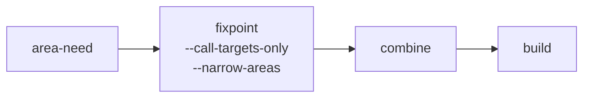

*This post is about getting a byte-level dataflow analysis to finish on a large CICS corpus: about 3,800 programs and 19,000 call sites and jumps. It covers each stage that was too slow or too imprecise, what was wrong, and what changed. Each technique has a longer explainer with a worked example in the [red-dragon-forge](https://github.com/avishek-sen-gupta/red-dragon-forge) repository, linked at the end.*

---

## Table of Contents

- [The problem](#the-problem)
- [The pipeline](#the-pipeline)
- [Area need: which bytes anyone reads](#area-need-which-bytes-anyone-reads)
- [Resolving call sites locally](#resolving-call-sites-locally)
- [Rounds, and walking only what changed](#rounds-and-walking-only-what-changed)
- [The fixpoint: a long tail](#the-fixpoint-a-long-tail)
- [The combine](#the-combine)
  - [Recursion](#recursion)
  - [One walk per jump](#one-walk-per-jump)
  - [The walk inside each program](#the-walk-inside-each-program)
  - [Profiling instead of guessing](#profiling-instead-of-guessing)
  - [Field names in the place identity](#field-names-in-the-place-identity)
  - [More than a million places](#more-than-a-million-places)
- [Bounding the walk by crossings](#bounding-the-walk-by-crossings)
- [What I took from it](#what-i-took-from-it)
- [Explainers](#explainers)

---

## The problem

COBOL programs often decide at runtime which program to call next. `CALL WS-PGM`, `EXEC CICS XCTL PROGRAM(WS-NEXT)` and `EXEC CICS LINK PROGRAM(WS-NEXT)` all name their target through a field. A call graph built only from literal targets misses those edges. To recover them statically, you need to know which values the field can hold at the call.

In this corpus the target fields came in three shapes:

1. A literal `VALUE` clause in working storage.
2. A `MOVE 'PROGNAME' TO WS-FIELD` somewhere before the call.
3. About 5% of them: a field the program reads from its `DFHCOMMAREA`, which a caller filled in before transferring control.

The first two need nothing outside the program. The third needs to follow the commarea back into every program that hands control to this one.

cobble, the static analyser in red-dragon-forge, does this with a byte-level dataflow analysis. Every field is a byte range. Every write, read and copy is tracked at that granularity, so group moves, `REDEFINES` and partial overlaps behave the way the storage does. That precision is the reason it works, and the reason it was slow.

## The pipeline

There are four stages that matter here:

- **area-need** works out, per program, which bytes of each handed-over area anyone actually reads.
- **fixpoint** runs the dataflow inside each program, tracking only what the call targets depend on.
- **combine** links the per-program results across programs, so a value written in a caller reaches the callee that reads it.
- **build** writes the knowledge graph, with the resolved targets as edges.

Every one of these needed changes before the corpus went through end to end.

## Area need: which bytes anyone reads

The first version of the fixpoint, in call-targets-only mode, kept every byte of every area a program hands over, since a callee might read any of it. Commareas are often thousands of bytes. Tracking all of them through every program was where most of the time went.

Area need is a backward liveness pass over each program's control flow graph. It starts from what the call targets read and works backwards to find which bytes of the program's own commarea, `USING` parameters or `RETRIEVE INTO` area are needed on entry. It also finds which bytes its callers read back after a `LINK` returns. The fixpoint then tracks only those bytes.

Getting the rows right took a few corrections:

- **Positional copies.** A `MOVE` of a group into another group copies byte for byte. If only 8 bytes of the destination are live afterwards, only the matching 8 bytes of the source are live before. The first version made the whole source live.
- **`LENGTH OF` in reference modification.** `WS-AREA(1:LENGTH OF WS-NAME)` has a bound the analysis can compute from the layout. It now folds to that field's length instead of being treated as unknown.
- **`START` and `RETRIEVE`.** A `START ... FROM(area)` hands that area to the started transaction, which picks it up with `RETRIEVE INTO`. This is now treated like a `LINK` passing a commarea. The started program's need is whatever is live in its `RETRIEVE INTO` area just after the `RETRIEVE`.

On CardDemo, the open-source CICS sample, the entry need summed over every program shows what each correction did:

| Change | Summed entry need |
|---|---|
| before positional copies | 32,767 bytes |
| positional copies | 1,033 bytes |
| a later baseline, before `LENGTH OF` folding | 4,394 bytes |
| `LENGTH OF` folding | 140 bytes |
| charging sites the combine had already resolved | 92 bytes |

The two baselines differ because other rules changed between them. With the need at 92 bytes, the narrowed fixpoint gave the same targets, links and graph as the run over whole areas.

On the large corpus, though, many programs still showed thousands of bytes needed on entry. The cause was the next problem.

## Resolving call sites locally

When a call site's target is a field, area need has to decide which programs it might reach, so it knows whose needs to charge. If it cannot tell, it has to assume any of them. The first version charged an unresolved site with the union of every program's need for that kind of area. One unresolved `XCTL` in a program made its commarea need as wide as the widest need anywhere in the corpus.

Most of these sites were not hard. They were shapes 1 and 2 above: a literal in working storage, or a literal moved into a field. Resolving them needs reaching definitions of literal values within the program: for each dynamic site, which writes reach the operand, and are they all literals?

The rule is strict. A site is resolved only when every definition reaching it overwrites all of the operand with a literal. The one exception is the program's own storage that no write reaches at all, which still holds its initial value. A copy from another field, a value returned by a call, a `RETRIEVE` or anything from linkage leaves the site unresolved, with the reason recorded.

Transaction ids, for `RETURN TRANSID` and `START`, are mapped to programs through the CSD. A transaction the CSD does not define reaches nothing. Without a CSD the site stays unresolved, rather than quietly resolving to nothing.

Before applying each rule, I checked that the combine treats the same case the same way. An area-need rule that disagrees with what the later stage does would narrow away bytes the combine then needs.

## Rounds, and walking only what changed

A program's need depends on its callees' entry rows and its own back row, and those change as other programs are analysed. So area need runs in rounds until no row changes.

Walking every program every round was too slow. A program's walk reads exactly three things from the table:

- the entry rows of the programs its call sites reach;
- its own back row;
- for a program with a site nothing resolved, the corpus-wide union.

So a later round only needs to walk the callers of programs whose entry row changed, the programs whose back row changed, and, only when the union changed, the programs with unresolved sites. This reaches the same rows as walking everything every round.

There is also a `--max-rounds` cap. A capped run warns how many programs were still to be walked. Its rows can miss bytes that arrive only through longer call chains.

## The fixpoint: a long tail

With area need in place, the per-program fixpoint ran on the corpus and finished. Most programs settled quickly. The last three took 1,404, 2,324 and 4,434 seconds.

The fixpoint uses a worklist in reverse postorder, with a budget of dequeues per CFG node. The full run finished within it, so that is what the rest of this post used. The alternative, for when the tail is too long to wait for, is `--sweeps N`: at most N passes over the program in reverse postorder.

One pass carries any forward chain of assignments all the way through. A value that has to go round a back edge needs another pass. Back edges come from loops, but also from a paragraph `PERFORM`ed from two places, since each paragraph appears once in the graph. A program only counts as settled after a pass that changes nothing. So a value written in a loop body is found by the second pass, but the program is marked settled only after the third. A program not settled after N passes is published as unsettled, and its call targets get the reason `incomplete-walk`.

The dynamic target assignments in this corpus are straight-line, so a small N finds them. A small N still leaves many programs marked unsettled.

## The combine

The combine is where values cross programs. For each jump's target bytes, it walks backwards through copies inside the program. When it reaches bytes that came in through the commarea, it continues into every caller that passes them. When it reaches bytes a `LINK`ed program may have written back, it continues into that program's exits. A place in this walk is a program, a node and a byte range.

It runs in rounds as well: a target resolved in one round adds an edge, and the next round walks over it.

### Recursion

The first corpus run stopped with Python's maximum recursion depth exceeded. Collecting answers recursed once per program, and there were 3,800 programs. The fix was to make it iterative. This was the only easy one.

### One walk per jump

The next run did not crash, but did not finish either. The progress log showed it on round 2, jump 195 of 18,952, for a long time.

Each jump ran its own walk. One walk reached about 311,000 places (program, node and byte range) over only about 850 distinct program positions, and different jumps reached many of the same places, each walking them again. The cost was the number of jumps times everything reachable from each.

The fix was a memo of what each place reaches, built once per round. A walk's answer from a place is the join of everything reachable from it. Places in the same strongly connected component reach each other, so they share one answer. Tarjan's algorithm finds the components. It is written with explicit stacks, since the same recursion limit applies. A component's answer is the join of its members' own contributions and the answers of everything it points to outside itself. Each place is expanded once per round, whatever the number of jumps that reach it.

The combine also needs to know whether a walk from a place would reach some place twice. That decides one corner case where an answer is otherwise empty. The memo decides this per component, where possible, without walking again.

On a test corpus of 15 programs passing a commarea round a ring, the same answers came from 60 expansions instead of 480.

### The walk inside each program

This still did not finish. Each step of the cross-program walk calls a walk inside one program, from a node back to where the bytes came from. That inner walk was memoised only by its starting point. Each new byte range walked nearly the same tens of thousands of positions again. The logs showed inner walks of 25,000 to 46,000 positions taking 15 to 20 seconds each.

The same memo applies inside a program. A program's facts and flows do not change between rounds, so this one is kept for the whole run.

### Profiling instead of guessing

After that, progress was faster but each place still cost seconds. At that point I stopped guessing and ran `py-spy dump` against the running process three times. All three stacks were in the same place: for every stop, the code scanned every edge in the corpus to find the ones that applied. A place can carry many stops. An index of the edges by what each lookup matches on, built once per round, replaced the scan with a lookup.

### Field names in the place identity

A place's byte range was compared including the field's name. The walk never reads the name. It compares only the program, region and offsets. So the same bytes reached as a group item, an elementary item and a `REDEFINES` were three separate places, each walked. Places are now identified by their bytes alone. This could only remove walks, never add them.

### More than a million places

The run was now much faster per place, and still did not finish. The stack of places waiting in the current component passed a million.

The remaining cause was the byte ranges themselves. A node reached under many slightly different sub-ranges is many places. Commarea windows shift ranges at each crossing, and partial copies cut them. Everything reachable from one jump on round 2 had joined into one cyclic group spanning much of the corpus.

I considered a redesign: resolve each node once per whole field, and slice the answer to the requested bytes. It would cap the number of places at the number of recorded facts. But each walk would follow every copy into every part of a field, not just the bytes holding a program name. I could not say in advance whether that would be faster on this corpus. So I did not build it.

## Bounding the walk by crossings

Back to the three shapes of dynamic target. The first two need zero program crossings. The third needs one: from the callee into the callers that filled in its commarea. Nothing about the problem needed a walk to cross the whole corpus.

`--max-hops N` limits how many program boundaries one walk may cross: into a caller, into a `LINK`ed program's exits, or into the program that `START`ed this one. A walk that would cross more stops there. It keeps the values it has already found, and its target gets the reason `hop-limit`. Each walk is then bounded by the programs within N crossings, not by the corpus.

`--skip-readbacks` stops following bytes a `LINK`ed program may have written back. Those bytes get the reason `readback-skipped`.

A target with those reasons says it may be missing candidates. A target without them is not always complete, though. Within one round, the walk below the limit is the same as the unlimited one, so an unmarked target matches it over the same set of links. Across rounds it can differ: a cut walk can miss a program name, the link to that program is then never discovered, and later walks that would have crossed it see fewer callers without being marked. I missed this at first; it came up while writing the explainer.

To choose N, raise it until the output stops changing. On the corpus:

| `--max-hops` | Time | Result |
|---|---|---|
| 3 | about 1 second | 3 targets with `hop-limit` |
| 4 | 10 to 12 seconds | identical to 3 |
| 5 | about a minute | used |

Comparing N with N+1 catches both kinds of cut, marked and unmarked, as long as the difference shows up within one more hop. Identical output at N and N+1 does not strictly prove nothing new appears at N+2, but it is good evidence. On CardDemo, the output is identical with no limit, at one hop, and with both flags.

## What I took from it

- **Test on the input that has the problem.** CardDemo was useful for checking that nothing changed, but it is too small to show any of the performance problems. Two memo changes gave identical results on CardDemo and made the corpus faster, but neither got it to finish, and CardDemo could not have told me that.
- **Profile before redesigning.** Three stack samples found the edge scan in a minute. Before that, I had spent hours on changes based on what I thought was slow.
- **Check what the next stage does before changing this one.** Several area-need rules were only correct because the combine treats the same cases the same way. Applying them without checking would have narrowed away bytes the combine needed.
- **Prefer an approximation that says what it cut.** `--sweeps`, `--max-rounds`, `--max-hops` and `--skip-readbacks` all trade completeness for time. Each one marks the results it shortened directly. The hop limit can also shorten results indirectly, by never discovering a link, so it still needs the N against N+1 comparison.
- **Match the bound to the problem.** The hop limit worked because the targets that mattered needed at most one crossing. A bound on walk size or time would have cut arbitrarily.

## Explainers

Each technique has an explainer in the repository, with a small COBOL example worked step by step:

| Explainer | Covers |
|---|---|
| [Area need](https://github.com/avishek-sen-gupta/red-dragon-forge/blob/main/docs/explainers/area-need.html) | backward liveness of handed-over bytes, positional copies, `LENGTH OF`, `START`/`RETRIEVE` |
| [Resolving a dynamic call site inside its own program](https://github.com/avishek-sen-gupta/red-dragon-forge/blob/main/docs/explainers/local-site-resolution.html) | reaching definitions of literals, the CSD, why the union widened everything |
| [Rounds across programs](https://github.com/avishek-sen-gupta/red-dragon-forge/blob/main/docs/explainers/interprocedural-rounds.html) | the dirty set, `--max-rounds` |
| [Sweeps](https://github.com/avishek-sen-gupta/red-dragon-forge/blob/main/docs/explainers/bounded-sweeps.html) | budgeted reverse-postorder passes, `incomplete-walk` |
| [Answering every walk once](https://github.com/avishek-sen-gupta/red-dragon-forge/blob/main/docs/explainers/memoised-reachability.html) | strongly connected components, the memo, place identity, the edge index |
| [Bounding walks by crossings](https://github.com/avishek-sen-gupta/red-dragon-forge/blob/main/docs/explainers/hop-limits.html) | `--max-hops`, `--skip-readbacks`, choosing N |

The [earlier explainers](https://github.com/avishek-sen-gupta/red-dragon-forge/blob/main/docs/explainers/index.html) cover the basics these build on: traversal orders, fixpoints and worklists, reaching definitions, byte extents and value sets.
